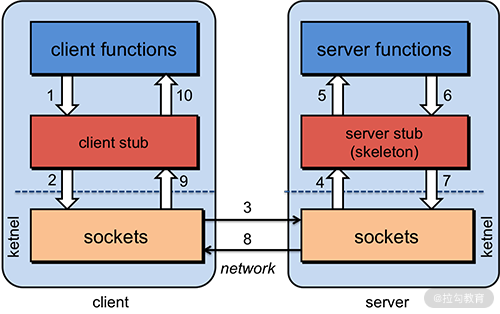

22 进程间通信： 进程间通信都有哪些方法？
======================

**这节课带给你的面试题目是：进程间通信都有哪些方法**？

在上一讲中，我们提到过，凡是面试官问“**什么情况下**”的时候，面试官实际想听的是你经过理解，整理得到的认知。回答应该是概括的、简要的。而不是真的去列举每一种 case。

另外，**面试官考察进程间通信，有一个非常重要的意义——进程间通信是架构复杂系统的基石**。复杂系统往往是分成各种子系统、子模块、微服务等等，按照 Unix 的设计哲学，系统的每个部分应该是稳定、独立、简单有效，而且强大的。系统本身各个模块就像人的器官，可以协同工作。而这个协同的枢纽，就是我们今天的主题——进程间通信。

### 什么是进程间通信？

进程间通信（Intermediate Process Communication，IPC）。所谓通信就是交换数据。所以，狭义地说，就是操作系统创建的进程们之间在交换数据。 我们今天不仅讨论狭义的通信，还要讨论 IPC 更广泛的意义——程序间的通信。 程序可以是进程，可以是线程，可以是一个进程的两个部分（进程自己发送给自己），也可以是分布式的——总之，今天讨论的是广义的交换数据。

### 管道

之前我们在“**07 | 进程、重定向和管道指令：xargs 指令的作用是**？”中讲解过管道和命名管道。 管道提供了一种非常重要的能力，就是组织计算。进程不用知道有管道存在，因此管道的设计是非侵入的。程序员可以先着重在程序本身的设计，只需要预留响应管道的接口，就可以利用管道的能力。比如用`shell`执行MySQL语句，可能会这样：

```
进程1 | 进程2 | 进程3 | mysql -u... -p | 爬虫进程

```

我们可以由进程 1、进程 2、进程 3 计算出 MySQL 需要的语句，然后直接通过管道执行。MySQL经过计算将结果传给一个爬虫进程，爬虫就开始工作。MySQL并不是设计用于管道，爬虫进程也不是设计专门用于管道，只是程序员恰巧发现可以这样用，完美地解决了自己的问题，比如：用管道构建一个微型爬虫然后把结果入库。

我们还学过一个词叫作**命名管道**。命名管道并没有改变管道的用法。相比匿名管道，命名管道提供了更多的编程手段。比如：

```
进程1 > namedpipe


进程2 > namedpipe

```

上面的程序将两个进程的临时结果都同时重定向到 namedpipe，相当于把内容合并了再找机会处理。再比如说，你的进程要不断查询本地的 MySQL，也可以考虑用命名管道将查询传递给 MySQL，再用另一个命名管道传递回来。这样可以省去和 localhost 建立 TCP 3 次握手的时间。 当然，现在数据库都是远程的了，这里只是一个例子。

管道的核心是不侵入、灵活，不会增加程序设计负担，又能组织复杂的计算过程。

### 本地内存共享

同一个进程的多个线程本身是共享进程内存的。 这种情况不需要特别考虑共享内存。如果是跨进程的线程（或者理解为跨进程的程序），可以考虑使用共享内存。内存共享是现代操作系统提供的能力， Unix 系操作系统，包括 Linux 中有 POSIX 内存共享库——shmem。（如果你感兴趣可以参考[网页中的内容](https://www.man7.org/linux/man-pages/man7/shm_overview.7.html)，这里不做太深入地分析。）Linux 内存共享库的实现原理是以虚拟文件系统的形式，从内存中划分出一块区域，供两个进程共同使用。看上去是文件，实际操作是内存。

共享内存的方式，速度很快，但是程序不是很好写，因为这是一种侵入式的开发，也就是说你需要为此撰写大量的程序。比如如果修改共享内存中的值，需要调用 API。如果考虑并发控制，还要处理同步问题等。因此，只要不是高性能场景，进程间通信通常不考虑共享内存的方式。

### 本地消息/队列

内存共享不太好用，因此本地消息有两种常见的方法。一种是用消息队列——现代操作系统都会提供类似的能力。Unix 系可以使用 POSIX 标准的 mqueue。另一种方式，就是直接用网络请求，比如 TCP/IP 协议，也包括建立在这之上的更多的通信协议（这些我们在下文中的“**远程调用**”部分详细讲解）。

本质上，这些都是收/发消息的模式。进程将需要传递的数据封装成格式确定的消息，这对写程序非常有帮助。程序员可以根据消息类型，分门别类响应消息；也可以根据消息内容，触发特殊的逻辑操作。在消息体量庞大的情况下，也可以构造生产者队列和消费者队列，用并发技术进行处理。

### 远程调用

远程调用（Remote Procedure Call，RPC）是一种通过本地程序调用来封装远程服务请求的方法。

程序员调用 RPC 的时候，程序看上去是在调用一个本地的方法，或者执行一个本地的任务，但是后面会有一个服务程序（通常称为 stub），将这种本地调用转换成远程网络请求。 同理，服务端接到请求后，也会有一个服务端程序（stub），将请求转换为一个真实的服务端方法调用。



客户端服务端的通信

你可以观察上面这张图，表示客户端和服务端通信的过程，一共是 10 个步骤，分别是：

1. 客户端调用函数（方法）；
2. stub 将函数调用封装为请求；
3. 客户端 socket 发送请求，服务端 socket 接收请求；
4. 服务端 stub 处理请求，将请求还原为函数调用；
5. 执行服务端方法；
6. 返回结果传给 stub；
7. stub 将返回结果封装为返回数据；
8. 服务端 socket 发送返回数据，客户端 socket 接收返回数据；
9. 客户端 socket 将数据传递给客户端 stub；
10. 客户端 stub 把返回数据转义成函数返回值。

RPC 调用过程有很多约定， 比如函数参数格式、返回结果格式、异常如何处理。还有很多细粒度的问题，比如处理 TCP 粘包、处理网络异常、I/O 模式选型——其中有很多和网络相关的知识比较复杂，你可以参考我将在拉勾教育上线的《**计算机网络》专栏**。

上面这些问题比较棘手，因此在实战中通常的做法是使用框架。比如 Thrift 框架（Facebook 开源）、Dubbo 框架（阿里开源）、grpc（Google 开源）。这些 RPC 框架通常支持多种语言，这需要一个接口定义语言支持在多个语言间定义接口（IDL）。

RPC 调用的方式比较适合微服务环境的开发，当然 RPC 通常需要专业团队的框架以支持高并发、低延迟的场景。不过，硬要说 RPC 有额外转化数据的开销（主要是序列化），也没错，但这不是 RPC 的主要缺点。**RPC 真正的缺陷是增加了系统间的耦合 **。** 当系统主动调用另一个系统的方法时 **，** 就意味着在增加两个系统的耦合 **。** 长期增加 RPC 调用 **，** 会让系统的边界逐渐腐**化。这才是使用 RPC 时真正需要注意的东西。

### 消息队列

既然 RPC 会增加耦合，那么怎么办呢——可以考虑事件。事件不会增加耦合，如果一个系统订阅了另一个系统的事件，那么将来无论谁提供同类型的事件，自己都可以正常工作。系统依赖的不是另一个系统，而是某种事件。如果哪天另一个系统不存在了，只要事件由其他系统提供，系统仍然可以正常运转。

实现事件可以用消息队列。具体这块架构技术我不再展开，你如果感兴趣可以课下去研究 Doman Drive Design 这个方向的知识。

另一个用到消息队列的场景是纯粹大量数据的传输。 比如日志的传输，中间可能还会有收集、清洗、筛选、监控的节点，这就构成了一个庞大的分布式计算网络。

总的来说，消息队列是一种耦合度更低，更加灵活的模型。但是对系统设计者的要求也会更高，对系统本身的架构也会有一定的要求。具体场景的消息队列有 Kafka，主打处理 feed；RabbitMQ、ActiveMQ、 RocketMQ 等主打分布式应用间通信（应用解耦）。

### 总结**那么通过这节课的学习，你现在可以尝试来回答本节关联的面试题目：进程间通信都有哪些方法？ **** 【解析】 **你可以从** 单机和分布式角度**给面试管阐述

* 如果考虑单机模型，有管道、内存共享、消息队列。这三个模型中，内存共享程序最难写，但是性能最高。管道程序最好写，有标准接口。消息队列程序也比较好写，比如用发布/订阅模式实现具体的程序。
* 如果考虑分布式模型，就有远程调用、消息队列和网络请求。直接发送网络请求程序不好写，不如直接用实现好的 RPC 调用框架。RPC 框架会增加系统的耦合，可以考虑 消息队列，以及发布订阅事件的模式，这样可以减少系统间的耦合。
