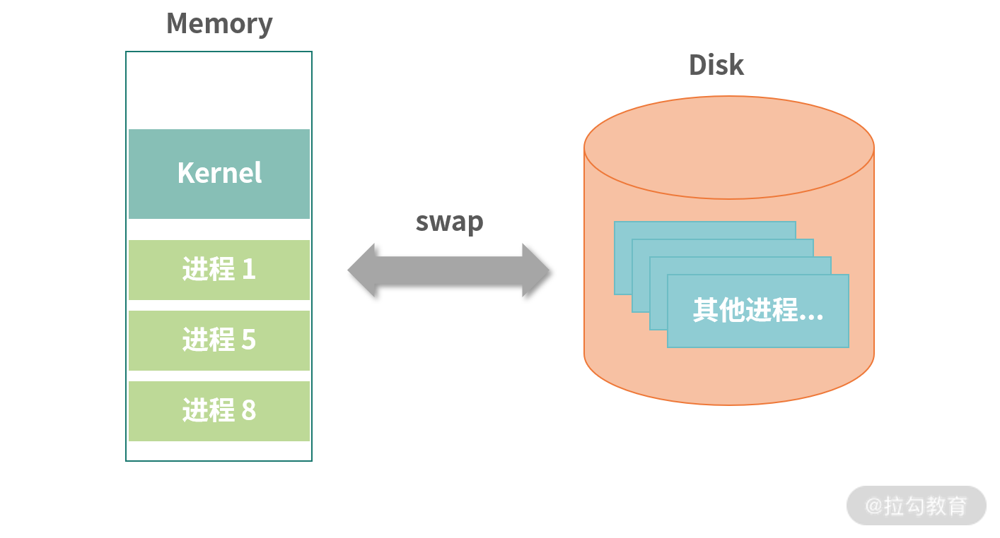
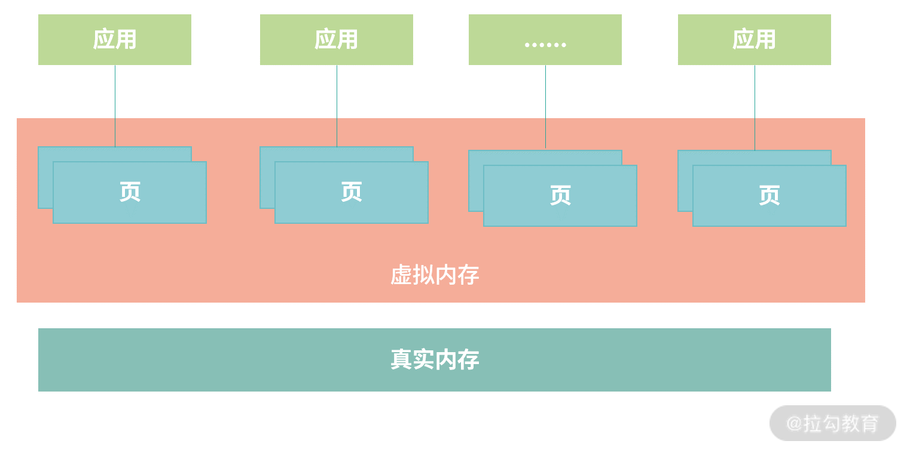
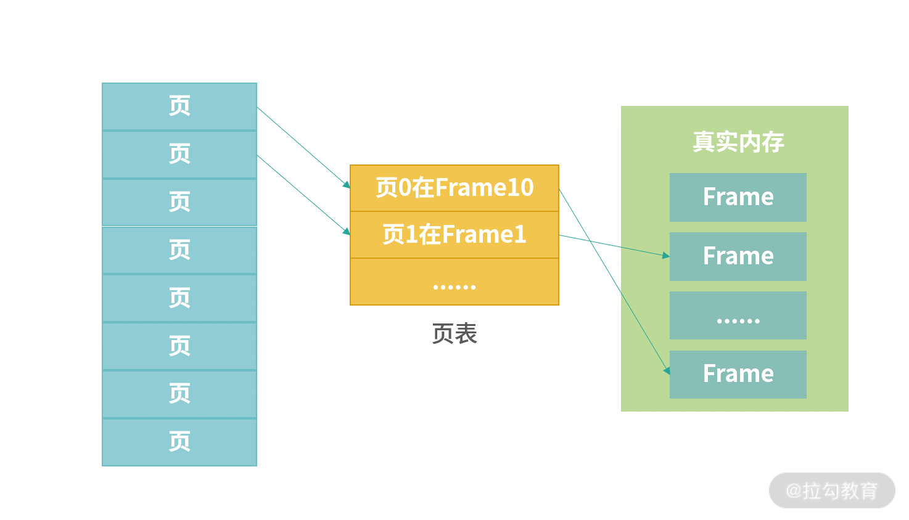
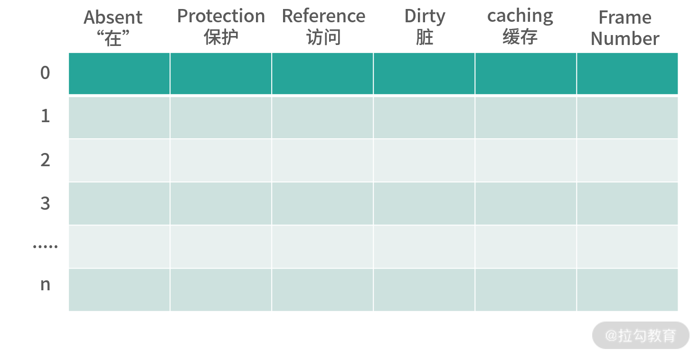
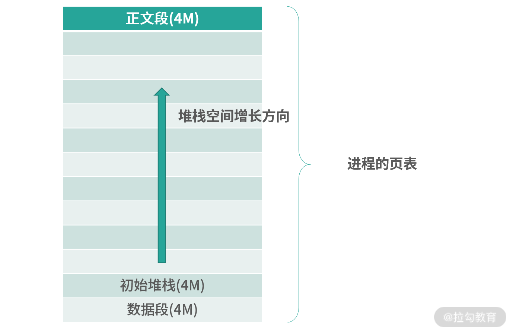
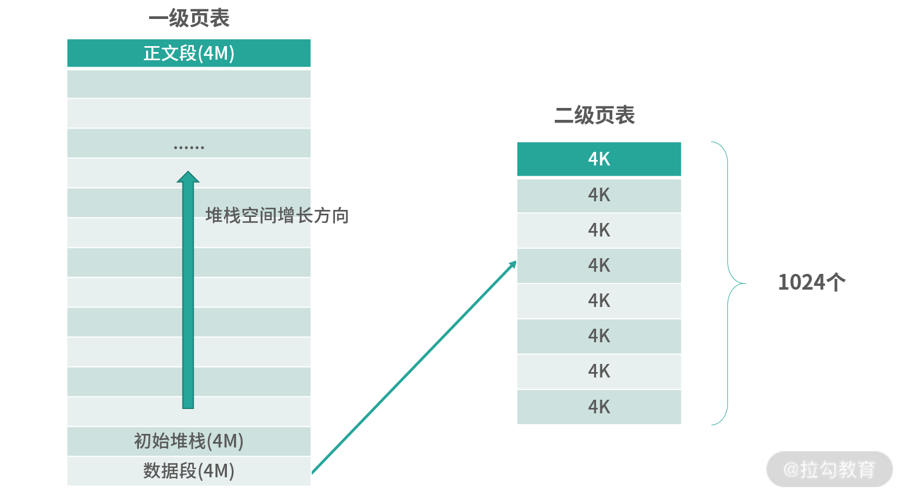

# 24 虚拟内存 ：一个程序最多能使用多少内存？

```
这个模块我们开始学习操作系统的内存管理，接下来我会先用 3 节课讲解操作系统对内存管理的原理。因为内存资源总是稀缺的，即便在拥有百 G 内存的机器上，我们都可以轻易把内存填满。为了解决这个问题，就需要用到虚拟化技术。
```

因此，本模块前面 3 讲将围绕虚拟化技术展开：第 24 讲介绍设计思想；第 25 讲介绍优化手段；第 26 讲挑选了对你工作比较有帮助的缓存置换算法深入讲解。

后面的第 27、28 讲将围绕内存回收（GC）讲解，GC 是面试的高频重点知识，同时也是程序员日常开发需要理解的部分。学习 GC 有助于你优化你开发应用的性能，特别是遇到内存不够用不会束手无策。

今天我们先学习内存的虚拟化技术。

内存是稀缺的，随着应用使用内存也在膨胀。当程序越来复杂，进程对内存的需求会越来越大。从安全角度考虑，进程间使用内存需要隔离。另外还有一些特殊场景，比如说，我在“ **模块四加餐** ”中提到的内存一致性问题，存在不希望 CPU 进行缓存的场景。 这个时候，有一个虚拟化层承接各种各样的诉求，统一进行处理，就会有很大的优势。

**还有一个大家普遍关心的问题，也是这节课我给大家带来的面试题：一个程序最多能使用多少内存**?

要回答这个问题，就需要对内存的虚拟化有一定的认识。接下来就请你带着问题，和我一起学习“**内存的虚拟化技术**”。

### 为什么内存不够用？

要理解一个技术，就必须理解它为何而存在。总体来说，**虚拟化技术是为了解决内存不够用的问题**，那么内存为何不够用呢？

主要是因为程序越来越复杂。比如说我现在给你录音的机器上就有 200 个进程，目前内存的消耗是 21G，我的内存是 64G 的，但是多开一些程序还是会被占满。 另外，如果一个程序需要使用大的内存，比如 1T，是不是应该报错？如果报错，那么程序就会不好写，程序员必须小心翼翼地处理内存的使用，避免超过允许的内存使用阈值。以上提到的这些都是需要解决的问题，也是虚拟化技术存在的价值和意义。

那么如何来解决这些问题呢？ 历史上有过不少的解决方案，但最终沉淀下的是虚拟化技术。接下来我为你介绍一种历史上存在过的 Swap 技术以及虚拟化技术。

#### 交换（Swap）技术

Swap 技术允许一部分进程使用内存，不使用内存的进程数据先保存在磁盘上。注意，这里提到的数据，是完整的进程数据，包括正文段（程序指令）、数据段、堆栈段等。轮到某个进程执行的时候，尝试为这个进程在内存中找到一块空闲的区域。如果空间不足，就考虑把没有在执行的进程交换（Swap）到磁盘上，把空间腾挪出来给需要的进程。



上图中，内存被拆分成多个区域。 内核作为一个程序也需要自己的内存。另外每个进程独立得到一个空间——我们称为地址空间（**Address Space）**。你可以认为地址空间是一块连续分配的内存块。每个进程在不同地址空间中工作，构成了一个原始的虚拟化技术。

比如：当进程 A 想访问地址 100 的时候，实际上访问的地址是基于地址空间本身位置（首字节地址）计算出来的。另外，当进程 A 执行时，CPU 中会保存它地址空间的开始位置和结束位置，当它想访问超过地址空间容量的地址时，CPU 会检查然后报错。

上图描述的这种方法，是一种比较原始的虚拟化技术，进程使用的是基于地址空间的虚拟地址。但是这种方案有很多明显的缺陷，比如：

1.**碎片问题 **：上图中我们看到进程来回分配、回收交换，内存之间会产生很多缝隙。经过反反复复使用，内存的情况会变得十分复杂，导致整体性能下降。
2.** 频繁切换问题**：如果进程过多，内存较小，会频繁触发交换。

你可以先思考这两个问题的解决方案，接下来我会带你进行一些更深入地思考——首先重新 Review 下我们的设计目标。

1. 隔离：每个应用有自己的地址空间，互不影响。
1. 性能：高频使用的数据保留在内存中、低频使用的数据持久化到磁盘上。
1. 程序好写（降低程序员心智负担）：让程序员不用关心底层设施。

现阶段，Swap 技术已经初步解决了问题 1。关于问题 2，Swap 技术在性能上存在着碎片、频繁切换等明显劣势。关于问题 3，使用 Swap 技术，程序员需要清楚地知道自己的应用用多少内存，并且小心翼翼地使用内存，避免需要重新申请，或者研发不断扩容的算法——这让程序心智负担较大。

经过以上分析，需要更好的解决方案，就是我们接下来要学习的虚拟化技术。

#### 虚拟内存

虚拟化技术中，操作系统设计了虚拟内存（理论上可以无限大的空间），受限于 CPU 的处理能力，通常 64bit CPU，就是 264 个地址。

 虚拟化技术中，应用使用的是虚拟内存，操作系统管理虚拟内存和真实内存之间的映射。操作系统将虚拟内存分成整齐小块，每个小块称为一个**页（Page）**。之所以这样做，原因主要有以下两个方面。

- 一方面应用使用内存是以页为单位，整齐的页能够避免内存碎片问题。
- 另一方面，每个应用都有高频使用的数据和低频使用的数据。这样做，操作系统就不必从应用角度去思考哪个进程是高频的，仅需思考哪些页被高频使用、哪些页被低频使用。如果是低频使用，就将它们保存到硬盘上；如果是高频使用，就让它们保留在真实内存中。

如果一个应用需要非常大的内存，应用申请的是虚拟内存中的很多个页，真实内存不一定需要够用。

### 页（Page）和页表

接下来，我们详细讨论下这个设计。操作系统将虚拟内存分块，每个小块称为一个页（Page）；真实内存也需要分块，每个小块我们称为一个 Frame。Page 到 Frame 的映射，需要一种叫作页表的结构。

 上图展示了 Page、Frame 和页表 （PageTable）三者之间的关系。 Page 大小和 Frame 大小通常相等，页表中记录的某个 Page 对应的 Frame 编号。页表也需要存储空间，比如虚拟内存大小为 10G， Page 大小是 4K，那么需要 10G/4K = 2621440 个条目。如果每个条目是 64bit，那么一共需要 20480K = 20M 页表。操作系统在内存中划分出小块区域给页表，并负责维护页表。

页表维护了虚拟地址到真实地址的映射。每次程序使用内存时，需要把虚拟内存地址换算成物理内存地址，换算过程分为以下 3 个步骤：

1. 通过虚拟地址计算 Page 编号；
1. 查页表，根据 Page 编号，找到 Frame 编号；
1. 将虚拟地址换算成物理地址。

下面我通过一个例子给你讲解上面这个换算的过程：如果页大小是 4K，假设程序要访问地址：100,000。那么计算过程如下。

1. 页编号（Page Number） = 100,000/4096 = 24 **余**1619。 24 是页编号，1619 是地址偏移量（Offset）。
1. 查询页表，得到 24 关联的 Frame 编号（假设查到 Frame 编号 = 10）。
1. 换算：通常 Frame 和 Page 大小相等，替换 Page Number 为 Frame Number 物理地址 = 4096 * 10 + 1619 = 42579。

#### MMU

上面的过程发生在 CPU 中一个小型的设备——内存管理单元（Memory Management Unit， MMU）中。如下图所示：


当 CPU 需要执行一条指令时，如果指令中涉及内存读写操作，CPU 会把虚拟地址给 MMU，MMU 自动完成虚拟地址到真实地址的计算；然后，MMU 连接了地址总线，帮助 CPU 操作真实地址。

这样的设计，就不需要在编写应用程序的时候担心虚拟地址到物理地址映射的问题。我们把全部难题都丢给了操作系统——操作系统要确定MMU 可以读懂自己的页表格式。所以，操作系统的设计者要看 MMU 的说明书完成工作。

难点在于不同 CPU 的 MMU 可能是不同的，因此这里会遇到很多跨平台的问题。解决跨平台问题不但有繁重的工作量，更需要高超的编程技巧，Unix 最初期的移植性（跨平台）是 C 语言作者丹尼斯·里奇实现的。

学到这里，细心的同学可能会有疑问：MMU 需要查询页表（这是内存操作），而 CPU 执行一条指令通过 MMU 获取内存数据，难道可以容忍在执行一条指令的过程中，发生多次内存读取（查询）操作？难道一次普通的读取操作，还要附加几次查询页表的开销吗？当然不是，这里还有一些高速缓存的设计，这部分我们放到“ **25 讲** ”中详细讨论。

#### 页表条目

上面我们笼统介绍了页表将 Page 映射到 Frame。那么，页表中的每一项（ **页表条目** ）长什么样子呢？下图是一个页表格式的一个演示。

 页表条目本身的编号可以不存在页表中，而是通过偏移量计算。 比如地址 100,000 的编号，可以用 100,000 除以页大小确定。

- Absent（“在”）位，是一个 bit。0 表示页的数据在磁盘中（不再内存中），1 表示在内存中。如果读取页表发现 Absent = 0，那么会触发缺页中断，去磁盘读取数据。
- Protection（保护）字段可以实现成 3 个 bit，它决定页表用于读、写、执行。比如 000 代表什么都不能做，100 代表只读等。
- Reference（访问）位，代表这个页被读写过，这个记录对回收内存有帮助。
- Dirty（“脏”）位，代表页的内容被修改过，如果 Dirty =1，那么意味着页面必须回写到磁盘上才能置换（Swap)。如果 Dirty = 0，如果需要回收这个页，可以考虑直接丢弃它（什么也不做，其他程序可以直接覆盖）。
- Caching（缓存位），描述页可不可以被 CPU 缓存。CPU 缓存会造成内存不一致问题，在上个模块的加餐中我们讨论了内存一致性问题，具体你可以参考“ **模块四** ”的加餐内容。
- Frame Number（Frame 编号），这个是真实内存的位置。用 Frame 编号乘以页大小，就可以得到 Frame 的基地址。

在 64bit 的系统中，考虑到 Absent、Protection 等字段需要占用一定的位，因此不能将 64bit 都用来描述真实地址。但是 64bit 可以寻址的空间已经远远超过了 EB 的级别（1EB = 220TB），这已经足够了。在真实世界，我们还造不出这么大的内存呢。

### 大页面问题

最后，我们讨论一下大页面的问题。假设有一个应用，初始化后需要 12M 内存，操作系统页大小是 4K。那么应该如何设计呢？

为了简化模型，下图中，假设这个应用只有 3 个区域（3 个段）——正文段（程序）、数据段（常量、全局变量）、堆栈段。一开始我们 3 个段都分配了 4M 的空间。随着程序执行，堆栈段的空间会继续增加，上不封顶。

 上图中，进程内部需要一个页表存储进程的数据。如果进程的内存上不封顶，那么页表有多少个条目合适呢？ 进程分配多少空间合适呢？ 如果页表大小为 1024 个条目，那么可以支持 1024\*4K = 4M 空间。按照这个计算，如果进程需要 1G 空间，则需要 256K 个条目。我们预先为进程分配这 256K 个条目吗？ 创建一个进程就划分这么多条目是不是成本太高了？

为了减少条目的创建，可以考虑进程内部用一个更大的页表（比如 4M），操作系统继续用 4K 的页表。这就形成了一个二级页表的结构，如下图所示：



这样 MMU 会先查询 1 级页表，再查询 2 级页表。在这个模型下，进程如果需要 1G 空间，也只需要 1024 个条目。比如 1 级页编号是 2， 那么对应 2 级页表中 \[2\* 1024, 3\*1024-1\] 的部分条目。而访问一个地址，需要同时给出一级页编号和二级页编号。整个地址，还可以用 64bit 组装，如下图所示：


MMU 根据 1 级编号找到 1 级页表条目，1 级页表条目中记录了对应 2 级页表的位置。然后 MMU 再查询 2 级页表，找到 Frame。最后通过地址偏移量和 Frame 编号计算最终的物理地址。这种设计是一个递归的过程，因此还可增加 3 级、4 级……每增加 1 级，对空间的利用都会提高——当然也会带来一定的开销。这对于大应用非常划算，比如需要 1T 空间，那么使用 2 级页表，页表的空间就节省得多了。而且，这种多级页表，顶级页表在进程中可以先只创建需要用到的部分，就这个例子而言，一开始只需要 3 个条目，从 256K 个条目到 3 个，这就大大减少了进程创建的成本。

### 总结

**那么通过这节课的学习，你现在可以尝试来回答本节关联的面试题目：一个程序最多能使用多少内存 **？** 【解析】** 目前我们主要都是在用 64bit 的机器。因为 264 数字过于大，即便是虚拟内存都不需要这么大的空间。因此通常操作系统会允许进程使用非常大，但是不到 264 的地址空间。通常是几十到几百 EB（1EB = 106TB = 109GB)。
