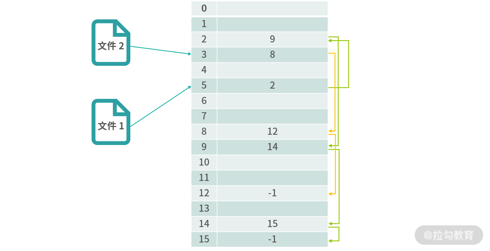
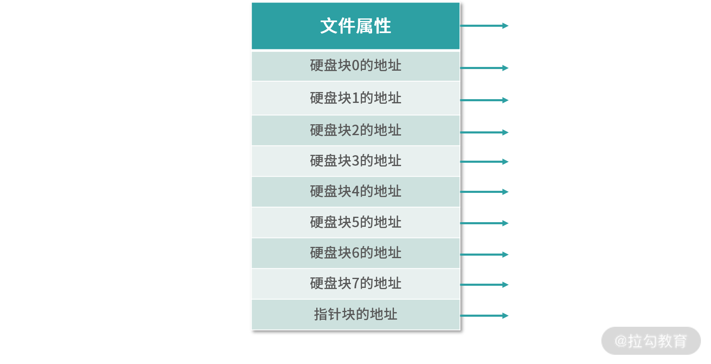
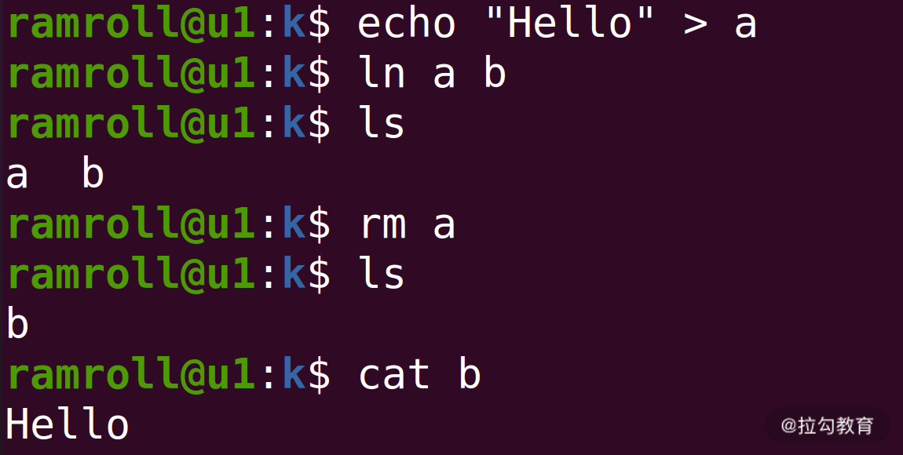
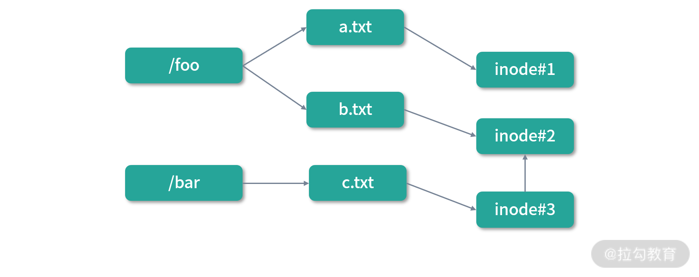
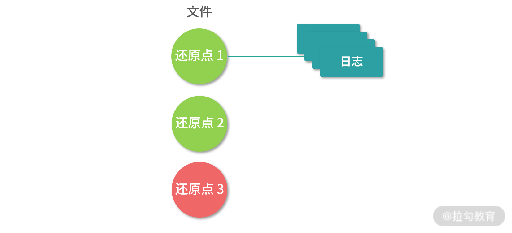

30 文件系统的底层实现：FAT、NTFS 和 Ext3 有什么区别？
===================================

**这一讲给你带来的面试题是： FAT、NTFS 和 Ext3 文件系统有什么区别**？

10 年前 FAT 文件系统还是常见的格式，而现在 Windows 上主要是 NTFS，Linux 上主要是 Ext3、Ext4 文件系统。关于这块知识，一般资料只会从支持的磁盘大小、数据保护、文件名等各种维度帮你比较，但是最本质的内容却被一笔带过。**它们最大的区别是文件系统的实现不同，具体怎么不同 **？** 文件系统又有哪些实现**？这一讲，我将带你一起来探索和学习这部分知识。

### 硬盘分块

在了解文件系统实现之前，我们先来了解下操作系统如何使用硬盘。**使用硬盘和使用内存有一个很大的区别，内存可以支持到字节级别的随机存取，而这种情况在硬盘中通常是不支持的**。过去的机械硬盘内部是一个柱状结构，有扇区、柱面等。读取硬盘数据要转动物理的磁头，每转动一次磁头时间开销都很大，因此一次只读取一两个字节的数据，非常不划算。

随着 SSD 的出现，机械硬盘开始逐渐消失（还没有完全结束），现在的固态硬盘内部是类似内存的随机存取结构。但是硬盘的读写速度还是远远不及内存。而连续读多个字节的速度，还远不如一次读一个硬盘块的速度。

因此，**为了提高性能，通常会将物理存储（硬盘）划分成一个个小块**，比如每个 4KB。这样做也可以让硬盘的使用看起来非常整齐，方便分配和回收空间。况且，数据从磁盘到内存，需要通过电子设备，比如 DMA、总线等，如果一个字节一个字节读取，速度较慢的硬盘就太耗费时间了。过去的机械硬盘的速度可以比内存慢百万倍，现在的固态硬盘，也会慢几十到几百倍。即便是最新的 NvMe 接口的硬盘，和内存相比速度仍然有很大的差距。因此，一次读/写一个块（Block）才是可行的方案。


如上图所示，操作系统会将磁盘分成很多相等大小的块。这样做还有一个好处就是如果你知道块的序号，就可以准确地计算出块的物理位置。

### 文件的描述

我们将硬盘分块后，如何利用上面的硬盘存储文件，就是文件系统（File System）要负责的事情了。当然目录也是一种文件，因此我们先讨论文件如何读写。不同的文件系统利用方式不同，今天会重点讨论 3 种文件系统：

* 早期的 FAT 格式
* 基于 inode 的传统文件系统
* 日志文件系统（如 NTFS, EXT2、3、4）

#### FAT 表

早期人们找到了一种方案就是文件分配表（File Allocate Table，FAT）。如下图所示：



**一个文件，最基本的就是要描述文件在硬盘中到底对应了哪些块。FAT 表通过一种类似链表的结构描述了文件对应的块 **。上图中：文件 1 从位置 5 开始，这就代表文件 1 在硬盘上的第 1 个块的序号是 5 的块 。然后位置 5 的值是 2，代表文件 1 的下一个块的是序号 2 的块。顺着这条链路，我们可以找到 5 → 2 → 9 → 14 → 15 → -1。-1 代表结束，所以文件 1 的块是：5,2,9,14,15。同理，文件 2 的块是 3,8,12。** FAT 通过一个链表结构解决了文件和物理块映射的问题，算法简单实用，因此得到过广泛的应用，到今天的 Windows/Linux/MacOS 都还支持 FAT 格式的文件系统**。FAT 的缺点就是非常占用内存，比如 1T 的硬盘，如果块的大小是 1K，那么就需要 1G 个 FAT 条目。通常一个 FAT 条目还会存一些其他信息，需要 2~3 个字节，这就又要占用 2-3G 的内存空间才能用 FAT 管理 1T 的硬盘空间。显然这样做是非常浪费的，问题就出在了 FAT 表需要全部维护在内存当中。

#### 索引节点（inode）

为了改进 FAT 的容量限制问题，可以考虑为每个文件增加一个索引节点（inode）。这样，随着虚拟内存的使用，当文件导入内存的时候，先导入索引节点（inode），然后索引节点中有文件的全部信息，包括文件的属性和文件物理块的位置。



如上图，索引节点除了属性和块的位置，还包括了一个指针块的地址。这是为了应对文件非常大的情况。一个大文件，一个索引节点存不下，需要通过指针链接到其他的块去描述文件。

这种文件索引节点（inode）的方式，完美地解决了 FAT 的缺陷，一直被沿用至今。FAT 要把所有的块信息都存在内存中，索引节点只需要把用到的文件形成数据结构，而且可以使用虚拟内存分配空间，随着页表置换，这就解决了 FAT 的容量限制问题。

### 目录的实现

有了文件的描述，接下来我们来思考如何实现目录（Directory）。目录是特殊的文件，所以每个目录都有自己的 inode。目录是文件的集合，所以目录的内容中必须有所有其下文件的 inode 指针。


文件名也最好不要放到 inode 中，而是放到文件夹中。这样就可以灵活设置文件的别名，及实现一个文件同时在多个目录下。


如上图，/foo 和 /bar 两个目录中的 b.txt 和 c.txt 其实是一个文件，但是拥有不同的名称。这种形式我们称作“硬链接”，就是多个文件共享 inode。



硬链接有一个非常显著的特点，硬链接的双方是平等的。上面的程序我们用`ln`指令为文件 a 创造了一个硬链接`b`。如果我们创造完删除了 a，那么 b 也是可以正常工作的。如果要删除掉这个文件的 inode，必须 a,b 同时删除。这里你可以看出 a,b 是平等的。

和硬链接相对的是软链接，软链接的原理如下图：



图中`c.txt`是`b.txt`的一个软链接，软链接拥有自己的`inode`，但是文件内容就是一个快捷方式。因此，如果我们删除了`b.txt`，那么`b.txt`对应的 inode 也就被删除了。但是`c.txt`依然存在，只不过指向了一个空地址（访问不到）。如果删除了`c.txt`，那么不会对`b.txt`造成任何影响。

在 Linux 中可以通过`ln -s`创造软链接。

```
ln -s a b # 将b设置为a的软链接(b是a的快捷方式)

```

以上，我们对文件系统的实现有了一个初步的了解。从**整体设计上，本质还是将空间切块，然后划分成目录和文件管理这些分块**。读、写文件需要通过 inode 操作磁盘。操作系统提供的是最底层读写分块的操作，抽象成文件就交给文件系统。比如想写入第 10001 个字节，那么会分成这样几个步骤：

1. 修改内存中的数据
2. 计算要写入第几个块
3. 查询 inode 找到真实块的序号
4. 将这个块的数据完整的写入一次磁盘**你可以思考一个问题，如果频繁读写磁盘，上面这个模型会有什么问题**？可以把你的思考和想法写在留言区，我们在本讲后面会详细讨论。

### 解决性能和故障：日志文件系统**在传统的文件系统实现中，inode 解决了 FAT 容量限制问题，但是随着 CPU、内存、传输线路的速度越来越快，对磁盘读写性能的要求也越来越高**。传统的设计，每次写入操作都需要进行一次持久化，所谓“持久化”就是将数据写入到磁盘，这种设计会成为整个应用的瓶颈。因为磁盘速度较慢，内存和 CPU 缓存的速度非常快，如果 CPU 进行高速计算并且频繁写入磁盘，那么就会有大量线程阻塞在等待磁盘 I/O 上。磁盘的瓶颈通常在写入上，因为通常读取数据的时候，会从缓存中读取，不存在太大的瓶颈

加速写入的一种方式，就是利用缓冲区。


上图中所有写操作先存入缓冲区，然后每过一定的秒数，才进行一次持久化。 这种设计，是一个很好的思路，但最大的问题在于容错。 比如上图的步骤 1 或者步骤 2 只执行了一半，如何恢复？如果步骤 2 只写入了一半，那么数据就写坏了。如果步骤 1 只写入了一半，那么数据就丢失了。无论出现哪种问题，都不太好处理。更何况写操作和写操作之间还有一致性问题，比如说一次删除 inode 的操作后又发生了写入……

解决上述问题的一个非常好的方案就是利用日志。假设 A 是文件中某个位置的数据，比起传统的方案我们反复擦写 A，日志会帮助我们把 A 的所有变更记录下来，比如：

```
A=1


A=2


A=3

```

上面 A 写入了 3 次，因此有 3 条日志。日志文件系统文件中存储的就是像上面那样的日志，而不是文件真实的内容。当用户读取文件的时候，文件内容会在内存中还原，所以内存中 A 的值是 3，但实际磁盘上有 3 条记录。

从性能上分析，如果日志造成了 3 倍的数据冗余，那么读取的速度并不会真的慢三倍。因为我们多数时候是从内存和 CPU 缓存中读取数据。而写入的时候，因为采用日志的形式，可以考虑下图这种方式，在内存缓冲区中积累一批日志才写入一次磁盘。


上图这种设计可以让写入变得非常快速，多数时间都是写内存，最后写一次磁盘。**而上图这样的设计成不成立，核心在能不能解决容灾问题**。

你可以思考一下这个问题——**丢失一批日志和丢失一批数据的差别大不大**。其实它们之间最大的差别在于，如果丢失一批日志，只不过丢失了近期的变更；但如果丢失一批数据，那么就可能造成永久伤害。

举个例子，比如说你把最近一天的订单数据弄乱了，你可以通过第三方支付平台的交易流水、系统的支付记录等帮助用户恢复数据，还可以通过订单关联的用户信息查询具体是哪些用户的订单出了问题。但是如果你随机删了一部分订单， 那问题就麻烦了。你要去第三发支付平台调出所有流水，用大数据引擎进行分析和计算。

为了进一步避免损失，一种可行的方案就是创建还原点（Checkpoint），比如说系统把最近 30s 的日志都写入一个区域中。下一个 30s 的日志，写入下一个区域中。每个区域，我们称作一个还原点。创建还原点的时候，我们将还原点涂成红色，写入完成将还原点涂成绿色。



如上图，当日志文件系统写入磁盘的时候，每隔一段时间就会把这段时间内的所有日志写入一个或几个连续的磁盘块，我们称为还原点（Checkpoint）。操作系统读入文件的时候，依次读入还原点的数据，如果是绿色，那么就应用这些日志，如果是红色，就丢弃。所以上图中还原点 3 的数据是不完整的，这个时候会丢失不到 30s 的数据。如果将还原点的间隔变小，就可以控制风险的粒度。另外，我们还可以对还原点 3 的数据进行深度恢复，这里可以有人工分析，也可以通过一些更加复杂的算法去恢复。

### 总结

这一讲我们学习了 3 种文件系统的实现，我们再来一起总结回顾一下。

* FAT 的设计简单高效，如果你要自己管理一定的空间，可以优先考虑这种设计。
* inode 的设计在内存中创造了一棵树状结构，对文件、目录进行管理，并且索引到磁盘中的数据。这是一种经典的数据结构，这种思路会被数据库设计、网络资源管理、缓存设计反复利用。
* 日志文件系统——日志结构简单、容易存储、按时间容易分块，这样的设计非常适合缓冲、批量写入和故障恢复。

现在我们很多分布式系统的设计也是基于日志，比如 MySQL 同步数据用 binlog，Redis 的 AOF，著名的分布式一致性算法 Paxos ，因此 Zookeeper 内部也在通过实现日志的一致性来实现分布式一致性。

**那么通过这节课的学习，你现在可以尝试来回答本节关联的面试题目：FAT、NTFS 和 Ext3 有什么区别**？

【**解析 **】FAT 通过内存中一个类似链表的结构，实现对文件的管理。** NTFS 和 Ext3 是日志文件系统，它们和 FAT 最大的区别在于写入到磁盘中的是日志，而不是数据**。日志文件系统会先把日志写入到内存中一个高速缓冲区，定期写入到磁盘。日志写入是追加式的，不用考虑数据的覆盖。一段时间内的日志内容，会形成还原点。这种设计大大提高了性能，当然也会有一定的数据冗余。
