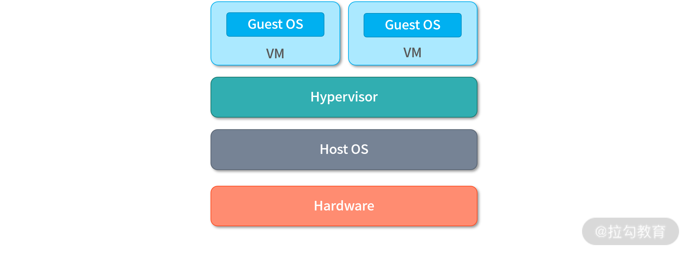
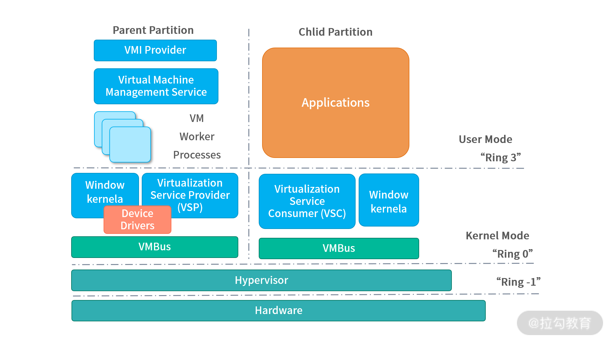
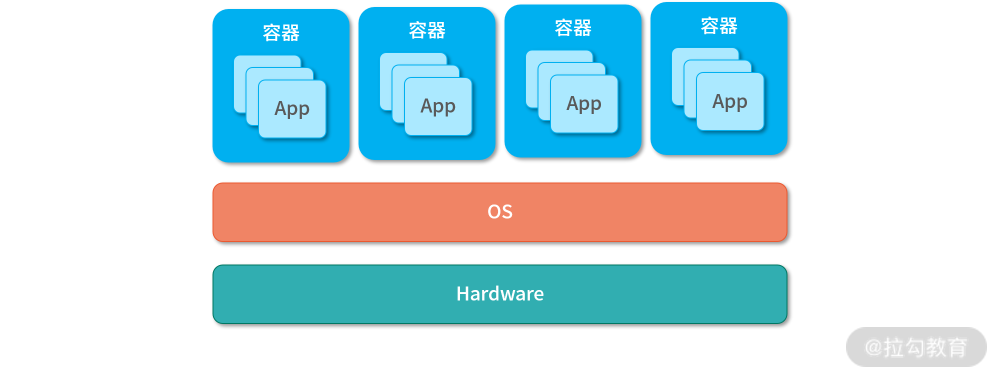

37 虚拟化技术介绍：VMware 和 Docker 的区别？
===============================

都说今天是一个云时代，其实云的本质就是由基础架构提供商提供基础架构，应用开发商不再关心基础架构。我们可以类比人类刚刚发明电的时候，工厂需要自己建电站，而现在只需要电线和插座就可以使用电。

云时代让我们可以在分钟、甚至秒级时间内获得计算、存储、操作系统等资源。设备不再论个卖，而是以一个虚拟化单位售卖，比如：

* 用户可以买走一个 64 核 CPU 机器中的 0.25 个 CPU；
* 也可以买走一个 128GB 内存机器中的 512M 内存；
* 还可以买走 1/2 台机器三个小时了执行时间。

实现以上这些，就需要虚拟化技术。这一讲我将以虚拟化技术中两种最具代表性的设计——VMware 和 Docker，为你解读解虚拟化技术。

### 什么是“虚拟化”

顾名思义，虚拟是相对于现实而言。虚拟化（Virutualization）通常是指构造真实的虚拟版本。不严谨地说，用软件模拟计算机，就是虚拟机；用数字模拟价值，就是货币；用存储空间模拟物理存储，就是虚拟磁盘。

VMware 和 Docker 是目前虚拟化技术中最具代表性的两种设计。 **VMware 为应用提供虚拟的计算机** （**虚拟机 **）；** Docker 为应用提供虚拟的空间，被称作容器 **（** Containe **r），关于空间的含义，我们会在下文中详细讨论。** VMware **在 1998 年诞生，通过 Hypervisor 的设计彻底改变了虚拟化技术。2005 年，VMware 不断壮大，在全球雇用了 1000 名员工，** 成为世界上最大的云基础架构提供商 **。** Docker **则是 2013 年发布的一个社区产品，后来逐渐在程序员群体中流行了起来。大量程序员开始习惯使用 Docker，所以各大公司才决定使用它。在“** 38 讲**”中我们要介绍的 Kubernates（K8s）容器编排系统，一开始也是将 Docker 作为主要容器。虽然业内不时有传出二者即将分道扬镳的消息，但是目前（2021 年）K8s 下的容器主要还是 Docker。

### 虚拟机的设计

接下来我们说说虚拟机设计。要虚拟一台计算机，要满足三个条件：**隔离、仿真、高效 **。** 隔离（Isolation）， **很好理解，** 指的是一台实体机上的所有的虚拟机实例不能互相影响 **。这也是早期设计虚拟机的一大动力，比如可以在一台实体机器上同时安装 Linux、Unix、Windows、MacOS 四种操作系统，那么一台实体机器就可以执行四种操作系统上的程序，这就节省了采购机器的开销。** 仿真（Simulation）指的是用起来像一台真的机器那样，包括开机、关机，以及各种各样的硬件设备**。在虚拟机上执行的操作系统认为自己就是在实体机上执行。仿真主要的贡献是\*\*让进程可以无缝的迁移，\*\*也就是让虚拟机中执行的进程，真实地感受到和在实体机上执行是一样的——这样程序从虚拟机到虚拟机、实体机到虚拟机的应用迁移，就不需要修改源代码。

**高效（Efficient）的目标是减少虚拟机对 CPU、对硬件资源的占用**。通常在虚拟机上执行指令需要额外负担10~15% 的执行成本，这个开销是相对较低的。因为应用通常很少将 CPU 真的用满，在容器中执行 CPU 指令开销会更低更接近在本地执行程序的速度。

为了实现上述的三种诉求，最直观的方案就是将虚拟机管理程序 Hypervisor 作为操作系统，在虚拟机管理程序（Hypervisor）之上再去构建更多的虚拟机。像这种管理虚拟机的架构，也称为 Type-1 虚拟机，如下图所示：

我们通常把虚拟机管理程序（Virtual Machine Monitor，VMM）称为 Hypervisor。在 Type-1 虚拟机中，Hypervisor一方面作为操作系统管理硬件，另一方面作为虚拟机的管理程序。在Hypervisor之上创建多个虚拟机，每个虚拟机可以拥有不同的操作系统（Guest OS）。

#### 二进制翻译

通常硬件的设计假定是由单操作系统管理的。如果多个操作系统要共享这些设备，就需要通过 Hypervisor。当操作系统需要执行程序的时候，程序的指令就通过 Hypervisor 执行。早期的虚拟机设计当中，Hypervisor 不断翻译来自虚拟机的程序指令，将它们翻译成可以适配在目标硬件上执行的指令。这样的设计，我们称为二进制翻译。**二进制翻译的弱点在于性能，所有指令都需要翻译**。相当于在执行所有指令的时候，都会产生额外的开销。当然可以用动态翻译技术进行弥补，比如说预读指令进行翻译，但是依然会产生较大的性能消耗。

#### 世界切换和虚拟化支持

另一种方式就是当虚拟机上的应用需要执行程序的时候，进行一次世界切换（World Switch）。**所谓世界切换就是交接系统的控制权，比如虚拟机上的操作系统，进入内核接管中断，成为实际的机器的控制者**。在这样的条件下，虚拟机上程序的执行就变成了本地程序的执行。相对来说，这种切换行为相较于二进制翻译，成本是更低的。

为了实现世界切换，虚拟机上的操作系统需要使用硬件设备，比如内存管理单元（MMR）、TLB、DMA 等。这些设备都需要支持虚拟机上操作系统的使用，比如说 TLB 需要区分是虚拟机还是实体机程序。虽然可以用软件模拟出这些设备给虚拟机使用，但是如果能让虚拟机使用真实的设备，性能会更好。现在的 CPU 通常都支持虚拟化技术，比如 Intel 的 VT-X 和 AMD 的 AMD-V（也称作 Secure Virtual Machine）。如果你对硬件虚拟化技术非常感兴趣，可以阅读[这篇文档](https://www.mimuw.edu.pl/~vincent/lecture6/sources/amd-pacifica-specification.pdf)。

#### Type-2 虚拟机

Type-1 虚拟机本身是一个操作系统，所以需要用户预装。为了方便用户的使用，VMware 还推出了 Type-2 虚拟机，如下图所示：

在第二种设计当中，虚拟机本身也作为一个进程。它和操作系统中执行的其他进程并没有太大的区别。但是**为了提升性能，有一部分 Hypervisor 程序会作为内核中的驱动执行 **。** 当虚拟机操作系统（Guest OS）执行程序的时候，会通过 Hypervisor 实现世界切换**。因此，虽然和 Type-1 虚拟机有一定的区别，但是从本质上来看差距不大，同样是需要二进制翻译技术和虚拟化技术。

#### Hyper-V

随着虚拟机的发展，现在也出现了很多混合型的虚拟机，比如微软的 Hyper-v 技术。从下图中你会看到，虚拟机的管理程序（Parent Partition）及 Windows 的核心程序，都会作为一个虚拟化的节点，拥有一个自己的 VMBus，并且通过 Hypervisor 实现虚拟化。

在 Hyper-V 的架构当中不存在一个主的操作系统。实际上，用户开机之后就在使用虚拟机，Windows 通过虚拟机执行。在这种架构下，其他的虚拟机，比如用 VMware 管理的虚拟机也可以复用这套架构。当然，你也可以直接把 Linux 安装在 Hyper-V 下，只不过安装过程没有 VMWare 傻瓜化，其实也是很不错的选择。

### 容器（Container）**虚拟机虚拟的是计算机，容器虚拟的是执行环境**。每个容器都是一套独立的执行环境，如下图所示，容器直接被管理在操作系统之内，并不需要一个虚拟机监控程序

**和虚拟机有一个最大的区别就是：容器是直接跑在操作系统之上的，容器内部是应用，应用执行起来就是进程 **。这个进程和操作系统上的其他进程也没有本质区别，但这个架构设计没有了虚拟机监控系统。当然，容器有一个更轻量级的管理程序，用户可以从网络上下载镜像，启动起来就是容器。容器中预装了一些程序，比如说一个 Python 开发环境中，还会预装 Web 服务器和数据库。因为没有了虚拟机管理程序在中间的开销，因而性能会更高。而且因为不需要安装操作系统，因此容器安装速度更快，可以达到 ms 级别。** 容器依赖操作系统的能力直接实现，比如：**

* **Linux 的 Cgroups（Linux Control Groups）能力，可以用来限制某组进程使用的 CPU 资源和内存资源，控制进程的资源能使用；**
* 另外 **Linux 的 Namespace 能力，可以设置每个容器能看到能够使用的目录和文件** 。

有了这两个能力，就可以基本控制容器间的隔离，容器中的应用直接以进程的身份执行即可。进程间的目录空间、 CPU 资源已经被隔离了，所以不用担心互相影响。

### 总结

这一讲我们学习了 VMware 虚拟机和 Docker 容器的一些基本设计思路。虚拟机可以把一个完整的系统用若干个文件保存下来，因此迁移和复制都很容易。但是，与其启动一个操作系统，还不如直接打开应用，因此以 Docker 为代表的容器逐渐发展了起来。

容器虽然达到了虚拟机同样的隔离性，创建、销毁、维护成本都更低，但是从安全性考虑，还是要优先选用虚拟机执行操作系统。基础设施是一件大事，比如操作系统会发生故障、任何应用都有可能不安全，甚至容器管理程序本身也可能出现问题。因此，现在更多的情况是 Docker 被安装到了虚拟机上。

**那么通过这一讲的学习，你现在可以尝试来回答本讲关联的面试题目：VMware 和 Docker 的区别 **？** 【解析】** VMware 提供虚拟机，Docker 提供容器。 虚拟机是一台完整的计算机，因此需要安装操作系统。虚拟机中的程序执行在虚拟机的操作系统上，为了让多个操作系统可以高效率地同时执行，虚拟机非常依赖底层的硬件架构提供的虚拟化能力。容器则是利用操作系统的能力直接实现隔离，容器中的程序可以以进程的身份直接执行。
