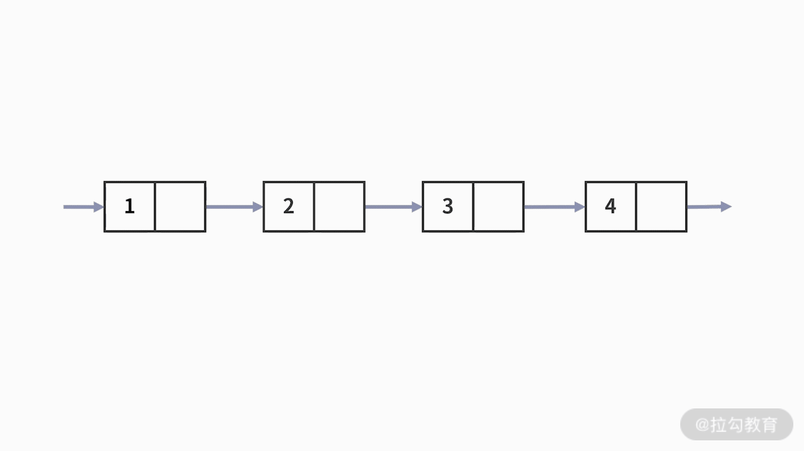
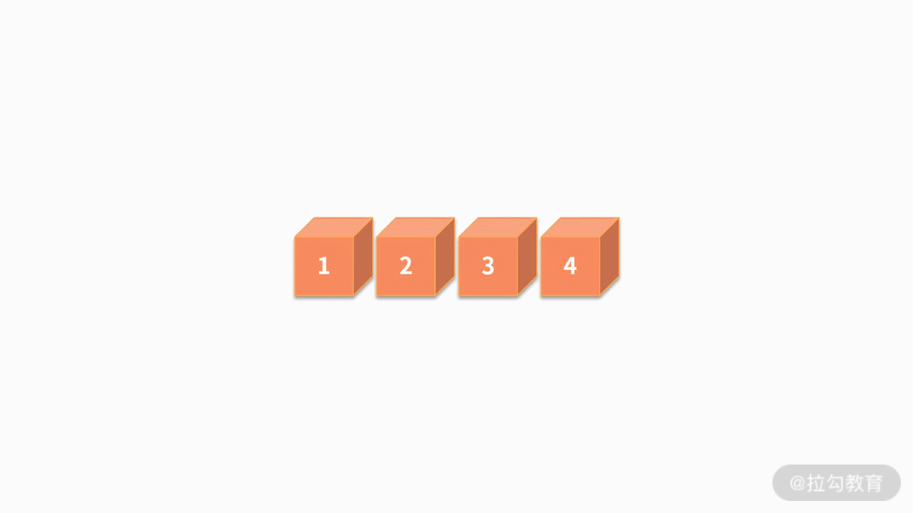

# 03 增删查：掌握数据处理的基本操作,以不变应万变

通过前面课时的学习，相信你已经建立了利用数据结构去完成时空转移的思想。接下来，你需要在理论思想的指导下灵活使用。其实，要想灵活使用数据结构，你需要先弄清楚数据在代码中被处理、加工的最小单位动作，也就是数据结构的基本操作，有了这些动作之后，你就可以基于此去选择更合适的数据结构了。本课时我们就先来学习数据处理的基本操作。

### 代码对数据的处理

我们重温一下上一课时的例子。在一个数组中找出出现次数最多的那个元素的数值。例如，输入数组 a = \[1,2,3,4,5,5,6\] 中，只有 5 出现了两次，其余都是 1 次。显然 5 出现的次数最多，则输出 5。为了降低时间复杂度，我们引入了 k-v 的字典的数据结构。那么问题来了，究竟是什么原因，促使我们想到了使用字典的数据结构呢？如果不使用字典，改为使用数组行不行呢？

为了回答这些问题，我们先看一下究竟此处代码需要对数据进行哪些操作。我们提到过，这段代码处理数据的核心思路是：

- 第一步，根据原始数组计算每个元素出现的次数；
- 第二步，根据第一步的结果，找到出现次数最多的元素。

首先，我们来分析第一步统计出现次数的处理。此时，你还不知道应该采用什么数据结构。

对于每一次的循环，你得到了输入数组中的某个元素 a\[ i \] 。接着，你需要判断这个元素在未知的数据结构中是否出现过：

- 如果出现了，就需要对出现的次数加 1。
- 如果没有出现过，则把这个元素新增到未知数据结构中，并且把次数赋值为 1。

这里的数据操作包括以下 3 个。

- **查找：** 看能否在数据结构中查找到这个元素，也就是判断元素是否出现过。
- **新增：** 针对没有出现过的情况，新增这个元素。
- \*\*改动：\*\*针对出现过的情况，需要对这个元素出现的次数加 1。

接下来，我们一起分析第二步。访问数据结构中的每个元素，找到次数最多的元素。这里涉及的数据操作很简单，只有**查找**。

因此，这段代码需要**高频使用查找**的功能。此时，第一步的查找动作嵌套在 for 循环中，如果你的代码不能在 O(1) 的时间复杂度内完成，则代码整体的时间复杂度并没有下降。而能在 O(1) 的时间复杂度内完成查找动作的数据结构，只有字典类型。这样，外层 for 循环是 O(n) 的时间复杂度，内部嵌套的查找操作是 O(1) 的时间复杂度。整体计算下来，就仍然是 O(n) 的时间复杂度。字典的查找是通过键值对的匹配完成的，它可以在 O(1) 时间复杂度内，实现对数值条件查找。关于字典的内容，我们在后续的课程中会详细解答。

现在，我们换个解决方案。假设采用两个数组，分别按照对应顺序记录元素及其对应的出现次数。数组对于元素的查找只能逐一访问，时间复杂度是 O(n)。也就是说，在 O(n) 复杂度的 for 循环中，又嵌套了 O(n) 复杂度的查找动作，所以时间复杂度是 O(n²)。因此，这里的数据结构，只能采用字典类型。

### 数据处理的基本操作

不管是数组还是字典，都需要额外开辟空间，对数据进行存储。而且数据存储的数量，与输入的数据量一致。因此，消耗的空间复杂度相同，都是 O(n)。由前面的分析可见，同样采用复杂的数据结构，消耗了 O(n) 的空间复杂度，其对时间复杂度降低的贡献有可能不一样。因此，我们必须要**设计合理的数据结构**，以达到降低时间损耗的目的。

而设计合理的数据结构，又要从问题本身出发，我们可以采用这样的思考顺序：

- 首先我们分析这段代码到底对数据先后进行了哪些操作。
- 然后再根据分析出来的数据操作，找到合理的数据结构。

这样我们就把数据处理的基本操作梳理了出来。今后，即使你遇到更复杂的问题，无非就是这些基本操作的叠加和组合。只要按照上述的逻辑进行思考，就可以轻松设计出合理的数据结构，

其实，代码对数据处理的操作类型非常少。代码对数据的处理就是代码对输入数据进行计算，得到结果并输出的过程。数据处理的操作就是找到需要处理的数据，计算结果，再把结果保存下来。这个过程总结为以下操作：

- 找到要处理的数据。这就是按照某些条件进行 **查找** 。
- 把结果存到一个新的内存空间中。这就是在现有数据上进行 **新增** 。
- 把结果存到一个已使用的内存空间中。这需要先 **删除** 内存空间中的已有数据，再新增新的数据。

经过对代码的拆解，你会发现即便是很复杂的代码，它对数据的处理也只有这 3 个基本操作，增、删、查。只要你围绕这 3 个数据处理的操作进行分析，就能得出解决问题的最优方案。常用的分析方法可以参考下面的 3 个步骤：

- 首先，这段代码对数据进行了哪些操作？
- 其次，这些操作中，哪个操作最影响效率，对时间复杂度的损耗最大？
- 最后，哪种数据结构最能帮助你提高数据操作的使用效率？

这 3 个步骤构成了设计合理数据结构的方法论。围绕第一步和第二步的数据处理的操作，我~~会~~再补充一些例子帮助你理解。而第三个方面就需要你拥有足够扎实的数据结构基础知识了，我会在后面的课程中详细讨论。

### 数据操作与数据结构的案例

我们先来看一个关于查找的例子。查找，就是从复杂的数据结构中，找到满足某个条件的元素。通常可从以下两个方面来对数据进行查找操作：

- 根据元素的位置或索引来查找。
- 根据元素的数值特征来查找。

针对上述两种情况，我们分别给出例子进行详细介绍。

例 1，我们来看第二个例子，对于一个数组，找到数组中的第二个元素并输出。

这个问题的处理很简单。由于数组本身具有索引 index ，因此直接通过索引就能查找到其第二个元素。别忘了，数组的索引值是从 0 开始的，因此第二个元素的索引值是 1 。不难发现，因为有了 index 的索引，所以我们就可以直接进行查找操作来，这里的时间复杂度为 O(1)。

例 2，我们来看第二个例子，如果是链表，如何找到这个链表中的第二个元素并输出呢？

链表和数组一样，都是 O(n) 空间复杂度的复杂数据结构。但其区别之一就是，数组有 index 的索引，而链表没有。链表是通过指针，让元素按某个自定义的顺序“手拉手”连接在一起的。

既然是这样，要查找其第二个元素，就必须要先知道第一个元素在哪里。以此类推，链表中某个位置的元素的查找，只能通过从前往后的顺序逐一去查找。不难发现，链表因为没有索引，只能“一个接一个”地按照位置条件查找，在这种情况下时间复杂度就是 O (n)。

例 3，我们再来看第三个例子，关于数值条件的查找。

我们要查找出，数据结构中数值等于 5 的元素是否存在。这次的查找，无论是数组还是链表都束手无策了。唯一的方法，也只有按照顺序一个接一个地去判断元素数值是否满足等于 5 的条件。很显然，这样的查找方法时间复杂度是 O(n)。那么有没有时间复杂度更低的方式呢？答案当然是：有。

在前面的课时中，我们遇到过要查找出数组中出现次数最多的元素的情况。我们采用的方法是，把数组转变为字典，以保存元素及其出现次数的 k-v 映射关系。而在每次的循环中，都需要对当前遍历的元素，去查找它是否在字典中出现过。这里就是很实际的按照元素数值查找的例子。如果借助字典的数据类型，这个例子的查找问题，就可以在 O(1) 的时间复杂度内完成了。

例 4，我们再来看第四个例子，关于复杂数据结构中新增数据，这里有两个可能.

- 第一个是在这个复杂数据结构的最后，新增一条数据。
- 第二个是在这个复杂数据结构的中间某个位置，新增一条数据。

这两个可能性的区别在于，新增~~了~~数据之后，是否会导致原有数据结构中数据的位置顺序改变。接下来，我们分别来举例说明。

在复杂数据结构中，新增一条数据。假设是在数据结构的最后新增数据。此时新增一条数据后，对原数据没有产生任何影响。因此，执行的步骤是：

- 首先，通过查找操作找到数据结构中最后一个数据的位置；
- 接着，在这个位置之后，通过新增操作，赋值或者插入一条新的数据即可。

如果是在数据结构中间的某个位置新增数据，则会对插入元素的位置之后的元素产生影响，导致数据的位置依次加 1 。例如，对于某个长度为 4 的数组，在第二个元素之后插入一个元素。则修改后的数组中，原来的第一、第二个元素的位置不发生变化，第三个元素是新插入的元素，第四、第五个元素则是原来的第三、第四个元素。

我们再来看看删除。在复杂数据结构中删除数据有两个可能：

- 第一个是在这个复杂数据结构的最后，删除一条数据。
- 第二个是在这个复杂数据结构的中间某个位置，删除一条数据。

这两个可能性的区别在于，删除了数据之后，是否会导致原有数据结构中数据的位置顺序改变。由于删除操作和新增操作高度类似，我们就不再举详细阐述了。

通过上述例子的学习之后，你就可以对它们进行组合，去玩转更复杂的数据操作了，我们再来看一个例子。

例 5，在某个复杂数据结构中，在第二个元素之后新增一条数据。随后再删除第 1 个满足数值大于 6 的元素。我们来试着分析这个任务的数据操作过程。这里有两个步骤的操作：

- 第一步，在第二个元素之后新增一条数据。这里包含了查找和新增两个操作，即查找第二个元素的位置，并在数据结构中间新增一条数据。
- 第二步，删除第 1 个满足数值大于 6 的元素。这里包含查找和删除两个操作，即查找出第 1 个数值大于 6 的元素的位置，并删除这个位置的元素。

因此，总共需要完成的操作包括，按照位置的查找、新增和按照数据数值的查找、删除。

### 总结

好的，这节课的内容就到这里了。这一节的内容在很多数据结构的课程中都是没有的，这是因为大部分课程设计时，都普遍默认你已经掌握了这些知识。但是，这些知识恰恰又是你学习数据结构的根基。只有在充分了解问题、明确数据操作的方法之后，才能设计出更加高效的数据结构类型。

经过我们的分析，数据处理的基本操作只有 3 个，分别是增、删、查。其中，增和删又可以细分为在数据结构中间的增和删，以及在数据结构最后的增和删。区别就在于原数据的位置是否发生改变。查找又可以细分为按照位置条件的查找和按照数据数值特征的查找。几乎所有的数据处理，都是这些基本操作的组合和叠加。

### 练习题

下面我们给出一道练习题。对于一个包含 5 个元素的数组，如果要把这个数组元素的顺序翻转过来。你可以试着分析该过程需要对数据进行哪些操作？

在实际的工作中，如果你不知道该用什么数据结构的时候，就一定要回归问题本源。
