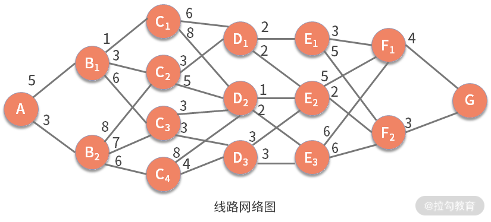
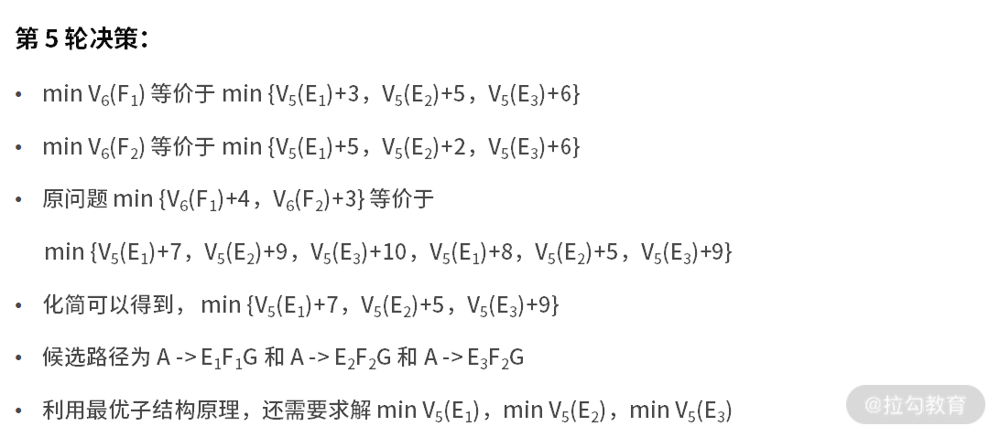
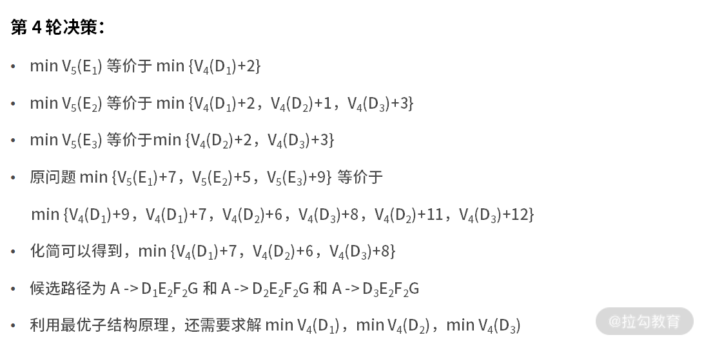
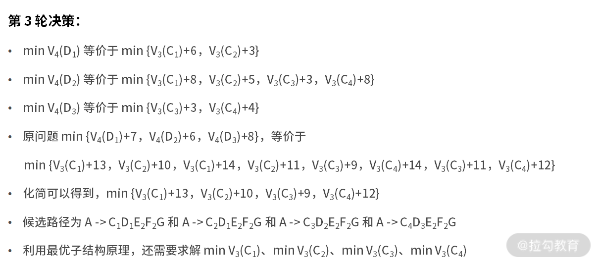
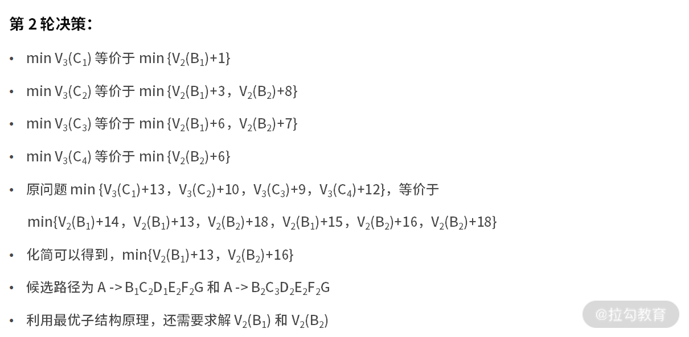
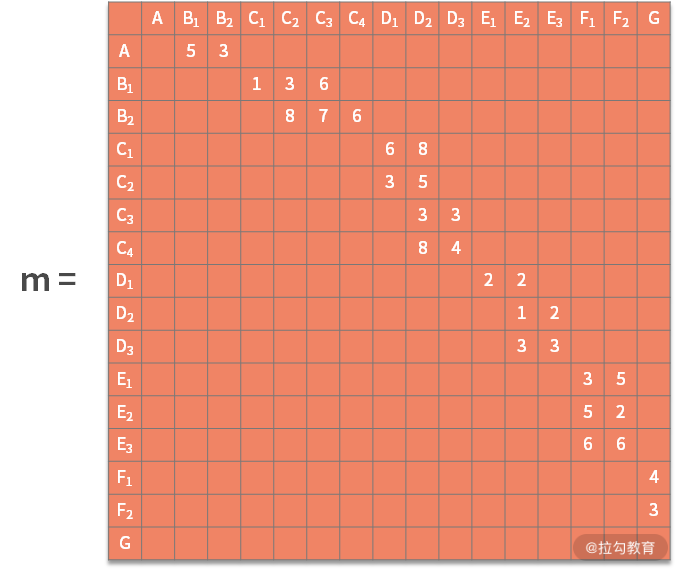

# 14 动态规划：如何通过最优子结构，完成复杂问题求解？

在前面课时中，我们学习了分治法的思想，并以二分查找为例介绍了分治的实现逻辑。

我们提到过，**分治法的使用必须满足 4 个条件：**1.  问题的解决难度与数据规模有关；
2\.  原问题可被分解；
3\.  子问题的解可以合并为原问题的解；
4\.  所有的子问题相互独立。

然而在实际工作中还存在这样一类问题，它们满足前 3 个条件，唯独不满足第 4 个条件。那么这类问题我们该怎么解决呢？本课时，我们就来学习求解这类问题的动态规划算法，它是最常用的算法之一。

### 什么是动态规划**从数学的视角来看，动态规划是一种运筹学方法，是在多轮决策过程中的最优方法**

那么，什么是多轮决策呢？其实多轮决策的每一轮都可以看作是一个子问题。**从分治法的视角来看，每个子问题必须相互独立。但在多轮决策中，这个假设显然不成立。这也是动态规划方法产生的原因之一**。

动态规划是候选人参加面试的噩梦，也是面试过程中的难点。虽然动态规划很难，但在实际的工作中，使用频率并不高，不是所有的岗位都会用到动态规划。

#### 最短路径问题

接下来。**我们来看一个非常典型的例子，最短路径问题**。如下图所示：


每个结点是一个位置，每条边是两个位置之间的距离。现在需要求解出一条由 A 到 G 的最短距离是多少。

不难发现，我们需要求解的路线是由 A 到 G，这就意味着 A 要先到 B，再到 C，再到 D，再到 E，再到 F。每一轮都需要做不同的决策，而每次的决策又依赖上一轮决策的结果。

例如，做 D2 -> E 的决策时，D2 -> E2 的距离为 1，最短。但这轮的决策，基于的假设是从 D2 出发，这就意味着前面一轮的决策结果是 D2。由此可见，相邻两轮的决策结果并不是独立的。**动态规划还有一个重要概念叫作状态**。在这个例子中，状态是个变量，而且受决策动作的影响。例如，第一轮决策的状态是 S1，可选的值是 A，第二轮决策的状态是 S2，可选的值就是 B1 和 B2。以此类推。

### 动态规划的基本方法

动态规划问题之所以难，是因为动态规划的解题方法并没有那么标准化，它需要你因题而异，仔细分析问题并寻找解决方案。**虽然动态规划问题没有标准化的解题方法，但它有一些宏观层面通用的方法论**：

> 下面的 k 表示多轮决策的第 k 轮

1.**分阶段 **，将原问题划分成几个子问题。一个子问题就是多轮决策的一个阶段，它们可以是不满足独立性的。
2.** 找状态 **，选择合适的状态变量 Sk。它需要具备描述多轮决策过程的演变，更像是决策可能的结果。
3.** 做决 **策，确定决策变量 uk。每一轮的决策就是每一轮可能的决策动作，例如 D2 的可能的决策动作是 D2 -> E2 和 D2 -> E3。
4.** 状态转移方程 **。这个步骤是动态规划最重要的核心，** 即 sk+1= uk(sk) 。 **5.** 定目标 **。写出代表多轮决策目标的指标函数 Vk,n。
6.** 寻找终止条件**。

了解了方法论、状态、多轮决策之后，我们再补充一些动态规划的基本概念。

- **策略**，每轮的动作是决策，多轮决策合在一起常常被称为策略。
- **策略集合 **，由于每轮的决策动作都是一个变量，这就导致合在一起的策略也是一个变量。我们通常会称所有可能的策略为策略集合。因此，动态规划的目标，也可以说是从策略集合中，找到最优的那个策略。** 一般而言，具有如下几个特征的问题，可以采用动态规划求解**：

1.**最优子结构 **。它的含义是，原问题的最优解所包括的子问题的解也是最优的。例如，某个策略使得 A 到 G 是最优的。假设它途径了 Fi，那么它从 A 到 Fi 也一定是最优的。
2.** 无后效性 **。某阶段的决策，无法影响先前的状态。可以理解为今天的动作改变不了历史。
3.** 有重叠子问题 **。也就是，子问题之间不独立。** 这个性质是动态规划区别于分治法的条件**。如果原问题不满足这个特征，也是可以用动态规划求解的，无非就是杀鸡用了宰牛刀。

### 动态规划的案例

到这里，动态规划的概念和方法就讲完了。接下来，我们以最短路径问题再来看看动态规划的求解方法。在这个问题中，你可以采用最暴力的方法，那就是把所有的可能路径都遍历一遍，去看哪个结果的路径最短的。如果采用动态规划方法，那么我们按照方法论来执行。

#### 动态规划的求解方法**具体的解题步骤如下**

##### 1.**分阶段**很显然，从 A 到 G，可以拆分为 A -> B、B -> C、C -> D、D -> E、E -> F、F -> G，6 个阶段

##### 2.**找状态**第一轮的状态 S1 = A，第二轮 S2 = {B1,B2}，第三轮 S3 = {C1,C2,C3,C4}，第四轮 S4 = {D1,D2,D3}，第五轮 S5 = {E1,E2,E3}，第六轮 S6 = {F1,F2}，第七轮 S7 = {G}

##### 3.**做决策**决策变量就是上面图中的每条边。我们以第四轮决策 D -> E 为例来看，可以得到 u4(D1)，u4(D2)，u4(D3)。其中 u4(D1) 的可能结果是 E1 和 E2

##### 4.**写出状态转移方程**

在这里，就是 _s**k_+1 = _u**k_(_s**k_)。

##### 5. **定目标**

别忘了，我们的目标是总距离最短。我们定义 _d**k_(_s**k_,_u**k_) 是在 sk 时，选择 uk 动作的距离。例如，\_d_5(\_E_1,\_F_1) = 3。那么此时 n = 7，则有，


就是最终要优化的目标。

##### 6. **寻找终止条件**

- 很显然，这里的起止条件分别是，s1 = A 和 s7 = G。
- 接下来，我们把所有的已知条件，凝练为上面的符号之后，只需要借助最优子结构，就可以把问题解决了。最优子结构的含义是，原问题的最优解所包括的子问题的解也是最优的。
- 套用在这个例子的含义就是，如果 A -> ... -> F1 -> G 是全局 A 到 G 最优的路径，那么此处 A -> ... -> F1 也是 A 到 F1 的最优路径。
- 因此，此时的优化目标 min Vk,7(s1=A, s7=G)，等价于 min { Vk,6(s1=A, s6=F1)+4， Vk,6(s1=A, s6=F2)+3 }。
- 此时，优化目标的含义为，从 A 到 G 的最短路径，是 A 到 F1 到 G 的路径和 A 到 F2 到 G 的路径中更短的那个。
- 同样的，对于上面式子中，Vk,6(s1=A,s6=F1) 和 Vk,6(s1=A,s6=F2)，仍然可以递归地使用上面的分析方法。

#### 计算过程详解

好了，为了让大家清晰地看到结果，我们给出详细的计算过程。为了书写简单， **我们把函数 Vk,7(s1=A, s7=G) 精简为 V7(G)，含义为经过了 6 轮决策后，状态到达 G 后所使用的距离** 。我们把图片复制到这里一份，方便大家不用上下切换。



**我们的优化目标为 min Vk,7(s1=A, s7=G)，因此精简后原问题为，min V7(G)**。











因此，**最终输出路径为 A -> B1 -> C2 -> D1 -> E2 -> F2 -> G，最短距离为 18**。

#### 代码实现过程

接下来，我们尝试用代码来实现上面的计算过程。对于输入的图，可以采用一个 m x m 的二维数组来保存。在这个二维数组里，m 等于全部的结点数，也就是结点与结点的关系图。而数组每个元素的数值，定义为结点到结点需要的距离。


在本例中，可以定义输入矩阵 m（空白处为0），如下图所示：



代码如下：

```
public class testpath {
    public static int minPath1(int[][] matrix) {
        return process1(matrix, matrix[0].length-1);
    }
    // 递归
    public static int process1(int[][] matrix, int i) {
        // 到达A退出递归
        if (i == 0) {
            return 0;
        }
        // 状态转移
        else{
            int distance = 999;
            for(int j=0; j<i; j++){
                if(matrix[j][i]!=0){
                    int d_tmp = matrix[j][i] + process1(matrix, j);
                    if (d_tmp < distance){
                        distance = d_tmp;
                    }
                }
            }
            return distance;
        }
    }
    public static void main(String[] args) {
        int[][] m = {{0,5,3,0,0,0,0,0,0,0,0,0,0,0,0,0},{0,0,0,1,3,6,0,0,0,0,0,0,0,0,0,0},{0,0,0,0,8,7,6,0,0,0,0,0,0,0,0,0},{0,0,0,0,0,0,0,6,8,0,0,0,0,0,0,0},{0,0,0,0,0,0,0,3,5,0,0,0,0,0,0,0},{0,0,0,0,0,0,0,0,3,3,0,0,0,0,0,0},{0,0,0,0,0,0,0,0,8,4,0,0,0,0,0,0},{0,0,0,0,0,0,0,0,0,0,2,2,0,0,0,0},{0,0,0,0,0,0,0,0,0,0,0,1,2,0,0,0},{0,0,0,0,0,0,0,0,0,0,0,3,3,0,0,0},{0,0,0,0,0,0,0,0,0,0,0,0,0,3,5,0},{0,0,0,0,0,0,0,0,0,0,0,0,0,5,2,0},{0,0,0,0,0,0,0,0,0,0,0,0,0,6,6,0},{0,0,0,0,0,0,0,0,0,0,0,0,0,0,0,4},{0,0,0,0,0,0,0,0,0,0,0,0,0,0,0,3}};
        System.out.println(minPath1(m));
    }
}
```

#### 代码解读**下面我们对这段代码进行解读 **：** 代码的 27 行是主函数 **，在代码中定义了二维数组 m，对应于输入的距离图。m 是 15 x 16 维的，我们忽略了最后一行的全 0（即使输入也不会影响结果）。** 然后调用函数 minPath1 **。** 在第 2 到第 4 行 **，它的内部又调用了 process1(matrix, matrix\[0\].length-1)。在这里，matrix\[0\].length-1 的值是 15，表示的含义是 matrix 数组的第 16 列（G）是目的地。** 接着进入 process1 函数中 **。我们知道在动态规划的过程中，是从后往前不断地推进结果，这就是状态转移的过程。** 对应代码中的 13-24 行：**

- 第 15 行开始循环，j 变量是纵向的循环变量。
- 第 16 行判断 matrix\[j\]\[i\] 与 0 的关系，含义为，只有值不为 0 才说明两个结点之间存在通路。
- 一旦发现某个通路，就需要计算其距离。计算的方式是 17 行的，d_tmp = matrix\[j\]\[i\] + process1(matrix, j)。
- 当得到了距离之后，还需要找到最短的那个距离，也就是 18 到 20 行的含义。这就是动态规划最优子结构的体现。
- 一旦 i 减小到了 0，就说明已经到了起点 A。那么 A 到 A 的距离就是 0，直接第 10 行的 return 0 就可以了。
- 经过运行，这段代码的输出结果是 18，这与我们手动的推导结果一致。

### 练习题

在 08 课时中，我们讲述“字符串匹配算法的案例”时提到过，最大公共子串也可以使用动态规划的方法来做。

案例题目如下：

假设有且仅有 1 个最大公共子串。比如，输入 a = "13452439"， b = "123456"。由于字符串 "345" 同时在 a 和 b 中出现，且是同时出现在 a 和 b 中的最长子串。因此输出 "345"。

我们就把这个问题当作本课时的练习题。详细分析和答案，请翻阅 16 课时例题 3。

### 总结

动态规划领域有很多经典问题，本课时，我们讲述了最短路径的问题。需要明确的是，动态规划并不简单，动态规划的适用范围也没有那么广。如果你不是专门从事运筹优化领域的工作，对它不了解也很正常。如果在求职过程中，你求职的岗位与运筹优化关系不大，一般而言被考察到动态规划的可能性也是极低的。
