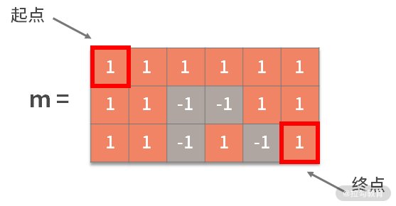

# 19 真题案例（四）：大厂真题实战演练

这个课时，我们找一些大厂的真题进行分析和演练。在看真题前，我们依然是再重复一遍通用的解题方法论，它可以分为以下 4 个步骤：

1. **复杂度分析** 。估算问题中复杂度的上限和下限。
   2. **定位问题** 。根据问题类型，确定采用何种算法思维。
   3. **数据操作分析** 。根据增、删、查和数据顺序关系去选择合适的数据结构，利用空间换取时间。
   4. **编码实现** 。

### 大厂真题实战演练

#### 例题 1：判断数组中所有的数字是否只出现一次 **【题目】** 判断数组中所有的数字是否只出现一次。给定一个个数字 arr，判断数组 arr 中是否所有的数字都只出现过一次。约束时间复杂度为 O(n)。例如，arr = {1, 2, 3}，输出 YES。又如，arr = {1, 2, 1}，输出 NO。 **【解析】** 这个题目相当于一道开胃菜，也是一道送分题。我们还是严格围绕解题方法论，去拆解这个问题。 **我们先来看一下复杂度** 。判断是否所有数字都只出现一次，很显然我们需要对每个数字进行遍历，因此时间复杂度为 O(n)。而每次的遍历，都要判断当前元素在先前已经扫描过的区间内是否出现过。由于此时并没有额外信息（例如数组有序）输入，因此，还需要 O(n) 的时间进行判断。综合起来看就是 O(n²) 的时间复杂度。这显然与题目的要求不符合。 **然后我们来定位问题** 。根据题目来看，你可以理解这是一个数据去重的问题。但是由于我们并没有学过太多解决这类问题的算法思维，因此我们不妨再从数据操作的视角看一下。 **按照解题步骤，接下来我们需要做数据操作分析。** 每轮迭代需要去判断当前元素在先前已经扫描过的区间内是否出现过，这就是一个查找的动作。也就是说，每次迭代需要对数据进行数值特征方面的查找。这个题目只需要判断是否有重复，并不需要新增、删除的动作

在优化数值特性的查找时，我们应该立马想到哈希表。因为它能在 O(1) 的时间内完成查找动作。这样，整体的时间复杂度就可以被降低为 O(n) 了。与此同时，空间复杂度也提高到了 O(n)。 **根据上面的思路进行编码开发** ，具体代码如下：

```
public static void main(String[] args) {
    int[] arr = { 1, 2, 3 };
    boolean isUniquel = isUniquel(arr);
    if (isUniquel) {
        System.out.println("YES");
    } else {
        System.out.println("NO");
    }
}
public static boolean isUniquel(int[] arr) {
    Map<Integer, Integer> d = new HashMap<>();
    for (int i = 0; i < arr.length; i++) {
        if (d.containsKey(arr[i])) {
            return false;
        }
        d.put(arr[i], 1);
    }
    return true;
}
``` **我们对代码进行解读** 。在主函数第 1～9 行中，调用 isUniquel() 函数进行判断，并根据结果打印 YES 或者 NO。在函数 isUniquel() 内，第 12 行定义了一个 k-v 结构的 map。

接着 13 行开始，对 arr 的每个元素进行循环。如果 d 中已经存在 arr\[i\] 了，那么就返回 false（第 14～16 行）；否则就把 arr\[i\],1 的 k,v 关系放进 d 中（第 17 行）。

这道题目比较简单，属于数据结构的应用范畴。

#### 例题 2：找出数组中出现次数超过数组长度一半的元素 **【题目】** 假设在一个数组中，有一个数字出现的次数超过数组长度的一半，现在要求你找出这个数字。

你可以假设一定存在这个出现次数超过数组长度的一半的数字，即不用考虑输入不合法的情况。要求时间复杂度是 O(n)，空间复杂度是 O(1)。例如，输入 a = {1,2,1,1,2,4,1,5,1}，输出 1。 **【解析】先来看一下时间复杂度的分析** 。一个直观想法是，一边扫描一边记录每个元素出现的次数，并利用 k-v 结构的哈希表存储。例如，一次扫描后，得到元素-次数（1-5，2-2，4-1，5-1）的字典。接着再在这个字典里去找到次数最多的元素。这样的时间复杂度和空间复杂度都是 O(n)。不过可惜，这并不满足题目的要求。 **接着，我们需要定位问题。** 从问题出发，这并不是某个特定类型的问题。而且既然空间复杂度限定是 O(1)，也就意味着不允许使用任何复杂的数据结构。也就是说，数据结构的优化不可以用，算法思维的优化也不可以用。

面对这类问题，我们只能从问题出发，看还有哪些信息我们没有使用上。题目中有一个重要的信息是，这个出现超过半数的数字一定存在。回想我们上边的解法，它可以找到出现次数最多的数字，但没有使用到“必然超过半数”这个重要的信息。

分析到这里，我们不妨想一下这个场景。假设现在三国交战，其中 A 国的兵力比 B 国和 C 国的总和还多。那么人们就常常会说，哪怕是 A 国士兵“一个碰一个”地和另外两国打消耗战，都能取得最后的胜利。

说到这里，不知道你有没有一些发现。“一个碰一个”的思想，那就是如果相等则加 1，如果不等则减 1。这样，只需要记录一个当前的缓存元素变量和一个次数统计变量就可以了。 **根据上面的思路进行编码开发** ，具体代码为：
```

public static void main(String\[\] args) {

```
int[] a = {1,2,2,1,1,4,1,5,1};

int result = a[0];

int times = 1;

for (int i = 1; i < a.length; i++) {

    if (a[i] != result) {

        times--;

    }

    else {

        times++;

    }

    if (times == -1) {

        times = 1;

        result = a[i];

    }

}

System.out.println(result);
```

}

``` **我们对代码进行解读** 。第 3～4 行，初始化变量，结果 result 赋值为 a\[0\]，次数 times 为 1。

接着进入循环体，执行“一个碰一个”，即第 6～11 行：

*   如果当前元素与 a\[i\] 不相等，次数减 1；
*   如果当前元素与 a\[i\] 相等，次数加 1。

当次数降低为 -1 时，则发生了结果跳转。此时，result 更新为 a\[i\]，次数重新置为 1。最终我们就在 O(n) 的时间复杂度下、O(1 )的空间复杂度下，找到了结果。

#### 例题 3：给定一个方格棋盘，从左上角出发到右下角有多少种方法

**【题目】** 在一个方格棋盘里，左上角是起点，右下角是终点。每次只能向右或向下，移向相邻的格子。同时，棋盘中有若干个格子是陷阱，不可经过，必须绕开行走。

要求用动态规划的方法，求出从起点到终点总共有多少种不同的路径。例如，输入二维矩阵 m 代表棋盘，其中，1 表示格子可达，-1 表示陷阱。输出可行的路径数量为 2。

 **【解析】** 题目要求使用动态规划的方法，这是我们解题的一个难点，也正是因为这一点限制才让这道题目区别于常见的题目。

对于 O2O 领域的公司，尤其对于经常要遇到有限资源下，去最优化某个目标的岗位时，动态规划应该是高频考察的内容。我们依然是围绕动态规划的解题方法，从寻找最优子结构的视角去解决问题。 **千万别忘了，动态规划的解题方法是，分阶段、找状态、做决策、状态转移方程、定目标、寻找终止条件** 。

我们先看一下这个问题的阶段。很显然，从起点开始，每一个移动动作就是一个阶段的决策动作，移动后到达的新的格子就是一个状态。

状态的转移和先前的最短路径问题非常相似。假定棋盘的维度是例子中的 3 x 6，那么起点标记为 m\[0,0\]，终点标记为 m\[2,5\]。利用 V(m\[i,j\]) 表示从起点到 m\[i,j\] 的可行路径总数。那么则有，

V(m\[i,j\]) = V(m\[i-1,j\]) + V(m\[i,j-1\])。

也就是说，到达某个格子的路径数，等于到达它左边格子的路径数，加上到达它上边格子的路径数。我们的目标也就是根据 m 矩阵，求解出 V(m\[2,5\])。

最后再来看一下终止条件。起点到起点只有一种走法，因此，V(m\[0,0\]) = 1。同时，所有棋盘外的区域也是不可抵达的，因此 V(m\[-, \]) = 0，V(m\[ , - \]) = 0。需要注意的是，根据题目的信息，标记为 -1 的格子是不得到达的。也就是说，如果 m\[i,j\] 为 -1，则 V(m\[i,j\]) = 0。

分析到了这里，我们可以得出了一个可行的解决方案。根据状态转移方程，就能寻找到最优子结构。即 V(m\[i,j\]) = V(m\[i-1,j\]) + V(m\[i,j-1\])。

很显然，我们可以用递归来实现。其他需要注意的地方，例如终止条件、棋盘外区域以及棋盘内不可抵达的格子，我们都已经定义好。接下来就可以进入开发阶段了。具体代码如下：
```

public static void main(String\[\] args) {

```
int[][] m = {{1,1, 1, 1, 1,1}, {1,1,-1,-1,1,1}, {1,1,-1, 1,-1,1}};

int path = getpath(m,2,5);

System.out.println(path);
```

}
public static int getpath(int\[\]\[\] m, int i, int j) {

```
if (m[i][j] == -1) {

    return 0;

}

if ((i > 0) && (j > 0)) {

    return getpath(m, i-1, j) + getpath(m, i, j-1);

}

else if ((i == 0) && (j > 0)) {

    return getpath(m, i, j-1);

}

else if ((i > 0) && (j == 0)){

    return getpath(m, i-1, j);

}

else {

    return 1;

}
```

}

``` **我们对代码进行解读** 。第 1～5 行为主函数。在主函数中，定义了 m 数组，就是输入的棋盘。在其中，数值为 -1 表示不可抵达。随后第 3 行代码调用 getpath 函数来计算从顶点到 m\[2,5\] 位置的路径数量。

接着进入第 7～23 行的getpath()函数，用来计算到达 m\[i,j\] 的路径数。在第 8～10 行进行判断：如果 m\[i\]\[j \]== -1，也就是当前格子不可抵达，则无须任何计算，直接返回 0 即可。如果 m\[i\]\[j\] 不等于 -1，则继续往下判断。

如果 i 和 j 都是正数，也就是说，它们不在边界上。那么根据状态转移方程，就能得到第 12 行的递归执行动作，即到达 m\[i,j\] 的路径数，等于到达 m\[i-1,j\] 的路径数，加上到 达 m\[i,j-1\] 的路径数。

如果 i 为 0，而 j 还是大于 0 的，也就是说此时已经到了最左边的格子了，则直接返回 getpath(m, i, j-1) 就可以了。

如果 i 为正，而 j 已经变为 0 了，同理直接返回 getpath(m, i-1, j) 就可以了。

剩下的 else 判断是，如果 i 和 j 都变成了 0，则说明在起点。此时起点到起点的路径数是 1，这就是终止条件。

根据这个例子不难发现，动态规划的代码往往并不复杂。关键在于你能否把阶段、状态、决策、状态转移方程和终止条件定义清楚。

### 总结

在备战大厂面试时，一定要加强问题解决方法论的沉淀。绝大多数一线的互联网公司讲究的是解决问题的规范性，这就决定了其更关注的是问题解决过程的步骤、方法或体系，而不仅仅是解决后的结果。

### 练习题

下面我们给出一个练习题，帮助你巩固本课时讲解的解题思路和方法。 **【题目】** 小明从小就喜欢数学，喜欢在笔记里记录很多表达式。他觉得现在的表达式写法很麻烦，为了提高运算符优先级，不得不添加很多括号。如果不小心漏了一个右括号的话，就差之毫厘，谬之千里了。

因此他改用前缀表达式，例如把 `(2 + 3) * 4`写成`* + 2 3 4`，这样就能避免使用括号了。这样的表达式虽然书写简单，但计算却不够直观。请你写一个程序帮他计算这些前缀表达式。

在这个题目中，输入就是前缀表达式，输出就是计算的结果。你可以假设除法为整除，即“5/3=1”。例如，输入字符串为 + 2 3，输出 5；输入字符串为 \* + 2 2 3，输出为 12；输入字符串为 \* 2 + 2 3，输出为 10。

我们给出一些提示。假设输入字符串为 \* 2 + 2 3，即 2\*(2+3)。第一个字符为运算符号 \*，它将对两个数字进行乘法。如果后面紧接着的字符不全是数字字符，那就需要暂存下来，先计算后面的算式。一旦后面的计算完成，就需要接着从后往前去继续计算。

因为从后往前是一种逆序动作，我们能够很自然地想到可以用栈的数据结构进行存储。你可以尝试利用栈，去解决这个问题。
```
