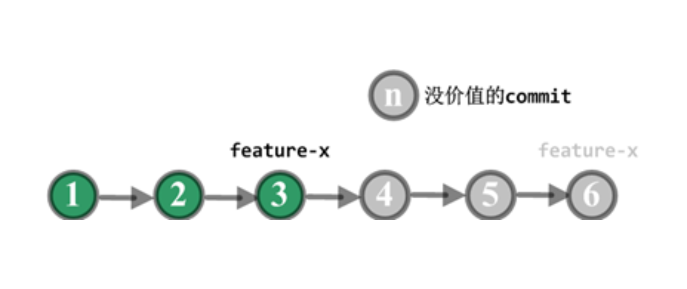
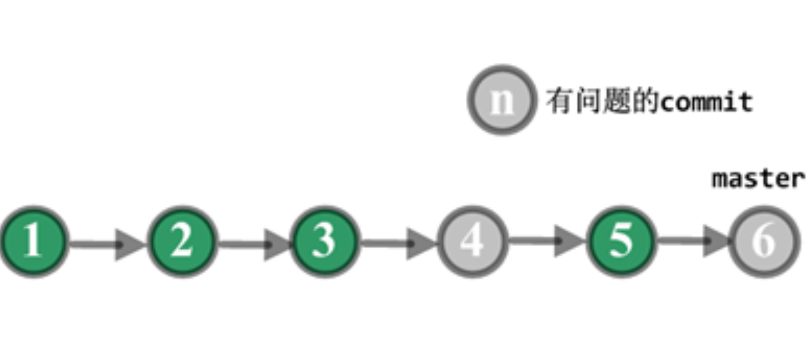
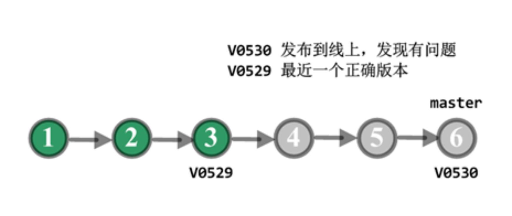
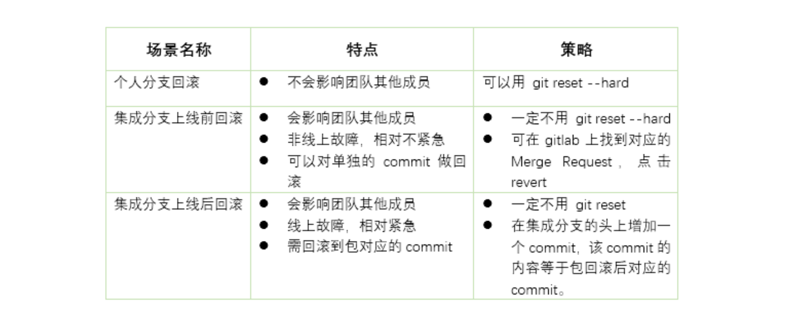
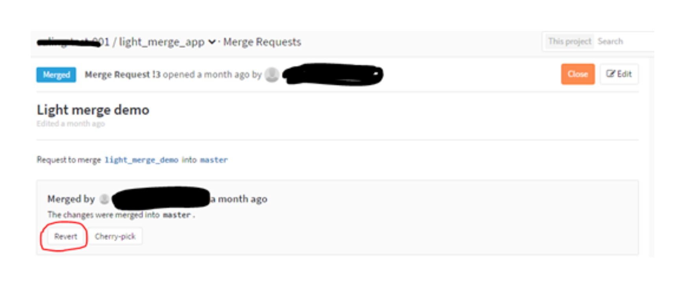
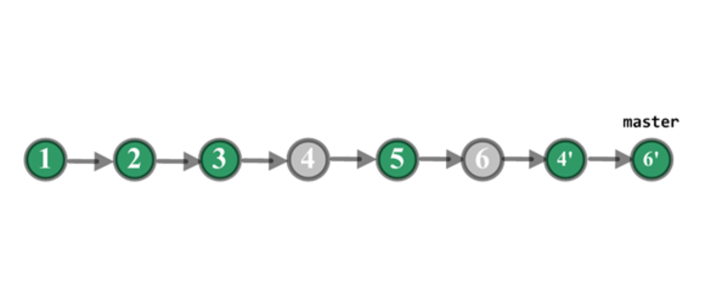
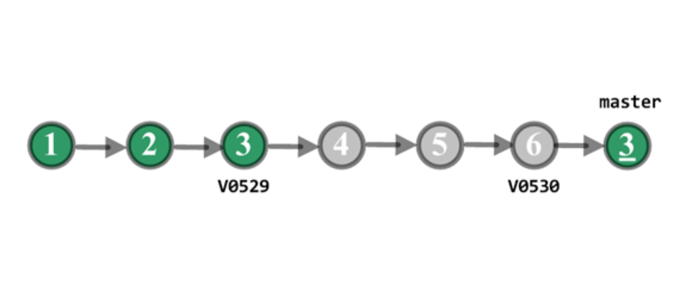

# 06 代码回滚，你真的理解吗？

## 什么是代码回滚？

在我正式开始今天的分享前，先给你讲两个核心概念：

1. 包回滚是指，线上运行的系统，从现在的版本回滚到以前稳定的老版本。
1. 代码回滚是指，Git 分支的指针（游标），从指向当前有问题的版本改为指向一个该分支历史树上没问题的版本，而这个版本可以是曾经的 commit，也可以是新建的 commit。

## 你是不是也遇到了问题？

在日常的代码管理中，困扰开发工程师最多，也是他们向我咨询得最多的问题就是：代码回滚的问题。这些问题，有的只是影响个人开发，而有的涉及了整个团队。我把这些问题进行了整理汇总，你可以看看是否也遇到过类似的问题？

1. 今天上午我在自己的开发环境上拉了一条新分支，提交了 5 个 commit，最新提交的 3 个 commit 我不想要了，那我该怎么退回到这 3 个 commit 之前的那个 commit？ 答：参考我在下面即将分享的“个人分支回滚”的内容。
1. 我本地的分支通过 reset --hard 的方式做了代码回滚，想通过 push 的方式让远端的分支也一起回滚，执行 push 命令时却报错，该怎么办？ 答：如果不加 -f 参数，执行 reset --hard 后，push 会被拒绝，因为你当前分支的最新提交落后于其对应的远程分支。push 时加上 -f 参数代表强制覆盖。
1. 线上产品包已经回滚到昨天的版本了，我清清楚楚地记得昨天我把发布分支上的代码也 reset --hard 到对应的 commit 了，怎么那几个有问题的 commit 今天又带到发布分支上了？真是要命！ 答：集成分支不能用 reset --hard 做回滚，应该采用集成分支上新增 commit 的方式达到回滚的目的。
1. 我刚刚在 GitLab 上接纳了一个合并请求（Merge Request），变更已经合入到 master 上了，但现在我发现这个合并出来的 commit 有较大的质量问题，我必须把 master 回滚到合并之前，我该怎么办？ 答：可以在 GitLab 上找到那个合并请求，点击 revert 按钮。
1. 刚刚线上 A 产品 V6.2 的包有问题，我已经把 A 的产品包回退到 V6.1 版本了，请问发布分支上的代码也要回滚到 V6.1 对应的 commit 吗？ 答：你可以在下文“哪些情况下需要回滚代码？”和“哪些情况下包的回滚无需回滚代码？”中找到答案。
1. 产品包的回滚可以在我们公司持续交付云平台上执行，平台能不能也提供代码一键回滚的功能？这样我们回滚代码能相对轻松一些。 答：针对已上线发布的版本，我认为持续交付平台提供一键回滚的方式还是有必要的。这么做可以规范集成分支上线后代码回滚的行为，也能减少人为失误。具体做法可以参考我在下面给你分享的“集成分支上线后回滚”的内容。

上面这六个问题，除了前两个问题外，剩下的四个问题都可能影响到整个团队，因此回滚代码时须站在团队的立场，采用合适的方式进行回滚。

接下来，我就一一为你解答这些问题。

## 哪些情况下需要回滚代码？

在代码集成前和集成后，都有可能需要回滚代码。

\*\*第一种情况：开发人员独立使用的分支上，如果最近产生的 commit 都没有价值，应该废弃掉，此时就需要把代码回滚到以前的版本。\*\*如图 1 所示。



图 1 个人分支回滚\*\*第二种情况：代码集成到团队的集成分支且尚未发布，但在后续测试中发现这部分代码有问题，且一时半会儿解决不掉，为了不把问题传递给下次的集成，此时就需要把有问题的代码从集成分支中回滚掉。\*\*如图 2 所示。



图 2 集成分支上线前回滚**第三种情况：代码已经发布到线上，线上包回滚后发现是新上线的代码引起的问题，且需要一段时间修复，此时又有其他功能需要上线，那么主干分支必须把代码回滚到产品包 V0529 对应的 commit。**    如图 3 所示。



图 3 集成分支上线后回滚

## 哪些情况下包的回滚无需回滚代码？

1. 线上回滚后，查出并不是因为源代码有问题。
1. 下次线上发布，就是用来修复刚才线上运行的问题。

## 代码回滚必须遵循的原则

集成分支上的代码回滚坚决不用 reset --hard 的方式，原因如下：

1. 集成分支上的 commit 都是项目阶段性的成果，即使最近的发布不需要某些 commit 的功能，但仍然需要保留这些 commit ，以备后续之需。
1. 开发人员会基于集成分支上的 commit 拉取新分支，如果集成分支采用 reset 的方式清除了该 commit ，下次开发人员把新分支合并回集成分支时，又会把被清除的 commit 申请合入，很可能导致不需要的功能再次被引入到集成分支。

## 三种典型回滚场景及回滚策略

在上面的内容中，我给你提到了个人分支回滚、集成分支上线前的回滚，以及集成分支上线后的回滚，这三种需要代码回滚的场景，它们具有一定的代表性。

现在，我就先以表 1 的形式，针对不同场景为你归纳不同的处理策略。后面的章节中，我再为你具体介绍每种场景的处理步骤。



表 1 需要代码回滚的三种场景对应的处理策略

### 第一，个人分支回滚


同图 1 个人分支回滚

针对图 1 的情况：

1. feature-x 分支回滚前 HEAD 指针指向 C6 。
1. 在个人工作机上，执行下面的命令：

```BASH
git checkout feature-x   
git reset --hard  C3 的 HASH 值
```

如果 feature-x 已经 push 到远端代码平台了，则远端分支也需要回滚：

```BASH
git push -f origin  feature-x
```

### 第二，集成分支上线前回滚


同图 2 集成分支上线前回滚

针对图 2 中集成分支上线前的情况说明：

1. 假定走特性分支开发模式，上面的 commit 都是特性分支通过 merge request 合入 master 产生的 commit。
1. 集成后，测试环境中发现 C4 和 C6 的功能有问题，不能上线，需马上回滚代码，以便 C5 的功能上线。
1. 团队成员可以在 GitLab 上找到 C4 和 C6 合入 master 的合并请求，然后点击 revert 。如图 4 所示。



图 4 用 revert 方式实现回滚

回滚后 master 分支变成如图 5 所示，C4’是 revert C4 产生的 commit，C6’是 revert C6 产生的 commit。通过 revert 操作，C4 和 C6 变更的内容在 master 分支上就被清除掉了，而 C5 变更的内容还保留在 master 分支上。



图 5 回滚后的示意图

### 第三，集成分支上线后回滚


同图 3 集成分支上线后回滚

我先跟你说明一下图 3 中的具体情况：

1. C3 打包并上线，生成线上的版本 V0529，运行正确。之后 C6 也打包并上线，生成线上版本 V0530，运行一段时间后发现有问题。C4 和 C5 并没有单独打包上线，所以没有对应的线上版本。
1. 项目组把产品包从 V0530 回滚到 V0529，经过定位，V0530 的代码有问题，但短时间不能修复，于是，项目组决定回滚代码。
1. C4 和 C5 没有单独上过线，因此从线上包的角度看，不能回滚到 C4 或 C5，应该回滚到 C3。
1. 考虑到线上包可以回滚到曾发布过的任意一个正确的版本。为了适应线上包的这个特点，线上包回滚触发的代码回滚我们决定不用 一个个 revert C4、C5 和 C6 的方式，而是直接创建一个新的 commit，它的内容等于 C3 的内容。
1. 具体回滚步骤：

```BASH
git fetch origin  
git checkout master
git reset --hard  V0529         # 把本地的 master 分支的指针回退到 V0529，此时暂存区 (index) 里就指向 V0529 里的内容了。
git reset --soft  origin/master  # --soft 使得本地的 master 分支的指针重新回到 V05javascript:;30，而暂存区 (index) 变成 V0529 的内容。
git commit -m "rollback to V0529"  # 把暂存区里的内容提交，这样一来新生成的 commit 的内容和 V0529 相同。 
git push origin  master        # 远端的 master 也被回滚。
```

回滚后如图 6 所示。



图 6 回滚后的示意图

C3’的内容等于 C3，master 分支已清除 C4、C5 和 C6 的变更。

现在 master 又回到了正确的状态，其他功能可以继续上线。

如果要修复 C4、C5 和 C6 的问题，可以在开发分支上先 revert 掉 C3’ ，这样被清除的几个 commit 的内容又恢复了。

## 总结

代码回滚在持续交付中与包回滚一样，也是不可缺少的一项活动。但它并不是简单地去执行 Git 的 reset 或 revert 命令就可以搞定的事情。

除了开发的个人分支上存在回滚的情况外，我们还会遇到集成分支上需要回滚的情况；对于集成分支的回滚，又可以分为上线前和上线后两种情况；因为紧急程度和上线情况的不同，我们必须采用不同的回滚策略。

我围绕着开发工程师在代码管理中，最常遇到的 6 个问题，分别为你介绍了代码回滚的概念，梳理了需要回滚及不需要回滚的情况，分析了回滚的类别及其不同的回滚策略，提炼了回滚原则，希望能对你的实际工作有所帮助，保持正确的回滚姿势。

## 思考题

那么，接下来就是留给你的思考题了。

1. 集成分支上线前，如果发现新提交的 5 个 commit 有 3 个需要回滚，请问，除了点击合并请求中的 revert 按钮这种方法外，还可以怎么做？
1. 采用特性分支开发的一个项目，每个特性分支合入到 master 时都会产生一个合并的 commit，而且该项目是禁止直接向 master 做 push 操作的。可是该项目的 master 分支却存在多个非合并产生的 commit，请问这些 commit 很可能是怎么产生的？
1. 持续交付平台如果要提供一键代码回滚的功能，每次回滚都要生成一个新的 commit 吗？即使以前已经产生过同内容的 commit 了，也要重建新的 commit 么？
