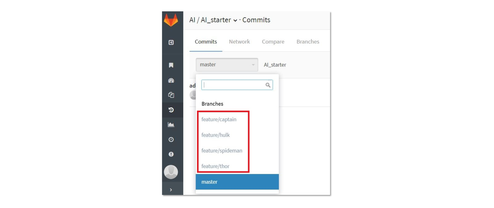
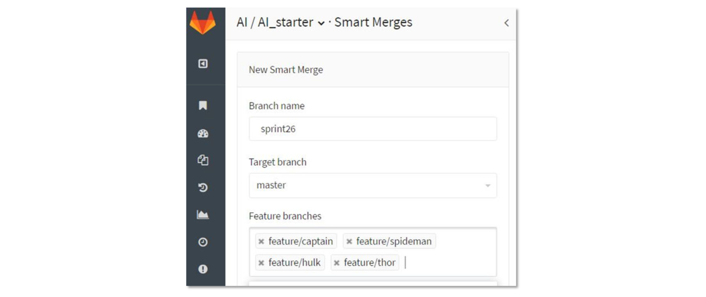

# 07 “两个披萨”团队的代码管理实际案例

在亚马逊内部有所谓的“两个披萨”团队，指的是团队的人数不能多到两个披萨饼还不够吃的地步。也就是说，  **团队要小到让每个成员都能做出显著贡献，并且相互依赖，有共同目标，以及统一的成功标准，这样团队的工作效率才会高。**

现在有很多互联网公司喜欢采用“两个匹萨”团队的模式，你可能很好奇，这些团队通常是如何实施代码管理的？

当前国内互联网公司通常采用特性分支开发的模式，我在第四篇文章《一切的源头，代码分支策略的选择》中，为你详细介绍了这种模式，下面我就以这种模式为例，为你解开困惑。

以迭代周期为一周的项目为例，我将按照从周一到周五的时间顺序，通过整个团队在每天的工作内容，跟你分享项目任务分配，分支创建、集成与分支合并、上线，包括分支删除的关系。你可以从中了解互联网公司研发团队日常代码管理的真实情况，体会团队为了提高研发效率，在代码管理上做出的创新与改进。

## 背景

周一上午 11：30，“复仇者” 团队的周会结束，会议室里陆续走出了 6 名工程师：

- “钢铁侠”：5 年一线开发经验，现任“复仇者”项目经理及产品负责人；
- “美国队长”：6 年开发经验，负责“复仇者”项目的技术架构，兼开发工作；
- “绿巨人”：3 年开发经验，全栈开发；
- “雷神”：3 年开发经验，全栈开发；
- “蜘蛛侠”：1 年开发经验，负责几个成熟模块的维护；
- “黑寡妇”：资深测试工程师，负责系统集成与测试。

其他同事泡咖啡喝茶的时候，“钢铁侠”在公司的 GitLab 上已经把 issue 分配给了团队成员，预示着忙碌又充实的一周要开始了。

## 周一下午

“美国队长”“绿巨人”“雷神”“蜘蛛侠”这 4 名开发人员早已熟悉团队的工作流程，午休之后，他们纷纷打开 GitLab 界面，在待办事项上找到自己的 issue，查看无误后，直接根据 issue 建好了新的特性分支。

每个新分支代表了一个具体的任务，待四人建好新分支后，“钢铁侠”不由得微微一笑，心想：哈哈，任务都被大伙儿认领了，看样子，他们下午就要开工啦。这 4 名开发人员新建的 4 个分支，如图 1 所示。

图 1 开发人员新建的 4 个分支

这时，资深测试工程师“黑寡妇”也没闲着，开始查看起本周计划完成的 issue，整理出功能点、性能要求和粗粒度的接口列表，基本明确了测试范围。随后，她在公司 GitLab 平台上为本周迭代设置好了“Smart Merge”，如图 2 所示。

图 2 配置 Smart Merge

要是有新人加入团队，“黑寡妇”肯定会向他推荐这个“Smart Merge”（[Smart Merge](https://github.com/gitlab-extra/smart_merge)是我和几个好友一同开发的 GitLab 插件，其作用是高效地解决分支合并的一系列问题）。高效的工作习惯使得“黑寡妇”早已整理好了说明文档，以便随时分享给其他同事。

有了 Smart Merge，任何一个分支的变更会自动触发合并，一旦出现冲突，开发人员就会立刻收到邮件通知。

周一下班前，4 位开发人员分别把各自的本地分支 push 到了 GitLab 平台。集成后没有冲突，大家开开心心回家了。

## 周二

“美国队长”起了个大早，9 点半就到公司了，昨天他已经实现了核心功能，今天要完善这些功能并升级 API。他忙了个把小时，本地开发自测完成，并把本地 feature/captain 分支 push 到了 GitLab 服务器。

一分钟不到，“美国队长”的邮箱收到了 GitLab 发来的通知，告诉他刚提交的某两个文件和 feature/hulk 分支发生了冲突。

“美国队长”知道肯定是黑寡妇创建的 Smart Merge 帮助自己快速发现了冲突，他直接用 GitLab 的 compare 功能对比了 feature/captain 和 feature/hulk 这两个分支，找到了冲突所在的行。

通过分析，“美国队长”判断出 feature/hulk 的变更是合适的，这个冲突应该由他解决掉。

“美国队长”选择在本地对自己的分支执行 git rebase -i ，把引入冲突的 commit 进行了变更，自测通过后，再次把 feature/captain 分支 push 到了 GitLab 。为了确保冲突的问题已经被解决，他打开了 Smart Merge，发现状态是“已合并”（Merged） ，这才端起杯子泡咖啡去了。

上午 10:00 前后，“绿巨人”等人也陆陆续续到公司了。团队已经约好了协作节奏：每周四下班前完成一个迭代的上线。

通常周二下午开发人员要把每个 issue 的基本功能开发好，“黑寡妇”周二下午会给 Smart Merge 配置好持续交付的环境，一旦某个分支 push 后，自动完成分支合并，然后自动编译、打包，并部署到测试环境。

在测试环境上，除了跑自动化测试外，“黑寡妇”也会手工做一些集成测试和性能测试。

周二下午，“美国队长”开始 review 大家的代码，他把本周开发的 4 个分支，在 GitLab 上分别创建了 4 个 merge request，目标分支都是 master 。

“美国队长”觉得 GitLab 的 review 功能很完善，交互也很便捷。这时，其他 3 名开发人员，忙着写代码和自测。“黑寡妇”除了搭建测试环境外，还补充了自动化测试的用例。

## 周三

经过周一和周二的努力，本周的基本功能均已实现，“黑寡妇”开始对系统实施集成测试，并做一些压力测试。

上午测试时，“黑寡妇”发现在某些场景下系统存在较大的延迟，这个问题在上周的版本中并不存在。她判断是本周新引入的功能导致了这个问题，但一下子又很难确定是怎么引起的。

于是，“黑寡妇”决定修改 Smart Merge 的配置，把嫌疑最大的分支剔除掉后再打包测试。通过这样的方式，最后查出是 feature/thor 这个分支引入的问题，她把测试情况详尽地告诉了“雷神”。

大半个下午雷神都在查问题，到下午四点钟时，问题终于被“雷神”修复了，他把 feature/thor 分支做了 push，然后向“黑寡妇”求助，请她合入自己的分支后再帮忙做测试。

“黑寡妇”把“雷神”的分支重新加回到 Smart Merge 中，并把编译包重新部署到了测试环境。经过测试验证：延时大的问题真的不见了。

下班前，“黑寡妇”召集项目组开了个简短的质量会议，大家商量后认为本周计划内的四个开发任务集成后没有大的质量问题，周四可以一起上线。

会后，“黑寡妇”看了看本周的四个合并请求，“美国队长”对四个请求意见都是赞成合入 master，Sonar 检查也都合格，加上自己测下来质量也过关，于是，她果断地接受了四个合并申请。

在回家前，master 对应的最新 commit 已经顺利地编译、打包后被发到用户验收测试环境，“黑寡妇”对这个环境启动了自动化测试服务。

至此，测试加修复 Bug，忙碌了一整天，大家终于可以回家休息了。

## 周四

“黑寡妇”一早上班时，首先查看了自动化测试的结果，显示 master 分支构建出的包符合质量要求。于是，她又对没有设计自动化测试用例的部分，进行了手工测试，发现几个界面上存在文字描述的问题，随后通知开发做修复。

开发在本地分支上修复问题后 push 到 GitLab，再次发起合并请求，“黑寡妇”逐个接受了这几个 Fix 的请求。

到中午时分，用于上线的产品包终于生成了。

等到发布窗口开启时，“黑寡妇”通过公司的发布系统把合格的产品包发布到了线上。观察一段时间，线上运行都正常。

对应本次上线，“黑寡妇”及时给 master 打了 tag，然后把本周成功发布的消息通知到项目组，并向“钢铁侠”做了汇报。

“钢铁侠”看大伙儿忙碌了这么多天，豪爽地请大家喝果汁，并告诉大家他又有几个紧急的用户需求，嘱咐大伙下周继续努力。

## 周五

通常在这一天，项目组会一起清理过期的分支，删除本周已合并到 master 的分支。而对于下周开发的新分支，项目组约定统一从 master 上拉取。另外，利用这一天，项目组也会召开回顾和改进会议，以讨论解决目前的一些已有问题的方案，这些讨论即包含工作流程问题，也包含代码和系统等问题。

## 总结

我介绍了由 6 人组成的“两个披萨”团队代码管理的实践，通过周一到周五的具体活动，你可以看到采用特性分支开发的团队是如何创建分支、集成分支和删除分支的，希望能对你的日常工作也有所帮助。

## 思考题

假设有 A、B、C 三个功能依次被合并到 master 并准备上线，此时发现 A 功能有问题，不能上线，而 B 和 C 则必须上线，此时你会采取什么办法来解决？
