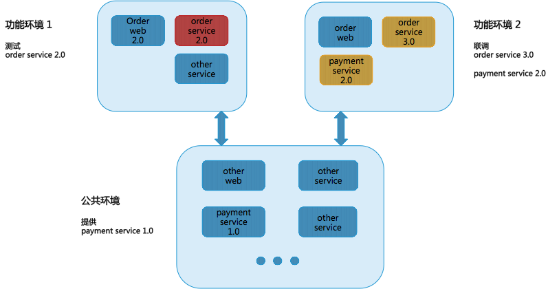

# 09 测试环境要多少？从成本与效率说起

在上一篇文章中，我分享了互联网公司测试环境的常见结构，以及对用户来说什么样的测试环境才是好用的。然而对测试环境来说，只是高效好用还不够，还要考虑到成本问题。

效率和成本永远是一对矛盾体。今天，我就从成本和效率出发，和你聊聊构建测试环境时，还需要考虑的其他维度。

## 测试环境的成本

谈到环境成本，你很自然地就会想到云计算，《持续交付：发布可靠软件的系统方法》一书出版时，云计算还是一个时髦的概念，而 8 年后的今天，云技术已经非常成熟了。

今天，部分传统企业和互联网企业都在选择混合云架构，而创业公司选择公有云已经有了点模式化的意味。公有云非常好地满足了 DevOps 的“基础设施即代码”的理念，哪怕你完全不使用公有云，那在环境中整合开源的私有云技术依然能为你带来不少便利。

然而，云计算并非“银弹”，我们上云后，在成本上，还是有很多值得去思考和做的事情。

尤其是当环境数量增加时，你很容易就可以想到成本会增加，但是你可能并不明白要增加哪些方面的成本，以及会增加多少的问题。那么，接下来，我就跟你聊聊当环境数量增加时，你需要考虑的成本有哪些呢？

### 首先是机器资源成本

保证环境的独立性，是你构建更多套环境的一个主要原因。但是，一套独立的、拥有完整链路的环境成本是非常高的。

那么，以阿里云的价格为例，我来跟你一起算算这笔账。假设一个只有 100 个应用的微服务架构环境，选取单应用单机 2 核 4G 内存的低配置实例方式进行部署，单实例的年价格在 2000 元左右，100 个实例的话，一年的花费就是 20 万元左右。

而这只是最保守的计算，随着服务规模的增加，以及更多环境的需要，整体花费上涨两个数量级也是很正常的。

这样的问题在开发环境和集成环境的表现是最明显的。为了保证这两套环境的独立性，你必然需要有很高的环境副本数。但无论如何，你都不可能让每一个开发和测试人员都拥有一套完整环境的硬件资源。

可见，每一套环境的机器资源成本都很大，而且随着需求的增加成比例增长。

### 其次是管理成本

管理成本，包括维护环境的可用性，配置的管理成本，和测试数据的维护成本三个维度。

1. \*\*维护多套环境的第一要点是，维护环境的可用性。 **与云时代之前相比，容器技术已经解决了很多问题。比如，服务器操作系统级别的依赖的标准化更容易了；当出现硬件故障时，迁移和恢复服务也更加方便了。 但是，容器技术并没有解决故障定位的问题。微服务架构下集群的节点数量多, 调用链复杂，你不再能确定到底是环境问题，还是程序本身的 Bug，也就导致定位故障更加困难了。 所以，更多套环境就意味着更大的集群规模，出现故障的几率会随之增加，而解决故障也会占用你更长的工作时间。
   2.** 维护多套环境的另一大成本是，配置的管理成本。 **配置是环境管理中最核心的内容，创建一套环境时，为了保证它真正的独立可用，不仅要保证应用可以成功运行，还要保证应用在基础设施的配置是正确的。比如集成测试环境下部署了一个应用的多个平行项目，就需要有办法保证测试人员能访问到正确的应用。 如果是 Web 应用，你就要考虑把应用绑定到不同的域名，这样就会增加域名管理的成本；如果是一个 service 应用，你就要考虑到这些 service 不会被其他项目的、无关环境中的应用调用到，同时也不会调用到其他错误的服务。 每多一套环境，就会多一套这样的配置，而且这些配置都需要在各类基础设施中生效。
   3.** 维护多套环境的第三大成本是，测试数据的维护成本。\*\*测试数据也是环境中极为重要的一个组成部分。当并行环境的数量变多后，数据的维护同样是让人头疼的问题。 为了保证环境的高仿真，哪些环境共用一套数据库，以及测试数据的更新在多套环境中怎么执行等等，都需要非常高的管理成本。

### 最后是流程成本

流程成本主要包括沟通成本和测试成本两个方面。

1. 沟通成本 每增加一套环境，你都需要考虑团队成员如何在新环境上沟通协作。谁在占用，何时退出这些信息，你都需要第一时间告知团队。当环境的数量变得非常多以后，做好这些事的难度就很大了。
1. 测试成本 在开发环境，集成测试环境，验收测试环境，预发布环境，生产环境这样的结构下，核心功能的测试流程就至少会执行五次。每引入一套新的环境，测试流程都会变得更加复杂。

## 如何调解效率和成本的矛盾？

现在你应该已经意识到，因为增加一套环境带来的成本竟然有那么多。但是为了提高持续交付的效率，隔离的多套环境又是必不可少的。

那么，你究竟应该怎样去规划和设计环境呢？

### 第一，公共与泳道的**第一个关键点是抽象公共环境，而其中的公共服务基本都属于底层服务，相对比较稳定，这是解耦环境的重中之重。 **比如我们经常会将中间件，框架类服务，底层业务公共（账户，登陆，基本信息）服务部署在这套公共环境下。** 在公共环境的基础上，可以通过泳道的方式隔离相关测试应用** ，利用 LB 和 SOA 中间件对路由功能的支持，在一个大的公共集成测试环境中隔离出一个个独立的功能测试环境，那么增加的机器成本就仅与被并行的项目多少有关系了

为了帮助你理解，我跟你分享一个具体的案例。

比如，你有一个新的下单流程需要测试。你可以将“下单 web 2.0”和“下单 service 2.0”抽离出来，如图中的“功能环境 1”所示。并保证被剥离出的“下单 service 2.0”只能被当前环境内的 web 服务器调用。而“下单 service 2.0”所依赖调用的“支付 service 1.0”则放在公共环境中。

于此同时，如图中所示的“功能环境 2”，可以同时支持“下单 service 3.0”这个并行版本与一个新版本的“支付 service 2.0”进行联调，此环境是不会调用公共环境中的“支付 service 1.0”的。

通过这种方式，你就可以解决并行开发和并行测试的问题了。

### 第二，避免产生多套公共环境

从原则上讲，集成环境中只要有一套公共环境就足够了。但有时候，你会发现项目的范围特别广，依赖应用或者影响应用特别多，特别是一些底层服务的改动或者重构等。在这种情况下，如果把依赖它的所有服务都部署起来，就很有可能变成第二、第三套公共环境了。

这种情况下，你可以通过 mock service 来模拟大多数服务，这样就可以达到测试环境的最小集合了。关于 mock service 如何做，我会在后续的讲解中，为你详细解释。

### 第三，减轻配置的复杂度

而对于减轻环境配置的复杂度来说，你可以从以下两个方面着手：

1. 制定一套统一配置的解决方案；
1. 要让环境自己说话，有效减少配置项。

比如，对于数据库，对于不同的测试需求，我们可能会在公共的数据库和独立的数据库之间进行频繁切换；又比如，我们可以在启动应用时自动配置正确的数据库。那么无论有多少套环境，配置也不是一件难事。

关于减轻配置的复杂度，我也会在专栏后续的讲解中，给你详细分析如何实现。

## 总结

我们究竟需要多少套环境，这个问题的答案应该是这样的：在大环境（开发、集成、验收）的数量上，你要考虑环境的核心用户是谁，环境的核心价值是什么。在环境的核心价值没有冲突时，尽量减少大环境的数量。

有些公司就通过功能分支直接上线的分支策略，对每个分支， 都创建一整套的功能测试环境，并在分支上线后快速释放。以这样的方式，精简了验收测试环境，即大环境的产生。但其代价是发布过程分支之间必须是串行的，即一个分支的上线会阻塞其他分支的上线。

而在每个大环境的子环境上（也就是按照测试需求被剥离出来的功能环境），你必须保证它的副本数可以满足用户测试的隔离需求。比如，在集成测试环境，只产生一套公共环境，并通过工具，支持隔离的功能测试环境的快速建立和销毁，让环境可以按需分配。

## 思考题

当你需要一套性能测试环境时，是独立出一套大环境还是作为一个子环境依附于某个大环境比较好？
