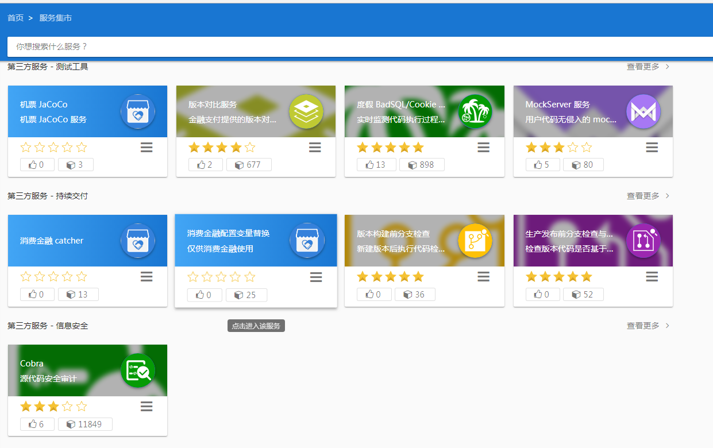

# 18 如何做好容器镜像的个性化及合规检查？

你好，我是王潇俊。我今天分享的主题是：如何做好容器镜像的个性化及合规检查。

你是否还记得我在第 13 讲篇文章《容器技术真的是环境管理的救星吗？》中说到：容器不是银弹，镜像发布无法很好地满足用户的个性化需求？

在携程的发布标准化中，容器内的环境也是由发布系统定义的，用户即使登录到容器上去做变更，下一次发布之后还是会被回滚回来。但是，对 Dockerfile 的编写和控制需要一定的学习成本，因此我们又不可能将镜像的内容与构建流程完全交给用户来自定义。

于是，就有了我今天的分享，即如何做好容器镜像的个性化及合规检查？根据我在持续交付道路上摸爬滚打的实践经验，总结了以下三种方法来满足用户对容器镜像个性化需求：

1. 自定义环境脚本；
1. 平台化环境选项与服务集市；
1. 自定义镜像发布。

接下来的内容，我将根据这三种方法展开，并将介绍如何通过合规检查来规避个性化带来的风险。

## 用户自定义环境脚本

我们允许用户在编译后的代码包内放入包含自定义环境脚本的 .paas 目录（这是一个自定义的隐藏目录），来满足用户对环境的个性化需求。

这个.paas 目录中，可能会存在 build-env.sh 和 image-env.sh 两个文件，分别运行于构建代码和构建镜像的过程中。

其中，build-env.sh 是在构建代码之前运行，image-env.sh 是在构建镜像的时候插入到我们规范的 Dockerfile 中，从而被打到容器内部。

这样就不仅可以满足用户对发布的镜像的个性化需求，同时还能满足对构建代码镜像的个性化需求。

比如，某个 Python 应用依赖一些动态链接库，那么这个依赖在构建代码和构建镜像环节都是必须的。这时，用户就需要在 build-env.sh 和 image-env.sh 这两个文件中都写入安装依赖的步骤，构建系统会在不同阶段判断是否有这两个文件，如果有就运行。

通常情况下，自定义环境脚本的方式，可以满足大部分用户的普通需求。但是，这个方式有两个缺点：

1. 构建镜像需要用完就删，因为我们无法感知用户在构建中修改了什么内容，是否会对下一次构建产生影响。这就要求每次构建都要生成新的容器，会在一定程度上降低构建性能。
1. 如果多个项目有同样的需求，那么这些项目就都要引用这个脚本文件，不但啰嗦，而且后面也不好维护，如果脚本内容变化，还需要通知所有引用的项目都改一遍。

好的工具就是要解决用户的一切痛点，因此针对第二个问题，我们在系统上通过平台化环境选项和服务集市的方式做了统一处理。

## 平台化环境选项与服务集市

\*\*环境选项，\*\*是携程在持续交付平台为用户提供的一些环境变更的常用功能，表现为构建镜像时的一些附加选项。

在上一篇文章《容器镜像构建的那些事儿》中，我介绍了构建镜像一个很重要的原则是：镜像要尽可能得小巧精简，因此我们没有在镜像中为用户安装太多的软件。但是，很多时候用户可能需要这些软件，于是我们就在平台上提供了环境选项的功能。

比如，很多用户需要用到 Wget 软件，于是我们就在交付平台上提供了一个 “安装 Wget ” 的环境选项。其实，这个环境选项对应的就是一条 shell 命令：

```bash
yum install wget -y
```

如果某次发布时，用户需要这个工具，可以勾选这个选项，那么就可以在构建镜像时作为参数传给构建系统。如果搭建系统判断出有这个参数，就将会其插入到规范的 Dockerfile 中，从而这个参数就可以被打到容器内部。

环境选项虽然好用，但是只适合一些简单的需求，比如安装一些软件、更改一些配置等。而对一些复杂的需求，则需要创建一个叫作**服务集市**的功能。举个例子：

携程的服务集市中有一个 JaCoCo 服务，它的作用就是在 Tomcat 启动时更改 JVM 参数，收集应用的覆盖率并发送给外部系统。同时，外部系统可以控制这个 JaCoCo 服务的启停，并将收集结果处理成可视化的页面。

服务集市功能的使用，会涉及到以下两个关键步骤：

1. 勾选 JaCoCO 服务之后，会在容器中注入 jacocoagent.jar 和启停脚本；
1. 通过对外暴露的 API，控制在容器中运行启停脚本。

像 JaCoCo 这样的复杂功能，我们会抽象成服务，供用户使用。他们只要在构建镜像时选择对应的服务，和该服务起效的环境就可以了。

而实际系统要完成的任务则复杂得多，首先要通过改写 Dockerfile 完成以上所说的“勾选 JaCoCo 服务”，同时还要改写镜像中 JVM 的启动参数等，并完成对 JaCoCo 服务中心的注册。具体的操作各个服务有所不同，根据实际需求而定，原则就是把这些服务内容增加到对应的环境镜像中去。

通过这种方式构建的镜像，不同环境就拥有了不同的服务。比如，用户在构建镜像时，选择了 JaCoCo 服务起效的环境是测试环境，那么 JaCoCo 就只在测试环境的镜像中起效，而不会在生产环境中起效。

除了 JaCoCo 以外，携程还提供了许多其他与环境有关的服务，组成了一个服务集市，用户可以按照具体需求组合使用。



携程的服务集市

自定义镜像发布
-------\*\*用户自定义环境脚本、平台化环境选项与服务集市，这两种方式有一个共同的缺点：自定义的部分都需要插到 Dockerfile 中，因此每次打镜像时都需要运行一次。\*\*这对一些比较快的操作，没有问题，但如果需要安装很多软件，甚至需要编译一些软件时，每次发布都重复运行一次的效率就会非常低下。

为此，我们提供了用户自定义镜像的功能，该功能分为自定义 Base 镜像和完全自定义镜像发布两种。

1.**自定义 Base 镜像**自定义 Base 镜像，就是如果基础镜像无法满足用户需求，并且自定义的部分非常重，运行比较久，我们就会建议用户使用自定义的 Base 镜像。但是，这个自定义的 Base 镜像，必须基于官方提供的 Base 镜像，因为很多工具和功能都是基于官方 Base 镜像的。

虽然 Base 镜像是自定义的，但是应用还是标准的应用，因此发布方式和普通的发布方式没有区别。只是解决了自定义环境脚本与平台化环境选项的运行速度问题，反映到实际的 Dockerfile 上，就只是 FROM 指令的指向改变了，变成了用户自定义的 Base 镜像地址。

1.**完全自定义镜像发布**但是，用户的需求是永无止境的。比如，特殊启动方式的应用，自定义 Base 镜像就无法解决。

原则上来说，我不建议使用一些非标准的应用，因为这是不可控的，对生产环境非常危险。但是 Docker 的镜像是如此方便，用户如果只是想在测试环境中使用一些测试工具，虽然这个工具来自于社区，也不是标准的应用，但我们也没有理由全部拒绝。否则，用户很可能会以虚拟机上可以安装任何工具为由，要求退回到虚拟机时代。

但是，这样的退化怎么能被允许呢！

因此，一定要支持完全自定义镜像发布，也就是说用户可以发布任何镜像，只要这个镜像能够跑起来。对私有云来说，这应该是能接受的最大化的自由了。

对于完全自定义发布我们使用 Docker 多阶段构建（multi-stage build），也就是说用户可以将构建代码和构建镜像合并成一个步骤，在同一个 Dockerfile 中完成。

## 镜像安全合规检查

满足了用户对镜像的个性化需求，也就意味着会引入不可控因素，因此对镜像的安全合规检查也就变得尤为重要了。我们必须通过合规检查，来确认用户是否在容器里做了危险的事情。

只有这样，用户个性化的自由，才不会损害整个环境。毕竟，有克制的自由才是真正的自由。**对自定义镜像，首先必须保证它是基于公司官方 Base 镜像的，这是携程最不可动摇的底线。 **在其他情况下，就算真的不继承公司官方 Base 镜像，建议也必须要满足 Base 镜像的一些强制性规定，比如应用进程不能是 root 等类似的安全规范。** 关于自定义镜像是否继承了公司官方镜像，我们采取的方法是对比镜像 Layer，即自定义镜像的 Layer 中必须包含官方 Base 镜像的 Layer。**

但是，对比 Layer 也不是最靠谱的方式，因为用户虽然继承了 Base 镜像，但还是有可能在用户创建的上层 Layer 中破坏镜像结构。目前，Docker 的部署流程中，还有许多潜在漏洞，有可能让一些有企图的人有机可乘，发起攻击。

因此，我们需要一些强制手段来确保镜像的安全，好的安全实践意味着要对可能出现的事故未雨绸缪 。

目前，市面上有很多工具可以为 Docker 提供安全合规检查，如 CoreOS Clair，Docker Security Scanning，Drydock 等等。

在安全合规检查方面，携程的方案是 Harbor 与 CoreOS Clair 结合使用：当构建系统 Push 一个新的镜像或者用户 Push 一个自定义镜像之后，Harbor 会自动触发 CoreOS Clair 进行镜像安全扫描。Clair 会对每个容器 Layer 进行扫描，并且对那些可能成为威胁的漏洞发出预警。

漏洞分严重级别，对于一些非破坏性的漏洞，我们是允许发布的。检查的依据是 Common Vulnerabilities and Exposures 数据库 (常见的漏洞和风险数据库，简称 CVE)，以及 Red Hat、Ubuntu 、Debian 类似的数据库。

这些数据库中，包含了一些常见的软件漏洞检查。比如， libcurl 7.29.0-25.el7.centos 存在如下漏洞：

> The curl packages provide the libcurl library and the curl utility for downloading files from servers using various protocols, including HTTP, FTP, and LDAP. Security Fix(es): * Multiple integer overflow flaws leading to heap-based buffer overflows were found in the way curl handled escaping and unescaping of data. An attacker could potentially use these flaws to crash an application using libcurl by sending a specially crafted input to the affected libcurl functions. (CVE-2016-7167) Additional Changes: For detailed information on changes in this release, see the Red Hat Enterprise Linux 7.4 Release Notes linked from the References section.

注：攻击者可以利用 libcurl 缓冲区溢出的漏洞，在应用的上下文中执行任意代码。

Clair 是一种静态检查，但对于动态的情况就显得无能为力了。所以，对于镜像的安全规则我还总结了如下的一些基本建议：

1. 基础镜像来自于 Docker 官方认证的，并做好签名检查；
1. 不使用 root 启动应用进程；
1. 不在镜像保存密码，Token 之类的敏感信息；
1. 不使用 --privileged 参数标记使用特权容器；
1. 安全的 Linux 内核、内核补丁。如 SELinux，AppArmor，GRSEC 等。

这样能使你的镜像更加安全。

## 总结与实践

在这篇文章中，我分享了携程满足用户对镜像个性化需求的三种方式：

1. 用户自定义环境脚本，通过 build-env.sh 和 image-env.sh 两个文件可以在构建的两个阶段改变镜像的内容；
1. 平台环境选项与服务集市，利用这两个自建系统，可以将个性化的内容进行抽象，以达到快速复用，和高度封装的作用；
1. 自定义镜像，是彻底解决镜像个性化的方法，但也要注意符合安全和合规的基本原则。

关于对镜像的安全合规检查，携程采用的方案是 Harbor 与 CoreOS Clair 结合使用。除此之外，我还给出了在实践过程中总结的 5 条合规检查的基本建议，希望这些实践可以帮到你。

除了 Clair 进行 CVE 扫描之外，还有其他一些关于镜像安全的工具也可以从其他方面进行检查，你也可以去尝试一下。
