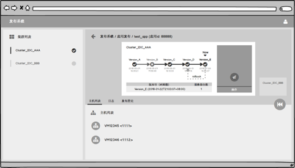
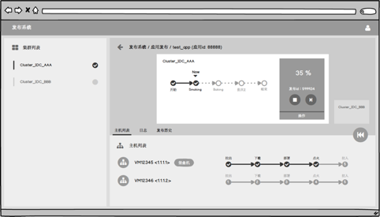

21 发布系统一定要注意用户体验
================

你好，我是王潇俊。我今天分享的主题是：发布系统一定要注意用户体验。

我在第 19 篇文章《发布是持续交付的最后一公里》中，介绍了蓝绿发布、滚动发布和金丝雀发布这三种灰度发布方式，也分享了携程根据自身情况综合使用滚动发布和金丝雀发布的方式，构建了自己的灰度发布系统 Tars。

但是，了解了灰度发布的知识，甚至是看过了别家的灰度发布系统，但并不一定能解决如何将这些灰度发布的理念贯彻到你自己的持续交付体系的问题。

其实，解决这个问题最好的方式，就是构建一套发布系统来落地灰度发布。这也是我今天这篇文章，以及后续两篇文章（《发布系统的核心架构和功能设计》《业务系统架构对发布的影响》）要重点解决的问题。

如果有一款发布系统，既能完成持续交付的目标，又能提升研发同学的工作效率，岂不美哉。那么，为了我们美好的目标开始努力吧。今天我就先从用户体验的角度，以携程发布系统为例，来和你聊聊如何落地发布系统。

1 张页面展示发布信息
-----------

如果要说什么样的设计才能让用户体验达到完美，那肯定是众说纷纭。从不同的视角去看，都会得到不同的答案。那么，对发布系统来说，我们应该怎么看待这个问题呢？

我们不妨做个类比，应用的发布和火箭发射其实有点相像。

平时我们看火箭发射时，往往会看到一个巨大的屏幕，这个巨大的屏幕汇集了火箭发射当时的各种信息，比如实时视频、各种数据图表、周围的情况，等等。

所有相关人员的注意力都会优先集中在这个大屏幕上，只有发生异常时，才会由具体的负责人在自己的岗位上进行处理。

这也就说明一个很重要的问题，对于发布这件事儿来说，  **首先应该有 1 张页面，且仅有 1 张页面，能够展示发布当时的绝大多数信息、数据和内容，这个页面既要全面，又要精准。**     全面指的是内容清晰完整，精准指的是数据要实时、可靠。

除了以上的要求外，对于实际的需求，还要考虑 2 个时态，即发布中和未发布时，展示的内容应该有所区别。

* 发布中：自然应该展示发布中的内容，包括处理的过程、结果、耗时、当前情况等等。
* 未发布时：应该显示这个应用历史发布的一个过程，也就是整个版本演进的路线图，以及当前各集群、各服务器上具体版本的情况。

所以基于以上考虑，携程的发布系统整体设计就只有一张核心页面，如图 1 所示。因为涉及到安全问题，所以图片处理的有些模糊。

图 1 携程发布系统 - 未发布时

2 个操作按钮简化使用
-----------

发布系统是一个逻辑比较复杂的系统。而且用户在使用时，往往会伴随一定的心理压力，毕竟每次发布都有造成故障的可能。所以，我见过有些公司，要求发布系统的使用者要经过严格的培训：他们需要熟练地掌握整个系统的使用，知晓每个按钮按下去的后果。

但，这显然不是持续交付想要达到的目标。

与 DevOps 的理念一样，我们更希望看到的场景是：谁开发，谁运行。也就是说，我们的目标是，每个开发者都能通过这套系统去发布和运行自己的代码。

这也就决定了，如果发布系统的用户体验做得很复杂、功能按钮非常多的话，就会增加系统的使用难度，背离我们实施持续交付的初衷。

所以，携程在思考发布系统的用户体验设计时，就提出了这样一个目标：页面上除了“回滚”按钮常在外，最多同时展示 2 个操作按钮。这样，用户的选择就会变得非常容易，要么左，要么右，总能找到适合自己的。

最终，用户在页面上可能会看到的同时出现的按钮组合有以下四种情况：

1. 开始发布，1 个按钮；
2. 中断发布，1 个按钮；
3. 中断或重试发布，2 个按钮，发生在有局部错误的情况下；
4. 中断或继续发布，2 个按钮，发生在发布被刹车时。

关于如何实现这样的需求，我会在下一次分享《发布系统的核心架构和功能设计》时，着重介绍。

3 种发布结果
-------

对发布系统的用户来说，他们最关心的无疑是发布结果。所以，发布结果的显示，也要力求简单，降低使用难度。

因为，结果的数量将直接决定用户操作和状态流转的复杂度。结果越多，程序要处理的逻辑也就越多，操作人员需要处理的状况自然也就越多。所以，如果能够对发布状态做足够的抽象和简化，那么整个系统的复杂度就将会得到指数级的简化。

 **系统不复杂了，用户体验自然也就简单了。这是一个相辅相成的过程。**

从最抽象的角度来说，发布系统只需要 3 种结果，即：成功、失败和中断。

* **成功状态** ：很好理解，即整个发布过程，所有的实例发布都成功；
* **失败状态** ：只要发布过程中有一个步骤、一个实例失败，则认为整个发布事务失败；
* **中断状态** ：发布过程中任何时间点都可以允许中断此次发布，中断后事务结束。

特别需要说明的是，部分失败和全部失败在发布系统的设计上没有分别，这也是出于事务完整性的考虑，即优先完成整个事务的发布。

4 类操作选择
-------

将发布结果高度概括为成功、失败和中断后，配合这三种状态，我们可以进一步地定义出最精简的 4 种用户操作行为，即开始发布、停止发布、发布回退和发布重试。

* **开始发布** ，指的是用户操作开始发布时，需要选择版本、发布集群、发布参数，配置提交后，即可立即开始发布。
* **停止发布** ，指的是发布过程中如果遇到了异常情况，用户可以随时停止发布，发布状态也将停留在操作“停止发布”的那一刻。
* **发布回退** ，指的是如果需要回退版本，用户可以在任意时刻操作“发布回退”，回退到历史上最近一次发布成功的版本。
* **发布重试** ，指的是在发布的过程中，因为种种原因导致一些机器发布失败后，用户可以在整个事务发布结束后，尝试重新发布失败的机器，直到发布完成。

5 个发布步骤
-------

在讲解了一个发布事务相关的操作和步骤，包括开始发布，停止发布，发布回退和发布重试之后，接下来我和你聊聊单个实例具体的发布过程。

就像我在第 19 讲\[《发布是持续交付的最后一公里》\]中总结的“靠谱的单机部署”流程一样，单个实例的发布过程，也可以分为 5 个步骤：

1. **markdown** ：为了减少应用发布时对用户的影响，所以在一个实例发布前，都会做拉出集群的操作，这样新的流量就不会再继续进入了。
2. **download** ：这就是根据版本号下载代码包的过程；
3. **install** ：在这个过程中，会完成停止服务、替换代码、重启服务这些操作；
4. **verify** ：除了必要的启动预检外，这一步还包括了预热过程；
5. **markup** ：把实例拉回集群，重新接收流量和请求。

在这 5 个步骤中，第四步 verify 比较特殊。因为包含了预热这个耗时通常比较长的过程（有时甚至需要几十分钟）。所以，这个步骤的处理必须是异步的。同时，还需要用户在发布配置时，设置一个超时时间，以便防呆处理，即在异步处理长时间无返回时，能够继续处理。

集群中的每个实例都会分批次，逐个按顺序去完成这 5 个步骤。这 5 个步骤本身是串行的，任何一步出错，该实例的操作都会立即停止。

6 大页面主要内容
---------

最后，再回过头来看一下，在分享的一开始，我提出了一个设想，要做到出色的用户体验，需要将发布的主要信息，呈现在唯一的一张页面上。那么，这张页面涉及到的主要内容到底有什么呢？

根据携程的实践，我提炼了这一张页面要展示的最主要的 6 部分内容。

第一，集群。集群是发布的标准单元。如图 2 所示，用户可以选择左侧的集群，在界面右侧查看当前运行的版本、历史发布情况、操作发布。

第二，实例。实例是集群的成员，通常情况下，一个集群会有多个实例承载流量。在界面上，用户可以查看实例的基本信息，了解实例的 IP、部署状态、运行状态等。用户能够看到发布时的状态与进度，这些信息可以帮助用户更好地控制发布。

第三，发布日志。在发布中和发布完成后，用户都可以通过查询发布日志了解发布时系统运行的日志，包括带有时间戳的执行日志和各种提示与报错信息，方便后续排查问题。

第四，发布历史。发布历史对发布系统来说尤为重要。用户可以通过发布历史了解集群过去所做的变更，并且可以清晰地了解集群回退时将会回退到哪一天发布的哪个版本。

第五，发布批次。由于集群中有很多实例，如何有序地执行发布，就是比较重要的事情。设定发布批次，可以让集群的发布分批次进行，避免问题版本上线后一下子影响所有的流量。每个批次中的实例采用并行处理的方式，而多个批次间则采用串行处理的方式。

第六，发布操作。所有的发布操作按钮都会集中在这个区域，以便用户快速定位。

图 2 携程发布系统 - 发布时

上面这 6 大部分内容，就是我在设计携程的发布系统时抽象出的最主要的内容。当然，在最初设计时，我们也考虑过将其他内容也加进来，比如监控内容。但，最终我们放弃了，因为这些都不是发布系统最关注的信息，而且当发布速度达到分钟级时，肉眼也已经无法解决监控或预警的问题了。

所以，在考虑灰度发布系统的用户体验时，我建议你可以参考以下三个原则：

1. 信息要全面直观，并且聚合，而不要分散；
2. 操作要简单直接，不要让用户做过多思考；
3. 步骤与状态要清晰，减少模糊的描述。

总结
---

一路看下来，不知道你是否已经发现，整篇文章的 6 个章节，恰好能用 1~6 这六个数字串接提炼，我也正是希望这种形式能够加深你对发布系统产品设计的概念理解。这里，我们再一起简单回顾一下吧。

1 张页面展示发布信息，且仅有 1 张页面，展示发布当时的绝大多数信息、数据和内容，这个页面既要全面，又要精准。

2 个操作按钮简化使用，即页面上除了“回滚”按钮常在外，最多同时展示 2 个操作按钮。目的是要降低发布系统的使用难度，做到“谁开发，谁运行”。

3 种发布结果，即成功、失败和中断状态，目的是简单、明了地显示用户最关心的发布结果。

4 类操作选择，包括开始发布、停止发布、发布回退、发布重试，目的是使状态机清晰明了。

5 个发布步骤，即 markdown、download、install、verify 和 markup。这里需要注意到的是，verify 这步包含了预热，由于耗时往往比较长，一般采用异步的处理方式。

6 大页面主要内容，包括集群、实例、发布日志、发布历史、发布批次、发布操作，来统一、简洁而又详细呈现发布中和未发布时的各种信息。

思考题
---

如果你是一个灰度发布系统的用户，你最关心的信息都有哪些？是否有我在这篇文章中没有提到的内容，你又将如何处理这些内容呢？
