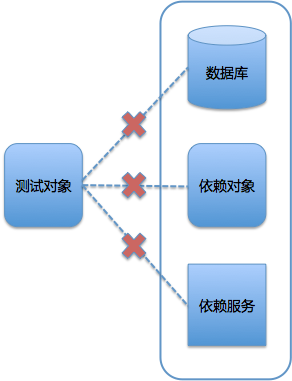

27 利用Mock与回放技术助力自动化回归
=====================

你好，我是王潇俊。今天我和你分享的主题是：利用 Mock 与回放技术助力自动化回归。

在《代码静态检查实践》和《越来越重要的破坏性测试 》这次的分享中，我介绍了对持续交付有重大影响的两个测试类型，即静态代码检查和破坏性测试。

你可能已经发现，这两种测试正好适用于持续集成和测试管理的一头、一尾：

* 静态代码检查，适合在所有其他测试类型开始之前优先进行，把住第一关；
* 破坏性测试，则适用于集成或验收测试之后，甚至是对系统进行持续长久的测试。

那么，我们现在再一起来看看，持续交付过程中还有哪些测试方法，以及还有哪些问题和难点吧。

持续交付中的测试难点
----------

其实，对于持续交付中的测试来说，自动化回归测试是不可或缺的，占了很大的测试比重。而进行自动化回归测试，就始终会有“三座大山”横在你面前。

 **“第一座大山”：测试数据的准备和清理。**

通常情况下，回归测试的用例是可以复用的，所以比较固定，结果校验也比较确定。而如果要实现回归测试的自动化，就需要保证每次测试时的初始数据尽量一致，以确保测试脚本可复用。

如果每次的数据都不同，那么每次的测试结果也会受到影响。为了做到测试结果的可信赖，就有两种方法：

* 一种是，每次全新的测试都使用全新初始化数据；
* 另一种是，在测试完成后，清除变更数据，将数据还原。

但是，这两种方法的实现，都比较麻烦，而且很容易出错。

 **“第二座大山”：分布式系统的依赖。**

分布式系统因为有服务依赖的问题，所以进行一些回归测试时，也会存在依赖的问题。这个问题，在持续交付中比较难解决：

1. 单元测试时要面对两难选择，测依赖还是不测依赖；
2. 集成测试时，如何保证依赖服务的稳定性，或者说排除由稳定性带来的干扰，所以到底是依赖服务的问题，还是被测服务的问题很难确定；
3. 真实的业务系统中，往往还存在多层依赖的问题，你还要想办法解决被测应用依赖的服务的依赖服务。

我的天呢，“这座大山”简直难以翻越。

 **“第三座大山”：测试用例的高度仿真。**

如何才能模拟出和用户一样的场景，一直困扰着我们。

如果我们的回归测试不是自己设计的假想用例，而是真实用户在生产环境中曾经发生过的实际用例的话，那么肯定可以取得更好的回归测试效果。那么，有没有什么办法或技术能够帮助我们做到这一点呢？

如何翻越这“三座大山”，我在这里给你准备了 Mock 和回放技术这个两大利器，也就是我接下来要和你重点分享的内容。

两大利器之一 Mock
-----------

我先来说说什么是 Mock：

> 如果某个对象在测试过程中依赖于另一个复杂对象，而这个复杂对象又很难被从测试过程中剥离出来，那么就可以利用 Mock 去模拟并代替这个复杂对象。

听起来是不是有点抽象？下面这张图就是 Mock 定义的一个具象化展示，我们一起来看看吧。

图 1 测试过程中，被测对象的外部依赖情况展示

在测试过程中，你可能会遇到这样的情况。你要测试某个方法和对象，而这个被测方法和对象依赖了外部的一些对象或者操作，比如：读写数据库、依赖另外一个对象的实体；依赖另一个外部服务的数据返回。

而实际的测试过程很难实现这三种情况，比如：单元测试环境与数据库的网络不通；依赖的对象接口还没有升级到兼容版本；依赖的外部服务属于其他团队，你没有办法部署等等。

那么，这时，你就可以利用 Mock 技术去模拟这些外部依赖，完成自己的测试工作。

Mock 因为这样的模拟能力，为测试和持续交付带来的价值，可以总结为以下三点：

1. **使测试用例更独立、更解耦** 。利用 Mock 技术，无论是单体应用，还是分布式架构，都可以保证测试用例完全独立运行，而且还能保证测试用例的可迁移性和高稳定性。为什么呢？ 因为足够独立，测试用例无论在哪里运行，都可以保证预期结果；而由于不再依赖于外部的任何条件，使得测试用例也不再受到外部的干扰，稳定性也必然得到提升。
2. **提升测试用例的执行速度** 。由于 Mock 技术只是对实际操作或对象的模拟，所以运行返回非常快。特别是对于一些数据库操作，或者复杂事务的处理，可以明显缩短整个测试用来的执行时间。 这样做最直接的好处就是，可以加快测试用例的执行，从而快速得到测试结果，提升整个持续交付流程的效率。
3. **提高测试用例准备的效率** 。因为 Mock 技术可以实现对外部依赖的完全可控，所以测试人员在编写测试用例时，无需再去特别考虑依赖端的情况了，只要按照既定方式设计用例就可以了。

那么，如何在测试中使用 Mock 技术呢？

目前，市场上有很多不同的 Mock 框架，你可以根据自己的情况进行选择。主要的应用场景可以分为两类：基于对象和类的 Mock，基于微服务的 Mock。

### 第一，基于对象和类的 Mock

基于对象和类的 Mock，我比较推荐使用的框架是 Mockito 或者 EasyMock。

Mockito 或者 EasyMock 这两个框架的实现原理，都是在运行时，为每一个被 Mock 的对象或类动态生成一个代理对象，由这个代理对象返回预先设计的结果。

这类框架非常适合模拟 DAO 层的数据操作和复杂逻辑，所以它们往往只能用于单元测试阶段。而到了集成测试阶段，你需要模拟一个外部依赖服务时，就需要基于微服务的 Mock 粉墨登场了。

### 第二，基于微服务的 Mock

基于微服务的 Mock，我个人比较推荐的框架是 Weir Mock 和 Mock Server。这两个框架，都可以很好地模拟 API、http 形式的对象。

从编写测试代码的角度看，Weir Mock 和 Mock Server 这两种测试框架实现 Mock 的方式基本一致：

1. 标记被代理的类或对象，或声明被代理的服务；
2. 通过 Mock 框架定制代理的行为；
3. 调用代理，从而获得预期的结果。

可见，这两种 Mock 框架，都很容易被上手使用。

### 第三，携程的 Mock Service 实践

在携程，我们一次集成测试，可能依赖的外部服务和数据服务会有几百个，而这几百个服务中很多都属于基础服务，都有被 Mock 的价值。

所以，携程借鉴了 Mock Server 的想法，在整个测试环境中构建了一套 Mock Service：所有服务的请求，都会优先通过这套系统；同时，所有服务的返回也会被拦截。这套 Mock Service 看起来就像是一个巨大的代理，代理了所有请求。

那么，测试人员只要去配置自己的哪些请求需要被 Mock Service 代理就可以了，如果请求的入参相同，且 Mock Service 中存在该请求曾经的返回，则直接被代理。反之，则透传到真正的服务。

虽然这会增加性能开销，但是对于整体的回归测试来说，价值巨大，而且方便好用、无需编码。

Mock 技术，通过模拟，绕过了实际的数据调用和服务调用问题，横在我们面前的“三座大山”中的其中两座，测试数据的准备和清理、分布式系统的依赖算是铲平了。但是如何解决“第三座大山”呢，即如何做到模拟用户真正的操作行为呢？

两大利器之二“回放”技术
------------

 **要做到和实际用户操作一致，最好的方法就是记录实际用户在生产环境的操作，然后在测试环境中回放。**

当然，我们要记录的并不是用户在客户端的操作过程，而是用户产生的最终请求。这样做，我们就能规避掉客户端产生的干扰，直接对功能进行测试了。

 **首先，我们一起来看一下如何把用户的请求记录下来。**

这里我们需要明确一个前提原则，即：我们并不需要记录所有用户的请求，只要抽样即可，这样既可以保持用例的新鲜度，又可以减少成本。

我们在携程有两种方案来拦截记录用户操作：

* 第一种方案是，在统一的 SLB 上做统一的拦截和复制转发处理。这个方案的好处是，管理统一，实现难度也不算太大。但问题是，SLB 毕竟是生产主路径上的处理服务，一不小心，就可能影响本身的路由服务，形成故障。所以，我们有了第二种替换方案。
* 第二种方案是，在集群中扩容一台服务器，在该服务器上启动一个软交换，由该软交换负责复制和转发用户请求，而真正的用户请求，仍旧由该服务器进行处理。 这个方案比第一种方案稍微复杂了一些，但在云计算的支持下，却显得更经济。你可以按需扩容服务器来获取抽样结果，记录结束后释放该服务器资源。这个过程中，你也不需要进行过多的配置操作，就和正常的扩容配置一样，减少了风险。

这样，我们就完成了用户行为的拦截记录。而用户行为记录的保存格式，你也可以根据要使用的的回放工具来决定。

 **然后，我们再一起看看回放的多样性。**

因为回放过程完全由我们来控制，所以除了正常的原样回放外，我们还可以利用回放过程达到更多的目的。

我们既可以按照正常的时间间隔，按照记录进行顺序回放；也可以压缩回放时间，形成一定的压力，进行回放，达到压力测试的目的。

而且，如果可以对记录的请求数据做到更精细的管理，我们还可以对回放进一步抽样和删选，比如只回放符合条件的某些请求等等，找出边界用例，利用这些用例完成系统的容错性和兼容性测试。

当然，你如果希望做到回放的精细管理，那我的建议是根据你的实际业务特性自研回放工具。

自研回放工具的整体思路其实非常简单，就是读取拦截的访问记录、模拟实际协议、进行再次访问。当然，你还可以给它加上更多额外的功能，比如数据筛选、异常处理、循环重复等等。

现在，利用“回放”技术，我们也顺利翻越了最后“一座山”，实现了用户行为的高度仿真。

总结
----

我以提出问题 - 分析问题 - 解决问题的思路，和你展开了今天的分享内容。

首先，我和你分享了自动化回归测试会遇到的三个难题：测试数据的准备和清理、分布式系统的依赖，以及测试用例的高度仿真。

我们可以利用 Mock 技术（即通过代理的方式模拟被依赖的对象、方法或服务的技术），通过不同的框架，解决自动化回归测试的前两个问题：

* 基于对象和类的 Mock，解决一个应用内部依赖的问题；
* 基于微服务的 Mock，解决应用与应用之间外部依赖的问题。

然后，我和你分享了携程的“回放技术”，即先通过虚拟交换机，复制和记录生产用户的实际请求，在测试时“回放”这些真实操作，以达到更逼真地模拟用户行为的目的，从而解决了自动化回归测试遇到的第三个问题。

所以，利用 Mock 和“回放”技术，我们能够提高自动化回归测试的效率和准确度，从而使整个持续交付过程更顺滑，自动化程度更高。

思考题
---

你所在的公司，有没有合理的回归测试过程？如果没有，是为什么呢，遇到了什么困难？通过我今天分享的内容，你将如何去优化这个回归测试的过程呢？
