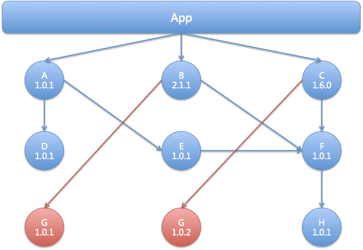

# 33 进阶，如何进一步提升移动APP的交付效率？

你好，我是王潇俊。今天我和你分享的主题是：进阶，如何进一步提升移动 App 的交付效率？

通过我在前面分享的《了解移动 App 的持续交付生命周期》和《细谈移动 App 的交付流水线（pipeline）》两个主题，你应该已经比较全面和细致地理解了移动客户端持续交付的整个过程。

当然，搭建持续交付体系的最终目的是，提升研发效率。所以，仅仅能把整个流水线跑起来，肯定满足不了你的胃口。那么，今天我就再和你聊聊，如何进一步提升移动 App 的交付效率。

## 提升交付效率的基本思路

同其他很多问题的解决方式一样，提升移动 App 持续交付的效率，也是要先有一个整体思路，再具体落实。

理解了移动 App 的交付流水线后，你很容易就能发现，它其实与后端服务的交付流水线十分相似。

后端持续交付流水线包括了：代码管理、环境管理、集成和编译管理、测试管理，以及发布管理这五个核心过程。而与之相比，移动 App 的运行形势决定了其在环境管理方面没有特别多的要求。

所以，我们可以从代码管理、集成和编译管理、测试管理，以及发布管理这四个方面来考虑问题。而将这四个方面直接对应到研发流程的话，就是标准的开发、构建、测试、发布过程。因此，移动 App 持续交付流水线的优化，我们只要从这四个过程中寻找优化点即可。

**我们优化移动 App 持续交付体系的整体思路就是**：首先找到这四个核心过程中存在的问题或瓶颈，再进行针对性的优化，从而达到提升效率的目的。

接下来，我们就逐一击破这四个核心过程中的难题吧。

## 如何提升开发效率？

从开发人员的角度看，提升效率最好的方法就是 2 个字：解耦。落到技术实现上来说，就是通过组件化形成合理的开发框架。

组件化是指，解耦复杂系统时将多个功能模块拆分、重组的过程。对于移动 App 来说可以横向地按功能模块进行组件化；也可以纵向地按照架构层次进行组件化。当然目前移动 App 的架构往往都已经比较复杂了，所以通常都是两者混合的模式。

组件化带来的好处包括：

1.**方便拆分代码仓库，降低分支管理难度，提高开发并行度。 **在上一篇文章《细谈移动 App 的交付流水线（pipeline）》中，我给出了一种适应发布快车模式的代码分支管理模型。试想一下，如果一个巨大的 App 的所有代码都集中在同一个代码仓库中，而所有的并行开发功能又都会形成一个个的功能分支的话，它们之间相互的影响将是难以想象的。 其实，任何一个代码仓库，当需要管理的并行分支超过 10 个时，都会让人头痛。所以，组件化的好处就是，对整个项目进行解耦，把不相干的功能组件从代码仓库这个层面进行隔离，以免互相影响。
2.** 组件可以多版本存在，通过依赖快速选取所需版本。 **所有的组件都可以同时发布多个版本，发布的形式可以是代码包、二进制组件等等。这样做的好处是，对于组件的提供方和依赖方来说，只需要通过版本控制就能管理或者选取自己需要的组件功能，这种方式更符合编程习惯，也降低了减少沟通成本。
3.** 专业分工，形成更优的组织结构。**一旦实施组件化，各种更专业的通用组建会慢慢形成（比如网络处理、图片处理、语音处理等等），而这些更专业的组件，也会渐渐地由更专业的人或团队进行开发和维护，专业的分工使得研发效率得到进一步提升。 所以，组件化其实就是通过专业分工，提升了整个组织的开发效率。

当然，组件化并非完美无瑕，它同时也会引起一些问题，比如：

1.**组件间的依赖问题 **。由于多组件、多版本的存在，加之它们之间的传递依赖，所以组件化之后的依赖管理问题不容小觑。
2.** 组件间的兼容问题**。兼容性问题，是由组件间的依赖问题引发的，由此组件的发布管理也会成为瓶颈：组件间到底要不要兼容？出现了不兼容的情况，应该怎么办？

其实，组件化带来的这些负面影响，在开发人员的维度是看不到的，往往会发生在构建阶段。还好，这些问题并不是无解的。接下来，我们就一起看看构建阶段如何解决这些问题，并提高效率吧。

## 如何提升构建效率？

从目前业界流行的处理方法来看，提升构建阶段的效率，可以从扁平化依赖管理和二进制交付两个维度解决。

### 第一，扁平化依赖管理

组件的依赖问题，到底有多让人头痛。我们一起来看看图 1 中的组件依赖示例吧。

一个 App 中的两个组件 B 和 C 都依赖了组件 G，但依赖的却是组件 G 的不同版本。所以，这个组件 G 的 2 个版本间就发生了冲突。

由此可见，由传递依赖带来的不确定性，是我们经常会遇见并非常讨厌的组件依赖形式。因为发现和处理的成本都很高。

图 1 组件依赖冲突

通常情况下，一个移动 App 可以拆分出十几到几十个组件。大型的移动 App，如淘宝、美团，甚至可以拆分出几百个组件。要保证这么多组件间依赖传递的准确性，其难度非常大。所以，为了解决这个问题，业界现在普遍直接采用扁平化的依赖管理方式，减少甚至去除传递依赖，以此避免组件、版本冲突的问题。

图 2 扁平化依赖

而且，这样的扁平化管理方式，对于一个 App 版本来说，更清晰、直观。

那么，实现这种扁平化的管理方式，需要具备什么前提吗。

答案，当然是需要。这个前提就是：不同组件之间，以及不同版本之间要保证可兼容。但是，你我都清楚，要想保证全部版本的完全可兼容性，其成本是巨大的。所以，在实践中，我们不会去保证所有版本的绝对兼容，而是去实现所有版本、组件间的相对兼容性。

相对兼容性是指，每个组件在发布新版本时，对于其所依赖的其他组件，都选择组件仓库中的最新版本。这样就保证了这个组件在发布之后的兼容性。如果所有组件都可以这么做，就能保证其各自都兼容。但是这个方法不是绝对的，比如我们会遇到并发发布，或者多个组件间引起的功能逻辑的冲突等问题，所以还是需要对移动 App 进行集成测试。

### 第二，二进制交付

解决了组件的依赖问题之后，我们需要再考虑的问题是，如何才能提高编译速度。

传统的移动 App 组件集成及编译的方式如图 3 所示。组件先以源码的方式集成到目标项目，然后对整个项目进行编译。如果组件比较多的话，采用这种方式的编译时间会非常长。有时，甚至要编译 1 个多小时。显然，我们不会接受这种低效的集成与编译方式。

图 3 组件源码集成

所以，为了加快编译速度，业界通常会采用二进制交付和集成的方案。如图 4 所示，二进制交付，会优先把组件编译成二进制包，再形成版本，并通过组件仓库进行版本管理，正如图中的组件 A Lib 包。在真正编译时，我们只要直接链接二进制包就可以了，无需再进行一次编译。

图 4 二进制交付及集成

使用二进制包的方式，可以帮我们大幅提升移动 App 的编译速度。而且，因为有了中间交付物，我们可以采用与后端服务一样的方式，在本地缓存需要依赖的组件，进一步加速编译过程。**通过对开发、构建过程的优化，我们已经将原来的交付效率至少提高了 1 倍。**接下来，我们再一起看看，如何优化测试和发布流程，以求移动 App 的持续交付体系更高效。

## 如何提升测试效率？

提高移动 App 测试效率的方法，主要的思路有三个：

1.**代码静态扫描工具 **。 移动 App 的测试，同样可以使用与后端服务一样的代码静态扫描工具。但相比之下，后端服务通常使用的那些工具虽然普适性强，但太重且定制的门槛也很高；所以针对移动 App 的代码静态扫描，目前多数大厂都采用自研的方式，定制静态代码扫描工具。另外，针对移动 App 开源的静态代码扫描工具，如 Lint 等，已经可以满足小团队的使用了。
2.** UI 自动化测试 **。 这部分的关注点是成本和收益比，你我都清楚，UI 自动化测试的脚本维护成本高，导致其难以被大规模使用。所以，针对重要的模块和组件，有计划地使用 UI 自动化测试是重中之重。
3.** 自动 Monkey 测试**。 Monkey 是一款非常好用的探索性测试工具，可以大幅提升测试效率，有效解决手工测试的盲点。iOS 系统的测试，由于系统限制比较多，所以可以在模拟器上执行 Monkey 的方式。

合理地利用这些测试工具和方法，就可以有效提升客户端的测试效率。

当然在测试过程中，合理地搭配监控工具，如性能监控、白屏检测等，可以起到更好的作用。

## 如何提升发布效率？

在前面两篇文章中，我提到过，移动 App 的发布流程与后端服务相比差别较大，根本原因在于移动 App 天生具备的分批发布特性。

所以，提升移动 App 的发布效率，我们也要采用与后端服务不一样的方式。在这里，我总结了提升移动 App 发布效率，需要注意的两个问题：

1.**要注意分发的精准性 **。精准性指的是，分发的目标、数量、时长，以及渠道一定要合理、有效，否则就会消耗无谓的分发成本。 这里，我和你分享一个关于分发精准性的技巧。其实，说是技巧，更不如说是大家在发布过程中容易疏忽的内容。为了进行小批量的测试，通常我们都会准备一个针对性的测试用户名单。但是，你有没有想过这份名单的更新周期呢？我看到很多组织都极少更新这份名单，其实这样既对用户体验不好，也会影响测试结果。小白鼠也要时常替换的，否则就会失去实验价值。 关于这份名单的更新周期，我的建议是：结合业务实际情况，尽量避免一个用户连续多次成为小白鼠。
2.** 要注意分发的稳定性** 。稳定性指的是，在分发的过程中，一定要做好监控数据的收集和分析，并且要考虑好风险的处理以及必要的回滚和热修复手段。 这里，我也和你分享一个关于稳定性的技巧。提高分发稳定性的一个方法就是，减少分发时更新的内容，并同时减少更新的时间。而对于移动 App 来说，静态资源包的差分发布就是一个优化方案。 比如，携程在选择静态资源包的差分发布时，就经历了这样一个优化过程：从全量包发布，到文件二进制差分，再到预差分。前两个方案都是在更新时，进行差分；而预差分则是在版本发布时，就已经做好了差分计算。与前两种方案相比，预差分的目的就是减少更新时间。但预差分的缺点是，可能要对所有要发布的版本进行差分处理，这将是一个巨大的笛卡尔积。 所以，携程在经历几次尝试后，最终选择的方案是：结合全量包发布、文件二进制差分，以及预差分三种方案的特点，形成了按需差分的方案。即，先收集用户正在使用的版本，然后只做这些版本与最新版本的差分，从而减少差分处理的成本。

在我看来，确保每次分发的有效性，以及每次分发都能达到预期，就是提高移动 App 发布效率的一种最有效的手段。

## 总结

在了解了移动 App 持续交付体系的内容后，你就可以自己去动手搭建一套持续交付体系了。持续交付体系搭建起来后，我们需要考虑的问题就成了，如何优化这个体系的流程，提升这个体系的效率。为此，我从开发、构建、测试和发布这四个核心流程的角度，和你分享了一些实践经验：

1. 利用组件化的思想提升开发效率，但同时也会带来组件依赖及发布的问题；
1. 利用扁平化依赖管理的方法解决组件依赖和发布的问题，同时采用二进制交付的方式，进一步提高构建效率；
1. 合理利用静态代码扫描、UI 自动化、自动 Monkey 等测试工具和方法，进一步提升测试效率；
1. 确保分发的精准性和稳定性，是提升发布效率的有效手段。

至此，通过持续交付移动 App 的三篇文章，再结合着以前我分享的后端服务的持续交付体系的内容，你完全可以自己厘清构建移动 App 持续交付体系的流程了，也知道了如何去优化这个流程。

希望这些内容，可以开拓你的思路，能够帮助你解决实际项目中遇到的问题。如果你还有哪些不清楚的内容，欢迎你留言和我一起讨论。

## 思考题

在今天的分享中，我介绍了一种扁平化依赖管理的方法。在实际工作中，你是如何管理依赖和 bundle 的呢？
