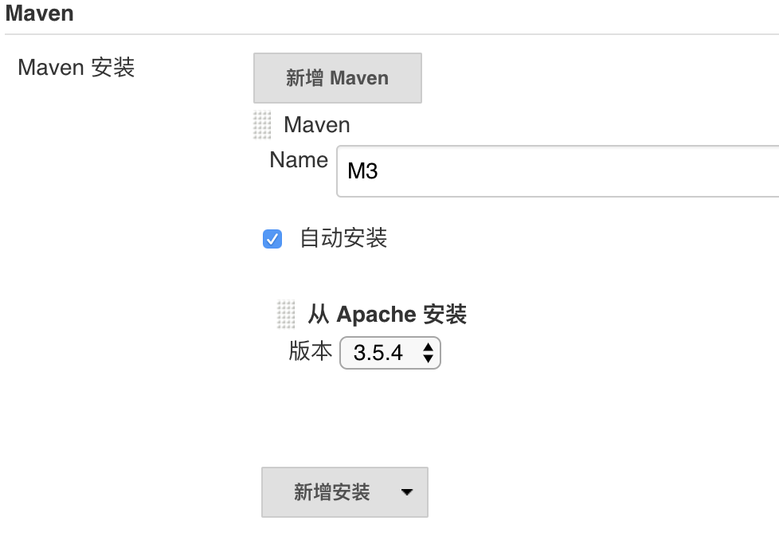
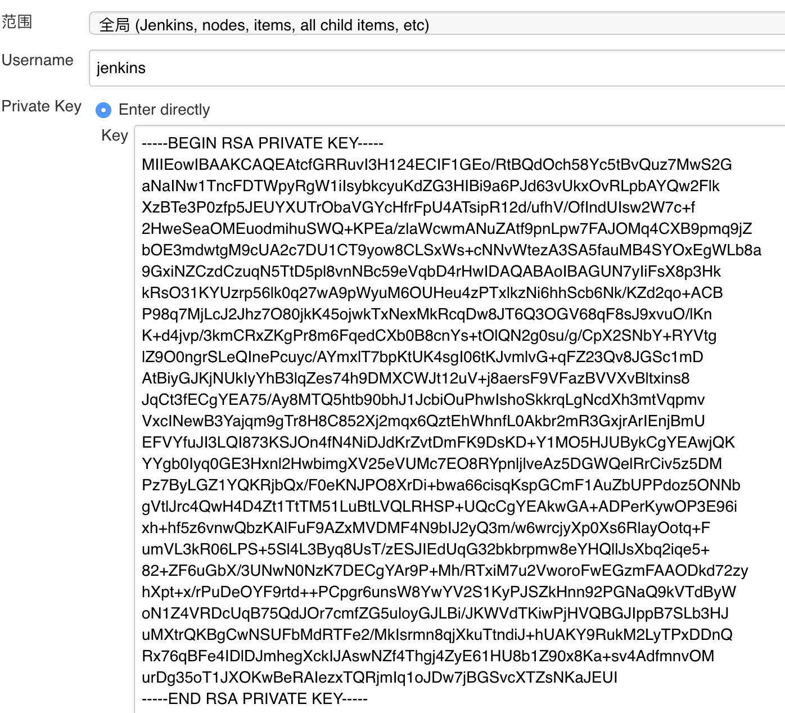
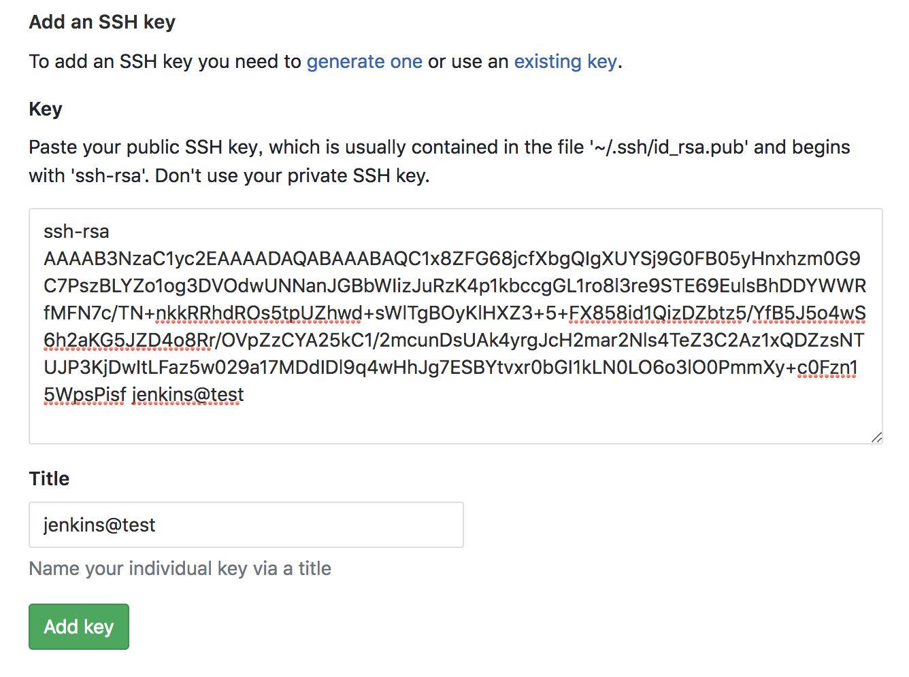
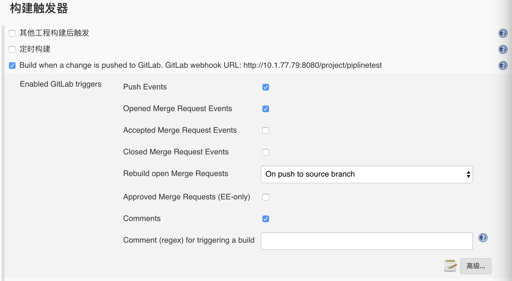

36 快速构建持续交付系统（三）：Jenkins 解决集成打包问题
=================================

在上一篇文章中, 我和你一起利用开源代码平台 GitLab 和代码静态检查平台 SonarQube 实现了代码管理平台的需求。那么，我今天这篇文章的目的，就是和你一起动手基于 Jenkins 搭建集成与编译相关的系统。

Jenkins 的安装与配置
--------------

Jenkins 这个开源项目，提供的是一种易于使用的持续集成系统，将开发者从繁杂的集成工作中解脱了出来，使得他们可以专注于更重要的业务逻辑实现。同时，Jenkins 还能实时监控集成环境中存在的错误，提供详细的日志文件和提醒功能，并以图表的形式形象地展示项目构建的趋势和稳定性。

因此，在携程，我们选择 Jenkins 作为了代码构建平台。而为了用户体验的一致性，以及交付的标准化，携程针对 Java、.net 等用到的主要语言，为开发人员封装了对于 Jenkins 的所有操作，并在自研的持续交付平台中实现了整个持续交付的工作流。

而如果是第一次搭建持续交付系统，我建议你不用像携程这样进行二次开发，因为 Jenkins 本身就可以在持续交付的构建、测试、发布流程中发挥很大的作用，完全可以满足你的搭建需求。而且，它提供的 Pipeline 功能，也可以很好地驱动整个交付过程。

所以，在这篇文章中，我就以 Jenkins 为载体，和你分享如何搭建集成与编译系统。

### 第一步，安装 Jenkins

为了整个持续交付体系的各个子系统之间的环境的一致性，我在这里依然以 Centos 7 虚拟机为例，和你分享 Jenkins 2.138（最新版）的安装过程。假设，Jenkins 主机的 IP 地址是 10.1.77.79。

1. 安装 Java 环境

```bash
 yum install java-1.8.0-openjdk-devel
```

1. 更新 rpm 源，并安装 Jenkins 2.138

```bash
rpm --import https://pkg.jenkins.io/redhat-stable/jenkins.io.key
wget -O /etc/yum.repos.d/jenkins.repo https://pkg.jenkins.io/redhat-stable/jenkins.repo
yum install jenkins
```

然后，我们就可以通过 “`http://10.1.77.79`” 访问 Jenkins 了，整个安装过程很简单。

当然，Jenkins 还有其他的安装方式，你可以参考 [https://jenkins.io/doc/book/installing/](https://jenkins.io/doc/book/installing/)。

### 第二步，配置 Jenkins 对 GitLab 的访问权限

Jenkins 安装完成之后，我们还需要初始化安装 Jenkins 的一些基础配置，同时配置 Jenkins 对 GitLab 的访问权限。

在新版的 Jenkins 中，第一次启动时会有一个初始化向导，引导你设置用户名、密码，并安装一些插件。

在这里，我推荐你勾选“安装默认插件”，用这种方式安装 Pipline、 LDAP 等插件。如果这个时候没能选择安装对应的插件，你也可以在安装完成后，在系统管理 -> 插件管理页面中安装需要的插件。

那么如何才能使编译和 GitLab、SonarQube 整合在一起呢？这里，我以一个后台 Java 项目为例，对 Jenkins 做进一步的配置，以完成 Jenkins 和 GitLab、SonarQube 的整合。这些配置内容，主要包括：

1. 配置 Maven；
2. 配置 Jenkins 钥匙；
3. 配置 GitLab 公钥；
4. 配置 Jenkins GitLab 插件。

接下来，我就逐一和你介绍这些配置内容吧。

1. **配置 Maven**进入系统管理 -> 全局工具配置页面，安装 Maven，并把名字设置为 M3。如图 1 所示。



图 1 Maven 配置

这样配置好 Maven 后，Jenkins 就会在第一次使用 GitLab 时，自动安装 Maven 了。

1.**配置 Jenkins 钥匙**配置 Jenkins 钥匙的路径是：凭据 -> 系统 -> 全局凭据 -> 添加凭据。

然后，将你的私钥贴入并保存。 如图 2 所示。



图 2 Jenkins 钥匙配置

1.**配置 GitLab 公钥**在 GitLab 端, 进入 http://{Gitlab Domain}/profile/keys，贴入你的公钥并保存，如图 3 所示。



图 3 GitLab 公钥配置

通过配置 Jenkins 钥匙，以及配置 GitLab 公钥两步，你就已经完成了 Jenkins 对 GitLab 仓库的访问权限配置。

1.**配置 Jenkins GitLab 插件**

Jenkins 的 GitLab-plugin 插件的作用是，在代码提交和 Merge Request 时触发编译。安装这个插件的方法是：进入 Jenkins 的系统管理 -> 插件管理页面，选择 GitLab Plugin 安装。

Jenkins 重启后，选择凭据 -> 系统 -> 全局凭据 -> 添加凭据，再选择 GitLab API Token。然后，将 `http://10.1.77.79/profile/personal_access_tokens`中新生成的 access token 贴入 GitLab API Token，并保存。

关于 GitLab-plugin 插件的更详细介绍，你可以参考它的[官方文档](https://github.com/jenkinsci/gitlab-plugin)。

完成了这四步的必要配置之后，你就可以开始使用 Jenkins Pipline 构建集成与编译系统的工作流了。

使用 Jenkins Pipeline 构建工作流
-------------------------

在使用 Jenkins 搭建集成和编译系统前，我们先一起回忆一下我在\[《快速构建持续交付系统（一）：需求分析》\]中提到的关于集成与编译系统的需求：

> 我们需要在代码 push 之后，自动触发编译和集成。如果编译成功，这套系统还要能继续处理自动化测试和部署。并且，在整个过程中，这个系统要能自动地适配三种不同的代码平台和交付产物。

那么，如何才能驱动整个事务的顺利完成呢？这里，我们就需要用到大名鼎鼎的 Jenkins Pipeline 了。

### Jenkins Pipeline 介绍

Jenkins Pipeline 是运行在 Jenkins 上的一个工作流框架，支持将原先运行在一个或多个节点的任务通过一个 Groovy 脚本串联起来，以实现之前单个任务难以完成的复杂工作流。并且，Jenkins Pipline 支持从代码库读取脚本，践行了 Pipeline as Code 的理念。

Jenkins Pipeline 大大简化了基于 Jenkins 的开发工作。之前很多必须基于 Jenkins 插件的二次开发工作，你都可以通过 Jenkins Pipeline 实现。

另外，Jenkins Pipeline 大大提升了执行脚本的可视化能力。

接下来，我就和你分享一下如何编写 Jenkins Pipeline，以及从代码编译到静态检查的完整过程。这个从代码编译到静态检查的整个过程，主要包括三大步骤：

* 第一步，创建 Jenkins Pipeline 任务；
* 第二步，配置 Merge Request 的 Pipeline 验证；
* 第三部，编写具体的 Jenkins Pipeline 脚本。

### 第一步，创建 Jenkins Pipeline 任务

首先，在 Jenkins 中创建一个流水线任务，并配置任务触发器。详细的配置，如图 4 所示。



图 4 触发器创建

然后，在 GitLab 端配置 Webhook。配置方法为：在 GitLab 项目下的 settings->Integrations 下配置并勾选 “Merge request events”选项。

经过这些配置后， 每次有新的 Merge Request 被创建或更新，都会触发 Jenkins 的 Pipeline，而再由自定义的 Pipeline 脚本完成具体任务，比如代码扫描任务。

### 第二步，配置 Merge Request 的 Pipeline 验证

在驱动代码静态扫描之后，我们还要做一些工作，以保证扫描结果可以控制 Merge Request 的行为。

进入 settings->Merge Request 页面, 勾选“Only allow Merge Requests to be merged if the pipeline succeeds”。这个配置可以保证，在静态检查任务中，不能合并 Merge Request。

### 第三步，编写具体的 Pipeline 脚本

然后我们再一起看一下为了实现我们之前的需求，即获取代码 - 编译打包 - 执行 Sonar 静态代码检查和单元测试等过程。Jenkins 端的 Pipeline 脚本如下，同时我们需要将该脚本配置在 Jenkins 中。

```bash
node {
   def mvnHome 
   # 修改 Merge Request 的状态，并 checkout 代码
   stage('Preparation') { // for display purposes
      mvnHome = tool 'M3'
      updateGitlabCommitStatus name: 'build', state: 'running'
      checkout scm
  } 
   # 执行 Maven 命令对项目编译和打包
   stage('Build') {
      echo 'Build Start'
      // Run the maven build
      sh "'${mvnHome}/bin/mvn' -Dmaven.test.skip=true clean package"
   } 
   # 启动 sonar 检查，允许 junit 单元测试，获取编译产物，并更新 Merge request 的状态
   stage('Results') {
      // Run sonar 
      sh “'${mvnHome}/bin/mvn' org.sonarsource.scanner.maven:sonar-maven-plugin:3.2:sonar”
      junit '**/target/surefire-reports/TEST-*.xml'
      archive 'target/*.war'
      updateGitlabCommitStatus name: 'build', state: 'success'
   }
}
```

在这个脚本中，一共包括了 3 个 stage。

 **第一个 stage：**从 GitLab 中获取当前 Merge Request 源分支的代码；同时，通 Jenkins GitLab 插件将 Merge Request 所在的分支的当前 commit 状态置为 running。这个时候，我们可以在 GitLab 的页面上看到 Merge Request 的合并选项已经被限制了，如图 5 所示。


图 5 GitLab Merge Request**第二个 stage： **比较好理解，就是执行 Maven 命令对项目编译和打包。** 第三个 stage：**

通过 Maven 调用 Sonar 的静态代码扫描，并在结束后更新 Merge Request 的 commit 状态，使得 Merge Request 允许被合并。同时将单元测试结果展现在 GitLab 上。

通过以上这三步，我们已经完整地实现了这个集成和编译系统的需求，即：在 GitLab 端创建 Merge Request 时，预先进行一次代码扫描，并保证在代码扫描期间，代码无法被合并入主干分支，只有扫描通过后，代码才能被合并。

当然，这个示例的 Pipline 的脚本还比较简单。但掌握了基本的思路之后，在这个基础上，我们还可以添加更多的改进代码，达到更多的功能。

比如，我们在 Sonar 检测之后，可以调用 Sonar 的 API 获取静态检查的详细信息；然后，调用 GitLab 的 API，将静态检查结果通过 comment 的方式，展现在 GitLab 的 Merge Request 页面上，从而使整个持续集成的流程更加丰满和完整。

多语言平台构建问题
---------

上面的内容，我以 Java 后台项目为例，详细介绍了 Jenkins Pipeline 的创建。 但是，在实际的工作中，整个编译平台需要支持的是多种语言。所以，我要再和你分享下多语言情况下，集成和编译系统可能会碰到的问题。

在这里，我将多语言栈情况下，集成与编译系统常会遇到的问题，归结为两类：

1. 多语言 CI 流水线的管理；
2. Jenkins Pipeline 的管理。

接下来，我们就一起看看，如何解决这两个问题吧。

### 多语言 CI 流水线管理

关于如何进行 Docker 编译和移动端编译的问题，你可以先回顾一下第 17 篇文章\[《容器镜像构建的那些事儿》\]，以及第 32 篇文章\[《细谈移动 APP 的交付流水线》\]的内容，并将相关的逻辑 Pipeline 化。

当然，对于 Docker 镜像和 iOS App 这两种不同的交付流水线，你还需要特别关注的几个点，我再带你回顾一下。

#### 第一，Docker 镜像

对于构建 docker 镜像，我们需要在静态检查之后增加一个 stage，即：把 Dockerfile 放入代码仓库。Dockerfile 包括两个部分：

1. base 镜像的定义，包括 Centos 系统软件的安装和 Tomcat 环境的创建；
2. war 包部分，将 Jenkins 当前工作目录下的 war 包复制到 Docker 镜像中，保证每次 Docker 镜像的增量就只有 war 包这一个构建产物，从而提高 Docker 镜像的编译速度。

#### 第二，iOS App

而对于 iOS 应用，需要在修改 Build stage 的逻辑中， 增加 fastlane shell 命令。详细步骤可以参考第 32 篇文章\[《细谈移动 APP 的交付流水线》\]的内容，我就不再此赘述了。

特别需要注意的是，因为 iOS 机器只能在 OS X 环境下编译，所以我们需要在 Pipeline 脚本的 node 上指定使用 Jenkins 的 Mac Slave。

### Jenkins Pipeline 的管理

原则上，对于每个项目，你都可以配置一个 Jenkins Pipeline 任务。但，当我们需要维护的平台越来越多，或者项目处于多分支开发的状态时，这种做法显然就不合适了，比如：

1. 每个项目组的开发人员都需要调整 Jenkins 的脚本，很容易造成代码被错误更改；
2. 当需要回滚代码时，无法追述构建脚本的历史版本。

在专栏的第 20 篇文章\[《Immutable！任何变更都需要发布》\]中，我曾提到，环境中的任何变更都需要被记录、被版本化。

所以，在 Jenkins Pipeline 的过程中，更好的实践是将 Pipeline 的脚本文件 Jenkinsfile 放入 Git 的版本控制中。每次执行 Jenkins Job 前，先从 Git 中获取到当前仓库的 Pipeline 脚本。

这样，不仅降低了单个项目维护 Jenkins job 的成本，而且还标准化了不同语言平台的构建，从而使得一套 Jenkins 模板就可以支持各个语言栈的编译过程。

多平台构建产物管理
---------

除了多语言栈的问题外，我们还会碰到的另一个问题是，构建产物的管理问题。

当开发语言只是 Java 的时候，我们管理的构建产物主要是 jar 包和 war 包，而管理方式一般就是把 Nexus 和 Artifactory 作为代码管理仓库。

而引入一种新的部署工具后，我们就需要额外的管理方式。比如，引入 Docker 镜像后，我们需要引入用于存储和分发 Docker 镜像的企业级 Registry 服务器 Harbor。

所以，为了保证整个系统工具链的一致性，我们需要做到:

1. 产物的统一版本化，即无论是 Java 的 war 包或是.net 程序的压缩包，都需要支持与上游的编译系统和下游的部署系统对接。
2. 对于同一个版本的多个构建产物，需要将它们和代码的 commit ID 实现有效的关联。比如，对于同一份 Java 代码生成的 war 包和 Docker 镜像，我们可以通过一个版本号把它们关联起来。

但是，这两种做法会使得整个持续交付系统的研发复杂度更高。

所以，携程最终选择的方案是：标准化先行。也就是说，保证不同语言的发布有且只有一套统一的流水线，并通过在编译系统的上层再封装一层自研系统，以达到不同的物理构建产物，可以使用同一个逻辑版本号进行串联管理的目的。

而针对这个问题，业界普遍采用的解决方案是：用 Artifactory 或者 Nexus 对构建产物进行统一管理。Artifactory 和 Nexus 都包括了开源 OSS 版和付费专业版。

另外，你可能在选择构建产物仓库的时候会有这样的疑惑：我到底应该选择哪个仓库呢。那么，我就再和你分享一下我之前调研得到的一些结论吧。

1. 如果你需要管理的产物只是 Java 相关的 Maven 或者 Gradle，那么 Nexus 或者 Artifactory 都能工作得很好，你可以随意选择。
2. 如果你有管理多语言构建产物的需求，而又没有付费意愿的话，我建议你使用 Nexus 3 的 OSS 版本。Nexus 3 的 OSS 版本支持 10 多种主流编程语言。而 Artifactory 的 OSS 版本能支持的编译工具就非常有限，只有 Gradle、Ivy、Maven、SBT 这四种。
3. 如果你有管理多语言构建产物的需求，而且也接受付费的话，我推荐你使用 Artifactory 的付费版本。Artifactory 的付费版本中，包含了很多头部互联网公司的背书方案，功能相当丰富。而且，如果你所在公司的开发人员比较多的话，Artifactory 按实例付费的方式也更划算。

好了，到此为止，我们的集成构建系统也搭建完成了。加上我们上一篇文章中一起搭建的代码管理平台，我们已经可以跑完三分之二的持续交付过程了。

所以，在接下来的最后一篇文章中，我将会为你介绍关于自动化测试和发布的一些实践，这样就能完整地实现我们对持续交付系统的需求了。

总结与实践
-----

通过今天这篇文章，我和你分享了如何快速安装和配置一套有效的 Jenkins 系统，以及如何打通 Jenkins 与 GitLab 之间的访问。这样就可以使这套基于 Jenkins 的集成与编译系统与我们在上一篇文章中基于 GitLab 搭建的代码管理平台相呼应，从而满足了在代码平台 push 代码时，驱动集成编译系统工作的需求。

当然，在今天这篇文章中，我还详细分析了 Jenkins Pipeline 的创建，以及与 Merge Request 的联动合作配置，同时提供了一个 Pipeline 脚本的例子，帮助你理解整个 Pipeline 的工作原理。这样你就可以根据自己的具体需求，搭建起适合自己的持续交付流水线了。

除此之外，我还提到了关于多语言平台和多平台构建产物的问题。对于这种复杂的问题，我也给出了解决问题的一些行之有效的办法。比如，使用统一逻辑版本进行产物管理等。

这样，通过搭建 Jenkins 系统，构建 Pipeline 流水线，以及处理好构建产物这三部曲，相信你已经可以顺利构建起一套适合自己的集成与编译系统了。
