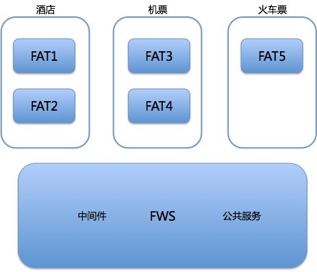
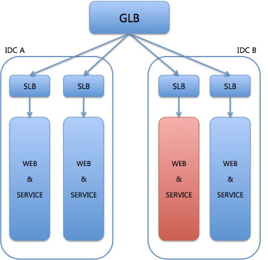
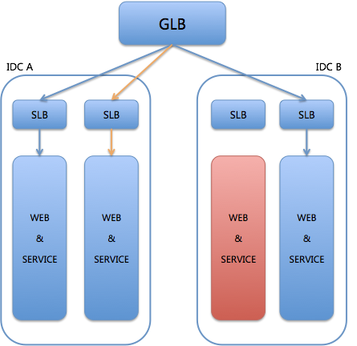
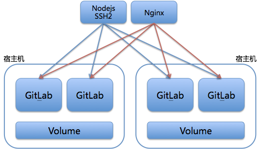

持续交付专栏特别放送 答疑解惑
===============

整个专栏的全部 37 篇文章，已经更新完毕了。在这三个多月的时间里，我一直在尽自己的最大努力，想要把自己过往的一些经验和遇到的问题分享给你。但是，毕竟篇幅、时间有限，针对一些比较复杂的案例，或者是针对不同层次的读者，也很难做到面面俱到。

所以，借着专栏即将结束的机会，我整理了一下大家的留言，总结了一些比较典型的问题，并从中挑选了 5 个问题在这篇文章中给与回答。虽然，这些问题我依旧不能做到面面俱到，但也想再为你略尽绵薄之力。

因此，今天我就针对下面这五个问题，再详细的展开一下，和你分享一些携程在这些方面的真实方案和实践：

1. 测试环境使用和管理的实例；
2. 怎么处理数据库发布和回滚；
3. Immutable，在携程是如何落地的；
4. 携程的破坏性测试，DR 演练；
5. 携程 GitLab HA 方案。

测试环境使用和管理的实例
------------

在第 8 篇\[《测试环境要多少？从现实需求说起》\]和第 9 篇\[《测试环境要多少？从成本与效率说起》\]文章中，我和你分享了携程的测试环境包括这么三类：

1. FAT 环境，为每个团队或功能准备的独立功能测试环境；
2. FWS 环境，部署稳定版本的功能服务，以供其他团队联调的环境；
3. UAT 环境，用户接受测试的环境，包括独立部署的 DB、缓存和中间件。

这三类环境中，UAT 环境的使用和管理方法大家都已经比较熟悉了，所以这里我再着重和你分享一下 FAT 和 FWS 环境相关的内容。

FAT 和 FWS 环境的关系，如图 1 所示。

图 1FAT 和 FWS 环境的关系

### FAT 与 FWS 环境的关系

FAT 环境属于不同部门，可以包括多套环境。在管理时既可以按需临时生成，也可以作为常备环境持久保留。我们可以在一套 FAT 环境中，部署任意个服务应用。

而 FWS 环境主要部署的是中间件和公共服务，通常情况下它的版本与生产版本一致。

FWS 和 FAT 这两类环境，在网络上完全相同，并共用一组数据库和缓存。

### 如何控制服务调用关系？

既然 FWS 和 FAT 这两类环境完全相同，而且不同的 FAT 环境中也会存在相同的服务应用，那么我们就必然要解决一个问题，即：如何控制服务的调用关系。

因为即使是相同的服务应用，部署在不同的 FAT 环境中的应用版本号也可能不一样。如果按照标准服务治理方式的话，那么就需要把所有 FAT 环境中的同一个服务认为是一个服务集群。而同一应用的不同版本同时服务的话，它们提供的功能也不一样，这会对测试产生负面影响。因为，你无法确定出现 Bug 的版本到底是哪一个。

那么，携程是如何解决这个问题的呢？

携程的解决方案是，由 SOA 通信中间件指定服务的具体地址，即通过配置指定要调用的服务的具体地址。当然，如果每个服务都要去指定配置，那么就太过繁琐了。所以，我们还定义了一条默认规则：

> 如果没有特别指定的服务调用地址，则优先调用同一个环境中的相关服务。如果同一个环境中该服务不存在，则尝试调用 FWS 中部署的实例。

### 在携程如何创建测试环境？

在携程，我们有一套完整的测试环境自助管理平台，开发人员或 QA 团队可以按需自助完成对对测试环境的任意操作。这里，我也分享一下，在携程创建一个测试环境的大致步骤。

 **第一步，选择一个已经存在的 FAT 环境，或者重新创建一个 FAT 环境 **。如果是重新创建的话，可以选择重新创建一个空的环境，或者是复制一个已有的环境。** 第二步，选择要在这个 FAT 环境下部署的服务应用，先进行关系绑定（即，这个 FAT 环境下要部署的所有服务应用的描述）再部署**。如果该服务属于其他团队，则可以要求该团队协助部署（由平台来处理）。

在携程，一个团队只能部署属于自己的服务应用，如果你的 FAT 环境中包含了其他团队的应用，则要由其他团队部署。这样做的好处是各司其职，能更好地控制联调版本。**第三步，配置这个 FAT 环境相关的信息 **。携程的配置中心，同样也支持多测试环境的功能，可以做到同一个配置 key 在不同环境有不同的 value。** 第四步，对于特殊的服务调用，进行单独配置。**

经过这样的四步，一个测试环境就被创建起来了。期间测试环境的任何变化，都可以通过环境管理平台完成。比如，增减服务应用、修改配置，或是扩容 / 缩容服务器等。

如何处理数据库发布和回滚？
-------------

这也是一个大家比较关心的问题。我来和你分享一下携程的实践吧。

在携程，数据库的变更是和应用发布拆分开的。也就是说，我们的数据库有单独的持续交付流程。这个持续交付的过程大致如图 2 所示。

图 2 数据库持续交付

在这个过程中，有两处 DBA 审核：

* 第一处审核，是在提交脚本之后。审核的内容主要是变更内容是否合法、方式是否得当、是否影响业务等等。
* 第二处审核，是在提交生产变更后。审核的主要的内容是，判断变更是否会对当时的生产系统产生影响。比如，订单表的更新、大表的变化等，就不允许在业务高峰期进行。

整个数据库发布的持续交付流程，是以测试通过为驱动的。这个过程，要经历开发、功能，以及集成测试 3 个环境。而数据库的发布又与代码发布不同步，所以如果有兼容问题的话，就容易被发现了。

那么，怎么做到兼容呢？  **携程对数据库变更的要求是：**

* 第一，与业务相关的，只能新增字段，不能删除字段，也不能修改已有字段的定义，并且新增字段必须有默认值。
* 第二，对于必须要修改原有数据库结构的场景，则必须由 DBA 操作，不纳入持续交付流程。

所以，按照这个管理方式处理数据库的持续交付的话，数据库本身基本就没有需要回滚的场景了。

Immutable，在携程是如何落地的？
--------------------

在第 20 篇文章\[《Immutable！任何变更都需要发布》\]中，我提到了“不可变”的概念和价值，也讲到了任何系统的变更都要视为一次发布。然而，在传统的基于虚拟机的系统架构下，要做到这一点代价非常大。

所以，携程基于 Docker 容器和 k8s 落地了不可变模型。

具体的实现思路，其实也很简单。在落地不可变模型之前，我们只有应用发布，这一个可追溯的版本树；那么，针对不可变的需求，我们在其上增加了一个系统变更版本树。同样地，原来只在代码交付时才会进行镜像和部署；现在在系统变更时，我们也会针对性地生成镜像、标注版本、进行部署。

将应用发布和系统变更这两条版本树合并，就是完整的不可变模型需要的版本树了，也就是落地了不可变模型。

携程的破坏性测试：DR 演练
--------------

其实，携程的破坏性测试也只是刚刚起步，还没有完全具备混沌工程的能力，其原因主要是：很多的老旧系统比较脆弱，不具备在所有的随机破坏后快速恢复的能力。

但是，携程在同城多机房 DR（灾难恢复）方面，做得还是比较出色的。其实，DR 也是一种破坏性测试，一般采用的方式是局部断电或者流量切换。所以，我们也会定时做 DR 演练，以检验系统健壮性是否达标。

其实，破坏性测试和 DR 演练这两种方式的最终结果是一样的，都是将所有生产流量从灾难机房迁移至其他正常机房。当然，要完成这样的切换，同时不影响正常业务，我们需要在架构层面多花费一些精力。比如，数据库的同步、Redis 的同步、SLB 路由的快速切换，等等。

我们一起看一下 DR 演练的具体过程吧。假设 IDC B 的某个服务单元出现了异常，如图 3 所示。

图 3 个别服务单元故障

而此时，IDC A 有这个服务单元的灾备存在，那么系统就会被触发流量切换，即：GLB 会将所有发给故障服务单元 SLB 上的流量，切换到 IDC A 的灾备服务单元上，如图 4 所示。

图 4 流量切换后

这样，故障的服务单元就暂停了服务，直接由灾备服务顶上了。

当然，这种演练不仅仅是整个服务单元异常这一种场景，还可用于单元内的个别服务的异常演练，这时的流量切换就不再是由 GLB 这种上层来做了，而是利用 SLB 这一层的能力，切换部分服务的流量到灾备服务上。

最后，你还要记住的很重要的一点就是，要能探测到故障单元是否恢复正常了。如果恢复正常了的话，流量还要还原回去。这部分的能力，可以利用 SLB 的健康检测实现。

其实，整个破坏性测试过程中最容易出现问题的是，数据库和缓存的处理。如果没有跨机房数据实时同步的能力，建议最好不要尝试，毕竟不要把演练变成了破坏。

携程的 GitLab HA 方案
----------------

携程的 GitLab HA 方案，主要是基于 Sharding 思想，大致的架构设计如图 5 所示。

图 5 携程 GitLab HA 方案

这个方案的核心思想是：通过 Nodejsssh2 代理和分发所有 SSH 请求，利用 Nginx 代理和分发所有 http 请求。具体的实施，包括以下三点：

第一，每台宿主机上有多个 GitLab 实例，可以是虚拟机形式，当然也可以是容器形式。

第二，同台宿主机上的 GitLab 实例共享一个 Volume，这样就保证了即使某一个 GitLab 实例故障，也可以快速将流量切换到同宿主机的其他实例上，继续提供服务。

第三，我们对每台宿主机的仓库，简单地用 rsync 做了冷备。此处并没做互备，否则就变成 NFS 方案了（因为，我们的目的是，只要保证存储故障时可恢复，所以无需采用 NFS 方案）。

这个方案的开发成本和维护成本都比较小、简单实用，你也可以借鉴。
