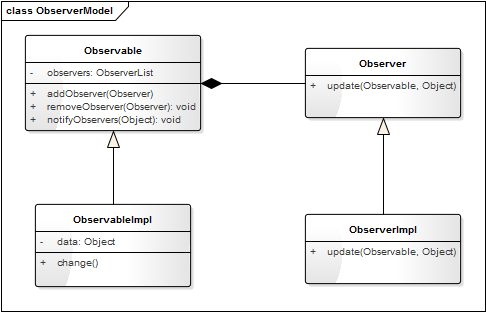

# 01 监听模式：坑爹的热水器

【故事剧情】

> 刚刚大学毕业的 Tony 只身来到北京这个硕大的城市，开始了北漂的生活。但刚刚毕业的他身无绝技、包无分文，为了生活只能住在沙河镇一个偏僻的村子里，每天坐着程序员专线（13号线）来回穿梭于昌平区与西城区……
>
> 在一个寒冷的冬天，下班之后要坐2个小时的地铁+公交才能回到住处，Tony 拖着疲惫的身体回到家。准备洗一个热水澡暖暖身体，耐何简陋的房子中用的还是90年代的热水器。因为热水器没有警报更没有自动切换模式的功能，所以烧热水必须得守着；不然时间长了成杀猪烫，时间短了又冷成狗。无奈的 Tony 背靠着墙，头望着天花板，深夜中做起了白日梦：一定要努力工作，过两个月我就可以自己买一个智能热水器了：水烧好了就发一个警报，我就可以直接去洗操。还要能自己设定模式，既可以烧开了用来喝，可以烧暖了用来洗澡……


### 用程序来模拟生活

Tony 陷入白日梦中……他的梦虽然在现实世界里不能立即实现，但在程序世界里可以。程序来源于生活，下面我们就用代码来模拟 Tony 的白日梦。

源码示例：

```python
class WaterHeater:
    "热水器：战胜寒冬的有利武器"
    def __init__(self):
        self.__observers = []
        self.__temperature = 25
    def getTemperature(self):
        return self.__temperature
    def setTemperature(self, temperature):
        self.__temperature = temperature
        print("current temperature is:", self.__temperature)
        self.notifies()
    def addObserver(self, observer):
        self.__observers.append(observer)
    def notifies(self):
        for o in self.__observers:
            o.update(self)
class Observer:
    "洗澡模式和饮用模式的父类"
    def update(self, waterHeater):
        pass
class WashingMode(Observer):
    "该模式用于洗澡用"
    def update(self, waterHeater):
        if waterHeater.getTemperature() >= 50 and waterHeater.getTemperature() < 70:
            print("水已烧好，温度正好！可以用来洗澡了。")
class DrinkingMode(Observer):
    "该模式用于饮用"
    def update(self, waterHeater):
        if waterHeater.getTemperature() >= 100:
            print("水已烧开！可以用来饮用了。")
```

测试代码：

```python
def testWaterHeater():
    heater = WaterHeater()
    washingObser = WashingMode()
    drinkingObser = DrinkingMode()
    heater.addObserver(washingObser)
    heater.addObserver(drinkingObser)
    heater.setTemperature(40)
    heater.setTemperature(60)
    heater.setTemperature(100)
```

输出结果：

```plaintext
current temperature is: 40
current temperature is: 60
水已烧好，温度正好！可以用来洗澡了。
current temperature is: 100
水已烧开！可以用来饮用了。
```

### 从剧情中思考监听模式

这个代码非常简单，水烧到50-70度时，会发出警告：可以用来洗澡了！烧到100度也会发出警告：可以用来喝了！在这里洗澡模式和饮用模式扮演了监听的角色，而热水器则是被监听的对象。一旦热水器中的水温度发生变化，监听者都能及时知道并做出相应的判断和动作。其实这就是程序设计中监听模式的生动展现。

#### 监听模式

监听模式又名观察者模式，顾名思意就是观察与被观察的关系，比如你在烧开水得时时看着它开没开，你就是观察者，水就是被观察者；再比如说你在带小孩，你关注她是不是饿了，是不是喝了，是不是撒尿了，你就是观察者，小孩就是被观察者。

观察者模式是对象的行为模式，又叫发布-订阅（Publish/Subscribe）模式、模型-视图（Model/View）模式、源-监听器（Source/Listener）模式或从属者（Dependents）模式。当你看这些模式的时候，不要觉得陌生，它们就是观察者模式。

观察者模式一般是一种一对多的关系，可以有任意个（一个或多个）观察者对象同时监听某一个对象。监听的对象叫观察者（后面提到监听者，其实就指观察者，两者是等价的），被监听的对象叫被观察者（Observable，也叫主题 Subject）。被观察者对象在状态或内容发生变化时，会通知所有观察者对象，使它们能够做出相应的变化（如自动更新自己的信息）。

### 监听模式的模型抽象

#### 代码框架

上面的示例代码还是相对比较粗糙，我们可以对它进行进一步的重构和优化，抽象出监听模式的框架模型。

```python
class Observer:
    "观察者的基类"
    def update(self, observer, object):
        pass
class Observable:
    "被观察者的基类"
    def __init__(self):
        self.__observers = []
    def addObserver(self, observer):
        self.__observers.append(observer)
    def removeObserver(self, observer):
        self.__observers.remove(observer)
    def notifyObservers(self, object = 0):
        for o in self.__observers:
            o.update(self, object)
```

#### 类图

上面的代码框架可用类图表示如下：



addObserver，removeObserver 分别用于添加和删除观察者，notifyObservers 用于内容或状态变化时通知所有的观察者。因为 Observable 的 notifyObservers 会调用 Observer 的 update 方法，所有观察者不需要关心被观察的对象什么时候会发生变化，只要有变化就是自动调用 update，只需要关注 update 实现就可以了。

#### 基于框架的实现

有了上面的代码框架之后，我们要实现示例代码的功能就会更简单了。最开始的示例代码我们假设它为 version 1.0，那么再看看基于框架的 version 2.0 吧。

```python
class WaterHeater(Observable):
    "热水器：战胜寒冬的有利武器"
    def __init__(self):
        super().__init__()
        self.__temperature = 25
    def getTemperature(self):
        return self.__temperature
    def setTemperature(self, temperature):
        self.__temperature = temperature
        print("current temperature is:", self.__temperature)
        self.notifyObservers()
class WashingMode(Observer):
    "该模式用于洗澡用"
    def update(self, observable, object):
        if isinstance(observable,
                      WaterHeater) and observable.getTemperature() >= 50 and observable.getTemperature() < 70:
            print("水已烧好，温度正好！可以用来洗澡了。")
class DrinkingMode(Observer):
    "该模式用于饮用"
    def update(self, observable, object):
        if isinstance(observable, WaterHeater) and observable.getTemperature() >= 100:
            print("水已烧开！可以用来饮用了。")
```

测试代码不用变。自己跑一下，会发现输出结果和之前的是一样的。

#### 模型说明

##### **设计要点** 在设计观察者模式的程序时要注意以下几点

1. 要明确谁是观察者谁是被观察者，只要明白谁是关注对象，问题也就明白了。一般观察者与被观察者之间是多对一的关系，一个被观察对象可以有多个监听对象(观察者)。如一个编辑框，有鼠标点击的监听者，也有键盘的监听者，还有内容改变的监听者。
1. Observable 在发送广播通知的时候，无须指定具体的 Observer，Observer 可以自己决定是否要订阅 Subject 的通知。
1. 被观察者至少需要有三个方法：添加监听者、移除监听者、通知 Observer 的方法；观察者至少要有一个方法：更新方法，更新当前的内容，作出相应的处理。
1. 添加监听者、移除监听者在不同的模型称谓中可能会有不同命名，如观察者模型中一般，addObserver，removeObserver；在源-监听器（Source/Listener）模型中一般是 attach/detach，应用在桌面编程的窗口中，还可能是 attachWindow/detachWindow，或 Register/UnRegister。不要被名称迷糊了，不管他们是什么名称，其实功能都是一样的，就是添加/删除观察者。

##### **推模型和拉模型** 观察者模式根据其侧重的功能还可以分为推模型和拉模型。 **推模型** ：被观察者对象向观察者推送主题的详细信息，不管观察者是否需要，推送的信息通常是主题对象的全部或部分数据。一般这种模型的实现中，会把被观察者对象中的全部或部分信息通过 update 的参数传递给观察者 \[update(Object obj) ，通过 obj 参数传递\]

> 如某应用 App 的服务要在凌晨1:00开始进行维护，1:00-2:00期间所有服务将会暂停，这里你就需要向所有的 App 客户端推送完整的通知消息：“本服务将在凌晨1:00开始进行维护，1:00-2:00期间所有服务将会暂停，感谢您的理解和支持！” 不管用户想不想知道，也不管用户会不会在这段期间去访问，消息都需要被准确无误地通知到。这就是典型的推模型的应用。 **拉模型** ：被观察者在通知观察者的时候，只传递少量信息。如果观察者需要更具体的信息，由观察者主动到被观察者对象中获取，相当于是观察者从被观察者对象中拉数据。一般这种模型的实现中，会把被观察者对象自身通过 update 方法传递给观察者 \[update(Observable observable )，通过 observable 参数传递 \]，这样在观察者需要获取数据的时候，就可以通过这个引用来获取了。

> 如某应用 App 有新的版本推出，则需要发送一个版本升级的通知消息，而这个通知消息只会简单地列出版本号和下载地址，如果你需要升级你的 App 还需要调用下载接口去下载安装包完成升级。这其实也可以理解成是拉模型。

推模型和拉模型其实更多的是语义和逻辑上的区别。我们上面的代码框架，从接口 \[update(self, observer, object)\] 上你应该知道是可以同时支持推模型和拉模型的。推模型时，observer 可以传空，推送的信息全部通常 object 传递；拉模型时，observer 和 object 都传递数据，或只传递 observer，需要更具体的信息时通过 observer 引用去取数据。

### 应用场景

1. 对一个对象状态或数据的更新需要其他对象同步更新，或者一个对象的更新需要依赖另一个对象的更新；
1. 对象仅需要将自己的更新通知给其他对象而不需要知道其他对象的细节，如消息推送。

学习设计模式，更应该领悟其设计思想，不应该应该局限于代码的层面。 观察者模式还可以用于网络中的客户端和服务器，比如手机中的各种 App 的消息推送，服务端是被观察者，各个手机 App 是观察者，一旦服务器上的数据（如 App 升级信息）有更新，就会被推送到手机客户端。在这个应用中你会发现服务器代码和 App 客户端代码其实是两套完全不一样的的代码，它们是通过网络接口进行通迅的，所以如果你只是停留在代码层面是无法理解的！
