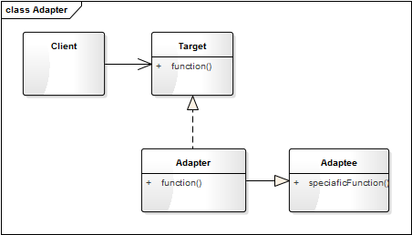
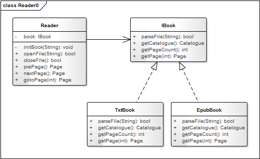
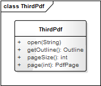
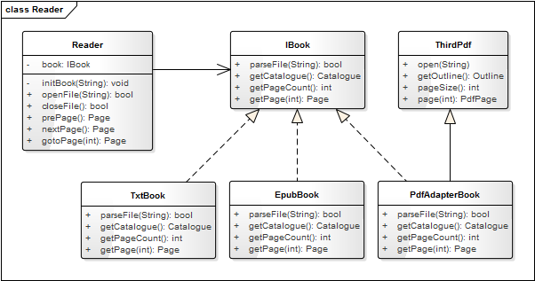

02 适配模式：身高不够鞋来凑
===============

【故事剧情】

> 晚上九点半，Tony 上了地铁，准备回家，正巧还有一个空位，赶紧走向前坐下。工作一天后，疲惫不堪的他正准备坐着打个盹小睡一会儿。这时进来两个小姑娘，一个小巧可爱，一个身姿曼妙；嬉笑地聊着天走到了 Tony 的前面，Tony 犹豫了片刻后还是绅士般地给小女孩让了个座……
>
> 两个小姑娘道了声谢谢，便挤在一块坐下了，继续有说有笑地谈论着……
>
> Amy：周末在商场里看到你和一个帅哥在一起。好你个 Nina，脱单了也不告诉姐姐我，太不够意思了！怎么……想金屋藏“娇”啊！
>
> Nina：不是啦，也是最近刚有事，还没来得及告诉你呢。
>
> Amy：那快说说呗！那小哥看着很高啊！
>
> Nina：嗯，他1米85。
>
> Amy：厉害了，你155 他185，这就是传说中的最萌身高组合啊！
>
> Nina：嗯，走在大街上，别人都回头看我们，弄的我挺不好了意思的~
>
> Amy：你这是身在福中不知福啊！别人就是因为想求也求不到呢！
>
> Nina：也有很气的时候啦，有时生气想打他，结果粉拳一出去就被他的大手包了饺子。
>
> Amy：哈哈哈哈，还有呢！
>
> Nina：还有一件很囧的事，我一抬头总是看到他的鼻毛，他一低头总是看到我的头发屑！
>
> Amy：哈哈哈！笑的我肚子痛了……所以你们在一起，你一定要天天洗头，他一定要天天修鼻毛咯~
>
> Nina：是啊！可麻烦了~
>
> Amy：看来还是我这 160 的身高最棒了！衣服可以随便挑，更重要的是我男友 175，穿上高跟鞋，我就可以挽着他的手肩并肩地走~
>
> Nina：这就是所谓的 **身高不够鞋来凑** 吗？
>
> Amy：不然怎么叫万能的高跟鞋呢……
>
> Nina：好羡慕啊！在我这，高跟鞋也无能~
>
> Amy：… …
>
> 正听的兴起时，地铁门开了。Tony 才反应过来，到站了，该下车了。Tony 赶忙往车门方向走，一不小心额头碰到了把手上，只好一手护着头往外跑，两个小姑娘相视一笑~


### 用程序来模拟生活

身材苗条、长像出众是每个人梦寐以求的，尤其是女孩子！但很多人却因为先天的原因并不能如意，这时就需要通过服装、化妆去弥补。所谓美女，三分靠长相七分靠打扮！比如身高不够，就可以通过穿高跟鞋来弥补；如果本身就比较高，那穿不穿高跟鞋就没那么重要了。这里的高跟鞋就起着一个适配的作用，能让你的形象增高四、五厘米，下面我们就用代码来模拟一下高跟鞋在生活中的场景吧！

源码示例：

```python
class IHightPerson:

    "接口类，提供空实现的方法，由子类去实现"
    def getName(self):

        "获取姓名"

        pass
    def getHeight(self):

        "获取身高"

        pass
class HighPerson(IHightPerson):

    "个高的人"
    def __init__(self, name):

        self.__name = name
    def getName(self):

        return self.__name
    def getHeight(self):

        return 170
class ShortPerson:

    "个矮的人"
    def __init__(self, name):

        self.__name = name
    def getName(self):

        return self.__name
    def getRealHeight(self):

        return 160
    def getShoesHeight(self):

        return 6
class DecoratePerson(ShortPerson, IHightPerson):

    "有高跟鞋搭配的人"
    def getHeight(self):

        return super().getRealHeight() + super().getShoesHeight()
```

测试代码：

```python
def canPlayReceptionist(person):

    """

    是否可以成为(高级酒店)接待员

    :param person: IHightPerson的对象

    :return: 是否符合做接待员的条件

    """

    return person.getHeight() >= 165;
def testPerson():

    lira = HighPerson("Lira")

    print(lira.getName() + "身高" + str(lira.getHeight()) + "，完美如你，天生的美女！" )

    print("是否适合做接待员：", "符合" if canPlayReceptionist(lira) else "不符合")

    print()

    demi = DecoratePerson("Demi");

    print(demi.getName() + "身高" + str(demi.getHeight()) + "在高跟鞋的适配下，你身高不输高圆圆，气质不输范冰冰！")

    print("是否适合做接待员：", "符合" if canPlayReceptionist(lira) else "不符合")
```

输出结果：

```
Lira身高170，完美如你，天生的美女！

是否适合做接待员： 符合
Demi身高166在高跟鞋的适配下，你身高不输高圆圆，气质不输范冰冰！

是否适合做接待员： 符合
```

### 从剧情中思考适配器模式

在上面的例子中，高跟鞋起着一个适配的作用，让其形象增高 5~7 厘米完全不在话下，而且效果立竿见影！使得一些女孩原本不符合接待员的真实身高，在鞋子的帮助下也能符合条件。如高跟鞋一样，使原本不匹配某种功能的对象变得匹配这种功能，这在程序中叫做适配器模式。

#### 适配器模式

> Convert the interface of a class into another interface clients expect. Adapter lets classes work together that couldn't otherwise because of incompatible interfaces.
>
> 将一个类的接口变成客户端所期望的另一种接口，从而使原本因接口不匹配而无法一起工作的两个类能够在一起工作。

适配器模式的作用：

* 接口转换，将原有的接口（或方法）转换成另一种接口；
* 用新的接口包装一个已有的类；
* 匹配一个老的组件到一个新的接口。

#### 设计思想

适配器模式又叫变压器模式，也叫包装模式（Wrapper），它的核心思想是将一个对象经过包装或转换后使它符合指定的接口，使得调用方可以像使用这接口的一般对象一样使用它。这一思想，在我们生活中可谓是处处可见，比如变压器插座，能让你像使用国内电器一样使用美标（110V）电器；还有就是各种转接头，如 MiniDP 转 HDMI 转接头、HDMI 转 VGA 线转换器、Micro USB 转 Type-C 转接头等。

你们知道吗？“设计模式”一词最初是来源于建筑领域，而中国古建筑是世界建筑史的一大奇迹（如最具代表性的紫禁城），中国古建筑的灵魂是一种叫 **榫卯结构** 的建造理念。

> 榫卯（sǔn mǎo）是两个木构件上所采用的一种凹凸结合的连接方式。凸出部分叫榫（或榫头）；凹进部分叫卯（或榫眼、榫槽）。它是古代中国建筑、家具及其他木制器械的主要结构方式。

榫卯结构的经典模型如下图：


榫卯是藏在木头里的灵魂！而随着时代的变化，其结构也发生着一些变化，现在很多建材生产商也在发明和生产新型的具有榫卯结构的木板。假设木板生产商有下面两块木板，木板 A 是榫，木板 B 是卯，A、B 两块木板就完全吻合。他们之间的榫卯接口是一种 T 字形的接口。


后来，随着业务的拓展，木板厂商增加了一种新木板 C。但 C 是 L 形的接口，不能与木板 A 对接。为了让木板 C 能与木板 A 进行对接，就需要增加一个衔接板 D 进行适配，而这个 D 就相当于适配器，如下图：


适配器模式通常用于对已有的系统拓展新功能时，尤其适用于在设计良好的系统框架下接入第三方的接口或第三方的 SDK 时。在系统的最初设计阶段，最好不要把适配器模式考虑进去，除非一些特殊的场景（如系统本身就是要去对接和适配多种类型的硬件接口）。

### 适配器模式的模型抽象

#### 类图

适配器模式的类图如下：



Target 是一个接口类，是提供给用户调用的接口抽象，如上面示例中的 IHightPerson。Adaptee 是你要进行适配的对象类，如上面的 ShortPerson。Adapter 是一个适配器，是对 Adaptee 的适配，它将 Adaptee 的对象转换（或说包装）成符合 Target 接口的对象；如上面的 DecoratePerson，将 ShortPerson 的 getRealHeight 和 getShoesHeight 方法包装成 IHightPerson 的 getHeight 接口。

### 模型说明

#### 设计要点

适配器模式中主要三个角色，在设计适配器模式时要找到并区分这些角色：

* **目标（Target）：** 即你期望的目标接口，要转换成的接口。
* **源对象（Adaptee）：** 即要被转换的角色，要把谁转换成目标角色。
* **适配器（Adapter）：** 适配器模式的核心角色，负责把源对象转换和包装成目标对象。

#### 优缺点

##### 适配器模式的优点

* 可以让两个没有关联的类一起运行，起着中间转换的作用。
* 提高了类的复用。
* 灵活性好，不会破坏原有的系统。

##### 适配器模式的缺点

* 如果原有系统没有设计好（如 Target 不是抽象类或接口，而一个实体类），适配器模式将很难实现。
* 过多地使用适配器，容易使代码结构混乱，如明明看到调用的是 A 接口，内部调用的却是 B 接口的实现。

### 实战应用

有一个电子书阅读器的项目（Reader），研发之初，产品经理经过各方讨论，最后告诉我们只支持 TXT 和 Epub 格式的电子书。然后经过仔细思考、精心设计，采用了如图1的代码架构。在这个类图中，有一个阅读器的核心类 Reader，一个 TXT 文档的关键类 TxtBook（负责 TXT 格式文件的解析），和一个 Epub 文档的关键类 EpubBook（负责 Epub 格式文件的解析）。



图1：阅读器类图

产品上线半年后，市场响应良好，业务部门反映：有很多办公人员也在用我们的阅读器，他们希望这个阅读器能同时支持 PDF 格式，这样就不用在多个阅读器神之间来回切换了，此时程序就需要增加对 PDF 格式的支持，而 PDF 并不是核心业务，我们不会单独为其开发一套 PDF 解析内核，而会使用一些开源的 PDF 库（我们称它为第三方库），如 MuPDF、TCPDF 等。而开源库的接口和我们的接口并不相同（如图2），返回的内容也不是我们直接需要的，需要经过一些转换才能符合我们的要求。



图2：第三方 PDF 解析库的类图

这时，我们就需要对 PDF 的解析库 MuPDF 进行适配。经过上面的学习，你一定知道这时该用适配器模式了，于是有了如下图3的类图结构。



图3：兼容 PDF 的类图结构

**代码实现如下：**```python
class Page:

    "电子书一页的内容"

    def __init__(self, pageNum):

        self.__pageNum = pageNum
    def getContent(self):

        return "第 " + str(self.__pageNum) + " 页的内容..."
class Catalogue:

    "目录结构"
    def __init__(self, title):

        self.__title = title

        self.__chapters = []

        self.setChapter("第一章")

        self.setChapter("第二章")
    def setChapter(self, title):

        self.__chapters.append(title)
    def showInfo(self):

        print("标题：" + self.__title)

        for chapter in self.__chapters:

            print(chapter)
class IBook:

    "电子书文档的接口类"
    def parseFile(self, filePath):

        pass
    def getCatalogue(self):

        pass
    def getPageCount(self):

        pass
    def getPage(self, pageNum):

        pass
class TxtBook(IBook):

    "TXT解析类"
    def parseFile(self, filePath):

        # 模拟文档的解析

        print(filePath + " 文件解析成功")

        self.__pageCount = 500

        return True
    def getCatalogue(self):

        return Catalogue("TXT电子书")
    def getPageCount(self):

        return self.__pageCount
    def getPage(self, pageNum):

        return Page(pageNum)
class EpubBook(IBook):

    "TXT解析类"
    def parseFile(self, filePath):

        # 模拟文档的解析

        print(filePath + " 文件解析成功")

        self.__pageCount = 800

        return True
    def getCatalogue(self):

        return Catalogue("Epub电子书")
    def getPageCount(self):

        return self.__pageCount
    def getPage(self, pageNum):

        return Page(pageNum)
class Outline:

    "第三方PDF解析库的目录类"

    pass
class PdfPage:

    "PDF页"
    def __init__(self, pageNum):

        self.__pageNum = pageNum
    def getPageNum(self):

        return self.__pageNum
class ThirdPdf:

    "第三方PDF解析库"
    def __init__(self):

        self.__pageSize = 0
    def open(self, filePath):

        print("第三方解析PDF文件：" + filePath)

        self.__pageSize = 1000

        return True
    def getOutline(self):

        return Outline()
    def pageSize(self):

        return self.__pageSize
    def page(self, index):

        return PdfPage(index)
class PdfAdapterBook(ThirdPdf, IBook):

    "TXT解析类"
    def parseFile(self, filePath):

        # 模拟文档的解析

        rtn = super().open(filePath)

        if(rtn):

            print(filePath + "文件解析成功")

        return rtn
    def getCatalogue(self):

        outline = super().getOutline()

        print("将Outline结构的目录转换成Catalogue结构的目录")

        return Catalogue("PDF电子书")
    def getPageCount(self):

        return super().pageSize()
    def getPage(self, pageNum):

        page = self.page(pageNum)

        print("将PdfPage的面对象转换成Page的对象")

        return Page(page.getPageNum())

# 导入os库

import os
class Reader:

    "阅读器"
    def __init__(self, name):

        self.__name = name

        self.__filePath = ""

        self.__curBook = None

        self.__curPageNum = -1
    def __initBook(self, filePath):

        self.__filePath = filePath

        extName = os.path.splitext(filePath)[1]

        if(extName.lower() == ".epub"):

            self.__curBook = EpubBook()

        elif(extName.lower() == ".txt"):

            self.__curBook = TxtBook()

        elif(extName.lower() == ".pdf"):

            self.__curBook = PdfAdapterBook()

        else:

            self.__curBook = None
    def openFile(self, filePath):

        self.__initBook(filePath)

        if(self.__curBook is not None):

            rtn = self.__curBook.parseFile(filePath)

            if(rtn):

                self.__curPageNum = 1

            return rtn

        return False
    def closeFile(self):

        print("关闭 " + self.__filePath + " 文件")

        return True
    def showCatalogue(self):

        catalogue = self.__curBook.getCatalogue()

        catalogue.showInfo()
    def prePage(self):

        return self.gotoPage(self.__curPageNum - 1)
    def nextPage(self):

        return self.gotoPage(self.__curPageNum + 1)
    def gotoPage(self, pageNum):

        if(pageNum < 1 or pageNum > self.__curBook.getPageCount()):

            return None
        self.__curPageNum = pageNum

        print("显示第" + str(self.__curPageNum) + "页")

        page = self.__curBook.getPage(self.__curPageNum)

        page.getContent()

        return page

```

测试代码：

```python
def testReader():

    reader = Reader("阅读器")

    if(not reader.openFile("平凡的世界.txt")):

        return

    reader.showCatalogue()

    reader.gotoPage(1)

    reader.nextPage()

    reader.closeFile()

    print()
    if (not reader.openFile("平凡的世界.epub")):

        return

    reader.showCatalogue()

    reader.gotoPage(5)

    reader.nextPage()

    reader.closeFile()

    print()
    if (not reader.openFile("平凡的世界.pdf")):

        return

    reader.showCatalogue()

    reader.gotoPage(10)

    reader.nextPage()

    reader.closeFile()
```** 输出结果：**

```

平凡的世界.txt 文件解析成功

标题：TXT电子书

第一章

第二章

显示第1页

显示第2页

关闭 平凡的世界.txt 文件
平凡的世界.epub 文件解析成功

标题：Epub电子书

第一章

第二章

显示第5页

显示第6页

关闭 平凡的世界.epub 文件
第三方解析PDF文件：平凡的世界.pdf

平凡的世界.pdf文件解析成功

将Outline结构的目录转换成Catalogue结构的目录

标题：PDF电子书

第一章

第二章

显示第10页

将PdfPage的面对象转换成Page的对象

显示第11页

将PdfPage的面对象转换成Page的对象

关闭 平凡的世界.pdf 文件

```

### 应用场景

*   系统需要使用现有的类，而这些类的接口不符合现有系统的要求。
*   对已有的系统拓展新功能时，尤其适用于在设计良好的系统框架下增加接入第三方的接口或第三方的 SDK 时。
