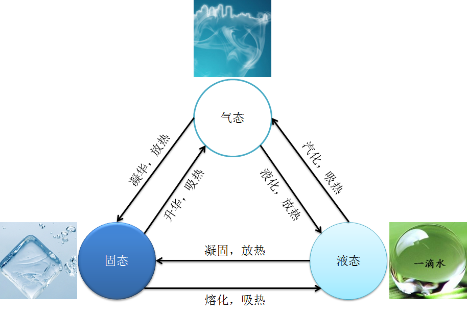
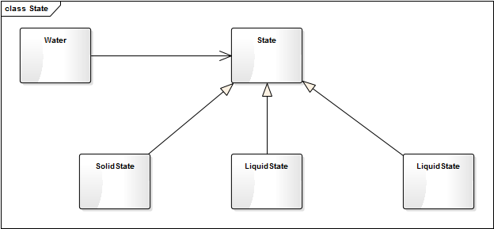
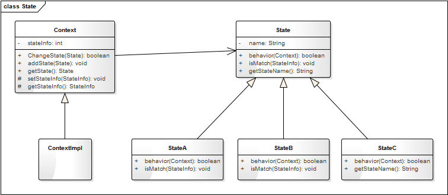

# 03 状态模式：人与水的三态

【故事剧情】

> 一个天气晴朗的周末，Tony 想去图书馆给自己充充电。于是背了一个双肩包，坐了一个多小时地铁，来到了首都图书馆。走进一个阅览室，Tony 看到一个青涩的小女孩拿着一本中学物理教科书，认真地看着热力学原理……女孩容貌像极了 Tony 中学的物理老师，不知不觉间 Tony 想起了他那可爱的老师，想起了那最难忘的一节课……
>
> Viya 老师站在一个三尺讲堂上，拿到一本教科书，给大家讲着水的特性：人有少年、壮年、老年三个不同的阶段；少年活泼可爱，壮年活力四射，老年充满智慧。 水也一样，水有三种不同的状态：固态——冰坚硬寒冷，液态——水清澈温暖，气态——气虚无缥缈。更有意思的是水不仅有三种状态，而且三种状态还可以相互转换。冰吸收热量可以熔化成水，水吸收热量可以汽化为气，气释放热量可以凝华成冰……
>
> 虽然时隔十几年，但 Viya 老师那甜美的容貌和生动的讲课方式依然历历在目……



### 用程序来模拟生活

水是世界上最奇特的物质之一，不仅滋润万物，更是变化万千。你很难想象冰、水、气其实是同一个东西 H2O，看到冰你可能更会联想到玻璃、石头，看到水你可能更会联想到牛奶、可乐，看到气可能更会联想到空气、氧气。三个不同状态下的水好像是三种不同的东西。

水的状态变化万千，而程序也可以实现万千的功能。那如何用程序来模拟水的三种不同状态及相互转化呢？

我们从对象的角度来考虑会有哪些类，首先不管它是什么状态始终是水（H2O），所以会有一个 Water 类；而它又有三种状态，我们可以定义三个状态类：SolidState，LiquidState，GaseousState；从 SolidState，LiquidState，GaseousState 这三个单词中我们会发现都有一个 State 后缀，于是我们会想它们之间是否有一些共性，能否提取出一个更抽象的类，这个类就是状态类（State）。这些类之间的关系大致如下：



Ok，我们已经知道了大概的关系，那就开始 Coding 实现吧，在实现的过程中不断完善。

源码示例：

```python
class Water:
    "水(H2O)"
    def __init__(self, state):
        self.__temperature = 25
        self.__state = state
    def setState(self, state):
        self.__state = state
    def changeState(self, state):
        if (self.__state):
            # cout << "由" << m_pState->GetStateName() << "变为" << pState->GetStateName() << endl;
            print("由", self.__state.getStateName(), "变为", state.getStateName())
        else:
            print("初始化为", state.getStateName())
        self.__state = state
    def getTemperature(self):
        return self.__temperature
    def setTemperature(self, temperature):
        self.__temperature = temperature
        if (self.__temperature <= 0):
            self.changeState(SolidState("固态"))
        elif (self.__temperature <= 100):
            self.changeState(LiquidState("液态"))
        else:
            self.changeState(GaseousState("气态"))
    def riseTemperature(self, step):
        self.setTemperature(self.__temperature + step)
    def reduceTemperature(self, step):
        self.setTemperature(self.__temperature - step)
    def behavior(self):
        self.__state.behavior(self)
class State:
    "状态"
    def __init__(self, name):
        self.__name = name
    def getStateName(self):
        return self.__name
    def behavior(self, water):
        pass
class SolidState(State):
    "固态"
    def __init__(self, name):
        super().__init__(name)
    def behavior(self, water):
        print("我性格高冷，当前体温", water.getTemperature(),
              "摄氏度，我坚如钢铁，仿如一冷血动物，请用我砸人，嘿嘿……")
class LiquidState(State):
    "液态"
    def __init__(self, name):
        super().__init__(name)
    def behavior(self, water):
        print("我性格温和，当前体温", water.getTemperature(),
              "摄氏度，我可滋润万物，饮用我可让你活力倍增……")
class GaseousState(State):
    "气态"
    def __init__(self, name):
        super().__init__(name)
    def behavior(self, water):
        print("我性格热烈，当前体温", water.getTemperature(),
              "摄氏度，飞向天空是我毕生的梦想，在这你将看不到我的存在，我将达到无我的境界……")
```

测试代码：

```python
def testState():
    "状态模式的测试代码"
    water = Water(LiquidState("液态"))
    water.behavior()
    water.setTemperature(-4)
    water.behavior()
    water.riseTemperature(18)
    water.behavior()
    water.riseTemperature(110)
    water.behavior()
    water.setTemperature(60)
    water.behavior()
    water.reduceTemperature(80)
    water.behavior()
```

输出结果：

```plaintext
我性格温和，当前体温 25 摄氏度，我可滋润万物，饮用我可让你活力倍增……
由 液态 变为 固态
我性格高冷，当前体温 -4 摄氏度，我坚如钢铁，仿如一冷血动物，请用我砸人，嘿嘿……
由 固态 变为 液态
我性格温和，当前体温 14 摄氏度，我可滋润万物，饮用我可让你活力倍增……
由 液态 变为 气态
我性格热烈，当前体温 124 摄氏度，飞向天空是我毕生的梦想，在这你将看不到我的存在，我将达到无我的境界……
由 气态 变为 液态
我性格温和，当前体温 60 摄氏度，我可滋润万物，饮用我可让你活力倍增……
由 液态 变为 固态
我性格高冷，当前体温 -20 摄氏度，我坚如钢铁，仿如一冷血动物，请用我砸人，嘿嘿……
```

### 从剧情中思考状态模式

从上面的 Demo 中我们可以发现，水就有三种不同状态冰、水、水蒸汽，三种不同的状态有着完全不一样的外在特性：

1. 冰，质坚硬，无流动性，表面光滑；
1. 水，具有流动性；
1. 水蒸汽，质轻，肉眼看不见，却存在于空气中。这三种状态的特性是不是相差巨大？简直就不像是同一种东西，但事实却是不管它在什么状态，其内部组成都是一样的，都是水分子（H2O）。

如水一般， **状态** 即事物所处的某一种形态。 **状态模式** 是说一个对象在其内部状态发生改变时，其表现的行为和外在属性不一样，这个对象看上去就像是改变了它的类型一样。因此，状态模式又称为对象的行为模式。

### 状态模式的模型抽象

#### 代码框架

上面的示例代码还是相对比较粗糙，也有一些不太合理的实现，如：

1. Water 的 setTemperature（self，temperature）方法不符合程序设计中的开放封闭原则。虽然水只有三种状态，但其他场景下的状态模式的应用可能会有更多的状态，如果要再加一个状态（State），则要在 SetTemperature 中再一个 if else 判断。
1. 表示状态的类应该只会有一个实例，因为不可能出现“固态1”、“固态2”的情形，所以状态类的实现要使用单例，关于单例模式，会在下一章中进一步讲述。

针对这些问题，我们可以对它进行进一步的重构和优化，抽象出状态模式的框架模型。

```python
class Context:
    "状态模式的上下文环境类"
    def __init__(self):
        self.__states = []
        self.__curState = None
        # 状态发生变化依赖的信息数据,在有多个变量决定状态的
        # 实际复杂应用场景中，可以将其单独定义成一个类
        self.__stateInfo = 0
    def addState(self, state):
        if (state not in self.__states):
            self.__states.append(state)
    def changeState(self, state):
        if (state is None):
            return False
        if (self.__curState is None):
            print("初始化为", state.getStateName())
        else:
            print("由", self.__curState.getStateName(), "变为", state.getStateName())
        self.__curState = state
        self.addState(state)
        return True
    def getState(self):
        return self.__curState
    def _setStateInfo(self, stateInfo):
        self.__stateInfo = stateInfo
        for state in self.__states:
            if( state.isMatch(stateInfo) ):
                self.changeState(state)
    def _getStateInfo(self):
        return self.__stateInfo
class State:
    "状态的基类"
    def __init__(self, name):
        self.__name = name
    def getStateName(self):
        return self.__name
    def isMatch(self, stateInfo):
        "状态信息stateInfo是否在当前的状态范围内"
        return False
    def behavior(self, context):
        pass
```

#### 类图

上面的代码框架可用类图表示如下：



### 基于框架的实现

有了上面的代码框架之后，我们要实现示例代码的功能就会更简单了。最开始的示例代码我们假设它为 version 1.0，那么再看看基于框架的 version 2.0 吧。

```python
class Water(Context):
    "水(H2O)"
    def __init__(self):
        super().__init__()
        self.addState(SolidState("固态"))
        self.addState(LiquidState("液态"))
        self.addState(GaseousState("气态"))
        self.setTemperature(25)
    def getTemperature(self):
        return self._getStateInfo()
    def setTemperature(self, temperature):
        self._setStateInfo(temperature)
    def riseTemperature(self, step):
        self.setTemperature(self.getTemperature() + step)
    def reduceTemperature(self, step):
        self.setTemperature(self.getTemperature() - step)
    def behavior(self):
        state = self.getState()
        if(isinstance(state, State)):
            state.behavior(self)
# 单例的装饰器
def singleton(cls, *args, **kwargs):
    "构造一个单例的装饰器"
    instance = {}
    def __singleton(*args, **kwargs):
        if cls not in instance:
            instance[cls] = cls(*args, **kwargs)
        return instance[cls]
    return __singleton
@singleton
class SolidState(State):
    "固态"
    def __init__(self, name):
        super().__init__(name)
    def isMatch(self, stateInfo):
        return stateInfo < 0
    def behavior(self, context):
        if (isinstance(context, Water)):
            print("我性格高冷，当前体温", context.getTemperature(),
                  "摄氏度，我坚如钢铁，仿如一冷血动物，请用我砸人，嘿嘿……")
@singleton
class LiquidState(State):
    "液态"
    def __init__(self, name):
        super().__init__(name)
    def isMatch(self, stateInfo):
        return (stateInfo >= 0 and stateInfo < 100)
    def behavior(self, context):
        if (isinstance(context, Water)):
            print("我性格温和，当前体温", context.getTemperature(),
              "摄氏度，我可滋润万物，饮用我可让你活力倍增……")
@singleton
class GaseousState(State):
    "气态"
    def __init__(self, name):
        super().__init__(name)
    def isMatch(self, stateInfo):
        return stateInfo >= 100
    def behavior(self, context):
        if (isinstance(context, Water)):
            print("我性格热烈，当前体温", context.getTemperature(),
                  "摄氏度，飞向天空是我毕生的梦想，在这你将看不到我的存在，我将达到无我的境界……")
```

这里只要改一下上面测试代码的第一行就可以了：

```python
water = Water()
```

自己跑一下，会发现输出结果和之前的是一样的。

#### 模型说明

1. 在状态模式实现的时候，实现的场景状态有时候会非常复杂。决定状态变化的因素也会非常多，这个时候我们可以把决定状态变化的属性单独抽象成一个类 StateInfo，这样判断状态属性是否符合当前的状态 isMatch 时就可以传入更多的信息。
1. 每一种状态应当只有唯一的一个实例。

### 应用场景

1. 一个对象的行为取决于它的状态，并且它在运行时可能经常改变它的状态从而改变它的行为。
1. 一个操作中含有庞大的多分支的条件语句，且这些分支依赖于该对象的状态，且每一个分支的业务逻辑非常复杂时，我们可以使用状态模式来拆分他不同分支逻辑，使程序有更好的可读性可维护性。
