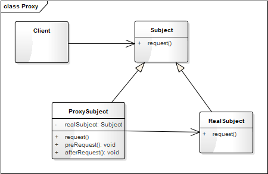

# 07 代理模式：帮我拿一下快递

【故事剧情】

> 八月中秋已过，冬天急速飞来……一场秋雨一场寒，十场秋雨穿上棉！在下了两场秋雨之后，Tony 已经冻的瑟瑟发抖了。周六，Tony 在京东上买了一双雪地鞋准备过冬了，但是忘了选择京东自营的货源，第二天穿新鞋的梦想又不能如期实现了。
>
> 周二，Tony 正在思考一个业务逻辑的实现方式，这时一通电话来了，“您好！圆通快递。您的东西到了，过来取一下快递！”。Tony 愣了一下，转念明白：是周六买的鞋子，本来以来第二天就能到的，所以填的是家里的地址。这下可好，人都不在家了，咋办呢？
>
> Tony 快速思索了一下，他想起了住一起的邻居 Wendy。Wendy 是一个小提琴老师，属于自由职业者，平时在艺术培训机构或到学生家里上上课，她在家的时间比较多。于是赶紧拿起手机呼叫 Wendy 帮忙：“你好，在家吗？能帮忙拿一下快速吗？”……
>
> 万幸的是 Wendy 正好在家，在她的帮助下终于顺利拿到快递，减了不少麻烦。


### 用程序来模拟生活

在生活中，我们经常要找人帮一些忙：帮忙收快递，帮忙照看宠物狗。在程序中，有一种类似的设计，叫代理模式。在开始之前，我们先来模拟一下上面的故事案例。

源码示例：

```python
class ReceiveParcel:
    "接收包裹"
    def __init__(self, name):
        self.__name = name
    def getName(self):
        return self.__name
    def receive(self, parcelContent):
        pass
class TonyReception(ReceiveParcel):
    "Tony接收"
    def __init__(self, name, phoneNum):
        super().__init__(name)
        self.__phoneNum = phoneNum
    def getPhoneNum(self):
        return self.__phoneNum
    def receive(self, parcelContent):
        print("货物主人：" + self.getName() + "， 手机号：" + self.getPhoneNum())
        print("接收到一个包裹，包裹内容：" + parcelContent)
class WendyReception(ReceiveParcel):
    "Wendy接收"
    def __init__(self, name, receiver):
        super().__init__(name)
        self.__receiver = receiver
    def receive(self, parcelContent):
        print("我是" + self.__receiver.getName() + "的朋友， 我来帮他代收快递！")
        if(self.__receiver is not None):
            self.__receiver.receive(parcelContent)
        print("代收人：" + self.getName())
```

测试代码：

```python
def testProxy():
    tony = TonyReception("Tony", "18512345678")
    wendy = WendyReception("Wendy", tony)
    wendy.receive("雪地靴")
```

输出结果：

```
我是Tony的朋友， 我来帮他代收快递！
货物主人：Tony， 手机号：18512345678
接收到一个包裹，包裹内容：雪地靴
代收人：Wendy
```

### 从剧情中思考代理模式

从上面的示例中我们可以发现，包裹实际上是 Tony 的，但是 Wendy 代替 Tony 的身份帮忙接收了包裹，Wendy 需要使用 Tony 的身份并获得快递员的验证（Tony 手机号）才能成功接收包裹。像这样，一个对象完成某项动作或任务，是通过对另一个对象的引用来完成，这种模式叫代理模式。

**代理模式（Proxy Pattern）** ：给某一个对象提供一个代理，并由代理对象控制对原对象的引用。代理模式的英文叫做 Proxy 或 Surrogate，它是一种对象结构型模式。

在某些情况下，一个客户不想或者不能直接引用一个对象，此时可以通过一个称之为“代理”的第三者来实现间接引用。如上面的示例中，Tony 因为不在家，所以不能亲自接收包裹，但他可以叫 Wendy 来代他接收，这里 Wendy 就是代理，她代理了 Tony 的身份去接收快递。

### 代理模式的模型抽象

#### 代码框架

代理模式有三个关键要素，它们分别是：

1. 主题（Subject）：定义“操作/活动/任务”的接口类。
1. 真实主题（RealSubject）：真正完成“操作/活动/任务”的具体类。
1. 代理主题（ProxySubject）：代替真实主题完成“操作/活动/任务”的代理类。

根据这三个要素，我们抽象出一个较为通用的代码框架。

```python
class Subject:
    "主题"
    def request(self):
        pass
class RealSubject(Subject):
    "代理主题"
    def request(self):
        print("RealSubject todo something...")
class ProxySubject(Subject):
    "代理主题"
    def __init__(self, subject):
        self.__realSubject = subject
    def request(self):
        self.preRequest()
        if(self.__realSubject is not None):
            self.__realSubject.request()
        self.afterRequest()
    def preRequest(self):
        print("preRequest")
    def afterRequest(self):
        print("afterRequest")
def client():
    "客户端调用类"
    realObj = RealSubject()
    proxyObj = ProxySubject(realObj)
    proxyObj.request()
```

#### 类图

上面的代码框架可用类图表示如下：



#### 基于框架的实现

上面的示例代码中，ReceiveParcel 其实就是 Subject，TonyReception 其实就是 RealSubject，WendyReception 其实就是 ProxySubject，而 receive 其实就是 request。

我们可以按上面的框架对 WendyReception 进行稍微的改动，如下：

```python
class WendyReception(ReceiveParcel):
    "Wendy接收"
    def __init__(self, name, receiver):
        super().__init__(name)
        self.__receiver = receiver
    def receive(self, parcelContent):
        self.preReceive()
        if(self.__receiver is not None):
            self.__receiver.receive(parcelContent)
        self.afterReceive()
    def preReceive(self):
        print("我是" + self.__receiver.getName() + "的朋友， 我来帮他代收快递！")
    def afterReceive(self):
        print("代收人：" + self.getName())
```

测试代码不用变。自己跑一下，会发现输出结果和之前的是一样的。

#### 模型说明

代理对象可以在客户端和目标对象之间起到中间调和的作用，并且可以通过代理对象隐藏不希望被客户端看到的内容和服务，或者添加客户需要的额外服务。

在实现生活中能找到非常的代理模式的模型：火车票/机票的代售点；银行支票在市场交易中用来代替现金，并提供对签发人账号上资金的控制；代表公司出席一些商务会议。

##### **代理模式的优点** 1.  代理模式能够协调调用者和被调用者，在一定程度上降低了系统的耦合度

2. 可以灵活地隐藏被代理对象的部分功能和服务，也增加额外的功能和服务。

##### **代理模式的缺点**

1. 由于在客户端和真实主题之间增加了代理对象，因此有些类型的代理模式可能会造成请求的处理速度变慢。
1. 实现代理模式需要额外的工作，有些代理模式的实现非常复杂。

### 应用场景

（1）不想或者不能直接引用一个对象时

如在移动端加载网页信息时，因为下载真实大图比较耗费流量和性能，可以用一个小图代替进行渲染（用一个代理对象去下载小图），在真正点击图片时，才去下载大图，显示大图效果。还有 HTML 中的占位符，其实也是代理的思想。

（2）想对一个对象的功能进行加强时

如在字体（Font）渲染时，对粗体（BoldFont）进行渲染时，可使用字体 Font 对象进行代理，只要在对 Font 进行渲染后，进行一步加粗的操作即可。

（3）各种特殊用途的代理：远程代理、虚拟代理、Copy-on-Write 代理、保护（Protect or Access）代理、Cache 代理、防火墙（Firewall）代理、同步化（Synchronization）代理、智能引用（Smart Reference）代理。这部分具体的运用可查阅相关[资料](https://design-patterns.readthedocs.io/zh_CN/latest/structural_patterns/proxy.html)。
