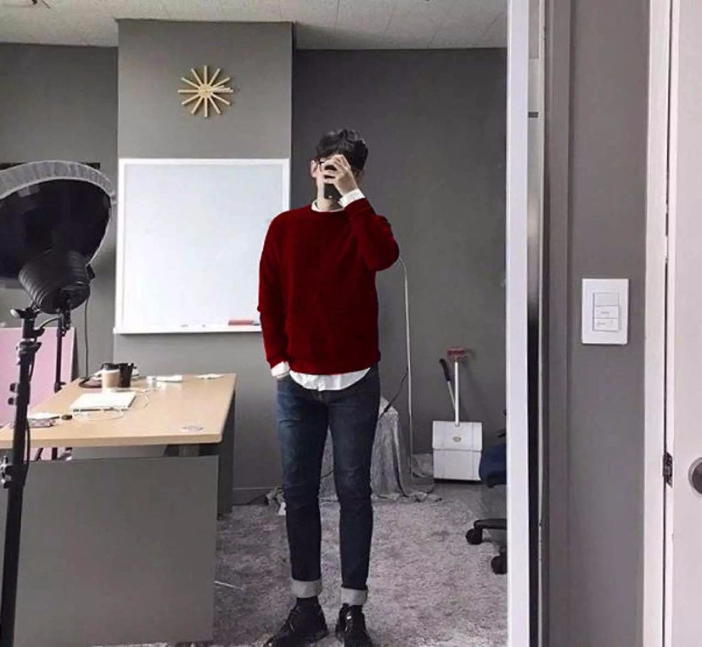
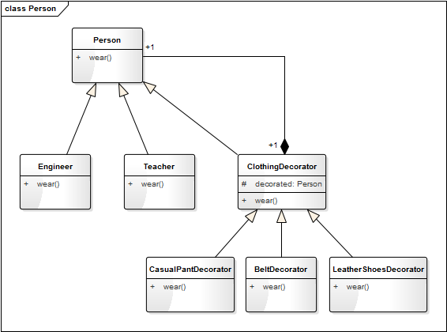
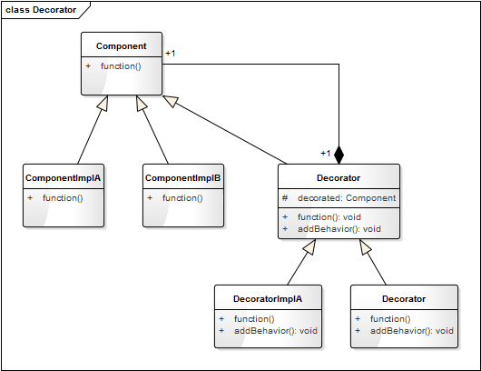

# 08 装饰模式：你想怎么穿就怎么穿

故事剧情

> 工作两年后，Tony 因为换工作而搬了一次家！这是一个4室1厅1卫1厨的户型，住了4户人家。恰巧这里住的都是年轻人，有男孩也有女孩，而 Tony 就是在这里遇上了自己喜欢的人，她叫 Jenny。Tony 和 Jenny 每天都低头不见抬头见，但 Tony 是一个程序猿，天生不善言辞、不懂着装，老被 Jenny 嫌弃：满脸猥琐，一副屌丝样！
>
> 被嫌弃后，Tony 痛定思痛：一定要改善一下自己的形象，摆脱屌丝样！于是叫上自己的死党 Henry 去了五彩城……
>
> Tony 在这个大商城中兜兜转转，被各个商家教化着该怎样搭配衣服：衬衫要套在腰带里面，风衣不要系纽扣，领子要立起来……
>
> 在反复试穿了一个晚上的衣服之后，终于找到一套还算凑合的行装：下面是一条卡其色休闲裤配一双深色休闲皮鞋，加一条银色针扣头的黑色腰带；上面是一件紫红色针织毛衣，内套一件白色衬衫；头上带一副方形黑框眼镜。整体行装虽不潮流，却透露出一种工作人士的成熟、稳健和大气！



（图片来自网络）

### 用程序来模拟生活

Tony 是一个程序员，给自己搭配了一套着装：一条卡其色休闲裤、一双深色休闲皮鞋、一条银色针扣头的黑色腰带、一件紫红色针织毛衣、一件白色衬衫、一副方形黑框眼镜。但类似的着装也可以穿在其他的人身上，比如一个老师也可以这样穿：一双深色休闲皮鞋、一件白色衬衫、一副方形黑框眼镜。

我们就用程序来模拟这样一个情景。

源码示例：

```python
class Person:
    "人"
    def __init__(self, name):
        self.__name = name
    def getName(self):
        return self.__name
    def wear(self):
        print("我的着装是：")
class Engineer(Person):
    "工程师"
    def __init__(self, name, skill):
        super().__init__(name)
        self.__skill = skill
    def getSkill(self):
        return self.__skill
    def wear(self):
        print("我是" + self.getSkill() + "工程师" + self.getName())
        super().wear()
class Teacher(Person):
    "教师"
    def __init__(self, name, title):
        super().__init__(name)
        self.__title = title
    def getTitle(self):
        return self.__title
    def wear(self):
        print("我是" + self.getName() + self.getTitle())
        super().wear()
class ClothingDecorator(Person):
    "服装装饰器"
    def __init__(self, person):
        self._decorated = person
    def wear(self):
        self._decorated.wear()
class CasualPantDecorator(ClothingDecorator):
    "休闲裤"
    def __init__(self, person):
        super().__init__(person)
    def wear(self):
        super().wear()
        print("一条卡其色休闲裤")
class BeltDecorator(ClothingDecorator):
    "腰带"
    def __init__(self, person):
        super().__init__(person)
    def wear(self):
        super().wear()
        print("一条银色针扣头的黑色腰带")
class LeatherShoesDecorator(ClothingDecorator):
    "皮鞋"
    def __init__(self, person):
        super().__init__(person)
    def wear(self):
        super().wear()
        print("一双深色休闲皮鞋")
class KnittedSweaterDecorator(ClothingDecorator):
    "针织毛衣"
    def __init__(self, person):
        super().__init__(person)
    def wear(self):
        super().wear()
        print("一件紫红色针织毛衣")
class WhiteShirtDecorator(ClothingDecorator):
    "白色衬衫"
    def __init__(self, person):
        super().__init__(person)
    def wear(self):
        super().wear()
        print("一件白色衬衫")
class GlassesDecorator(ClothingDecorator):
    "眼镜"
    def __init__(self, person):
        super().__init__(person)
    def wear(self):
        super().wear()
        print("一副方形黑框眼镜")
```

测试代码：

```python
def testDecorator():
    tony = Engineer("Tony", "客户端")
    pant = CasualPantDecorator(tony)
    belt = BeltDecorator(pant)
    shoes = LeatherShoesDecorator(belt)
    shirt = WhiteShirtDecorator(shoes)
    sweater = KnittedSweaterDecorator(shirt)
    glasses = GlassesDecorator(sweater)
    glasses.wear()
    print()
    decorateTeacher = GlassesDecorator(WhiteShirtDecorator(LeatherShoesDecorator(Teacher("wells", "教授"))))
    decorateTeacher.wear()
```

上面的测试代码中：

```plaintext
decorateTeacher = GlassesDecorator(WhiteShirtDecorator(LeatherShoesDecorator(Teacher("wells", "教授"))))
```

这个写法，大家不要觉得奇怪，它其实就是将多个对象的创建过程合在了一起，其实是一种优雅的写法（是不是少了好几行代码？）。创建的 Teacher 对象又通过参数传给 LeatherShoesDecorator 的构造函数，而创建的 LeatherShoesDecorator 对象又通过参数传给 WhiteShirtDecorator 的构造函数，以此类推……

输出结果：

```plaintext
我是客户端工程师Tony
我的着装是：
一条卡其色休闲裤
一条银色针扣头的黑色腰带
一双深色休闲皮鞋
一件白色衬衫
一件紫红色针织毛衣
一副方形黑框眼镜
我是wells教授
我的着装是：
一双深色休闲皮鞋
一件白色衬衫
一副方形黑框眼镜
```

### 从剧情中思考装饰模式

上面的示例中，Tony 为了改善自己的形象，整体换了个着装，改变了自己的气质，使自己看起来不再是那么猥琐的屌丝样。俗话说一个人帅不帅，得看三分长相七分打扮。同一个人，不一样的着装，给人一种完全不一样的感觉。我们可以任意搭配不同的衣服、围巾、裤子、鞋子、眼镜、帽子以达到不同的效果。不同的搭配，形成不同的风格，透露不同的气质。在这个追求个性与自由的时代，穿着的风格可谓是开放到了极致，真是你想怎么穿就怎么穿！如果你是去参加一个正式会议或演讲，可以穿一套标配西服；如果你是去大草原，想骑着骏马驰骋天地，便该穿上一套马服马裤马鞋；如果你是漫迷，去参加动漫节，亦可穿上 Cosplay 的衣服，让自己成为那个内心向往的主角；如果你是……

这样一个时时刻刻发现在我们生活中的着装问题，就是程序中装饰模式的典型样例。

#### 装饰模式

**装饰模式** （Decorator Pattern）：动态地给一个对象增加一些额外的职责（Responsibility），就增加对象功能来说，装饰模式比生成子类实现更为灵活。

就故事中这个示例来说，由结构庞大的子类继承关系转换成了结构紧凑的装饰关系：


继承关系：



装饰关系

#### 装饰模式的特点

1. **可灵活地给一个对象增加职责或拓展功能** 如上面的示例中，可任意地穿上自己想穿的衣服。不管穿上什么衣服，你还是那个你，但穿上不同的衣服你就会有不同的外表。

1. **可增加任意多个装饰** 你可以只穿一件衣服，也可以只穿一条裤子，也可以衣服和裤子各种搭配的穿，全随你意！

1. **装饰的顺序不同，可能产生不同的效果** 在上面的示例中，Tony 是针织毛衣穿在外面，白色衬衫穿在里面。当然，如果你愿意（或因为怕冷），也可以针织毛衣穿在里面，白色衬衫穿在外面。但两种着装穿出来的效果，给人的感觉肯定是完全不一样的，自己脑补一下，哈哈！

使用装饰模式的方式，想要改变装饰的顺序，也是非常简单的。只要把测试代码稍微改动一下即可，如下：

```python
def testDecorator2():
    tony = Engineer("Tony", "客户端")
    pant = CasualPantDecorator(tony)
    belt = BeltDecorator(pant)
    shoes = LeatherShoesDecorator(belt)
    sweater = KnittedSweaterDecorator(shoes)
    shirt = WhiteShirtDecorator(sweater)
    glasses = GlassesDecorator(shirt)
    glasses.wear()
```

结果如下：

```plaintext
我是客户端工程师Tony
我的着装是：
一条卡其色休闲裤
一条银色针扣头的黑色腰带
一双深色休闲皮鞋
一件紫红色针织毛衣
一件白色衬衫
一副方形黑框眼镜
```

### 装饰模式的模型抽象

#### 类图

通过上面的示例代码，我们知道了装饰模式的一个典型实现。我们再将其抽象成一个一般化的类图结构，如下：



上图中的 Component 是一个抽象类，代表具有某中功能（function）的组件，ComponentImplA 和 ComponentImplB 分别是其具体的实现子类。Decorator 是 Component 装饰器，里面有一个 Component 的对象 decorated，这就是被装饰的对象，装饰器可为被装饰对象添加额外的功能或行为（addBehavior）。DecoratorImplA 和 DecoratorImplB 分别是两个具体的装饰器（实现子类）。

这样一种模式很好地将装饰器与被装饰的对象进行解耦。

#### 模型说明 **装饰模式的优点：** 1.  使用装饰模式来实现扩展比继承更加灵活，它可以在不需要创造更多子类的情况下，将对象的功能加以扩展

2. 可以动态地给一个对象附加更多的功能。

1. 可以用不同的装饰器进行多重装饰，装饰的顺序不同，可能产生不同的效果。

1. 装饰类和被装饰类可以独立发展，不会相互耦合；装饰模式相当于是继承的一个替代模式。 **装饰模式的缺点：**

1. 与继承相比，用装饰的方式拓展功能更加容易出错，排错也更困难。对于多次装饰的对象，调试时寻找错误可能需要逐级排查，较为烦琐。

### 应用场景

1. 有大量独立的扩展，为支持每一种组合将产生大量的子类，使得子类数目呈爆炸性增长。
1. 需要动态地增加或撤销功能时。
1. 不能采用生成子类的方法进行扩充时，如类定义不能用于生成子类。

装饰模式的应用场景非常广泛。如在实际项目开发中经常看到的过滤器，便可用装饰模式的方式去实现。如果你是 Java 程序员，对 IO 中的 FilterInputStream 和 FilterOutputStream 一定不陌生，它的实现其实就是一个装饰模式。FilterInputStream(FilterOutputStream) 就是一个装饰器，而 InputStream(OutputStream) 就是被装饰的对象。

我们看一下创建对象过程：

```java
DataInputStream dataInputStream = new DataInputStream(new FileInputStream("C:/text.txt"));
DataOutputStream dataOutputStream = new DataOutputStream(new FileOutputStream("C:/text.txt"));
```

这个写法与上面 Demo 中的

```plaintext
decorateTeacher = GlassesDecorator(WhiteShirtDecorator(LeatherShoesDecorator(Teacher("wells", "教授"))))
```

是不是很相似？都是一个对象套一个对象的方式进行创建。

还有一个场景，如果你对图形图像处理有一定了解，就会知道对图像的处理其实就是对一个二维坐标像素数据的处理，如图像的灰度化、梯度化（锐化）、边缘化、二值化。这些操作顺序不同就会造成不同的效果，也是适合用装饰模式来进行封装。
