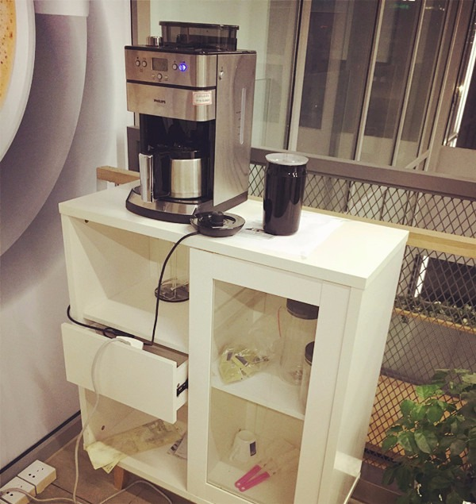
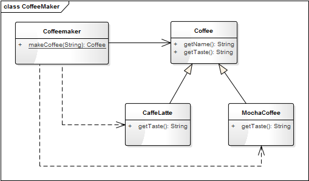
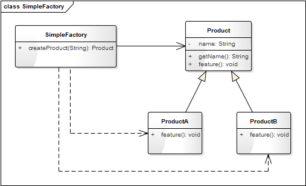
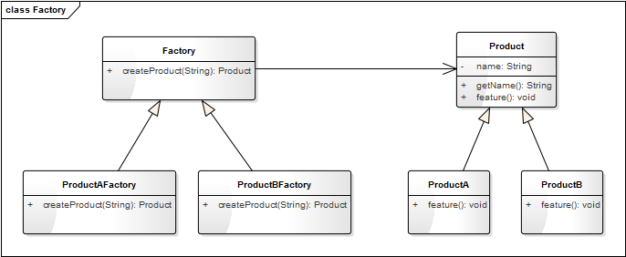
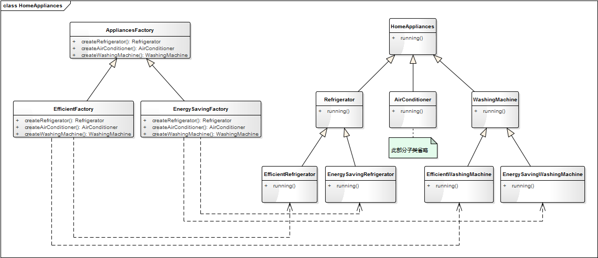
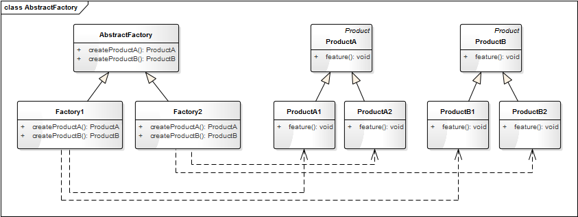

# 09 工厂模式：你要拿铁还是摩卡

【故事剧情】

> Tony 工作的公司终于有了自己的休息区！ 在这里大家可以看书、跑步、喝咖啡、玩体感游戏！开心工作，快乐生活！
>
> 现在要说的是休息区里的自制咖啡机，因为公司里有很多咖啡客，所以颇受欢迎！
>
> 咖啡机的使用也非常简单，咖啡机旁边有已经准备好的咖啡豆，想要喝咖啡，只要往咖啡机里加入少许的咖啡豆，然后选择杯数和浓度，再按一下开关，10分钟后，带着浓香味的咖啡就为你准备好了！当然，如果你想喝一些其他口味的咖啡，也可以自备咖啡豆，无论你是要拿铁还是摩卡，这些都还是问题。那问题来了，你是拿铁还是摩卡呢？



### 用程序来模拟生活

有人可能会说了：不就是一个咖啡机吗，有什么好炫耀的！非也非也，我只是要告诉你如何从生活的每一件小事中领悟设计模式，因为这里又隐藏了一个模式，你猜到了吗？我们还是先用程序来模拟一个上面的场景吧！

源码示例：

```python
class Coffee:
    "咖啡"
    def __init__(self, name):
        self.__name = name
    def getName(self):
        return self.__name
    def getTaste(self):
        pass
class CaffeLatte(Coffee):
    "拿铁咖啡"
    def __init__(self, name):
        super().__init__(name)
    def getTaste(self):
        return "轻柔而香醇。"
class MochaCoffee(Coffee):
    "摩卡咖啡"
    def __init__(self, name):
        super().__init__(name)
    def getTaste(self):
        return "丝滑与醇厚。"
class Coffeemaker:
    "咖啡机"
    @staticmethod
    def makeCoffee(coffeeBean):
        coffee = None
        if(coffeeBean == "拿铁风味咖啡豆"):
            coffee = CaffeLatte("拿铁咖啡")
        elif(coffeeBean == "摩卡风味咖啡豆"):
            coffee = MochaCoffee("摩卡咖啡")
        else:
            coffee = Coffee()
        return coffee
```

测试代码：

```python
def testCoffeeMaker():
    latte = Coffeemaker.makeCoffee("拿铁风味咖啡豆")
    print(latte.getName(), "已为您准备好了，口感：" + latte.getTaste() + "请慢慢享用！")
    mocha = Coffeemaker.makeCoffee("摩卡风味咖啡豆")
    print(mocha.getName(), "已为您准备好了，口感：" + mocha.getTaste() + "请慢慢享用！")
```

输出结果：

```
拿铁咖啡 已为您准备好了，口感：轻柔而香醇。请慢慢享用！
摩卡咖啡 已为您准备好了，口感：丝滑与醇厚。请慢慢享用！
```

### 从剧情中思考工厂模式

在上面的示例中，我们可以通过咖啡机制作咖啡，加入不同的咖啡豆就产生不同口味的咖啡。就如同一个工厂一样，我们加入不同的配料，则会产出不同的产品，这就是程序设计中 **工厂模式** 的概念。

专门定义一个类来负责创建其他类的实例，根据参数的不同创建不同类的实例，被创建的实例通常都具有共同的父类。这个模式叫 **简单工厂模式** （Simple Factory Pattern），又称为静态工厂方法模式（之所以叫静态，是因为在各种面向对象的计算机语言中通常被定义成一个静态（static）方法，这样便可通过类名直接调用，工厂方法模式见下面的拓展内容）。用来创建对象的类叫工厂类，比如上面示例中 CoffeeMaker 就是工厂类。上面示例的类图关系如下：



### 工厂模式的模型抽象

#### 类图

简单工厂模式是一个非常简单的模式，其类图关系表示如下：



#### 模型说明

简单工厂模式对创建过程抽象出单独的一个类，将对象的创建和对象的使用过程进行分离，降低了系统的耦合度，使得两者修改起来都相对容易。

在应用简单工厂模式的程序时要注意以下几点：

1. 产品具有明显的继承关系，且产品的类型不宜太多。
1. 所有的产品具有相同的方法和类似的功能，这样使用者就可以只关注产品的抽象类有哪些方法，而不用对具体的类型进行向下转型。

##### **简单工厂的优点**1.  抽象出一个专门的类来负责某类对象的创建，分割出创建的职责，不能直接去创建具体的对象，只要传入适当的参数即可

2. 使用者可以不用关注具体对象的类名称，只知道传入什么参数可以创建哪些需要的对象。

##### **简单工厂的缺点**1.  不易拓展，一旦添加新的产品类型，就不得不修改工厂的创建逻辑

2. 产品类型较多时，工厂的创建逻辑可能过于复杂，一但出错可能造成所以产品的创建失败，不利于系统的维护。

#### 模型的拓展应用

基于经典的简单工厂模式之上，我们也可以对它进行一此延伸和拓展。一般的简单工厂模式中我们可以创建任意多个对象，但在一些特定场景下，我们可能希望每一个具体的类型只能创建一个对象，这就需要对工厂类的实现方式做一修改。

比如在众多的在线教育产品和视频教学产品中都会有一个白板的功能（用电子白板来模拟线下的黑板功能），白板功能中会需要不同类型的画笔，比如直线、矩形、椭圆等，但在一个白板中我们只需要一个画笔。这就可通过对简单工厂模式进行一些修改以符合这种需求。具体的实现代码如下：

源码示例：

```
from abc import ABCMeta, abstractmethod
# 引入 ABCMeta 和 abstractmethod 来定义抽象类和抽象方法
from enum import Enum
# Python3.4 之后支持枚举 Enum 的语法
class PenType(Enum):
    """画笔类型"""
    PenTypeLine = 1
    PenTypeRect = 2
    PenTypeEllipse = 3
class Pen(metaclass=ABCMeta):
    """画笔"""
    def __init__(self, name):
        self.__name = name
    @abstractmethod
    def getType(self):
        pass
    def getName(self):
        return self.__name
class LinePen(Pen):
    """直线画笔"""
    def __init__(self, name):
        super().__init__(name)
    def getType(self):
        return PenType.PenTypeLine
class RectanglePen(Pen):
    """矩形画笔"""
    def __init__(self, name):
        super().__init__(name)
    def getType(self):
        return PenType.PenTypeRect
class EllipsePen(Pen):
    """椭圆画笔"""
    def __init__(self, name):
        super().__init__(name)
    def getType(self):
        return PenType.PenTypeEllipse
class PenFactory:
    """画笔工厂类"""
    def __init__(self):
        "定义一个字典(key:PenType，value：Pen)来存放对象,确保每一个类型只会有一个对象"
        self.__pens = {}
    def getSingleObj(self, penType, name):
        """获得唯一实例的对象"""
    def createPen(self, penType):
        """创建画笔"""
        if (self.__pens.get(penType) is None):
            # 如果该对象不存在，则创建一个对象并存到字典中
            if penType == PenType.PenTypeLine:
                pen = LinePen("直线画笔")
            elif penType == PenType.PenTypeRect:
                pen = RectanglePen("矩形画笔")
            elif penType == PenType.PenTypeEllipse:
                pen = EllipsePen("椭圆画笔")
            else:
                pen = Pen("")
            self.__pens[penType] = pen
        # 否则直接返回字典中的对象
        return self.__pens[penType]
```

测试代码：

```python
def testPenFactory():
    factory = PenFactory()
    linePen = factory.createPen(PenType.PenTypeLine)
    print("创建了 %s，对象id：%s， 类型：%s" % (linePen.getName(), id(linePen), linePen.getType()) )
    rectPen = factory.createPen(PenType.PenTypeRect)
    print("创建了 %s，对象id：%s， 类型：%s" % (rectPen.getName(), id(rectPen), rectPen.getType()) )
    rectPen2 = factory.createPen(PenType.PenTypeRect)
    print("创建了 %s，对象id：%s， 类型：%s" % (rectPen2.getName(), id(rectPen2), rectPen2.getType()) )
    ellipsePen = factory.createPen(PenType.PenTypeEllipse)
    print("创建了 %s，对象id：%s， 类型：%s" % (ellipsePen.getName(), id(ellipsePen), ellipsePen.getType()) )
```

输出结果

```
创建了 直线画笔，对象id：61077872， 类型：PenType.PenTypeLine
创建了 矩形画笔，对象id：61077936， 类型：PenType.PenTypeRect
创建了 矩形画笔，对象id：61077936， 类型：PenType.PenTypeRect
创建了 椭圆画笔，对象id：61077904， 类型：PenType.PenTypeEllipse
```

看到了吗？在上面的 Demo 中，我们 Create 了两次矩形画笔的对象 rectPen 和 rectPen2，但这两个变量指向的是同一个对象，因为对象的 ID 是一样的，说明通过这种方式我们实现了每一个类型只创建一个对象。

### 应用场景

1. 产品具有明显的继承关系，且产品的类型不宜太多。
1. 所以的产品具有相同的方法和类似的属性，使用者不关心具体的类型，只希望传入合适的参数能返回合适的对象。

### 【拓展】工厂三姐妹

谈到工厂模式就不得不提及它的三朵姐妹花：简单工厂模式（小妹妹）、工厂方法模式（妹妹）、抽象工厂模式（姐姐）。这三种模式可以理解为同一种编程思想下的三个版本，从简单到高级不断升级。上面通篇所谈的其实就是我们最简单的一个版本——简单工厂模式。工厂方法是简单工厂的升级，抽象工厂又是工厂方法的升级。它们之间的区别和联系如下。

#### 简单工厂模式

这是最简单的一个版本，只有一个工厂类 SimpleFactory，类中有一个静态创的建方法 createProduct，该方法通过参数传递的类型值（type）或名称（name）来创建具体的产品（子类）对象。

类图如下：

**优点：**

- 实现简单、结构浅析

**缺点：**

- 如果产品的种类非常多，createProduct 方法会变得非常庞大，switch … case …（或 if … else …）的判断会变得非常多。
- 不符合 **开放—封闭原则** （对拓展开放，对修改封闭），如果要增加或删除一个产品种类，就要修改 switch … case …（或 if … else …）的判断代码。

尽管简单工厂模式不符合开放—封闭原则，但因为它简单，你仍然能在很多项目中看到它。

#### 工厂方法模式

工厂方法模式是简单工厂模式的一个升级版本，为解决简单工厂模式中不符合开放-封闭原则的问题，我们对 SimpleFactory 进行了一个拆分，抽象出一个父类 Factory，并增加多个子类分别负责创建不同的具体产品。

类图如下：



**优点：**

- 解决了简单工厂模式中不符合 开放—封闭原则 的问题，使程序更容易拓展。
- 实现简单

因为工厂方法模式简单且易于拓展，因此在项目中应用的非常广泛，在很多标准库和开源项目中都能看到他的影子。

**缺点：**

- 对于有多种分类的产品，或具有二级分类的产品，工厂方法模式并不适用。

> **多种分类：**如我们有一个电子白板白板程序，可以绘制各种图形。那么画笔的绘制功能可以理解为是一个工厂，而图形可以理解为一种产品；图形可以根据形状分为直线、矩形、椭圆等，也可以根据颜色分为红色图形、绿色图形、蓝色图形等。
>
> **二级分类：**如一个家电工厂，它可能同时生产冰箱、空调和洗衣机，那么冰箱、空调、洗衣机属于一级分类；而洗衣机又可能分为高效型的和节能型的，那么高效型洗衣机和节能型洗衣机就属于二级分类。

#### 抽象工厂模式

抽象工厂模式又是工厂方法模式的升级版本，工厂方法模式不能解决具有二级分类的产品的创建，抽象工厂模式就是用来解决这一缺陷的。

我们来看一下上面的家电工厂的实现类图如下：



AppliancesFactory 是一个抽象的工厂类，定义了三个方法，分别用来生产冰箱（Refrigerator）、空调（Air-conditioner）、洗衣机（WashingMachine）。EfficientFactory 和 EnergySavingFactory 是两个具体的工厂类，分别用来生产高效型的家电和节能弄的家电。

抽象工厂模式的类图：



抽象工厂模式适合于有多个系列的产品，且每一个系列下有相同子分类的产品。我们定义一个抽象的工厂类 AbstractFactory，AbstractFactory 中定义生产每一个系列产品的方法；而两个具体的工厂实现类 Factory1 和 Factory2 分别生产子分类1的每一系列产品和子分类2的每一系列产品。

如上面家电的例子中，有冰箱、空调、洗衣机三个系列的产品，而每一个系列都有相同的子分类高效型和节能型。通过抽象工厂模式的类图，我们知道 Refrigerator、AirConditioner、WashingMachine 其实也可以不用继承自 HomeAppliances，因为可以把它们看成是独立的系列。当然真实项目中要根据实际应用场景而定，如果这三种家电有很多相同的属性，可以抽象出一个父类 HomeAppliances，如果差别很大则没有必要。**优点：**

- 解决了具有二级分类的产品的创建。

**缺点：**

- 如果产品的分类超过二级，如三级甚至更多的级，抽象工厂模式将会变得非常臃肿。
- 不能解决产品有多种分类多种组合的问题。

##### **进一步思考 **** 如果产品出现三级甚至更多级的分类怎么办？ **如果你的程序中出现了三级分类的对象，就需要重新审视一下你的设计，看一下有些类是不可以进行归纳、抽象合并的。如果实际的应用场景确实就是有三级甚至更多的分类怎么办？那就建议你不要使用工厂模式了，直接交给每一个具体的产品类自己去创建吧！因为超过三级（含三级）以上的分类，你的工厂类也会变得非常臃肿而难以维护；开发成本也会急巨增加。模式是死的，人是活的，不要为了使用设计模式而进行设计模式！** 如果产品有多种分类多种组合怎么办？**

如果产品有多种分类，就不能单独使用工厂模式了，需要结合其他的设计模式进行优化。如上面提到的白板程序，可以结合中介模式和工厂方法模式进行实现，具体内容请参考“模式大结合——工厂方法+中介”内容。
