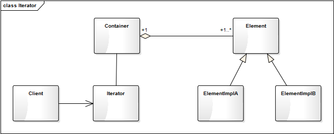
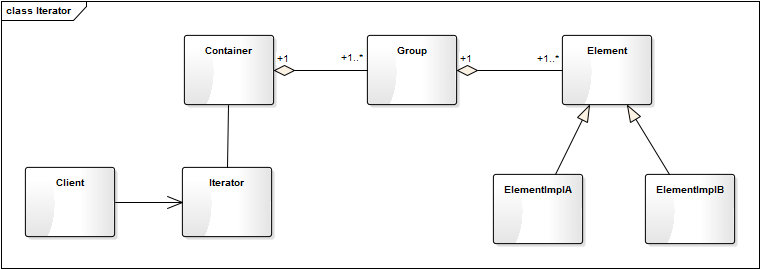

# 10 迭代模式：下一个就是你了

【故事剧情】

> Tony 自小就有两颗大牙缺失、腐化，因为父母对牙齿健康的意识太缺失，一直没有治疗过。最近因为上火严重，牙齿更加疼痛，刷牙时水温稍微过低或过高都难耐无比，于是决定自己去医院看牙。
>
> 周末，Tony 带着医保卡来到空军总医院，这是 Tony 第一次走进北京这种大城市的医院。一楼大厅已经挤满了人，人数多的超过了他的想象。咨询完分诊台，花了近1个小时才排队挂上号：7楼牙科，序号0214，前面还有46人。Tony 坐电梯上了7楼，找到了对应的分诊室的位置，诊室外面等候区的座位已经坐满了人。
>
> 这里每一个诊室的医生诊断完一个病人之后，会呼叫下一位病人，这时外面的显示屏和语音系统就会自动播报下一位病人的名字。Tony 无聊地看着显示屏，下一位病人0170 Panda，请进入3号分诊室准备就诊；下一位病人0171 Lily……
>
> 因为人太多，等到12点前面仍然还有12个人，Tony 不得不下去吃个中饭，回来继续等。下一位病人0213 Nick，请进入3号分诊室准备就诊！Tony 眼睛一亮，\*\*哎，妈呀！终于快到了，下一个就是我了！\*\*看了一个时间，正好14:00……


### 用程序来模拟生活

医院使用排号系统来维持秩序，方便医生和病人。虽然仍然需要排队，且等待是一件非常烦人的事情，但如果没有排号系统，大家都挤在诊室门口将会是更可怕的一件事！这个排号系统就像是病人队伍的大管家，通过数字化的方式精确地维护着先来先就诊的秩序。下面我们用程序来模拟这一场景。

源码示例：

```python
class Customer:
    "客户"
    def __init__(self, name):
        self.__name = name
        self.__num = 0
        self.__clinics = None
    def getName(self):
        return self.__name
    def register(self, system):
        system.pushCustomer(self)
    def setNum(self, num):
        self.__num = num
    def getNum(self):
        return self.__num
    def setClinic(self, clinic):
        self.__clinics = clinic
    def getClinic(self):
        return self.__clinics
class Iterator:
    "迭代器"
    def __init__(self, data):
        self.__data = data
        self.__curIdx = -1
    def current(self):
        return self.__data[self.__curIdx] if(len(self.__data) >= self.__curIdx) else None
    def next(self):
        if (self.__curIdx < len(self.__data) - 1):
            self.__curIdx += 1
            return True
        else:
            return False
class NumeralSystem:
    "排号系统"
    __clinics = ("1号分诊室", "2号分诊室", "3号分诊室")
    def __init__(self, name):
        self.__customers = []
        self.__curNum = 0
        self.__name = name
    def pushCustomer(self, customer):
        customer.setNum(self.__curNum + 1)
        click = NumeralSystem.__clinics[self.__curNum % len(NumeralSystem.__clinics)]
        customer.setClinic(click)
        self.__curNum += 1
        self.__customers.append(customer)
        print(customer.getName() + "您好！您已在" + self.__name+ "成功挂号，序号："
              + str(customer.getNum()).zfill(4) + "，请耐心等待！")
    def getIterator(self):
        return Iterator(self.__customers)
```

测试代码：

```python
def testIterator():
    numeralSystem = NumeralSystem("挂号台")
    lily = Customer("Lily")
    lily.register(numeralSystem);
    pony = Customer("Pony")
    pony.register(numeralSystem)
    nick = Customer("Nick")
    nick.register(numeralSystem)
    tony = Customer("Tony")
    tony.register(numeralSystem)
    iterator = numeralSystem.getIterator()
    while(iterator.next()):
        customer = iterator.current()
        print("下一位病人", str(customer.getNum()).zfill(4), customer.getName(), "请到", customer.getClinic(),  "就诊。")
```

输出结果：

```
Lily您好！您已在挂号台成功挂号，序号：0001，请耐心等待！
Pony您好！您已在挂号台成功挂号，序号：0002，请耐心等待！
Nick您好！您已在挂号台成功挂号，序号：0003，请耐心等待！
Tony您好！您已在挂号台成功挂号，序号：0004，请耐心等待！
下一位病人 0001 Lily 请到 1号分诊室 就诊。
下一位病人 0002 Pony 请到 2号分诊室 就诊。
下一位病人 0003 Nick 请到 3号分诊室 就诊。
下一位病人 0004 Tony 请到 1号分诊室 就诊。
```

### 从剧情中思考迭代器模式

医院的排号系统就像是病人队伍的大管家，通过数字化的方式精确地维护着先来先就诊的秩序。医生不用在乎外面有多少人在等待，更不需要了解每一个人的名字和具体信息。他只要在诊断完一个病人后按一下按钮，排号系统就会自动为他呼叫下一位病人，这样医生就可只专注于病情的诊断！

这个排号系统就如同程序设计中的 **迭代器模式** ：提供一种方法访问一个容器（container）对象中各个元素，而又不需暴露该对象的内部细节。迭代器（Iterator）是按照一定的顺序对一个或多个容器中的元素从前往遍历的一种机制，比如 for 循环就是一种最简单的迭代器，对一个数组的遍历也是一种迭代遍历的过程。

有人可能会认为上面的实现反而复杂化了，直接一个 for 循环就能遍历所有的病人：

```python
    def visit(self):
        for customer in self.__customers:
            print("下一位病人", str(customer.getNum()).zfill(4), customer.getName(),
                  "请到", customer.getClinic(), "就诊。")
```

是的，一开始我也思考过这个问题。因为 Python 本身对迭代器的支持非常好，Python 的很多内置对象本身就是可遍历的（iterable），如 List、Tuple、Dictionary 都是可以遍历的。自定义的容器类，只要实现 `\__iter\__`和`\__next\__` 两个方法也可以支持 for … in … 的方式进行遍历。

这里还是要以这种方式来实现，主要有两个原因：

1. for … in … 的方式不能实现医生诊断完一个病人后，呼叫下一个（next）病人的功能。
1. 这里讲的迭代器模式是一个一般化的方法，其他的编程语言对迭代器的支持可能并没有这么好。通过这一 Demo 的实现，有助于你更进一步地理解 Python 的 iterable 机制。

### 迭代器模式的模型抽象

#### 迭代器的设计思路

迭代器其实就是维护一个当前的指针，这个指针可以指向当前的元素，可以返回当前所指向的元素，可以移到下一个元素的位置，通过这个指针可以遍历容器的所有元素。迭代器一般至少会有以下两种方法：

- current(); // 获得当前所指向的元素
- next(); // 移至下一个元素


这是最基本的两个方法，有了这两个方法，就可以从前往后地遍历各个元素。我们也可以增加一些更加丰富的方法，比如实现从后往前遍历。一些更为丰富的迭代器功能：

- toBegin() // 将指针移至起始位置
- toEnd() // 将指针移至结尾位置
- next() // 往后（下一个）移动一个元素
- previous() // 往前（上一个）移动一个元素
- current() // 获取当前的元素

这样可以同时实现往前遍历和往后遍历。


#### 基于设计思路的实现

在理解了迭代器的设计思路之后，我们可以为上面示例代码中的迭代器增加一些更丰富的功能，以实现从后往前的遍历。

功能更丰富的迭代器：

```python
class Iterator:
    "迭代器"
    def __init__(self, data):
        self.__data = data
        self.toBegin()
    def toBegin(self):
        "将指针移至起始位置"
        self.__curIdx = -1
    def toEnd(self):
        "将指针移至结尾位置"
        self.__curIdx = len(self.__data)
    def next(self):
        "往前移动一个元素"
        if (self.__curIdx < len(self.__data) - 1):
            self.__curIdx += 1
            return True
        else:
            return False
    def previous(self):
        "往后移动一个元素"
        if (self.__curIdx > 0):
            self.__curIdx -= 1
            return True
        else:
            return False
    def current(self):
        "获取当前的元素"
        return self.__data[self.__curIdx] if (len(self.__data) >= self.__curIdx) else None
```

测试代码：

```python
def testIterator():
    numeralSystem = NumeralSystem("挂号台")
    lily = Customer("Lily")
    lily.register(numeralSystem);
    pony = Customer("Pony")
    pony.register(numeralSystem)
    nick = Customer("Nick")
    nick.register(numeralSystem)
    tony = Customer("Tony")
    tony.register(numeralSystem)
    print()
    print("从前往后遍历:")
    iterator = numeralSystem.getIterator()
    while(iterator.next()):
        customer = iterator.current()
        print("下一位病人", str(customer.getNum()).zfill(4), customer.getName(), "请到", customer.getClinic(),  "就诊。")
    print("从后往前遍历:")
    iterator.toEnd()
    while (iterator.previous()):
        customer = iterator.current()
        print("下一位病人", str(customer.getNum()).zfill(4), customer.getName(), "请到", customer.getClinic(), "就诊。")
```

输出结果：

```
Lily您好！您已在挂号台成功挂号，序号：0001，请耐心等待！
Pony您好！您已在挂号台成功挂号，序号：0002，请耐心等待！
Nick您好！您已在挂号台成功挂号，序号：0003，请耐心等待！
Tony您好！您已在挂号台成功挂号，序号：0004，请耐心等待！
从前往后遍历:
下一位病人 0001 Lily 请到 1号分诊室 就诊。
下一位病人 0002 Pony 请到 2号分诊室 就诊。
下一位病人 0003 Nick 请到 3号分诊室 就诊。
下一位病人 0004 Tony 请到 1号分诊室 就诊。
从后往前遍历:
下一位病人 0004 Tony 请到 1号分诊室 就诊。
下一位病人 0003 Nick 请到 3号分诊室 就诊。
下一位病人 0002 Pony 请到 2号分诊室 就诊。
下一位病人 0001 Lily 请到 1号分诊室 就诊。
```

说明：在这里从后往前遍历本身是没有意义的（医院不可能后来先就诊），只是为了说明迭代器这一功能的实现方式。

#### 类图

一个迭代器一般对应着一个容器类，而一个容器会包含多个元素，这些元素可能会有不同的子类。他们的关系可表示成如下：



在实际的项目开发中有可能会有遇到一些更复杂的逻辑。如具有层级关系的组织架构：一个公司有 A、B、C 三个部门，每个部门有自己的部门成员，这时要遍历一个公司的所有成员。这里就会有类似这样的类图关系：



这里公司就对应 Container，部门就对应 Group。我们并不遍历 Group，而是按照一定的顺序遍历 Group 的每一个成员，一个 Group 遍历完后，再遍历下一个 Group。这样使用者只需要调用迭代 next() 方法就可以遍历所有的成员，而不用关注内部的组织架构。

#### 模型说明

##### **迭代器模式的优点**1.  迭代器模式将存储数据和遍历数据的职责分离

2. 简化了聚合数据的访问方式。
1. 可支持多种不同的方式（如顺序和逆序）遍历一个聚合对象。

##### **迭代器模式的缺点**

需要额外增加迭代器的功能实现，增加新的聚合类时，可能需要增加新的迭代器。

### 应用场景

1. 集合的内部结构复杂，不想暴露对象的内部细节，只提供精简的访问方式。
1. 需要提供统一的访问接口，从而对不同的集合使用同一的算法。
1. 需要为一系列聚合对象提供多种不同的访问方式。
