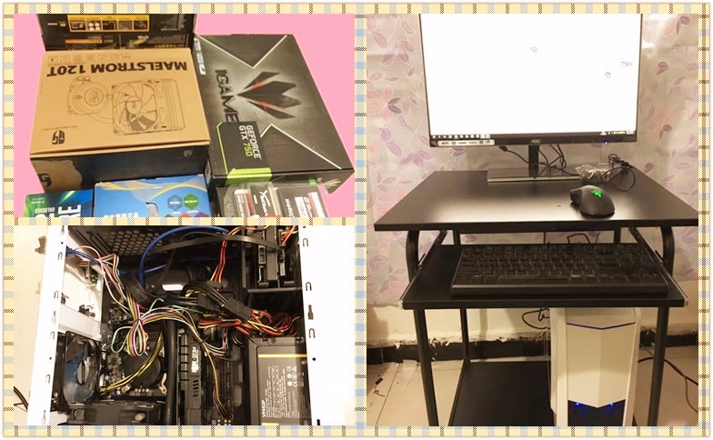
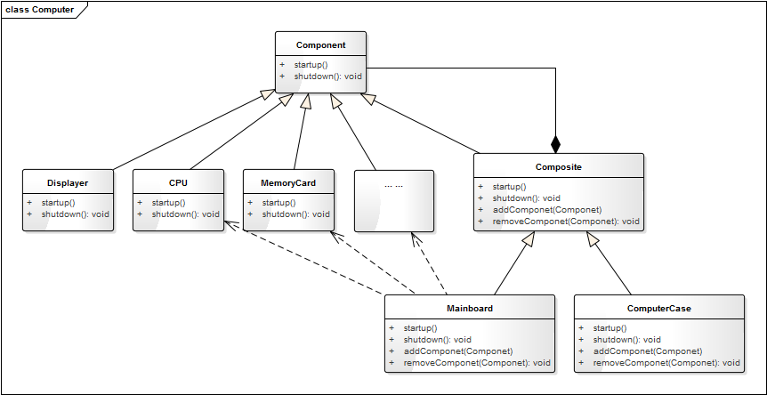
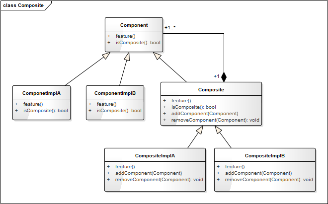
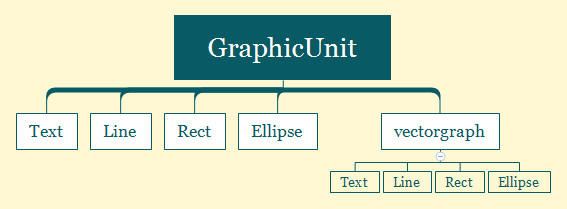

# 11 组合模式：自己组装电脑

【故事剧情】

> Tony 用的笔记本电脑还是大学时候买的，到现在已经用了5年，虽然后面加过一次内存，也换过一次硬盘，但仍然跟不上 Tony 对性能的要求，改变不了它被淘汰的命运，是时候该换一台新的电脑了……
>
> 换什么电脑呢？MacBook，ThinkPad，还是台式机？经过几番思考之后，Tony 还是决定买台式机，因为作为软件开发，台式机性能会更高，编译程序也会更快。确定台式机后，一个新的问题又来了，是买一个整机呢，还是自己组装呢？在反复纠结两天之后，Tony 还是决定自己亲自动手组装。一来自己也了解一些硬件知识，正好趁这次机会对自己的知识做一个检验和实践；二来自己组装能便宜一大笔钱！
>
> 于是 Tony 在京东上浏览了各个配件，花了一个星期进行精心挑选（这可真是一个精细的活，需要考虑各种型号的性能，还要考虑不同硬件之间的兼容性，还需知道各个配件的尺寸确保能正常放进机箱，因为选的是小机箱），终于确定了各个子配件：
>
> GIGABYTE Z170M M-ATX 的主板、Intel Core i5-6600K 的 CPU、Kingston Fury DDR4 的内存、Kingston V300 的 SSD 硬盘、Colorful iGame750 的显卡、DEEPCOOL 120T 水冷风扇、Antec VP 450P 的电源、AOC LV243XIP 的显示器、SAMA MATX 小板机箱……
>
> 周末，Tony 花了一天的时间才把这些配件组装成一个完整的整机。一次点亮，Tony 成就感十足！与购买相同性能的整机相比，不仅价格减了三成，而且加深了对各个硬件的了解。



### 用程序来模拟生活

只要你对硬件稍微有一些了解，或者打开过机箱换过组件，一定知道 CPU、内存、显卡是插在主板上的，而硬盘也是连在主板上的，在机箱的后面有一排的插口，可以连接鼠标、键盘、耳麦、摄像头等外接配件，而显示器需要单独插电源才能工作。我们可以用代码来模拟台式电脑的组成，这里假设每一个组件都有开始工作和结束工作两个功能，还可以显示自己的信息和组成结构。

源码示例：

```python
class Component:

    "组件，所有子配件的基类"
    def __init__(self, name):

        self._name = name
    def showInfo(self, indent = ""):

        pass
    def isComposite(self):

        return False
    def startup(self, indent = ""):

        print(indent + self._name + " 准备开始工作...")
    def shutdown(self, indent = ""):

        print(indent + self._name + " 即将结束工作...")
class CPU(Component):

    "中央处理器"
    def __init__(self, name):

        super().__init__(name)
    def showInfo(self, indent):

        print(indent, end="")

        print("CPU:" + self._name + ",可以进行高速计算。")
class MemoryCard(Component):

    "内存条"
    def __init__(self, name):

        super().__init__(name)
    def showInfo(self, indent):

        print(indent, end="")

        print("内存:" + self._name + ",可以缓存数据，读写速度快。")
class HardDisk(Component):

    "硬盘"
    def __init__(self, name):

        super().__init__(name)
    def showInfo(self, indent):

        print(indent, end="")

        print("硬盘:" + self._name + ",可以永久存储数据，容量大。")
class GraphicsCard(Component):

    "显卡"
    def __init__(self, name):

        super().__init__(name)
    def showInfo(self, indent):

        print(indent, end="")

        print("显卡:" + self._name + ",可以高速计算和处理图形图像。")
class Battery(Component):

    "电源"
    def __init__(self, name):

        super().__init__(name)
    def showInfo(self, indent):

        print(indent, end="")

        print("电源:" + self._name + ",可以持续给主板和外接配件供电。")
class Fan(Component):

    "风扇"
    def __init__(self, name):

        super().__init__(name)
    def showInfo(self, indent):

        print(indent, end="")

        print("风扇:" + self._name + "，辅助CPU散热。")
class Displayer(Component):

    "显示器"
    def __init__(self, name):

        super().__init__(name)
    def showInfo(self, indent):

        print(indent, end="")

        print("显示器:" + self._name + "，负责内容的显示。")
class Composite(Component):

    "配件组合器"
    def __init__(self, name):

        super().__init__(name)

        self._components = []
    def showInfo(self, indent):

        print(self._name + ",由以下部件组成:")

        indent += "\t"

        for element in self._components:

            element.showInfo(indent)
    def isComposite(self):

        return True
    def addComponent(self, component):

        self._components.append(component)
    def removeComponent(self, component):

        self._components.remove(component)
    def startup(self, indent):

        super().startup(indent)

        indent += "\t"

        for element in self._components:

            element.startup(indent)
    def shutdown(self, indent):

        super().startup(indent)

        indent += "\t"

        for element in self._components:

            element.shutdown(indent)
class Mainboard(Composite):

    "主板"
    def __init__(self, name):

        super().__init__(name)
    def showInfo(self, indent):

        print(indent + "主板:", end="")

        super().showInfo(indent)
class ComputerCase(Composite):

    "机箱"
    def __init__(self, name):

        super().__init__(name)
    def showInfo(self, indent):

        print(indent + "机箱:", end="")

        super().showInfo(indent)
class Computer(Composite):

    "电脑"
    def __init__(self, name):

        super().__init__(name)
    def showInfo(self, indent):

        print(indent + "电脑:", end="")

        super().showInfo(indent)
```

测试代码：

```python
def testComputer():

    cpu = CPU("Intel Core i5-6600K")

    memoryCard = MemoryCard("Kingston Fury DDR4")

    hardDisk = HardDisk("Kingston V300 ")

    graphicsCard = GraphicsCard("Colorful iGame750")

    mainBoard = Mainboard("GIGABYTE Z170M M-ATX")

    mainBoard.addComponent(cpu)

    mainBoard.addComponent(memoryCard)

    mainBoard.addComponent(hardDisk)

    mainBoard.addComponent(graphicsCard)
    battery = Battery("Antec VP 450P")

    fan = Fan("DEEPCOOL 120T")

    computerCase = ComputerCase("SAMA MATX")

    computerCase.addComponent(battery)

    computerCase.addComponent(mainBoard)

    computerCase.addComponent(fan)
    displayer = Displayer("AOC LV243XIP")
    computer = Computer("Tony DIY电脑")

    computer.addComponent(displayer)

    computer.addComponent(computerCase)
    computer.showInfo("")

    print("\n开机过程:")

    computer.startup("")

    print("\n关机过程:")

    computer.shutdown("")
```

输出结果：

```
电脑:Tony DIY电脑,由以下部件组成:

    显示器:AOC LV243XIP，负责内容的显示。

    机箱:SAMA MATX,由以下部件组成:

        电源:Antec VP 450P,可以持续给主板和外接配件供电。

        主板:GIGABYTE Z170M M-ATX,由以下部件组成:

            CPU:Intel Core i5-6600K,可以进行高速计算。

            内存:Kingston Fury DDR4,可以缓存数据，读写速度快。

            硬盘:Kingston V300 ,可以永久存储数据，容量大。

            显卡:Colorful iGame750,可以高速计算和处理图形图像。

        风扇:DEEPCOOL 120T，辅助CPU散热。
开机过程:

Tony DIY电脑 准备开始工作...

    AOC LV243XIP 准备开始工作...

    SAMA MATX 准备开始工作...

        Antec VP 450P 准备开始工作...

        GIGABYTE Z170M M-ATX 准备开始工作...

            Intel Core i5-6600K 准备开始工作...

            Kingston Fury DDR4 准备开始工作...

            Kingston V300  准备开始工作...

            Colorful iGame750 准备开始工作...

        DEEPCOOL 120T 准备开始工作...
关机过程:

Tony DIY电脑 准备开始工作...

    AOC LV243XIP 即将结束工作...

    SAMA MATX 准备开始工作...

        Antec VP 450P 即将结束工作...

        GIGABYTE Z170M M-ATX 准备开始工作...

            Intel Core i5-6600K 即将结束工作...

            Kingston Fury DDR4 即将结束工作...

            Kingston V300  即将结束工作...

            Colorful iGame750 即将结束工作...

        DEEPCOOL 120T 即将结束工作...
```

### 从剧情中思考组合模式

Tony 自己 DIY 组装的电脑是由各个配件组成的，在组装之前，就是一个个 CPU、硬盘、显卡等配件，不能称之为电脑，只有把它们按正确的方式组装在一起，配合操作系统才能正常运行。一般人使用电脑并不会关注内部的组成结构，只会关注一台整机。

这里有明显的部分与整体的关系，主板、电源等是电脑的一部分，而主板上又有 CPU、硬盘、显卡，它们又可以认为是主板的一部分。像电脑一样，把对象组合成树形结构，以表示“部分-整体”的层次结构的程序设计模式就叫 **组合模式** 。组合模式使得用户对单个对象和组合对象的使用具有一致性，使用组合对象就像使用一般对象一样，不便关心内部的组织结构。

如上面的示例中，组合的电脑具有明显层次组合关系，如：


我们将这种层次关系转换成对象的组合关系如下：



### 组合模式的模型抽象

#### 类图

根据上面组装电脑的示例，将组合模式抽象成一般化的类图关系如下：



这里 Composite 就是组合对象，组合对象可以添加或删除组件，它本身也是一个组件，因此组合对象可以像一般对象一样被使用，因为它也实现了 Component的feature() 方法。

#### 模型说明

组合模式是一个非常常用的模式，你可能在有意或无意间就已经用上了，比如公司（各个部门或各个子公司）的组织架构，学校各个学院-班级的关系。

如在图形绘制系统中，图元（GraphicUnit）可以有多种不同的类型：Text、Line、Rect、Ellipse 等，还可以是矢量图（vectorgraph）。而矢量图本身又是由一个或多个 Text、Line、Rect、Ellipse 组成。但所有的图元都有一个共同的方法，那就是 draw()。这里就得用组合模式。



##### **组合模式的优点**1.  调用简单，组合对象可以像一般对象一样使用

2. 组合对象可以自由地增加、删除组件，可灵活地组合不同的对象。

##### **组合模式的缺点**

在一些层次结构太深的场景中，组合结构会变得太庞杂。

### 应用场景

1. 对象之间具有明显的“部分-整体”的关系时，或者具有层次关系时。
1. 组合对象与单个对象具有相同或类似行为（方法），用户希望统一地使用组合结构中的所有对象。
