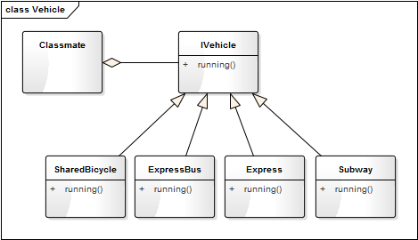
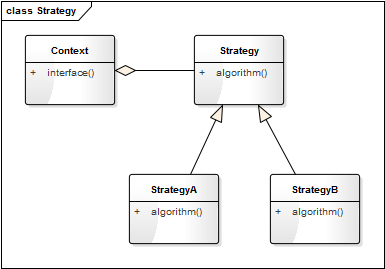

# 14 策略模式：怎么来不重要，人到就行

【故事剧情】

> Tony 在北京漂泊了三年，在这期间有很多的美好，也有很多心酸，有很多期待，也有很多失落；可终究还是要离开了，原因很简单：一来北京压力太大，生活成本太高；二来北京离家太远。离开北京，Tony 也没有回家，而是选择了新的城市——杭州。
>
> Tony 并不是班里最早逃离北京的人，但却是毕业后仍然坚持做技术且由一线城市退居到二线城市最早的人（不是回老家或都转行）。Tony 还有十几个同学在北京，一说要离开北京，肯定是要和这些同学道别的。Tony 的学姐 Leaf（也是学校时的辅导员）为他精心组织和安排了一次聚餐，地点选在了健德门附近的一家江西餐饮——西江美食舫，大家约好晚上 19：00 不见不散……
>
> 时间和地点都定了，把能来的这些人建了一个群，大家便开始热闹地聊起来了：
>
> Joe：我离那比较近，骑共享单车 15 分钟就到了，我可以先去点餐。
>
> Helen：我坐地铁到那半小时，也没问题。
>
> Henry：我有直达的快速公交到那 40 分钟，不过下班高峰期可能会堵车，时间不好说。
>
> Ruby：我公司还有点事，可能会晚半个小时，到时我打车过去……
>
> Leaf：**怎么来不重要，人到就行！**
>
> Tony：大家有心，万分感谢，安全最重要！


### 用程序来模拟生活

随着社会的发展、时代的进步，出行交通的方式可谓是越来越多样，可以说是丰富到了千奇百怪的地步了。除了上面提到的共享单车、公交车、地铁、快车（或出租车），也可以是自驾、电动车、平衡车，甚至都可以踏个轮滑、踩个滑板过来！采用什么交通方式并不重要，重要的是你能准时来共聚晚餐，不然就只能吃残羹冷炙了，哈哈！下面用代码来模拟一下大家使用不同的出行方式参加聚餐的情景吧。

源码示例：

```python
class IVehicle:

    "交通工具的抽象类"
    def running(self):

        pass
class SharedBicycle(IVehicle):

    "共享单车"
    def running(self):

        print("骑共享单车(轻快便捷)", end='')
class ExpressBus(IVehicle):

    "快速公交"
    def running(self):

        print("坐快速公交(经济绿色)", end='')
class Express(IVehicle):

    "快车"
    def running(self):

        print("打快车(快速方便)", end='')
class Subway(IVehicle):

    "地铁"
    def running(self):

        print("坐地铁(高效安全)", end='')
class Classmate:

    "参加聚餐的同学"
    def __init__(self, name, vechicle):

        self.__name = name

        self.__vechicle = vechicle
    def attendTheDinner(self):

        print(self.__name + " ", end='')

        self.__vechicle.running()

        print(" 来参加聚餐！")
```

测试代码：

```python
def testTheDinner():

    sharedBicycle = SharedBicycle()

    joe = Classmate("Joe", sharedBicycle)

    joe.attendTheDinner()

    helen = Classmate("Helen", Subway())

    helen.attendTheDinner()

    henry = Classmate("Henry", ExpressBus())

    henry.attendTheDinner()

    ruby = Classmate("Ruby", Express())

    ruby.attendTheDinner()
```

输出结果：

```
Joe 骑共享单车(轻快便捷) 来参加聚餐！

Helen 坐地铁(高效安全) 来参加聚餐！

Henry 坐快速公交(经济绿色) 来参加聚餐！

Ruby 打快车(快速方便) 来参加聚餐！
```

上面示例的类图如下：



### 从剧情中思考策略模式

上面的示例中我们可以选择不同的出行方式去参加聚餐，可以骑共享单车，也可以坐公共汽车，亦或是踩一辆平衡车；选用什么交通工具不重要，重要的是能够实现我们的目标——准时到达聚餐的地点，我们可以根据自己的实际情况进行选择和更换不同的出行方式。这里，选择不同的交通工具，就相当于选择了不同的出行策略；在程序中也有这样一种类似的模式——策略模式。

### 策略模式

策略模式的定义：

> Define a family of algorithms, encapsulate each one, and make them interchangeable. Strategy lets the algorithm vary independently from the clients that use it.
>
> 定义一系列算法，将每个算法都封装起来，并且使他们之间可以相互替换。策略模式使算法可以独立于使用它的用户而变化。

策略模式是对算法、规则的一种封装。如上面的示例中，可以将不同的出行方式（采用的交通工具）理解成一种出行算法，将这些算法抽象出一个基类 IVehicle，并定义一系列的算法，共享单车（SharedBicycle）、快速公交（ExpressBus）、地铁（Subway）、快车（Express）。我们可以选择任意一种（实际场景肯定会选择最合适的）出行方式，并且可以方便更换出行方式。如 henry 要把出行方式由快速公交改成快车，只需要调用出改一行代码即可。

```python
# henry = Classmate("Henry", ExpressBus())

henry = Classmate("Henry", Express())

henry.attendTheDinner()
```

### 策略模式的模型抽象

#### 类图

策略模式的类图表示如下：



Context 是一个上下文环境类，负责提供对外的接口，与用户的交互，屏蔽上层对策略（算法）的直接访问，如示例中的 Classmate。Strategy 是策略（算法）的抽象类，定义统一的接口，如示例中的 IVehicle。StrategyA 和 StrategyB 是具体策略的实现类，如示例中 SharedBicycle、ExpressBus 等。

\*\*注意：\*\*algorithm() 方法并不是说只用来定义算法，也可以是一种规则、一个运作或一种行为（如方面示例中的 running 指的是交通工具的运行方式）。一个 Strategy 也可以有多个方法（如一种算法是多个步骤组成的）。

#### 模型说明

##### **设计要点**

策略模式中主要三个角色，在设计策略模式时要找到并区分这些角色：

- **上下文环境（Context）：** 起着承上启下的封装作用，屏蔽上层应用对策略（算法）的直接访问，封装可能存在的变化。
- **策略的抽象（Strategy）：** 策略（算法）的抽象类，定义统一的接口，规定每一个子类必须实现的方法。
- \*\*具备的策略：\*\*策略的具体实现者，可以有多个不同的（算法或规则）实现。

##### **优缺点**

策略模式的优点：

- 算法（规则）可自由地切换。
- 避免使用多重条件判断。
- 方便拓展和增加新的算法（规则）。

策略模式的缺点：所有策略类都需要对外暴露。

### 实战应用

假设有这样一个应用场景：

> 有一 Person 类，有年龄（age）、体重（weight）、身高（height）三个属性。现要对 Person 的一组对象进行排序，但并没有确定根据什么规则来排序，有时需要根据年龄进行排序，有时需要根据身高进行排序，有时可能是根据身高和体重的综合情况来排序，还有可能……

通过对这个应用场景进行分析，会发现，这里需要有多种排序算法，而且需要动态地在这几种算法中进行选择，相信你很容易就会想到策略模式。没错，想到这就对了！那我们来看一下具体的代码。

**源码示例：**\`\`\`python
class Person:

```
"人类"
def __init__(self, name, age, weight, height):

    self.name = name

    self.age = age

    self.weight = weight

    self.height = height
def showMysef(self):

    print(self.name + " " + str(self.age) + " years old, " + str(self.weight) + "kg, " + str(self.height) + "m.")
```

class ICompare:

```
"比较算法"
def comparable(self, person1, person2):

    "person1 > person2 返回值>0，person1 == person2 返回0， person1 < person2 返回值小于0"

    pass
```

class CompareByAge(ICompare):

```
"通过年龄排序"
def comparable(self, person1, person2):

    return person1.age - person2.age
```

class CompareByHeight(ICompare):

```
"通过身高进行排序"
def comparable(self, person1, person2):

    return person1.height - person2.height
```

class SortPerson:

```
"Person的排序类"
def __init__(self, compare):

    self.__compare = compare
def sort(self, personList):

    "排序算法，这里采用最简单的冒泡排序"

    n = len(personList)

    for i in range(0, n-1):

        for j in range(0, n-i-1):

            if(self.__compare.comparable(personList[j], personList[j+1]) > 0):

                tmp = personList[j]

                personList[j] = personList[j+1]

                personList[j+1] = tmp

        j += 1

    i += 1
```

`** 测试代码： **`python
def testSortPerson():

```
personList = [

    Person("Tony", 2, 54.5, 0.82),

    Person("Jack", 31, 74.5, 1.80),

    Person("Nick", 54, 44.5, 1.59),

    Person("Eric", 23, 62.0, 1.78),

    Person("Helen", 16, 45.7, 1.60)

]

sorter0 = SortPerson(CompareByAge())

sorter0.sort(personList)

print("根据年龄进行排序后的结果：")

for person in personList:

    person.showMysef()

print()
sorter1 = SortPerson(CompareByHeight())

sorter1.sort(personList)

print("根据身高进行排序后的结果：")

for person in personList:

    person.showMysef()
```

```** 输出结果：**

```

根据年龄进行排序后的结果：

Tony 2 years old, 54.5kg, 0.82m.

Helen 16 years old, 45.7kg, 1.6m.

Eric 23 years old, 62.0kg, 1.78m.

Jack 31 years old, 74.5kg, 1.8m.

Nick 54 years old, 44.5kg, 1.59m.
根据身高进行排序后的结果：

Tony 2 years old, 54.5kg, 0.82m.

Nick 54 years old, 44.5kg, 1.59m.

Helen 16 years old, 45.7kg, 1.6m.

Eric 23 years old, 62.0kg, 1.78m.

Jack 31 years old, 74.5kg, 1.8m.

````

上面的代码可用类图表示如下：


看到这，熟悉 Python 的读者肯定要吐槽了！Python 是一个简洁明了的语言，使用十几行代码就能解决的问题（如下面的实现代码），为什么要写上面这一大堆的东西。

```python
from operator import itemgetter,attrgetter
def testPersonListInPython():

    "用Python的方式对Person进行排序"
    personList = [

        Person("Tony", 2, 54.5, 0.82),

        Person("Jack", 31, 74.5, 1.80),

        Person("Nick", 54, 44.5, 1.59),

        Person("Eric", 23, 62.0, 1.78),

        Person("Helen", 16, 45.7, 1.60)

    ]
    # 使用使用operator模块根据年龄进行排序

    print("根据年龄进行排序后的结果：")

    sortedPerons = sorted(personList, key = attrgetter('age'))

    for person in sortedPerons:

        person.showMysef()

    print()
    print("根据身高进行排序后的结果：")

    sortedPerons1 = sorted(personList, key=attrgetter('height'))

    for person in sortedPerons1:

        person.showMysef()
````

输出的结果和上面是一模一样的，这里不再赘述。

能提出这个问题，说明你一定是带着思考在阅读！之所以还要这么写，出于以下几个原因：

- 设计模式是一种编译思想，它和语言没有强关联，应当适用于所有面向对象的语言。Python 因为语言本身的灵活性和良好的封装性，使得其自带了很多的功能。而其他语言并没有这样的功能，为了让熟悉其他语言的人也能看懂，所以使用了最接近面向对象思维的方式进行实现（即使你熟悉 Python 也可通过它来学习一种新的思维方式）。
- 通过这种最本质的实现方式，有助于你更好地理解各种语言的 Sort 函数的原理。熟悉 Java 的同学，再看看 java.lang.Comparable 接口和 java.util.Arrays 中的 Sort 方法（public static void sort(Object\[\] a)），一定会有更深刻的理解，因为 Comparable 接口使用的就是策略模式，只不过该接口的实现者就是实体类本身（如上面例子中的 Person 就是实体类）。
- 使用 Python 语言本身的特性，还是难以实现一些特殊的需求，如要根据身高和体重的综合情况来排序（身高和体重的权重分别是 0.6 和 0.4）。用策略模式就可以很方便地实现，只需要增加一个 CompareByHeightAndWeight 的策略类就可以，如下面代码：

```python
class CompareByHeightAndWeight(ICompare):

    "根据身高和体重的综合情况来排序(身高和体重的权重分别是0.6和0.4)"
    def comparable(self, person1, person2):

        value1 = person1.height * 0.6 + person1.weight * 0.4

        value2 = person2.height * 0.6 + person2.weight * 0.4

        return value1 - value2
```

### 应用场景

- 如果一个系统里面有许多类，它们之间的区别仅在于有不同的行为，那么可以使用策略模式动态地让一个对象在许多行为中选择一种。
- 一个系统需要动态地在几种算法中选择一种。
- 设计程序接口时希望部分的内部实现由调用方自己实现。
