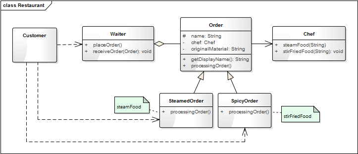
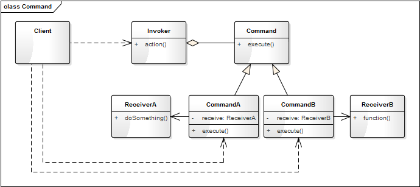
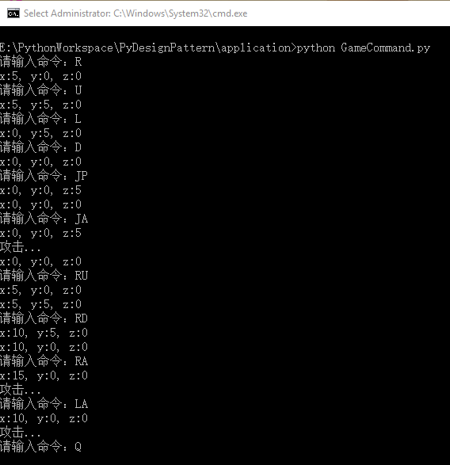

# 15 命令模式：大闸蟹，走起

【故事剧情】

> David：听说阿里开了一家实体店——盒马鲜生，特别火爆！明天就周末了，我们一起去吃大闸蟹吧！ Tony：吃货！真是味觉的哥伦布啊，哪里的餐饮新店都少不了你的影子。不过听说盒马鲜生到处是黑科技诶，而且海生是自己挑的，还满新奇的。
>
> David：那就说好了，明天 11：00，盒马鲜生，不吃不散！
>
> Tony 和 David 来到杭州上城区的一家分店。这里食客众多，物品丰富，特别是生鲜，从几十块钱的小龙虾到几百块的大青蟹，再到一千多的俄罗斯帝王蟹，应有尽有。帝王蟹是吃不起了，Tony 和 David 挑了一只 900g 的一号大青蟹。
>
> 食材挑好了，接下来就是现厂加工。加工的方式有多种，清蒸、姜葱炒、香辣炒、避风塘炒等，可以任意选择，当然不同的方式价格也有所不同。因为我们选的蟹是当时活动推荐的，所以免加工费。选择一种加工方式后进行下单，下单后会给你一个呼叫器，厨师做好了会有专门的服务人员送过来，坐着等就可以了……


### 用程序来模拟生活

盒马鲜生之所以这么火爆，一方面是因为中国从来就不缺像 David 这样的吃货，另一方面是因为里面的海生很新鲜，而且可以自己挑选。很多人都喜欢吃大闸蟹，但是你有没有注意到一个问题？从你买大闸蟹到吃上大闸蟹的整个过程，可能都没有见过厨师，而你却能享受美味的佳肴。这里有一个很重要的角色就是服务员，她帮你下订单，然后把订单传送给厨师，厨师收到订单后根据订单做餐。我们用代码来模拟一下这个过程。

源码示例：

```python
from abc import ABCMeta, abstractmethod
# 引入ABCMeta和abstractmethod来定义抽象类和抽象方法
class Chef():
    "厨师"
    def steamFood(self, originalMaterial):
        print(originalMaterial + "清蒸中...")
        return "清蒸" + originalMaterial
    def stirFriedFood(self, originalMaterial):
        print(originalMaterial + "爆炒中...")
        return "香辣炒" + originalMaterial
class Order(metaclass=ABCMeta):
    "订单"
    def __init__(self, name, originalMaterial):
        self._chef = Chef()
        self._name = name
        self._originalMaterial = originalMaterial
    def getDisplayName(self):
        return self._name + self._originalMaterial
    @abstractmethod
    def processingOrder(self):
        pass
class SteamedOrder(Order):
    "清蒸"
    def __init__(self, originalMaterial):
        super().__init__("清蒸", originalMaterial)
    def processingOrder(self):
        if(self._chef is not None):
            return self._chef.steamFood(self._originalMaterial)
        return ""
class SpicyOrder(Order):
    "香辣炒"
    def __init__(self, originalMaterial):
        super().__init__("香辣炒", originalMaterial)
    def processingOrder(self):
        if (self._chef is not None):
            return self._chef.stirFriedFood(self._originalMaterial)
        return ""
class Waiter:
    "服务员"
    def __init__(self, name):
        self.__name = name
        self.__order = None
    def receiveOrder(self, order):
        self.__order = order
        print("服务员" + self.__name + "：您的 " + order.getDisplayName() + " 订单已经收到,请耐心等待")
    def placeOrder(self):
        food = self.__order.processingOrder()
        print("服务员" + self.__name + "：您的餐 " + food + " 已经准备好，请您慢用!")
```

测试代码：

```python
def testOrder():
    waiter = Waiter("Anna")
    steamedOrder = SteamedOrder("大闸蟹")
    print("客户David：我要一份" + steamedOrder.getDisplayName())
    waiter.receiveOrder(steamedOrder)
    waiter.placeOrder()
    print()
    spicyOrder = SpicyOrder("大闸蟹")
    print("客户Tony：我要一份" + steamedOrder.getDisplayName())
    waiter.receiveOrder(spicyOrder)
    waiter.placeOrder()
```

输出结果：

```
客户David：我要一份清蒸大闸蟹
服务员Anna：您的 清蒸大闸蟹 订单已经收到，请耐心等待
大闸蟹清蒸中...
服务员Anna：您的餐 清蒸大闸蟹 已经准备好，请您慢用!
客户Tony：我要一份清蒸大闸蟹
服务员Anna：您的 香辣炒大闸蟹 订单已经收到，请耐心等待
大闸蟹爆炒中...
服务员Anna：您的餐 香辣炒大闸蟹 已经准备好，请您慢用!
```

### 从剧情中思考命令模式

在上面的示例中，我们只要发一个订单就能吃到想要的加工方式的美味佳肴，而不用知道厨师是谁，更不用关心他是怎么做出来的。像点餐的订单一样，发送者（客户）与接收者（厨师）没有任何的依赖关系，我们只要发送订单就能完成想要的任务，这在程序中 **命令模式** 。

在上面的示例中，我们可以用类图描述如下：



#### 命令模式

> Encapsulate a request as an object, thereby letting you parametrize clients with different requests, queue or log requests, and support undoable operations.
>
> 将一个请求封装成一个对象，从而让你使用不同的请求把客户端参数化，对请求排队或者记录请求日志，可以提供命令的撤销和恢复功能。

命令模式的最大特点是 **将具体的命令与对应的接收者相关联（捆绑），使得调用方不用关系具体的行动执行者及如何执行，只要发送正确的命令，就能准确无误地完成相应的任务。** 就像军队，将军一声令下，士兵就得分秒无差，准确执行。

命令模式是一种高内聚的模式，之所以说是高内聚是因为他把它命令封装成对象，并与接收者关联在一起，从而使（命令的）请求者（Invoker）接收者（Receiver）分离。

### 命令模式的模型抽象

#### 代码框架

上面的示例代码还是相对比较粗糙，我们可以对它进行进一步的重构和优化，抽象出命令模式的框架模型。

```python
class Command(metaclass=ABCMeta):
    "命令的抽象类"
    @abstractmethod
    def execute(self):
        pass
class CommandImpl(Command):
    "命令的具体实现类"
    def __init__(self, receiver):
        self.__receiver = receiver
    def execute(self):
        self.__receiver.doSomething()
class Receiver:
    "命令的接收者"
    def doSomething(self):
        print("do something...")
class Invoker:
    "调度者"
    def __init__(self):
        self.__command = None
    def setCommand(self, command):
        self.__command = command
    def action(self):
        if self.__command is not None:
            self.__command.execute()
def client():
    invoker = Invoker()
    command = CommandImpl(Receiver())
    invoker.setCommand(command)
    invoker.action()
```

#### 类图

命令模式可用类图表示如下：



上面的类图中 Command 是核心类，表示一项任务一个动作，如示例中的订单，是所有命令的抽象类，定义了统一的执行方法 execute。具体的命令实现类 CommandA 和 CommandB 包装了命令的接收者（分别是 ReceiveA 和 ReceiveB），在执行 execute 方法时会调用接收者的实现（如 doSomething 和 function）。Receiver 是命令的接收者，也是任务的具体的执行者，如示例中的厨师。Invoker 负责命令的调用，如示例中的服务员。Client 的真正的用户，如示例中的顾客。

#### 模型说明

（1）设计要点

命令模式中主要有四个角色，在设计命令模式时要找到并区分这些角色，具体如下。

- **命令（Command）：** 要完成的任务，或要执行的动作，这是命令模式的核心角色。
- **接收者（Receiver）：** 任务的具体实施方，或行动的真实执行者。
- **调度者（Invoker）：** 接受任务并发送命令，对接用户的需求并执行内部的命令，负责外部用户与内部命令的交互。
- **用户（Client）：** 命令的使用者，即真正的用户。

（2）优缺点

策略模式的优点：

- 对命令的发送者与接收者进行解耦，使得调用方不用关系具体的行动执行者及如何执行，只要发送正确的命令即可。
- 可以很方便地增加新的命令。

策略模式的缺点：

- 在一些系统中可能会有很多的命令，而每一个命令都需要一个具体的类去封装，容易使命令的类急剧膨胀。

### 实战应用

在游戏中，有两个最基本的动作，一个是行走（也叫移动），一个是攻击。这几乎是所有游戏都少不了的基础功能，不然就没法玩了！

现在我们来模拟一下游戏角色（英雄）中的移动和攻击，为简单起见，假设移动只有上移（U）、下移（D）、左移（L）、右移（R）、上跳（J）、下蹲（S）这 6 个动作，而攻击（A）只有 1 种，括号中字符代表每一个动作在键盘中的按键，也就是对应动作的调用，这些动作的命令可以单独使用，但更多的时候会组合在一起使用。比如，弹跳就是上跳 + 下蹲两个的动作的组合，我们用 JP 表示；而弹跳攻击是弹跳 + 攻击的组合（也就是上跳 + 攻击 + 下蹲），我们用 JA 表示；而移动也可以两个方向一起移动，如上移 + 右移，我们用 RU 表示。下面的程序中，为简单起见，这里用标准输入的字符来代表按键输入事件。

**GameCommand.py**

```python
#!/usr/bin/python
# -*- coding: UTF-8 -*-
# Authoer: Spencer.Luo
# Date: 5/18/2018
from abc import ABCMeta, abstractmethod
import time
class GameRole:
    # 每次移动的步距
    STEP = 5
    def __init__(self):
        self.__x = 0
        self.__y = 0
        self.__z = 0
    def leftMove(self):
        self.__x -= self.STEP
    def rightMove(self):
        self.__x += self.STEP
    def upMove(self):
        self.__y += self.STEP
    def downMove(self):
        self.__y -= self.STEP
    def jumpMove(self):
        self.__z += self.STEP
    def squatMove(self):
        self.__z -= self.STEP
    def attack(self):
        print("攻击...")
    def showPosition(self):
        print("x:" + str(self.__x) + ", y:" + str(self.__y) + ", z:" + str(self.__z))
class GameCommand(metaclass=ABCMeta):
    "游戏角色的命令类"
    def __init__(self, role):
        self._role = role
    def setRole(self, role):
        self._role = role
    @abstractmethod
    def execute(self):
        pass
class Left(GameCommand):
    "左移命令"
    def execute(self):
        self._role.leftMove()
        self._role.showPosition()
class Right(GameCommand):
    "右移命令"
    def execute(self):
        self._role.rightMove()
        self._role.showPosition()
class Up(GameCommand):
    "上移命令"
    def execute(self):
        self._role.upMove()
        self._role.showPosition()
class Down(GameCommand):
    "下移命令"
    def execute(self):
        self._role.downMove()
        self._role.showPosition()
class Jump(GameCommand):
    "弹跳命令"
    def execute(self):
        self._role.jumpMove()
        self._role.showPosition()
        # 跳起后空中停留半秒
        time.sleep(0.5)
class Squat(GameCommand):
    "下蹲命令"
    def execute(self):
        self._role.squatMove()
        self._role.showPosition()
        # 下蹲后伏地半秒
        time.sleep(0.5)
class Attack(GameCommand):
    "攻击命令"
    def execute(self):
        self._role.attack()
class MacroCommand(GameCommand):
    def __init__(self, role = None):
        super().__init__(role)
        self.__commands = []
    def addCommand(self, command):
        # 让所有的命令作用于同一个对象
        # command.setRole(self._role)
        self.__commands.append(command)
    def removeCommand(self, command):
        self.__commands.remove(command)
    def execute(self):
        for command in self.__commands:
            command.execute()
class GameInvoker:
    def __init__(self):
        self.__command = None
    def setCommand(self, command):
        self.__command = command
        return self
    def action(self):
        if self.__command is not None:
            self.__command.execute()
def testGame():
    role = GameRole()
    invoker = GameInvoker()
    while True:
        strCmd = input("请输入命令：");
        strCmd = strCmd.upper()
        if (strCmd == "L"):
            invoker.setCommand(Left(role)).action()
        elif (strCmd == "R"):
            invoker.setCommand(Right(role)).action()
        elif (strCmd == "U"):
            invoker.setCommand(Up(role)).action()
        elif (strCmd == "D"):
            invoker.setCommand(Down(role)).action()
        elif (strCmd == "JP"):
            cmd = MacroCommand()
            cmd.addCommand(Jump(role))
            cmd.addCommand(Squat(role))
            invoker.setCommand(cmd).action()
        elif (strCmd == "A"):
            invoker.setCommand(Attack(role)).action()
        elif (strCmd == "LU"):
            cmd = MacroCommand()
            cmd.addCommand(Left(role))
            cmd.addCommand(Up(role))
            invoker.setCommand(cmd).action()
        elif (strCmd == "LD"):
            cmd = MacroCommand()
            cmd.addCommand(Left(role))
            cmd.addCommand(Down(role))
            invoker.setCommand(cmd).action()
        elif (strCmd == "RU"):
            cmd = MacroCommand()
            cmd.addCommand(Right(role))
            cmd.addCommand(Up(role))
            invoker.setCommand(cmd).action()
        elif (strCmd == "RD"):
            cmd = MacroCommand()
            cmd.addCommand(Right(role))
            cmd.addCommand(Down(role))
            invoker.setCommand(cmd).action()
        elif (strCmd == "LA"):
            cmd = MacroCommand()
            cmd.addCommand(Left(role))
            cmd.addCommand(Attack(role))
            invoker.setCommand(cmd).action()
        elif (strCmd == "RA"):
            cmd = MacroCommand()
            cmd.addCommand(Right(role))
            cmd.addCommand(Attack(role))
            invoker.setCommand(cmd).action()
        elif (strCmd == "UA"):
            cmd = MacroCommand()
            cmd.addCommand(Up(role))
            cmd.addCommand(Attack(role))
            invoker.setCommand(cmd).action()
        elif (strCmd == "DA"):
            cmd = MacroCommand()
            cmd.addCommand(Down(role))
            cmd.addCommand(Attack(role))
            invoker.setCommand(cmd).action()
        elif (strCmd == "JA"):
            cmd = MacroCommand()
            cmd.addCommand(Jump(role))
            cmd.addCommand(Attack(role))
            cmd.addCommand(Squat(role))
            invoker.setCommand(cmd).action()
        elif (strCmd == "Q"):
            exit()
testGame()
```

**测试结果：** 

在上面的 Demo 中 MacroCommand 是一种组合命令，也叫 **宏命令** （Macro Command）。宏命令是一个具体命令类，它拥有一个集合属性，在该集合中包含了对其他命令对象的引用，如上面的弹跳命令是上跳、攻击、下蹲 3 个命令的组合，引用了 3 个命令对象。

当调用宏命令的 execute() 方法时，会循环地调用每一个子命令的 execute() 方法。一个宏命令的成员可以是简单命令，还可以继续是宏命令，宏命令将递归地调用它所包含的每个成员命令的 execute() 方法。

### 应用场景

- 希望系统发送一个命令（或信号），任务就能得到处理时，如 GUI 中的各种按钮的单击命令；再如自定义一套消息的响应机制。
- 需要将请求调用者和请求接收者解耦，使得调用者和接收者不直接交互时。
- 需要请一系列的命令组合成一组操作时，可以使用宏命令的方式。
