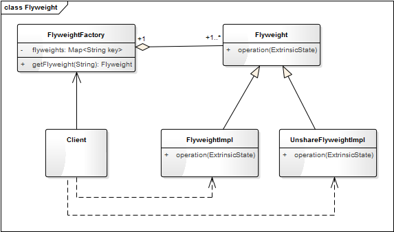

# 17 享元模式：颜料很贵必须充分利用

【故事剧情】

> 团队的拓展培训是很多大公司都组织的活动，因为素质拓展培训能将企业培训、团队建设、企业文化融入到有趣的体验活动中。Tony 所在的公司今年也举行了这样的活动，形式是团体活动 + 自由行，团体活动（第一天）就是素质拓展和技能培训，自由行（第二天）就是自主选择、轻松游玩，因为我们的活动地点是一个休闲娱乐区，还是有很多可玩的东西。
>
> 团体活动中有一个项目非常有意思，活动内容是：6 个人一组，每个组完成一幅作画，每个组会拿到一张彩绘原型图，然后根据原型图完成一幅彩绘图。素材：原型图每组一张、铅笔每组一支、空白画布每组一张、画刷每组若干；而颜料却是所有组共用的，有红、黄、蓝、绿、紫五种颜色各一大桶，足够使用。开始前 3 分钟时间准备，采用什么样的合作方式每组自己讨论，越快完成的组获得的分数越高！颜料之所以是共用的，原因也很简单，**颜料很贵，必须充分利用。**>
> Tony 所在的 _梦之队_ 组经过讨论后，采用的合作方式是：绘画天分最高的 Anmin 负责描边（也就是素描），Tony 负责选择和调配颜料（取到颜料后必须加水并搅拌均匀），而喜欢跑步的 Simon 负责传送颜料（因为颜料放中间，离每个组都有一段距离），其他人负责涂色。因为梦之队成员配合的比较好，所以最后取得了最优的成绩。


### 用程序来模拟生活

在上面的示例中，用来涂色的颜料只有有红、黄、蓝、绿、紫五大桶，大家共用相同的颜料来节约资源，我们可以通过程序来模拟一下颜料的使用过程。

源码示例：

```python
import logging
class Pigment:
    "颜料"
    def __init__(self, color):
        self.__color = color
        self.__user = ""
    def getColor(self):
        return self.__color
    def setUser(self, user):
        self.__user = user
        return self
    def showInfo(self):
        print(self.__user + "取得" + self.__color + "色颜料")
class PigmengFactory:
    "资料的工厂类"
    def __init__(self):
        self.__sigmentSet = {
            "红": Pigment("红"),
            "黄": Pigment("黄"),
            "蓝": Pigment("蓝"),
            "绿": Pigment("绿"),
            "紫": Pigment("紫"),
        }
    def getPigment(self, color):
        pigment = self.__sigmentSet.get(color)
        if pigment is None:
            logging.error("没有%s颜色的颜料！", color)
        return pigment
```

测试代码：

```python
def testPigment():
    factory = PigmengFactory()
    pigmentRed = factory.getPigment("红").setUser("梦之队")
    pigmentRed.showInfo()
    pigmentYellow = factory.getPigment("黄").setUser("梦之队")
    pigmentYellow.showInfo()
    pigmentBlue1 = factory.getPigment("蓝").setUser("梦之队")
    pigmentBlue1.showInfo()
    pigmentBlue2 = factory.getPigment("蓝").setUser("和平队")
    pigmentBlue2.showInfo()
```

输出结果：

```
梦之队取得红色颜料
梦之队取得黄色颜料
梦之队取得蓝色颜料
和平队取得蓝色颜料
```

### 从剧情中思考享元模式

在上面的示例中，我们通过限定颜料的数量并采用共享的方式来达到节约资源、节约成本的目的，在程序的世界中这种方式叫**享元模式**。

#### 享元模式

> 享元模式（Flyweight Pattern）：运用共享技术有效地支持大量细粒度对象的复用。
>
> Flyweight 一词来源于拳击比赛，意思是“特轻量级”。用在程序的设计中，就是指享元模式要求能够共享的对象必须是轻量级对象，也就是细粒度对象，因此享元模式又称为轻量级模式。

享元模式以共享的方式高效地支持大量的细粒度对象，享元对象能做到共享的关键是区分内部状态和外部状态。

- \*\*内部状态（Intrinsic State）\*\*是存储在享元对象内部并且不会随环境改变而改变的状态，因此内部状态可以共享人状态。如上面示例中颜料的颜色就是 Pigment 对象的内部状态。
- \*\*外部状态（Extrinsic State）\*\*是随环境改变而改变的、不可以共享的状态。享元对象的外部状态必须由客户端保存，并在享元对象被创建之后，在需要使用的时候再传入到享元对象内部。如上面示例中颜料的使用者就是外部状态。

### 享元模式的模型抽象

#### 类图

享元模式的类图表示如下：



#### 基于框架的实现

上面的示例代码中我们在 PigmengFactory 的初始化（构造）函数中就把五种颜色的颜料都创建出来了，这是因为我们的颜料在活动之前就已经准备好了。在程序中可以在需要用到的时候再去创建它，这对于一些初始化非常耗时的对象，可有效地提升程序的性能，因为把耗时的操作分解了。外部状态也可以通过参数的方式传给 operation 方法，替代 set 的方式。

我们根据享元模式的类图把示例的代码重新实现一下，最开始的示例代码我们假设它为 version 1.0，那么再看看基于框架的 version 2.0 吧。

**源码示例：**\`\`\`python
from abc import ABCMeta, abstractmethod

# 引入ABCMeta和abstractmethod来定义抽象类和抽象方法

class Flyweight(metaclass=ABCMeta):

```
"享元类"
@abstractmethod
def operation(self, extrinsicState):
    pass
```

class FlyweightImpl(Flyweight):

```
"享元类的具体实现类"
def __init__(self, color):
    self.__color = color
def operation(self, extrinsicState):
    print(extrinsicState + "取得" + self.__color + "色颜料")
```

class FlyweightFactory:

```
"享元工厂"
def __init__(self):
    self.__flyweights = {}
def getFlyweight(self, key):
    pigment = self.__flyweights.get(key)
    if pigment is None:
        pigment = FlyweightImpl(key)
    return pigment
```

`** 测试代码： **`python
def testPigment2():

```
factory = FlyweightFactory()
pigmentRed = factory.getFlyweight("红")
pigmentRed.operation("梦之队")
pigmentYellow = factory.getFlyweight("黄")
pigmentYellow.operation("梦之队")
pigmentBlue1 = factory.getFlyweight("蓝")
pigmentBlue1.operation("梦之队")
pigmentBlue2 = factory.getFlyweight("蓝")
pigmentBlue2.operation("和平队")
```

```
自己跑一下，会发现输出结果和之前的是一样的。
#### 模型说明
#####** 设计要点 **享元模式的实现非常简单，在设计享元模式的程序时要注意两个主要角色和四个设计要点。** 两个主要角色**
*   **享元对象（Flyweight）：** 即你期望用来共享的对象，享元对象必须是轻量级对象，也就是细粒度对象。
*   **享元工厂（FlyweightFactory）： **享元模式的核心角色，负责创建和管理享元对象。享元工厂提供一个用于存储享元对象的享元池，用户需要对象时，首先从享元池中获取，如果享元池中不存在，则创建一个新的享元对象返回给用户，并在享元池中保存该新增对象。** 三个设计要点**
*   享元对象必须是轻量级，细粒度的对象；
*   区分享元对象的内部状态和外部状态；
*   享元对象的内部状态和属性，一经创建后不会被随意改变。因为如果可以改变，侧 A 取得这个对象 obj 后，改变了其状态；B 再去取这个对象 obj 时就已经不是原来的状态了。
*   使用对象时通过享元工厂去获取，使得传入相同的 key 时获得相同的对象。
##### **优缺点**
优点：
*   可以极大减少内存中对象的数量，使得相同对象或相似对象（内部状态相同的对象）在内存中只保存一份。
*   享元模式的外部状态相对独立，而且不会影响其内部状态，从而使得享元对象可以在不同的环境中被共享。
缺点：
*   享元模式使得系统更加复杂，需要分离出内部状态和外部状态，这使得程序的逻辑复杂化。
*   享元对象的内部状态一经创建后不能被随意改变。要解决这个问题，需要使用对象池机制，即享元模式的升级版，要了解这部分内容，请看后面对象池的章节。
### 应用场景
*   一个系统有大量相同或者相似的对象，由于这类对象的大量使用，造成内存的大量耗费。
*   对象的大部分状态都可以外部化，可以将这些外部状态传入对象中。
享元模式是一个考虑系统性能的设计模式，通过使用享元模式可以节约内存空间，提高系统的性能；因为他的这一特性，在实际项目中使用的还是比较多的。比如浏览器的缓存就可以使用这个设计思想，浏览器会对已打开页面的图片、文件缓存到本地；如在一个页面中多次出现相同的图片（即一个页面中多个 img 标签指向同一个图片地址），则只需要创建一个图片对象，在解析到 img 标签的地方多次重复显示这个对象即可。
```
