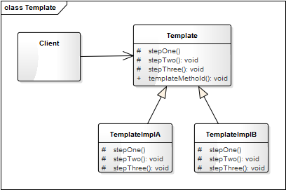
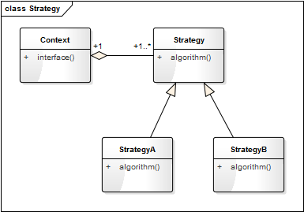
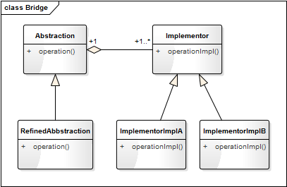
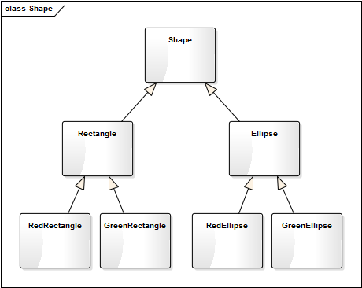
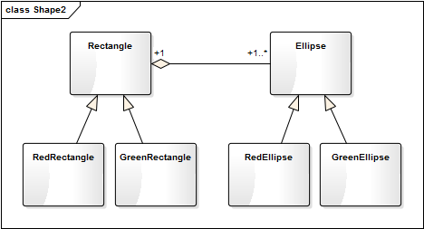
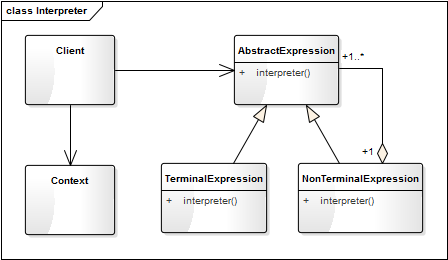
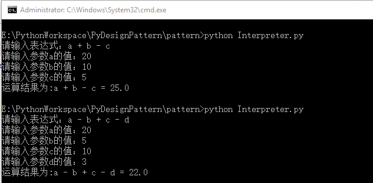

# 21 生活中的设计模式：那些未完待续的设计模式

随着技术的不断革新与发展，设计模式也一直在发展，有一些模式已不再常用，同时却有一些新的模式在诞生。本课程并未对这 23 种设计模式都进行一一讲解，因为有一些设计模式在现今软件的开发中用的非常少！而有一些却在面向对象中应用的太频繁，以至于我们都不认为它是一种模式。前面已经讲解了 19 种设计模式，下面将对未提及的 4 种设计模式一并进行说明。

### 抽象工厂

这个模式与工厂方法模式相比，在实际应用项目中使用的相对较少。一谈到工厂模式，大家一定会想到工厂三姐妹：简单工厂模式、工厂方法模式、抽象工厂模式，这一部分的内容在《\[生活中的工厂模式——你要拿铁还是摩卡\]》一文的 _拓展：工厂三姐妹_ 的部分已经做了较详细的说明，读者可跳转这一课程中进行阅读。

### 模板模式

这一模式非常简单，以至于我都不觉得它是一个模式。因为只要是在使用面向对象的语言进行开发时，在有意无意之中就已经在使用它了，举一个例子。

#### Demo

_在阅读电子书时，根据每个人的不同阅读习惯，可以设置不同的翻页方式，如左右平滑、仿真翻页等，不同的翻页方式，会给人以不同的展示效果。_

根据这一需求，我们用程序来模拟实现一下效果。

```python
from abc import ABCMeta, abstractmethod
# 引入ABCMeta和abstractmethod来定义抽象类和抽象方法
class ReaderView(metaclass=ABCMeta):
    "阅读器视图"
    def __init__(self):
        self.__curPageNum = 1
    def getPage(self, pageNum):
        self.__curPageNum = pageNum
        return "第" + str(pageNum) + "的内容"
    def prePage(self):
        content = self.getPage(self.__curPageNum - 1)
        self.displayPage(content)
    def nextPage(self):
        content = self.getPage(self.__curPageNum + 1)
        self.displayPage(content)
    @abstractmethod
    def displayPage(self, content):
        "翻页效果"
        pass
class SmoothView(ReaderView):
    "左右平滑的视图"
    def displayPage(self, content):
        print("左右平滑:" + content)
class SimulationView(ReaderView):
    "仿真翻页的视图"
    def displayPage(self, content):
        print("仿真翻页:" + content)
```

你看，是不是非常简单，因为模板方法模式只是用了面向对象的继承机制。而这种继承方式，在写代码的时候可能在很多地方已经有意无意的就这么使用了。

> Define the skeleton of an algorithm in an operation, deferring some steps to client subclasses. Template Method lets subclasses redefine certain steps of an algorithm without changing the algorithm's structure.
>
> 在父类中提供了一个定义算法框架的模板方法，而将算法中用到的具体的步骤放到子类中去实现，使得子类可以在不改变算法的同时重新定义该算法的某些特定步骤。

#### 代码框架

我们对上面的示例代码进行进一步的重构和优化，抽象出模板模式的框架模型。

```python
from abc import ABCMeta, abstractmethod
# 引入ABCMeta和abstractmethod来定义抽象类和抽象方法
class Template(metaclass=ABCMeta):
    "模板类(抽象类)"
    @abstractmethod
    def stepOne(self):
        pass
    @abstractmethod
    def stepTwo(self):
        pass
    @abstractmethod
    def stepThree(self):
        pass
    def templateMethold(self):
        "模板方法"
        self.stepOne()
        self.stepTwo()
        self.stepThree()
class TemplateImplA(Template):
    "模板实现类A"
    def stepOne(self):
        print("步骤一")
    def stepTwo(self):
        print("步骤二")
    def stepThree(self):
        print("步骤三")
class TemplateImplB(Template):
    "模板实现类B"
    def stepOne(self):
        print("Step one")
    def stepTwo(self):
        print("Step two")
    def stepThree(self):
        print("Step three")
```

#### 类图

模板方法模式的类图表示如下：



Template 是一个模板类，用于定义模板方法（某种算法的框架），如示例中的 ReaderView。TemplateImplA 和 TemplateImplB 是模板类的具体子类，用于实现算法框架中的一些特定步骤。

#### 应用场景

- 对一些复杂的算法进行分割，将其算法中固定不变的部分设计为模板方法和父类具体方法，而一些可以改变的细节由其子类来实现。即一次性实现一个算法的不变部分，并将可变的行为留给子类来实现。
- 各子类中公共的行为应被提取出来并集中到一个公共父类中以避免代码重复。
- 需要通过子类来决定父类算法中某个步骤是否执行，以实现子类对父类的反向控制。

### 桥接模式

这个模式可以和策略模式合为一个模式，因为思想相同，代码结构也几乎一样，如下图它们的类图结构几乎相同，只是一个（策略模式）侧重于对象行为，一个（桥接模式）侧重于软件结构。

#### 类图



策略模式的类图



桥接模式的类图

从类图可以看出，桥梁模式和策略模式几乎是一样的，只是多了对抽象（Abstraction）的具体实现类，用于对抽象化角色进行修正。

#### 桥接模式

> Decouple an abstraction from its implementation so that the two can vary independently.
>
> 将抽象和实现解耦，使得它们可以独立地变化。

桥梁模式关注的是抽象和实现的分离，使得它们可以独立地发展；桥梁模式是结构型模式，侧重于软件结构。而策略模式关注的是对算法、规则的封装，使得算法可以独立于使用它的用户而变化；策略模式是行为型模式，侧重于对象行为。

设计模式其实就是一种编程思想，没有固定的结构。区分不同的模式，更多的是要从语义和用途是判断。

#### 应用案例

在几何图形的分类中，假设我们有矩形和椭圆之分，这时又希望加入颜色（红色、绿色）来拓展它的层级。如果用一般继承的思想，则会有下面这样的类图：



如果再增加几个形状（如三角形），再增加几种颜色（如蓝色、紫色），这个类图将会越来越膨胀和臃肿。这时，我们就希望对这个设计进行解耦，将形状和颜色分成两个分支，独立发展，互不影响。桥接模式就派上用场了，我们看一下使用桥接模式后的类图：



实现代码如下：

```python
from abc import ABCMeta, abstractmethod
# 引入ABCMeta和abstractmethod来定义抽象类和抽象方法
class Shape(metaclass=ABCMeta):
    "形状"
    def __init__(self, color):
        self._color = color
    @abstractmethod
    def getShapeType(self):
        pass
    def getShapeInfo(self):
        return self._color.getColor() + "的" + self.getShapeType()
class Rectange(Shape):
    "矩形"
    def __init__(self, color):
        super().__init__(color)
    def getShapeType(self):
        return "矩形"
class Ellipse(Shape):
    "椭圆"
    def __init__(self, color):
        super().__init__(color)
    def getShapeType(self):
        return "椭圆"
class Color(metaclass=ABCMeta):
    "颜色"
    @abstractmethod
    def getColor(self):
        pass
class Red(Color):
    "红色"
    def getColor(self):
        return "红色"
class Green(Color):
    "绿色"
    def getColor(self):
        return "绿色"
```

测试代码如下：

```python
def testShap():
    redRect = Rectange(Red())
    print(redRect.getShapeInfo())
    greenRect = Rectange(Green())
    print(greenRect.getShapeInfo())
    redEllipse = Ellipse(Red())
    print(redEllipse.getShapeInfo())
    greenEllipse = Ellipse(Green())
    print(greenEllipse.getShapeInfo())
```

结果如下：

```
红色的矩形
绿色的矩形
红色的椭圆
绿色的椭圆
```

### 解释模式

#### 解释模式

解释模式又叫解释器模式，它是一种使用频率相对较低但学习难度较大的设计模式，它用于描述如何使用面向对象语言构成一个简单的语言解释器。在某些情况下，为了更好地描述某一些特定类型的问题，我们可以创建一种新的语言，这种语言拥有自己的表达式和结构，即文法规则，这些问题的实例将对应为该语言中的句子。如在金融业务中，经常需要定义一些模型运算来统计、分析大量的金融数据，从而窥探一些商业发展趋势。

> Given a language, define a representation for its grammar along with an interpreter that uses the representation to interpret sentences in the language.
>
> 定义一个语言，定义它的文法的一种表示；并定义一个解释器，该解释器使用该文法来解释语言中的句子。

#### 类图

解释模式的类图表示如下：



AbstractExpression 解释器的抽象类，定义统一的解析方法。TerminalExpression 是终结符表达式，终结符表达式是语法中的最小单元逻辑，不可再拆分，如下面示例中的 VarExpression。

NonTerminalExpression 是非终结符表达式，方法中每一条规则对应一个非终结表达式，如下面示例中的 AddExpression 和 SubExpression。Context 是上下文环境类，包含解析器之外的一些全局信息，如下面示例中的 newExp 和 expressionMap。

#### 应用案例

我们用数学中最简单的加减法来讲解解释器模式的应用。假设有如下两个表达式规则：

```
a+b+c
a+b-c
```

用解释器来解释具体的内容。

```python
from abc import ABCMeta, abstractmethod
# 引入ABCMeta和abstractmethod来定义抽象类和抽象方法
class Expression(metaclass=ABCMeta):
    "抽象表达式"
    @abstractmethod
    def interpreter(self, var):
        pass
class VarExpression(Expression):
    "变量解析器"
    def __init__(self, key):
        self.__key = key
    def interpreter(self, var):
        return var.get(self.__key)
class SymbolExpression(Expression):
    "运算符解析器，运算符的抽象类"
    def __init__(self, left, right):
        self._left = left
        self._right = right
class AddExpression(SymbolExpression):
    "加法解析器"
    def __init__(self, left, right):
        super().__init__(left, right)
    def interpreter(self, var):
        return self._left.interpreter(var) + self._right.interpreter(var)
class SubExpression(SymbolExpression):
    "减法解析器"
    def __init__(self, left, right):
        super().__init__(left, right)
    def interpreter(self, var):
        return self._left.interpreter(var) - self._right.interpreter(var)
# import stack
class Calculator:
    "计算器类"
    def __init__(self, text):
        self.__expression = self.parserText(text)
    def parserText(self, expText):
        # 定义一个栈，处理运算的先后顺序
        stack = Stack()
        left = right = None # 左右表达式
        idx = 0
        while(idx < len(expText)):
            if (expText[idx] == '+'):
                left = stack.pop()
                idx += 1
                right = VarExpression(expText[idx])
                stack.push(AddExpression(left, right))
            elif(expText[idx] == '-'):
                left = stack.pop()
                idx += 1
                right = VarExpression(expText[idx])
                stack.push(SubExpression(left, right))
            else:
                stack.push(VarExpression(expText[idx]))
            idx += 1
        return stack.pop()
    def run(self, var):
        return self.__expression.interpreter(var)
class Stack:
    "封装一个堆栈类"
    def __init__(self):
        self.items = []
    def isEmpty(self):
        return len(self.items) == 0
    def push(self, item):
        self.items.append(item)
    def pop(self):
        return self.items.pop()
    def peek(self):
        if not self.isEmpty():
            return self.items[len(self.items) - 1]
    def size(self):
        return len(self.items)
```

测试代码：

```python
def testCalculator():
    # 获取表达式
    expStr = input("请输入表达式：");
    # 获取各参数的键值对
    newExp, expressionMap = getMapValue(expStr)
    calculator = Calculator(newExp)
    result = calculator.run(expressionMap)
    print("运算结果为:" + expStr + " = " + str(result))
def getMapValue(expStr):
    preIdx = 0
    expressionMap = {}
    newExp = []
    for i in range(0, len(expStr)):
        if (expStr[i] == '+' or expStr[i] == '-'):
            key = expStr[preIdx:i]
            key = key.strip()  # 去除前后空字符
            newExp.append(key)
            newExp.append(expStr[i])
            var = input("请输入参数" + key + "的值：");
            var = var.strip()
            expressionMap[key] = float(var)
            preIdx = i + 1
    # 处理最后一个参数
    key = expStr[preIdx:len(expStr)]
    key = key.strip()  # 去除前后空字符
    newExp.append(key)
    var = input("请输入参数" + key + "的值：");
    var = var.strip()
    expressionMap[key] = float(var)
    return newExp, expressionMap
```

结果如下：



解释器模式是一个简单的语法分析工具，最显著的优点是拓展性，修改语法规则只要修改相应的非终结符表达式就可以了。解释器模式在实际的项目开发中应用的比较少，因为现实复杂，较难维护，但在一些特定的领域还是会被用到，如数据分析、科学计算、数据统计与报表分析。
