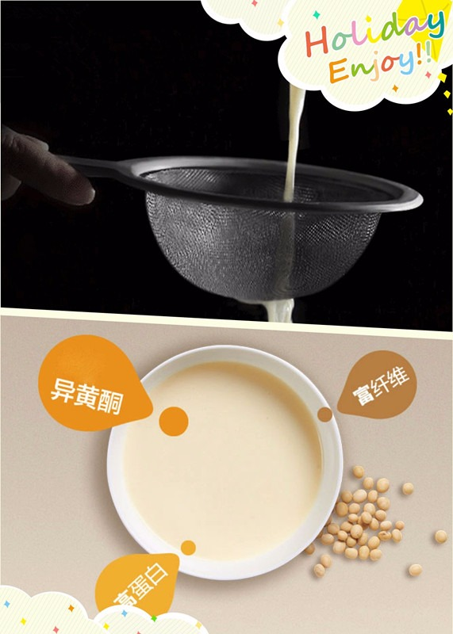
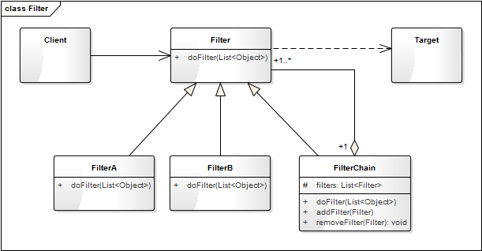

# 22 深入解读过滤器模式：制作一杯鲜纯细腻的豆浆

故事剧情】

> 腊八已过，粥已喝，马上就要过年了！别人家的公司现在都是开年会、发现金红包、发 iPone、发平衡车什么的，而 Tony 什么也没有，只能默默地躲在朋友圈的角落里，好在最后一周还算发了一个慰问品——九阳豆浆机。
>
> 豆浆机已经有了，怎么制作一杯鲜纯细腻的豆浆呢？Tony 在网上找了一些资料，摸索了半天总算学会了，准备周末买一些大豆，自制早餐！
>
> 把浸泡过的大豆放进机器，再加入半壶水，然后选择模式并按下“启动”键，15 分钟后就可以了，但这并没有完，因为还有最关键的一步，那就是往杯子倒豆浆的时候要用过滤网把豆渣过虑掉。这样，一杯美味的阳光早餐就出来了。



### 用程序来模拟生活

世间万物，唯有爱与美食不可辜负，吃的健康才能活的出彩。在上面制作豆浆的过程中，豆浆机很重要，但过滤网更关键，因为它直接影响了豆桨的质量。下面我们用程序来模拟一下这关键的步骤。

源码示例：

```python
class FilterScreen:
    """过滤网"""
    def doFilter(self, rawMaterials):
        for material in rawMaterials:
            if (material == "豆渣"):
                rawMaterials.remove(material)
        return rawMaterials
```

测试代码：

```python
def testFilterScreen():
    rawMaterials = ["豆浆", "豆渣"]
    print("过滤前：", rawMaterials)
    filter = FilterScreen()
    filteredMaterials = filter.doFilter(rawMaterials)
    print("过滤后：", filteredMaterials)
```

输出结果：

```plaintext
过滤前： ['豆浆', '豆渣']
过滤后： ['豆浆']
```

### 从剧情中思考过滤器模式

在上面的示例中，豆浆机中有豆浆和豆渣，往杯子里倒的过程中，用过滤网把豆渣过滤掉才能获得更加鲜嫩细腻的豆浆。过滤网起着一个过滤的作用，在程序中也有一种类似的机制，叫 **过滤器模式** 。

#### 过滤器模式

> 过滤器模式就是将一组对象，根据某种规则，过滤掉一些不符合要求的对象的过程。

如在互联网上发布信息时敏感词汇的过滤，在 Web 接口的请求与响应时，对请求和响应信息的过滤。过滤器模式的核心思想非常简单：就是把不需要的信息过滤掉，怎么判定哪些是不需要的信息呢？这就需要制定规则。过滤的过程如下图：


举一更加形象的例子，在基建行业中，沙子是最重要的原材料之一，这些沙子很多是从江河中打捞上来的，而打捞上来的不只有沙子，还有小石头和水。若要得到这些颗粒均匀的沙子，就必须把水和石头过滤掉。

#### 与职责模式的联系

在《\[生活中的职责模式——我的假条去哪了\]》一文中，我们讲了职责模式（也就是责任链模式）。过滤器与责任链的相似之处是处理过程都是一环一环地进行，不同之处在于责任链中责任的传递一般会有一定的顺序，而过滤器通常没有这种顺序，所以过滤器会比责任链还简单。

### 过滤器模式的模型抽象

一些熟悉 Python 的读者可能会觉得上面示例中的这种写法太麻烦了，Python 本身就自带了 filter() 函数。用下面这段代码就能轻松搞定，结果是一样的，但代码少了好几行：

```python
def testFilter():
    rawMaterials = ["豆浆", "豆渣"]
    print("过滤前：", rawMaterials)
    filteredMaterials = list(filter(isSoybeanMilk, rawMaterials))
    print("过滤后：", filteredMaterials)
def isSoybeanMilk(material):
    return material == "豆浆"
```

能提出这个问题，说明你是带思考阅读本文的。之所以要这么写，有以下两个原因：

- Python 自带的 filter() 是函数式编程（即面向过程式的编程），而设计模式讲述的是一种面向对象的设计思想。
- filter() 函数只是进行简单的数组中对象的过滤，对于一些更复杂的需求（如对不符合要求的对象，不是过滤掉而是进行替换），filter() 函数是难以应付的。

#### 代码框架

基于上面这些问题的思考，我们可以对过滤器模式进行进一步的重构和优化，抽象出过滤器模式的框架模型。

```python
from abc import ABCMeta, abstractmethod
# 引入ABCMeta和abstractmethod来定义抽象类和抽象方法
class Filter(metaclass=ABCMeta):
    """过滤器"""
    @abstractmethod
    def doFilter(self, elements):
        """过滤方法"""
        pass
class FilterChain(Filter):
    "过滤器链"
    def __init__(self):
        self._filters = []
    def addFilter(self, filter):
        self._filters.append(filter)
    def removeFilter(self, filter):
        self._filters.remove(filter)
    def doFilter(self, elements):
        for filter in self._filters:
            filter.doFilter(elements)
```

#### 类图

上面的代码框架可用类图表示如下：



Filter 是所有过滤器的抽象类，定义了统一的过滤接口 doFilter()。FilterA 和 FilterB 是具体的过滤器类，一个类定义一个过滤规则。FilterChain 是一个过滤器链，它可以包含多个过滤器，并管理这些过滤器，在过滤对象元素时，包含的每一个过滤器都会进行一次过滤。

#### 基于框架的实现

有了上面的代码框架之后，我们要实现示例代码的功能就会更简单明确了。最开始的示例代码假设它为 version 1.0，那么再看看基于框架的 version 2.0 吧。

```python
class FilterScreen(Filter):
    """过滤网"""
    def doFilter(self, elements):
        for material in elements:
            if (material == "豆渣"):
                elements.remove(material)
        return elements
```

测试代码不用变。自己跑一下，会发现输出结果和之前的是一样的。

#### 模型说明

##### 设计要点

过滤器模式中主要有三个角色，在设计过滤器模式时要找到并区分这些角色：

- **过滤的目标（Target）：** 即要被过滤的对象，通常是一个对象数组（对象列表）。
- **过滤器（Filter）：** 负责过滤不需要的对象，一般一个规则对应一个类。
- **过滤器链（FilterChain）：** 即过滤器的集合，负责管理和维护过滤器，用这个对象进行过滤时，它包含的每一个子过滤器都会进行一次过滤。这个类并不总是需要的，但如果有多个过滤器，有这个类将会带来极大的方便。

#### 优缺点

优点：

- 将对象的过滤、校验逻辑抽离出来，降低系统的复杂度。
- 过滤规则可实现重复利用。

缺点：性能较低，每个过滤器都会对每一个元素进行遍历。如果有 n 个元素、m 个过滤器，则复杂度为 O(mn)。

### 实战应用

我们在互联网上发布信息时，经常被进行敏感词的过滤；在表单提交的信息要以 HTML 的形式进行显示，会对一些特殊字符的进行转换。这时，我们就需要用过滤器模式对提交的信息进行过滤和处理。

**源码示例：** 

```python
import re

# 引入正则表达式库

class SensitiveFilter(Filter):
```

"""敏感词过滤"""
def __init__(self):
    self.__sensitives = ["黄色", "台独", "贪污"]
def doFilter(self, elements):
    # 敏感词列表转换成正则表达式
    regex = ""
    for word in self.__sensitives:
        regex += word + "|"
    regex = regex[0: len(regex) - 1]
    # 对每个元素进行过滤
    newElements = []
    for element in elements:
        item, num = re.subn(regex, "", element)
        newElements.append(item)
    return newElements

```plaintext
class HtmlFilter(Filter):
```

"HTML特殊字符转换"
def __init__(self):
    self.__wordMap = {
        "&": "&amp;",
        "'": " &apos;",
        ">": "&gt;",
        "<": "&lt;",
        "\"": " &quot;",
    }
def doFilter(self, elements):
    newElements = []
    for element in elements:
        for key, value in self.__wordMap.items():
            element = element.replace(key, value)
        newElements.append(element)
    return newElements

```python
` **测试代码：** `python
def testFiltercontent():
```

contents = [
    '有人出售黄色书：<黄情味道>',
    '有人企图搞台独活动, ——"造谣咨询"',
]
print("过滤前的内容：", contents)
filterChain = FilterChain()
filterChain.addFilter(SensitiveFilter())
filterChain.addFilter(HtmlFilter())
newContents = filterChain.doFilter(contents)
print("过滤后的内容：", newContents)

```plaintext
``` **输出结果：** ```

过滤前的内容： \['有人出售黄色书：\<黄情味道>', '有人企图搞台独活动, ——"造谣咨询"'\]

过滤后的内容： \['有人出售书：\<黄情味道>', '有人企图搞活动, —— "造谣咨询 "'\]
```

### 应用场景
*   敏感词过滤、舆情监测。
*   需要对对象列表（或数据列表）进行检验、审查或预处理的场景。
*   对网络接口的请求和响应进行拦截，如对每一个请求和响应记录日志，以便日后分析。
```
