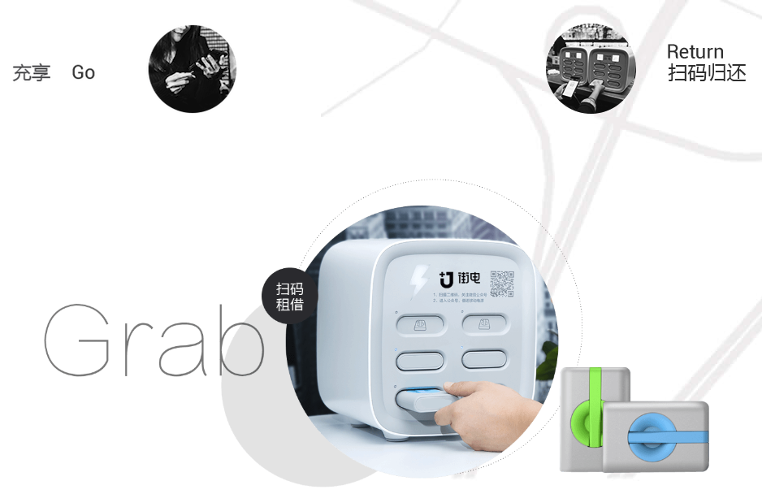
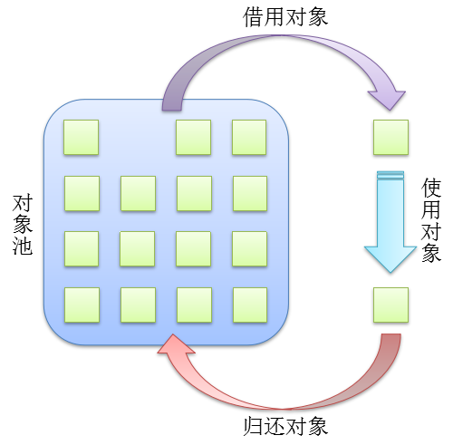
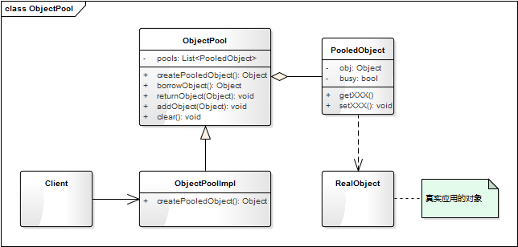

# 23 深入解读对象池技术：共享让生活更便捷

【故事剧情】

> 大学的室友兼死党 Sam 首次来杭州，作为东道主的 Tony 自然得悉心招待，不敢怠慢。这不，不仅要陪吃陪喝还得陪玩，哈哈！
>
> 第一次来杭州，西湖必然是非去不可的。正值周末，风和日丽，最适合游玩。上午 9 点出发，Tony 和 Sam 打一辆滴滴快车从滨江到西湖的南山路，然后从大华饭店步行到断桥，之后是穿越断桥，漫步白堤，游走孤山岛，就这样一路走走停停，闲聊、拍照，很快就到了中午。中午在岳王庙附近找了一家生煎，简单解决午餐（大餐留着晚上吃）。因为拍照拍的比较多，手机没电了，正好看到店里有共享充电宝，便借了一个给手机充满电，也多休息了一个小时。 下午，他们准备骑行最美西湖路；吃完饭，找了两辆共享自行车，从杨公堤开始骑行，路过太子湾、雷峰塔，然后再到柳浪闻莺。之后就是沿湖步行走到龙翔桥，找了一家最具杭州特色的饭店解决晚餐……
>
> 这一路行程他们从共享汽车（滴滴快车）到共享自行车，再到共享充电宝，共享的生活方式已如影随形地渗透到了生活的方方面面。**共享，不仅让我们出行更便捷，而且资源更节约！**

### 用程序来模拟生活

共享经济的飞速发展真的是改变了我们的生活方式，共享自行车、共享雨伞、共享充电宝、共享 KTV 等，共享让我们的生活更便利，你可以不用带充电宝，却可以随时用到它；共享让我们的资源更节约，你可以不用买自行车，但每个人都能骑到自行车（一辆车可以为多个人服务）。我们以共享充电宝为例，用程序来模拟一下它是怎样做到资源节约和共享的。

源码示例：

```python
class PowerBank:

    "移动电源"
    def __init__(self, serialNum, electricQuantity):

        self.__serialNum = serialNum

        self.__electricQuantity = electricQuantity

        self.__user = ''
    def getSerialNum(self):

        return self.__serialNum
    def getElectricQuantity(self):

        return self.__electricQuantity
    def setUser(self, user):

        self.__user = user
    def getUser(self):

        return self.__user
    def showInfo(self):

        print("序列号:" + str(self.__serialNum) + "  电量:" + str(self.__electricQuantity) + "%  使用者:" + self.__user)
class ObjectPack:

    "对象的包装类，封装指定的对象(如充电宝)是否被使用中"

    def __init__(self, obj, inUsing = False):

        self.__obj = obj

        self.__inUsing = inUsing
    def inUsing(self):

        return self.__inUsing
    def setUsing(self, isUsing):

        self.__inUsing = isUsing
    def getObj(self):

        return self.__obj
class PowerBankBox:

    "存放移动电源的智能箱盒"
    def __init__(self):

        self.__pools = {}

        self.__pools['0001'] = ObjectPack(PowerBank('0001', 100))

        self.__pools['0002'] = ObjectPack(PowerBank('0002', 100))
    def borrow(self, serialNum):

        "使用移动电源"

        item = self.__pools.get(serialNum)

        result = None

        if(item is None):

            print("没有可用的电源！")

        elif(not item.inUsing()):

            item.setUsing(True)

            result = item.getObj()

        else:

            print(str(serialNum) + "电源已被借用！")

        return result
    def giveBack(self, serialNum):

        "归还移动电源"

        item = self.__pools.get(serialNum)

        if(item is not None):

            item.setUsing(False)

            print(str(serialNum) + "电源已归还!")
```

测试代码：

```python
def testPowerBank():

    box = PowerBankBox()

    powerBank1 = box.borrow('0001')

    if(powerBank1 is not None):

        powerBank1.setUser('Tony')

        powerBank1.showInfo()

    powerBank2 = box.borrow('0002')

    if(powerBank2 is not None):

        powerBank2.setUser('Sam')

        powerBank2.showInfo()

    powerBank3 = box.borrow('0001')

    box.giveBack('0001')

    powerBank3 = box.borrow('0001')

    if(powerBank3 is not None):

        powerBank3.setUser('Aimee')

        powerBank3.showInfo()
```

输出结果：

```
序列号:0001  电量:100%  使用者:Tony

序列号:0002  电量:100%  使用者:Sam

0001电源已被借用！

0001电源已归还!

序列号:0001  电量:100%  使用者:Aimee
```

### 从剧情中思考对象池机制

在共享充电宝这个示例中，如果还有未被借用的设备，我们就能借到充电宝给自己的手机充电；用完之后把充电宝还回去，继续让下一个人借用，这样就能让充电宝的利用率达到最大。如共享充电宝一样，在程序中也有一种对应的机制，可以让对象重复地被使用，这就是**对象池**。

#### 对象池

> **对象池**其实就是一个集合，里面包含了我们需要的已经过初始化且可以使用的对象，我们称这些对象都被池化了，也就是被对象池所管理，想要这样的对象，从池子里取一个就行，但是用完得归还。

可以理解对象池为单例模式的延展，多例模式，就那么几个对象实例，再多没有了；要用可以，但用完必须归还，这样其他人才能再使用。可以用下面一张图来形象的表示：



上面共享充电定的示例就能非常形象地类比对象池的概念：对象池就如同存放充电宝的智能箱盒，对象就量充电定，而对象的借用、使用、归还分别对应充电宝的借用、使用、归还。

#### 与享元模式的联系

在《\[第17课：生活中的享元模式——颜料很贵必须充分利用\]》这一篇文章中我们知道享元模式可以实现对象的共享，通过使用享元模式可以节约内存空间，提高系统的性能。但这个模式也存在一个问题，那就是享元对象的内部状态和属性，一经创建后不会被随意改变。因为如果可以改变，则 A 取得这个对象 obj 后，改变了其状态；B 再去取这个对象 obj 时就已经不是原来的状态了。

对象池机制正好可以解决享元模式的这个缺陷。它通过借、还的机制，让一个对象在某段时间内被一个使用者独占，用完之后归还该对象，在独占的这段时间内使用者可以修改对象的部分属性（因为这段时间内其他用户不会使用这个对象）；而享元模式因为没有这种机制，享元对象在整个生命周期都是被所有使用者共享的。

> 什么就**独占**？就是你用着这个充电宝，（同一时刻）别人就不能用了，因为只有一个接口，只能给一个手机充电。
>
> 什么叫**共享**？就是深夜中几个人围一圆桌坐着，头顶上挂着一盏电灯，大家都享受着这盏灯带来的光明，这盏电灯就是共享的。而且一定范围内来讲它是无限共享的，因为圆桌上坐着 5 个人和坐着 10 个人，他们感觉到的光亮是一样的。

对象池机制是享元模式的一个延伸，可以理解为享元模式的升级版。

### 对象池机制的模型抽象

#### 代码框架

池子、借用、归还是对象池机制的核心思想，我们可以基于这一思想逐步抽象出一个简单可用的实现模型。

```python
from abc import ABCMeta, abstractmethod

# 引入ABCMeta和abstractmethod来定义抽象类和抽象方法

import logging

# 引入logging模块用于输出日志信息

import time

# 引入时间模块
class PooledObject:

    "池对象,也称池化对象"
    def __init__(self, obj):

        self.__obj = obj

        self.__busy = False
    def getObject(self):

        return self.__obj
    def setObject(self, obj):

        self.__obj = obj
    def isBusy(self):

        return self.__busy
    def setBusy(self, busy):

        self.__busy = busy
class ObjectPool(metaclass=ABCMeta):

    "对象池"
    "对象池初始化大小"

    InitialNumOfObjects = 10

    "对象池最大的大小"

    MaxNumOfObjects = 50
    def __init__(self):

        self.__pools = []

        for i in range(0, ObjectPool.InitialNumOfObjects):

            obj = self.createPooledObject()

            self.__pools.append(obj)
    @abstractmethod

    def createPooledObject(self):

        "子类提供创建对象的方法"

        pass
    def borrowObject(self):

        # 如果找到空闲对象，直接返回

        obj = self._findFreeObject()

        if(obj is not None):

            logging.info("%s对象已被借用, time:%d", id(obj), time.time())

            return obj
        # 如果对象池未满，则添加新的对象

        if(len(self.__pools) < ObjectPool.MaxNumOfObjects):

            pooledObj = self.addObject()

            if (pooledObj is not None):

                pooledObj.setBusy(True)

                logging.info("%s对象已被借用, time:%d", id(pooledObj.getObject()), time.time())

                return pooledObj.getObject()
        # 对象池已满且没有空闲对象，则返回None

        return None
    def returnObject(self, obj):

        for pooledObj in self.__pools:

            if(pooledObj.getObject() == obj):

                pooledObj.setBusy(False)

                logging.info("%s对象已归还, time:%d", id(pooledObj.getObject()), time.time())

                break
    def addObject(self):

        obj = None

        if(len(self.__pools) < ObjectPool.MaxNumOfObjects):

            obj = self.createPooledObject()

            self.__pools.append(obj)

            logging.info("添加新对象%s, time:%d", id(obj), time.time())

        return obj
    def clear(self):

        self.__pools.clear()
    def _findFreeObject(self):

        "查找空闲的对象"

        obj = None

        for pooledObj in self.__pools:

            if(not pooledObj.isBusy()):

                obj = pooledObj.getObject()

                pooledObj.setBusy(True)

                break

        return obj
```

#### 类图

上面的代码框架可用类图表示如下：



ObjectPool 的一个抽象的对象池，PooledObject 是池对象。实际使用时要实现一个 ObjectPool 的子类并实现 createPooledObject 创建对象的方法；PooledObject 其实是对真实对象的一个包装类，用于控制其是否被占用状态。

#### 基于框架的实现

有了上面的代码框架之后，我们要实现示例代码的功能就会更简单了。最开始的示例代码假设它为 version 1.0，那么再看看基于框架的 version 2.0 吧。

```python
class PowerBank:

    "移动电源"
    def __init__(self, serialNum, electricQuantity):

        self.__serialNum = serialNum

        self.__electricQuantity = electricQuantity

        self.__user = ""
    def getSerialNum(self):

        return self.__serialNum
    def getElectricQuantity(self):

        return self.__electricQuantity
    def setUser(self, user):

        self.__user = user
    def getUser(self):

        return self.__user
    def showInfo(self):

        print("序列号:%03d  电量:%d%%  使用者:%s" % (self.__serialNum, self.__electricQuantity, self.__user))
class PowerBankPool(ObjectPool):
    __serialNum = 0
    @classmethod

    def getSerialNum(cls):

        cls.__serialNum += 1

        return cls.__serialNum
    def createPooledObject(self):

        powerBank = PowerBank(PowerBankPool.getSerialNum(), 100)

        return PooledObject(powerBank)
```

测试代码得稍微改一下：

```python
def testObjectPool():

    powerBankPool = PowerBankPool()

    powerBank1 = powerBankPool.borrowObject()

    if (powerBank1 is not None):

        powerBank1.setUser("Tony")

        powerBank1.showInfo()

    powerBank2 = powerBankPool.borrowObject()

    if (powerBank2 is not None):

        powerBank2.setUser("Sam")

        powerBank2.showInfo()

    powerBankPool.returnObject(powerBank1)

    # powerBank1归还后，不能再对其进行相关操作

    powerBank3 = powerBankPool.borrowObject()

    if (powerBank3 is not None):

        powerBank3.setUser("Aimee")

        powerBank3.showInfo()
    powerBankPool.returnObject(powerBank2)

    powerBankPool.returnObject(powerBank3)

    powerBankPool.clear()
```

输出结果：

```
序列号:001  电量:100%  使用者:Tony

序列号:002  电量:100%  使用者:Sam

序列号:001  电量:100%  使用者:Aimee
```

#### 设计要点

对象池机制有两个核心对象和三个关键动作。

- **对象（Object）：** 要进行池化的对象，通常是一些创建和销毁时会非常耗时，或对象本身非常占内存的对象。
- **对象池（Object Pool）：** 对象的集合，其实就是对象的管理器，管理对象的借用、归还。
- **借用对象（borrow object）：** 从对象池中获取对象。
- **使用对象（using object）：** 使用对象进行业务逻辑的处理。
- **归还对象（return、give back）：** 将对象归还对象池；归还后这个对象的引用不能再作它用，除非重新获取对象。

#### 对象池机制的优点

对象池机制通过借用、归还的思想，实现了对象的重复利用，能有效地节约内存，提升程序性能。

#### 对象池机制的缺点

但同时也带来一个问题，就是使用者必须自己去负责对象的借用和归还，这里需要注意两点：

- 借用和归还必须成对出现，用完后必须归还，不然这个对象将一直处于占用状态。
- 已归还的对象的引用，不能再进行任何其他的操作，否则将产生不可预料的结果。

这就类似于 C 语言中对象内存的分配和释放，程序员必须自己负责内存的申请和释放，给程序带来了很大的负担。

要解决这个问题，就要使用引用计数的技术。 **引用计数的核心相思** 是：这个对象每多一个使用者（如对象的赋值和传递时），引用就自动加 1；每少一个使用者（如 del 一个变量，或退出作用域），引用就自动减 1。

当引用为1时（只有对象池指向这个对象），自动归还（returnObject）给对象池，这样使用者只需要申请一个对象（borrowObject），而不用关心什么时候归还。

这一部分的实现方式比较复杂，这里将不再详细讲述。引用计数每一门机算机语言的实现方式都各不相同，如 Java 的 Commons-pool 库中就有 SoftReferenceObjectPool 类就是用来解决这个问题的；而 C++ 则可以使用智能指针的方式来实现；Python 的引用计数则是内置了，你可以通过 sys 包中的 getrefcount() 来获得一个对象被引用的数量。

### 应用场景

对象池机制特别适用于那些初始化和销毁的代价高，且需要经常被实例化的对象；如大对象、需占用 IO 的对象，这些在创建和销毁时会非常耗时，或对象本身非常占内存的对象。如果是简单的对象，对象的创建和销毁都非常快速，也不吃内存；把它进行池化的时间比自己构建还多，就不划算了。因为对象池的管理本身也是需要占用资源的，如对象的创建、借用、归还这些都是需要消耗资源的。我们经常听到的（数据库）连接池、线程池用到的都是对象池的思想。

这一课讲的是对象池技术中最核心部分的一种实现，在实际的项目开发中，也有很多成熟的开源项目可以用，比如 Java 语言有 Apache 的 commons-pool 库，就提供了种类多样、功能强大的对象池实现；C++ 语言，也有 Boost 库提供了相应的对象池的功能。
