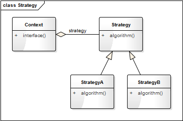
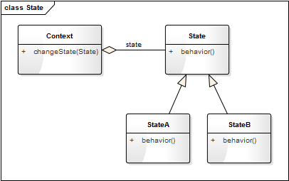
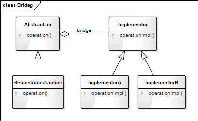

# 25 谈谈我对设计模式的理解

### 众多书籍之下为何还要写这一课程

设计模式可谓是老生常谈的不能再老生常谈了，我曾经思考过很长一段时间要不要去写这系列的文章，因为这一主题的书籍实在太多了，网上免费的资料也非常的多。思考再三，最终决定写它，主要有以下几个原因：

- 网上的资料虽然非常多，但就如同你所知：网上资料一大抄！内容极其雷同而且粗浅。
- 讲设计模式的书籍虽然非常多，但用 Python 来描述的非常的少，有那么几本也是从国外翻译过来的，内容多少会有些变味。
- 能把抽象难懂的设计模式讲的通俗易懂、妙趣横生的很少。

### 设计模式玄吗

我觉得它玄，也不玄！

怎么讲呢？《孙子兵法》玄不玄？也玄！因为芸芸众生中能看懂悟透的人很少，能真正灵活应用的人更少！而且战争的成败受众多因素的影响，如天时、地利、人和。但你要问中国历代名将中有哪个不读《孙子兵法》的？几乎没有，如三国的曹操、南宋的岳飞、明代的戚继光，这些人可谓是把兵法用的出神入化了。那两千多年来世界其他国家没看过《孙子兵法》的是怎么打仗的？照样打。没学过兵法的人就不会使用里面的计策吗？当然会用，而且经常用。比如“借刀杀人”，相信这个人们在耍小聪明的时候都用过；“打草惊蛇”这个计策估计连小孩都会用，这样的例子还有很多。只是你不知道古代已经有人把它总结成“战争模式”了。所以说《孙子兵法》其实也不玄。

同样的道理，“设计模式”是一套被反复使用、多数人知晓的、无数工程师实践的代码设计经验的总结。因此它比较抽象，没有一定的编程经验很难读懂，更不能理解其精髓。所以很多人觉得它玄，但真正的架构师和优秀的程序员，几乎没有不看设计模式的。能把设计模式应用的如火纯青的，那就是大神。同样的问题：没有学过设计模式就不会使用设计模式了吗？当然不是！只要你有两年以上的编程经验，像模板模式、单例模式、适配器（Wrapper）模式，这些你肯定用过（那怕你没有看一本设计模式的书），只是你不知道有前人已经总结成书了，所以说设计模式其实也不玄！

网上看到一句话，我还是很赞同这种说法的：

> 对于 10w 行以下的代码量的汉子来说，设计模式 = 玄学。
>
> 对于 10w ~ 50w 行代码量的汉子来说，设计模式 = 科学。
>
> 对于 50w 行以上代码量的汉子来说，设计模式 = 文学。

### 如何区分不同的模式

设计模式是对面向对象思想的常见使用场景的模型总结和归纳。\*\*设计模式之间的区分，要更多地从我们含义和应用场景去区别，而不应该从他们的类图结构来区分。\*\*看策略模式、状态模式、桥接模式这三种模式的类图几乎是完全一样的（如下图）。从面向的对象的继承、多态、封装的角度来分析，他们是完全一样的。

但他们的实际应用场景却不同、侧重点不同。策略侧重的算法的变更导致执行结果的差异，状态侧重的是对象本身状态的改变而导致行为的变化，而桥接强调的是实现与抽象的分离。

### 编程思想的三重境界

所以有人说：**设计模式这东西很虚！ **要我说，** 它确实也虚！** 如果它看得见摸得着，那我就没必要讲了。我说过，设计模式是一套被反复使用、多数人知晓的、无数工程师实践的代码设计经验的总结，它是面向对象思想的高度提炼和模板化。既然是思想，能不虚吗？它就想道家里面的“道”的理念，每个人对道的理解是不样的，对道的认知也有不同的境界，而不同的境界对应着不同的修为。

宋代禅宗大师青原行思提出参禅的三重境界：

> 参禅之初，看山是山，看水是水；
>
> 禅有悟时，看山不是山，看水不是水；
>
> 禅中彻悟，看山仍是山，看水仍是水。

上面讲述的是对禅道的认识的三重不同境界，设计模式既然是一种编程思想，那也会有不同的境界，我这里也概括它为三重境界：

- \*\*一重境界：\*\*依葫芦画瓢。这属于初学阶段，以为设计模式只有书中提到的那几种模式，模式名称也能倒背如流。但真正要用时，还得去翻书，依关类图照般照改。
- \*\*二重境界：\*\*灵活运用。这属于中级阶段，对每一种设计模式都非常熟悉，有较深入的思考，而且能够根据实际的业务场景选择合适的模式，并对相应的模式进行恰当的修改以符合实际需求。
- **三重境界： **心中无模式。这算终于阶段，这里说无模式并非他不用设计模式，而是设计模式的理念已经融入他的灵魂和血液，他已经不在乎哪种具体的通用模式了，每一处代码都遵循了设计的原则，能灵活地创造和使用新的模式（可能这种模式他自己也不知道该叫什么名）。这就是所谓的** 心中无模式却处处是模式**。
