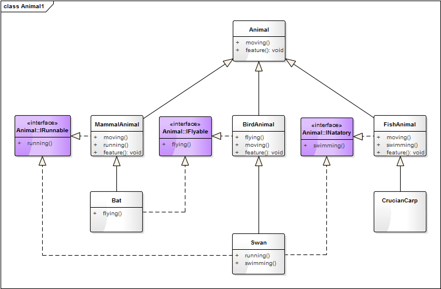
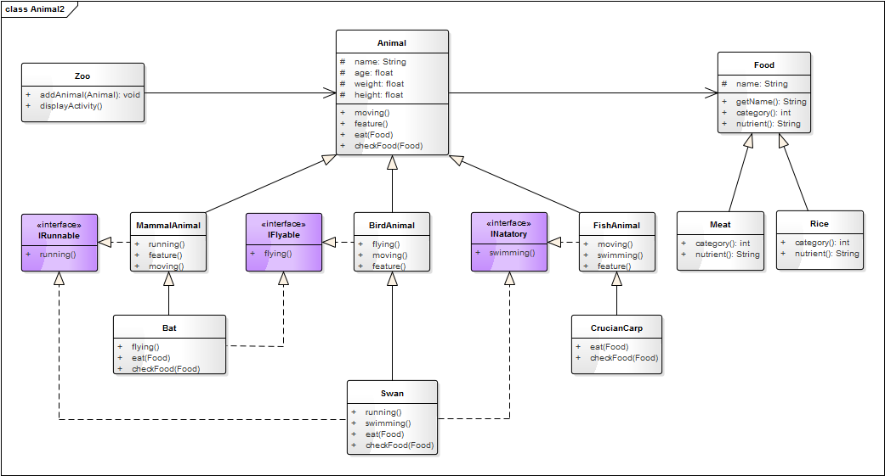
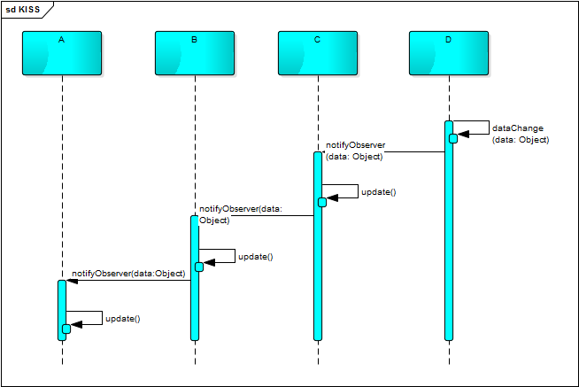

# 26 谈谈我对设计原则的思考

如果说 **设计模式** 是面向对象编程的编程思想，那 **设计原则** 就是这些编程思想的指导总纲。SOLID 原则是众多设计原则中威力最大、最广为人知的五大原则，除 SOLID 原则外，还有一些更为简单实用的原则。

### SOLID 原则

SOLID 是面向对象设计（OOD）的头五大基本原则的首字母缩写，由俗称「鲍勃大叔」的 [Robert C. Martin](https://en.wikipedia.org/wiki/Robert_C._Martin) 在《敏捷软件开发：原则、模式与实践》一书中整理收集而来。这些原则结合在一起能够方便程序员开发易于维护和扩展的软件。这五原则分别是：

- S——单一职责原则
- O——开放封闭原则
- L——里氏替换原则
- I——接口隔离原则
- D——依赖倒置原则

#### 单一职责原则（Single Responsibility Principle，SRP）

##### **核心思想：**> A class should have only one reason to change

> 一个类应该有且仅有一个原因引起它的变更。

这句话这样说可能不太容易理解，解释一下：类 T 负责两个不同的职责（可以理解为功能）：职责 P1、职责 P2。当由于职责 P1 需求发生改变而需要修改类 T 时，有可能会导致原本运行正常的职责 P2 功能发生故障。这就不符合单一职责原则，这时就应该将类 T 拆分成两个类 T1、T2，使 T1 完成职责 P1 功能，T2 完成职责 P2 功能。这样，当修改类 T1 时，不会使职责 P2 发生故障风险；同理，当修改 T2 时，也不会使职责 P1 发生故障风险。

##### **说人话：**> 一个类只负责一项功能或一类相似的功能

当然这个“一”并不是绝对的，应该理解为一个类只负责尽可能独立的一项功能，尽可能少的职责。就好比一个人，我们的精力、时间都是有限的；如果我们什么事情都做，那什么事情都做不好；而应该集中精力做一件事，才能把事情做好。

##### **案例分析**我们知道动物都能运动，假设都有一个跑的方法。产品经理告诉你只处理陆生哺乳动物，那我们定义一个动物的类

```python
class Animal:
    """动物"""
    def __init__(self, name):
        self.__name = name
    def running(self):
        print(self.__name + "在跑...")
Animal("猫").running()
Animal("狗").running()
```

结果：

```
猫在跑...
狗在跑...
```

Ok，这样定义完全没有问题，一个类只负责一项功能。但过了两天，产品经理告诉你，我们的动物不只有陆生动物，还要有水生动物（如鱼类），水生动物是在水里游。这个时候你能拿把刀砍了产品经理吗？想多了，祭天的还是程序员！

还是好好改代码吧！这个时候，我们可能会有三种写法：**方法一：**\`\`\`
class Animal:
"""动物"""
def **init**(self, name, type):
self.\_\_name = name
self.\_\_type = type
def running(self):
if(self.\_\_type == "水生"):
print(self.\_\_name + "在水里游...")
else:
print(self.\_\_name + "在陆上跑...")
Animal("狗", "陆生").running()
Animal("鱼", "水生").running()

````

这种写法，改起来相对快速，但在代码的方法级别就违背了单一职责原则，因为影响 running 这个功能的因素就有两个，一个是陆地的因素，一个水质的因素。如果那一天要区分是在池塘里游还是在海里游，就又得修改 running 方法（增加 if… else… 判断），这种修改对陆地上跑的动物来说，存在极大的隐患。可能那一天突然程序出现 Bug：骆驼在海里游了。哈哈！** 方法二： **```python
class Animal:
    """动物"""
    def __init__(self, name):
        self.__name = name
    def running(self):
        print(self.__name + "在陆上跑...")
    def swimming(self):
        print(self.__name + "在水里游...")
Animal("狗").running()
Animal("鱼").swimming()
````

这种写法在代码的方法级别是符合单一职责原则的，一个方法负责一项功能，因水质的原因修改 swimming 方法不会影响陆地上跑的动物。但在类的级别它是不符合单一职责原则的，因为它同时可以干两件事情：跑和游。而且这种写法给用户增加了麻烦，调用方需要时刻明白那种动物是会跑的，那种动物是会游泳的；不然就很可能会出现“狗调用了 swimming 方法，鱼调用了 running 方法”窘境。**方法三：**\`\`\`
class TerrestrialAnimal():
"""陆生生物"""
def **init**(self, name):
self.\_\_name = name
def running(self):
print(self.\_\_name + "在陆上跑...")
class AquaticAnimal():
"""水生生物"""
def **init**(self, name):
self.\_\_name = name
def swimming(self):
print(self.\_\_name + "在水里游...")
TerrestrialAnimal("狗").running()
AquaticAnimal("鱼").swimming()

````

这种写法就符合单一职责原则。此时影响动物移动的因素就有两个：一个是陆地的因素，一个水质的因素；动物对应两个职责，一个是跑，一个是游。所以我们将动物根据不同的职责拆分成陆生生物（TerrestrialAnimal）和水生生物（AquaticAnimal）。

#####** 优点：**

*   功能单一，职责清晰。
*   增强可读性，方便维护。

##### **缺点：**

*   拆分的太详细，类的数量会急剧增加。
*   职责的的度量没有统一的标准，需要根据项目实现情况而定。

#### 开放封闭原则（Open Close Principle，OCP）

##### **核心思想： **> Software entities（classes、modules、functions、etc.）should be open for extension，but closed for modification.
> 
> 软件实体（如类、模块、函数等）应该对拓展开放，对修改关闭。

#####** 说人话： **在一个软件产品的生命周期内，不可避免的会有一些业务和需求变化。我们在设计代码的时候应该尽可能地考虑这些变化，在增加一个功能时，应当尽可能地不去改动已有的代码；当修改一个模块时不应该影响到其他的模块。

#####** 案例分析 **我们还是以上面的动物为例，假设有这样一个场景：动物园里有很多动物，游客希望观察每一种动物是怎样活动的。

根据上面已有的代码，我们可能会写出这样的调用方式：

```python
class Zoo:
    """动物园"""
    def __init__(self):
        self.__animals =[
            TerrestrialAnimal("狗"),
            AquaticAnimal("鱼")
        ]
    def displayActivity(self):
        for animal in self.__animals:
            if isinstance(animal, TerrestrialAnimal):
                animal.running()
            else:
                animal.swimming()
zoo = Zoo()
zoo.displayActivity()
````

这种写法目前是没有问题的，但如果要再加一个类型的动物（如鸟类，而鸟是会飞的），这个时候就又得修改 displayActivity 方法，再增加一个 if… else… 判断。

```python
def displayActivity(self):
    for animal in self.__animals:
        if isinstance(animal, TerrestrialAnimal):
            animal.running()
        elif isinstance(animal, BirdAnimal)
            animal.flying()
        else:
            animal.swimming()
```

这是不符合“开放封闭原则”，因为每增加一个类别就要修改 displayActivity，我们要对修改关闭。这时我们就要重新设计我们的代码，如下：

```python
from abc import ABCMeta, abstractmethod
class Animal(metaclass=ABCMeta):
    """动物"""
    def __init__(self, name):
        self._name = name
    @abstractmethod
    def moving(self):
        pass
class TerrestrialAnimal(Animal):
    """陆生生物"""
    def __init__(self, name):
        super().__init__(name)
    def moving(self):
        print(self._name + "在陆上跑...")
    def checkFood(self, food):
        food.category() == ""
class AquaticAnimal(Animal):
    """水生生物"""
    def __init__(self, name):
        super().__init__(name)
    def moving(self):
        print(self._name + "在水里游...")
class BirdAnimal(Animal):
    """鸟类动物"""
    def __init__(self, name):
        super().__init__(name)
    def moving(self):
        print(self._name + "在天空飞...")
class Monkey(TerrestrialAnimal):
    """猴子"""
    def __init__(self, name):
        super().__init__(name)
    def climbing(self):
        print(self._name + "在爬树，动作灵活轻盈...")
class Zoo:
    """动物园"""
    def __init__(self):
        self.__animals =[]
    def addAnimal(self, animal):
        self.__animals.append(animal)
    def displayActivity(self):
        print("观察每一种动物的活动方式：")
        for animal in self.__animals:
            animal.moving()
```

测试代码：

```python
def testZoo():
    zoo = Zoo()
    zoo.addAnimal(TerrestrialAnimal("狗"))
    zoo.addAnimal(AquaticAnimal("鱼"))
    zoo.addAnimal(BirdAnimal("鸟"))
    zoo.displayActivity()
```

结果：

```python
观察每一种动物的活动方式：
狗在陆上跑...
鱼在水里游...
鸟在天空飞...
```

这时我们把各种类型的动物抽象出了一个基类——动物类（Animal）；同时我们把游（swimming）和飞（flying）的动作也抽象成了移动（moving）。这样我们每增加一种类型的动物，只要增加一个 Animal 的子类即可，其他代码几乎可以不用动；要修改一种类型动物的行为，只要修改对应的类即可，其他的类不受影响；这才是符合面向对象的设计。

#### 里氏替换原则（Liskov Substitution Principle，LSP）

##### **核心思想：**> functions that use pointers to base classes must be able to use objects of derived classes without knowing it

> 所有能引用基类的地方必须能透明地使用其子类的对象。

有一个类 T 有两个子类 T1、T2，能够使用 T 的对象的地方，就能用 T1 的对象或 T2 的对象，因为子类拥有父类的所有属性和行为。

##### \*\*说人话：\*\*只要父类能出现的地方子类就能出现（就可以用子类来替换他），反之，子类能出现的地方父类就不一定能出现（子类拥有父类的所有属性和行为，但子类拓展了更多的功能）

##### 案例分析

我们还是以动物为例，陆地上的动物都能在地上跑，但猴子除了能在陆地上跑之外还会爬树。因此我们可以为猫单独定义一个类 Monkey，并在 Zoo 类中增加一个观察指定动物的爬树行为的方法。

增加一猴子类：

```python
class Monkey(TerrestrialAnimal):
    """猴子"""
    def __init__(self, name):
        super().__init__(name)
    def climbing(self):
        print(self._name + "在爬树，动作灵活轻盈...")
```

修改 Zoo 类，增加 climbing 方法：

```
class Zoo:
    """动物园"""
    def __init__(self):
        self.__animals =[]
    def addAnimal(self, animal):
        self.__animals.append(animal)
    def displayActivity(self):
        print("观察每一种动物的活动方式：")
        for animal in self.__animals:
            animal.moving()
    def monkeyClimbing(self, monkey):
        monkey.climbing()
```

测试代码：

```python
def testZoo():
    zoo = Zoo()
    zoo.addAnimal(TerrestrialAnimal("狗"))
    zoo.addAnimal(AquaticAnimal("鱼"))
    zoo.addAnimal(BirdAnimal("鸟"))
    monkey = Monkey("猴子")
    zoo.addAnimal(monkey)
    zoo.displayActivity()
    print()
    print("观察猴子的爬树行为：")
    zoo.monkeyClimbing(monkey)
```

结果：

```
观察每一种动物的活动方式：
狗在陆上跑...
鱼在水里游...
鸟在天空飞...
猴子在陆上跑...
观察猴子的爬树行为：
猴子在爬树，动作灵活轻盈...
```

这里 Zoo 的 addAnimal 方法接受 Animal 类的对象，所以 Animal 子类的对象都能传入。但 Zoo 的 monkeyClimbing 方法只接受 Monkey 类的对象，当传入 TerrestrialAnimal（Monkey 的父类) 的对象时，程序将报错；这说明能出现子类的地方，父类不一定能出现。

#### 依赖倒置原则（Dependence Inversion Principle，DIP）

##### **核心思想：**> High level modules should not depend on low level modules; both should depend on abstractions. Abstractions should not depend on details. Details should depend upon abstractions

> 高层模块不应该依赖底层模块，二者都该依赖其抽象，抽象不应该依赖细节，细节应该依赖抽象。

高层模块就是调用端，低层模块就是具体实现类，抽象就是指接口或抽象类，细节也是指具体的实现类，也就是说我们只依赖抽象编程。

##### \*\*说人话：\*\*把具有相同特征或相似功能的类，抽象成接口或抽象类，让具体的实现类继承这个抽象类（或实现对应的接口）。抽象类（接口）负责定义统一的方法，实现类负责实现具体功能的实现

##### **案例分析**

上面“开放封闭原则”的例子中，我们把各种类型的动物抽象成一个抽象类 Animal，并定义统一的方法 moving()，这也是遵循了依赖倒置原则。我们的 Zoo（动物园）类是一个高层模块，Zoo 类中的 displayActivity 方法依赖的是动物的抽象类 Animal 和其定义的抽象方法 running()，这就是高层模块依赖其抽象，而不是依赖细节的表现。

我们对这一案例进行更深层次的挖掘一下：我们知道人以食为天，动物更是如此，每天都要吃东西。一说到动物吃东西，你可能立刻就会想到：狗喜欢吃肉，鱼喜欢吃草，鸟喜欢吃虫子！你在小学就会背了，哈哈！

如果让你用程序来模拟一下动物吃东西的过程，你会怎么设计你的程序呢？你会写出下面这样的代码吗？

```python
 class Dog:
    def eat(self, meat):
        pass
class Fish:
    def eat(self, grass):
        pass
```

如果写出这样的代码，那就糟糕了！ 因为这样实现你会有几个问题：

- 每一种动物，你都需要为其定义一个食物类，高度依赖于细节；
- 每一种动物只能吃一种东西（它最喜欢的食物），这与实现想违背；如猫不仅喜欢吃老鼠，还喜欢吃鱼；不仅鱼喜欢吃草，牛也喜欢吃草。

这个时候应该遵循 **依赖倒置原则** 来进行设计：抽象出一个食物（Food）类，动物（Animal）该依赖食物的抽象类 Food，而不应该依赖基体的细节（具体的食物）。我们根据这一原则来实现一下我们代码，如下：

```python
from abc import ABCMeta, abstractmethod
# 引入ABCMeta和abstractmethod来定义抽象类和抽象方法
class Animal(metaclass=ABCMeta):
    """动物"""
    def __init__(self, name):
        self._name = name
    def eat(self, food):
        if(self.checkFood(food)):
            print(self._name + "进食" + food.getName())
        else:
            print(self._name + "不吃" + food.getName())
    @abstractmethod
    def checkFood(self, food):
        pass
class Dog(Animal):
    """狗"""
    def __init__(self):
        super().__init__("狗")
    def checkFood(self, food):
        return food.category() == "肉类"
class Swallow(Animal):
    """燕子"""
    def __init__(self):
        super().__init__("燕子")
    def checkFood(self, food):
        return food.category() == "昆虫"
class Food(metaclass=ABCMeta):
    """食物"""
    def __init__(self, name):
        self._name = name
    def getName(self):
        return self._name
    @abstractmethod
    def category(self):
        """食物类别"""
        pass
    @abstractmethod
    def nutrient(self):
        """营养成分"""
        pass
class Meat(Food):
    """肉"""
    def __init__(self):
        super().__init__("肉")
    def category(self):
        return "肉类"
    def nutrient(self):
        return "蛋白质、脂肪"
class Worm(Food):
    """虫子"""
    def __init__(self):
        super().__init__("虫子")
    def category(self):
        return "昆虫"
    def nutrient(self):
        return "蛋白质含、微量元素"
```

测试代码：

```python
def testFood():
    dog = Dog()
    swallow = Swallow()
    meat = Meat()
    worm = Worm()
    dog.eat(meat)
    dog.eat(worm)
    swallow.eat(meat)
    swallow.eat(worm)
```

结果：

```
狗进食肉
狗不吃虫子
燕子不吃肉
燕子进食虫子
```

在上面的例子中，动物抽象出一个父类 Animal，食物也抽象出一个抽象类 Food。Animal 抽象来不依赖于细节（具体的食物类），具体的动物（如 Dog），也不依赖于细节（具体的食物类），不能就是说我们只依赖抽象编程。

#### 迪米特法则（Law of Demeter，LoD）

##### **核心思想：**> Each unit should have only limited knowledge about other units: only units "closely" related to the current unit

> Only talk to your immediate friends, don't talk to strangers.
>
> 每一个逻辑单元应该对其他逻辑单元有最少的了解：也就是说只亲近当前的对象。
>
> 只和直接（亲近）的朋友说话，不和陌生人说话。

如类 A 中有类B的对象；类 B 中有类 C 的对象，调用方有一个类 A 的对象 a，这时要访问 C 对象的属性，不要采用类似下面的写法：

```
a.getB().getC().getProperties()
```

而应该是：

```
a.getCProperties()
```

至于 getCProperties 怎么实现是类 A 要负责的事情，我只和我直接的对象 a 进行交互，不访问我不了解的对象。

##### \*\*说人话：\*\*一个类对自己依赖的类知道的越少越好，只需要和直接的对象进行交互，而不用在乎这个对象的内部组成结构

##### **案例分析**大家都知道大熊猫是我们国家的国宝，为数不多的熊猫大部分都存活在动物动物园中。而动物园内种类繁多，布局复杂，如有鸟类馆、熊猫馆。假设某国外领导人来访华，参观我们的动物园，他想知道动物园内叫“贝贝”大熊猫年龄多大，体重多少。他难道要先去调取熊猫馆的信息，再去查找叫“贝贝”的这只大熊猫，再去看他的信息吗？显然不用，他只要问一下动物园的馆长就可以了。动物园的馆长会告诉他所有需要的信息，因为他只认识动物园的馆长，并不了解动物园的内部结构，也不需要去了解

以上过程，类似下面的代码：

```python
zooAdmin.getPandaBeiBeiInfo()
```

#### 接口隔离原则（Interface Segregation Principle，ISP）

##### **核心思想：**> Clients should not be forced to depend upon interfaces that they don't use. Instead of one fat interface many small interfaces are preferred based on groups of methods, each one serving one submodule

> 客户端不应该依赖它不需要的接口。用多个细粒度的接口来替代由多个方法组成的复杂接口，每一个接口服务于一个子模块。

类 A 通过接口 interface 依赖类 C，类 B 通过接口 interface 依赖类 D，如果接口 interface 对于类 A 和类 B 来说不是最小接口，则类 C 和类 D 必须去实现他们不需要的方法。

##### **说人话： **建立单一接口，不要建立庞大臃肿的接口，尽量细化接口，接口中的方法尽量少。也就是说，我们要为各个类建立专用的接口，而不要试图去建立一个很庞大的接口供所有依赖它的类去调用。** 接口尽量小，但是要有限度**。当发现一个接口过于臃肿时，就要对这个接口进行适当的拆分，但是如果过小，则会造成接口数量过多，使设计复杂化；所以一定要适度

##### **案例分析**我们知道在生物分类学中，从高到低有界、门（含亚门）、纲、目、科、属、种七个等级的分类。脊椎动物就是脊索动物的一个亚门，是万千动物世界中数量最多、结构最复杂的一个门类。哺乳动物（也称兽类）、鸟类、鱼类是脊椎动物中最重要的三个子分类；哺乳动物大都生活于陆地，鱼类都生活在水里，而鸟类大都能飞行

但这些特性并不是绝对的，如蝙蝠是哺乳动物，但它却能飞行；鲸鱼也是哺乳动物，却生活在海中；天鹅是鸟类，能在天上飞，也能在水里游，还能在地上走。所以我们上面的示例中将动物根据活动场所分为水生动物、陆生动物和飞行动物是不够准确的，因为奔跑、游泳、飞翔是动物的一种行为，应该抽象成接口，而且有些动物可能同时具有多种行为。 我们应该根据生理特征来分类，如哺乳类、鸟类、鱼类；哺乳类动物具有恒温，胎生，哺乳等生理特征；鸟类动物具有恒温，卵生，前肢成翅等生理特征；鱼类动物具有流线型体形，用鳃呼吸等生理特征。

这里将奔跑、游泳、飞翔抽象成接口就是对接口的一种细粒度拆分，提高程序设计灵活性。代码的实现如下：

```python
from abc import ABCMeta, abstractmethod
# 引入ABCMeta和abstractmethod来定义抽象类和抽象方法
class Animal(metaclass=ABCMeta):
    """(脊椎)动物"""
    def __init__(self, name):
        self._name = name
    def getName(self):
        return self._name
    @abstractmethod
    def feature(self):
        pass
    @abstractmethod
    def moving(self):
        pass
class IRunnable(metaclass=ABCMeta):
    """奔跑的接口"""
    @abstractmethod
    def running(self):
        pass
class IFlyable(metaclass=ABCMeta):
    """飞行的接口"""
    @abstractmethod
    def flying(self):
        pass
class INatatory(metaclass=ABCMeta):
    """游泳的接口"""
    @abstractmethod
    def swimming(self):
        pass
class MammalAnimal(Animal, IRunnable):
    """哺乳动物"""
    def __init__(self, name):
        super().__init__(name)
    def feature(self):
        print(self._name + "的生理特征：恒温，胎生，哺乳。")
    def running(self):
        print("在陆上跑...")
    def moving(self):
        print(self._name + "的活动方式：", end="")
        self.running()
class BirdAnimal(Animal, IFlyable):
    """鸟类动物"""
    def __init__(self, name):
        super().__init__(name)
    def feature(self):
        print(self._name + "的生理特征：恒温，卵生，前肢成翅。")
    def flying(self):
        print("在天空飞...")
    def moving(self):
        print(self._name + "的活动方式：", end="")
        self.flying()
class FishAnimal(Animal, INatatory):
    """鱼类动物"""
    def __init__(self, name):
        super().__init__(name)
    def feature(self):
        print(self._name + "的生理特征：流线型体形，用鳃呼吸。")
    def swimming(self):
        print("在水里游...")
    def moving(self):
        print(self._name + "的活动方式：", end="")
        self.swimming()
class Bat(MammalAnimal, IFlyable):
    """蝙蝠"""
    def __init__(self, name):
        super().__init__(name)
    def running(self):
        print("行走功能已经退化。")
    def flying(self):
        print("在天空飞...", end="")
    def moving(self):
        print(self._name + "的活动方式：", end="")
        self.flying()
        self.running()
class Swan(BirdAnimal, IRunnable, INatatory):
    """天鹅"""
    def __init__(self, name):
        super().__init__(name)
    def running(self):
        print("在陆上跑...", end="")
    def swimming(self):
        print("在水里游...", end="")
    def moving(self):
        print(self._name + "的活动方式：", end="")
        self.running()
        self.swimming()
        self.flying()
class CrucianCarp(FishAnimal):
    """鲫鱼"""
    def __init__(self, name):
        super().__init__(name)
```

测试代码：

```python
def testAnimal():
    bat = Bat("蝙蝠")
    bat.feature()
    bat.moving()
    swan = Swan("天鹅")
    swan.feature()
    swan.moving()
    crucianCarp = CrucianCarp("鲫鱼")
    crucianCarp.feature()
    crucianCarp.moving()
```

结果如下：

```
蝙蝠的生理特征：恒温，胎生，哺乳。
蝙蝠的活动方式：在天空飞...行走功能已经退化。
天鹅的生理特征：恒温，卵生，前肢成翅。
天鹅的活动方式：在陆上跑...在水里游...在天空飞...
鲫鱼的生理特征：流线型体形，用鳃呼吸。
鲫鱼的活动方式：在水里游...
```

上面这些代码组织成如下的类图结构：



##### **优点：**

- **提高程序设计灵活性**。将接口进行细分后，多个接口可自由发展，互不干扰。
- **提高内聚，减少对外交互。** 使接口用最少的方法去完成最多的事情。
- \*\*为依赖接口的类定制服务。\*\*只暴露给调用的类它需要的方法，它不需要的方法则隐藏起来。

### 实际项目中是否一定要遵循这些设计原则

#### 软件设计是一个逐步优化的过程

从上面六个原则的讲解中，应该体会到**软件的设计是一个循序渐进，逐步优化的过程**。经过一次次的逻辑分析，一层层的结构调整和优化，最终得出一个较为合理的设计图。整个动物世界的类图如下：



我们对上面五个原则做一个总结：

1.**单一职责原则告诉我们实现类要职责单一 **。用于类的设计，增加一个类时使用 SRP 原则来核对该类的设计是否纯粹干净，也就是让一个类的功能尽可能单一，不要想着一个类包揽所有功能。
2.** 里氏替换原则告诉我们不要破坏继承体系 **。用于指导类继承的设计，设计类之间的继承关系时，使用 LSP 原则来判断这种继承关系是否合理。只要父类能出现的地方子类就能出现（就可以用子类来替换他），反之则不一定成立。
3.** 依赖倒置原则告诉我们要面向接口编程 **。用于指导如何抽象，即要依赖抽象和接口编程，不要依赖具体的实现。
4.** 接口隔离原则告诉我们在设计接口的时候要精简单一 **。用于指导接口的设计，当发现一个接口过于臃肿时，就要对这个接口进行适当的拆分。
5.** 开放封闭原则告诉我们要对扩展开放，对修改关闭**。开闭原则可以说是整个设计的最终目标和原则！开闭原则是总纲，其他4个原则是对这个原则具体解释。

#### 是否一定要遵循这些设计原则

设计原则是进行软件设计的核心思想和规范。那在实际的项目开发中，是否一定要遵循原则？答案不总是肯定，要视情况而定。因为在实际的项目开发中，必须要安时按量地完成任务。项目的进度受时间成本，测试资源的影响，而且程序一定要保存稳定可以。

还记得我们在单一职责原则中提到一个例子吗？面对需求的变更，我们有三种解决方式：方法一：直接改原有的函数（方法），这种方式最快速，但后期维护最困难，而且不便拓展；这种方式一定是要杜绝的。方法二：增加一个新方法，不修改原有的方法，这在方法级别是符合单一职责原则的；但对上层的调用会增加不少麻烦。在项目比较复杂，类比较庞大，而且测试资源比较紧缺的时候，不失为一种快速和稳妥的方式。因为如果要进行大范围的代码重构，势必要对影响到的模块进行全覆盖的测试回归，才能确保系统的稳定可靠。方法三：增加一个新的类来负责新的职责，两个职责分离，这是符合单一职责原则的。在项目首次开发，或逻辑相对简单的情况下，需要采用这种方式。

在实际的项目开发中，我们要尽可能地遵循这些设计原则。但并不是要 100% 地遵从，需要结果实际的时间成本、测试资源、代码改动难度等情况进行综合评估，适当取舍，采用最高效合理的方式。

### 更为实用的设计原则

前面讲的面向对象设计的六大原则是一种理想环境下的设计原则。在实际的项目开发中，往往没有这么充分的条件（如团队成员的整体技术水平，团队的沟通成本），或没有这么充足的时间遵循这些原则去设计，或遵循这些原则设计后实现成本太大。在受现实条件所限，不能遵循六大原则来设计时，我们还可以遵循下面这些更为简单、实用的原则，让我们的程序更加灵活，更易于理解。

#### LoD 原则（Law of Demeter）

> Each unit should have only limited knowledge about other units: only units "closely" related to the current unit.
>
> Only talk to your immediate friends, don't talk to strangers.
>
> 每一个逻辑单元应该对其他逻辑单元有最少的了解：也就是说只亲近当前的对象。
>
> 只和直接（亲近）的朋友说话，不和陌生人说话。

这一原则又称为迪米特法则，简单的说就是：一个类对自己依赖的类知道的越少越好，只需要和直接的对象进行交互，而不用在乎这个对象的内部组成结构。

如类 A 中有类 B 的对象；类 B 中有类 C 的对象，调用方有一个类 A 的对象 a，这时要访问 C 对象的属性，不要采用类似下面的写法：

```
a.getB().getC().getProperties()
```

而应该是：

```
a.getCProperties()
```

至于 getCProperties 怎么实现是类 A 要负责的事情，我只和我直接的对象 a 进行交互，不访问我不了解的对象。

大家都知道大熊猫是我们国家的国宝，为数不多的熊猫大部分都存活在动物动物园中。而动物园内种类繁多，布局复杂，如有鸟类馆，熊猫馆。假设某国外领导人来访华，参观我们的动物园，他想知道动物园内叫“贝贝”大熊猫年龄多大，体重多少。他难道要先去调取熊猫馆的信息，再去查找叫“贝贝”的这只大熊猫，再去看他的信息吗？显然不用，他只要问一下动物园的馆长就可以了。动物园的馆长会告诉他所有需要的信息，因为他只认识动物园的馆长，并不了解动物园的内部结构，也不需要去了解。

以上过程，可用类似下面的代码来表示：

```python
zooAdmin.getPandaBeiBeiInfo()
```

#### KISS 原则（Keep It Simple and Stupid）

> Keep It Simple and Stupid
>
> 保持简单和愚蠢

这一原则正如这句话本身一样容易理解。简单就是说要让你的程序能简单、快速地被实现；愚蠢是说你的设计要简单到傻瓜都能理解，即简单就是美！

为什么要简单呢？因为大多数的技术团队，每一个团队成员的技术水平都是参差不齐。如果你的程序设计的太复杂，有些成员可能无法理解这种设计的真实意图，而且复杂的程序讲解起来也会增加沟通成本。为什么说愚蠢呢？对同样需要的一个软件，每个人都有自己独特的思维逻辑和实现方式，因此你写的程序对于另一个人来说就是个陌生的项目。所以你的代码要愚蠢到不管是什么时候，不管是谁来接手这个项目，都要能很容易地被看懂；否则，不要让他看到你的联系方式和地址，你懂得~

有些人可能会觉得设计模式这东西很大上（神化了它的功能），学了一些设计模式，就为了模式而模式，去过渡地设计你的程序，这是非常不可取的。监听模式是一种应用非常广泛的设计模式，合理地应用能很好地对程序进行解耦，使程序的表现层和数据逻辑层分离！但在我接手过的一些项目中却看有这样的设计：A 监听 B，B 又监听 C，C 再监听 D，这就会出现数据的层层传递和连锁式的反应。因为如果 D 的数据发生变更，就会引起 C 的更新，C 的更新又会影响 B，B 又影响 A，同时数据也从 D 流向 C，再流向 B，再流向 A。这种一环扣一环的设计有时是非常可怕的，一旦程序出现问题，追踪起来将会非常困难；而且只要其中某一环境出现需求的变更，就可能会影响后续的所有环。如果是一个新人来接手这样的项目，你能想像到他也会有多抓狂！这就是一个明显的过渡设计的例子，只要你仔细地分析需求和业务逻辑，一定可以用更好的实现方式来替换他。



#### DRY 原则（Don’t Repeat Yourself）

> Don't repeat yourself
>
> 不要重复自己

这又是一个极为容易理解的原则：不要重复你的代码，即多次遇到同样的问题，应该抽象出一个共同的解决方法，不要重复开发同样的功能，也就要尽可能地提高代码的复用率。

假设我们有下面这样一个需要：

_有一个文件上传的功能，我们要根据上传的文件的类型进行分目录存放，这时我们就需要一个根据文件名来获取存放路径的方法_。

```python
import os
# 导入os库,用于文件、路径相关的解析
def getPath(basePath, fileName):
    extName = os.path.splitext(fileName)[1]
    filePath = basePath
    if(extName.lower() == ".txt"):
        filePath += "/txt/"
    elif(extName.lower() == ".pdf"):
        filePath += "/pdf/"
    else:
        filePath += "/other/"
    # 如果目录不存在，则创建新目录
    if (not os.path.exists(filePath)):
        os.makedirs(filePath)
    filePath += fileName
    return filePath
```

这一方法此时看起来好像没什么大的问题，但随着业务的发展，支持的文件类型肯定越来越多，你就会有一堆的 if … else … 判断。当文件类型到十几种时，估计就已经有一两屏的代码了。

仔细观察，你会发现这段代码是有很多相似和重复的部分：如 if 条件的判断和路径的拼接，这时就需要遵循 DRY 原则对代码进行重构了，重构后的代码如下：

```python
import os
# 导入os库,用于文件、路径相关的解析
def getPath(basePath, fileName):
    extName = fileName.split(".")[1]
    filePath = basePath + "/" + extName + "/"
    # 如果目录不存在，则创建新目录
    if (not os.path.exists(filePath)):
        os.makedirs(filePath)
    filePath += fileName
    return filePath
```

这样就可以放心大胆地上传文件了，不管什么类型的文件都可以支持。

要遵循DRY原则，实现的方式有非常多：

- **函数级别的封装**：把一些经常使用的，重复出现的功能封装一个通用的函数。
- **类级别的抽象**：把具有相似功能或行为的类进行抽象，抽象出一个基类，并把这几个类都有的方法提到基类去实现。
- **泛型设计**：Java 中可使用泛型，以实现通功能类对多种数据类型的支持；C++ 中可以使用类模板的方式，或宏定义的方式；Python 中可以使用装饰器来消除冗余的代码。

这一原则在单人开发时比较容易遵守和实现，但团队开发时不太容易做好，特别是对于大团队的项目，关键还是团队内的沟通。比如 Tony 在做模块 A 时用到了一个查询用户信息的功能，于是实现了一个 getUserInfo(uid) 的方法；这时团队内的另一同事 Frank 在做模块 B 时，也要一个查询用户信息的功能，但他不知道 Tony 已经实现了这个功能，已是又写了一个 getUser(uid) 的方法。

#### YAGNI 原则（You Aren't Gonna Need It）

> You aren't gonna need it, don't implement something until it is necessary.
>
> 你没必要那么着急，不要给你的类实现过多的功能，直到你需要他的时候再去实现。

这个原则简而言之为——只考虑和设计必须的功能，避免过度设计。只实现目前需要的功能，在以后您需要更多功能时，可以再进行添加。

- 如无必要，勿增添复杂性。
- 软件开发先是一场沟通博弈。

它背后的指导思想，就是尽可能快、尽可能简单地让软件运行起来（do the simplest thing that could possibly work）。

#### Rule Of Three 原则

Rule of three 称为“三次法则”，指的是当某个功能第三次出现时，才进行抽象化，即事不过三，三则重构。

这个准则表达的意思是：第一次去实现一个功能尽管大胆去做；第二次做类似的功能设计时会产生反感，但是还是会去做；第三次还要实现类似的功能做同样的事情时，就应该去审视是否有须要做这些重复劳动了，这个时候就应该去重构你的代码了：把重复或相似功能的代码进行抽象，封装成一个通过的模块或接口。

这样做有几个理由：

- 省事。如果一种功能只有一到两个地方会用到，就不需要在“抽象化”上面耗费时间了。
- 容易发现模式。“抽象化”需要找到问题的模式（即共同点或相似点），问题出现的场合越多，就越容易看出模式，从而可以更准确地“抽象化”。
- 防止过度冗余。如果相同功能的代码重复出现，后期的维护将会非常麻烦，这也就是重构的意义所在。这种重复最多可以容忍出现一次，再多就无法接受了，这与中国的“事不过三”的文化也是相符的。

到这时，你会发现 DRY 原则、YAGNI 原则、三次法则，这之间有一些非常有意思的关系：

- **DRY 原则** 告诉我们不要有重复的代码，要对重复的功能进行抽象，找到通用的解决方法。
- **YAGNI 原则**追求“快和省”，意味着不要把精力放在抽象化上面，因为很可能“你不会需要它”。

这两个原则看起来是有一些矛盾的，这时就需要**三次法则**来进行调和，寻找代码冗余和开发成本的平衡点。三次法则告诉我们什么时候可以容忍代码的冗余，什么时候需要进行重构。(关于重构的话题，下一节会有更详细的探讨)

#### CQS 原则（Command-Query Separation）

> \*\*查询：\*\*当一个方法返回一个值来回应一个问题的时候，它就具有查询的性质；
>
> \*\*命令：\*\*当一个方法要改变对象的状态的时候，它就具有命令的性质；

通常，一个方法可能是纯的 Command 模式或者是纯的 Query 模式，或者是两者的混合体。在设计接口时，如果可能，应该尽量使接口单一化（也就是方法级别的单一职责原则）。保证方法的行为严格的是命令或者是查询，这样查询方法不会改变对象的状态，没有副作用；而会改变对象的状态的方法不可能有返回值。也就是说：如果我们要问一个问题，那么就不应该影响到它的答案。实际应用，要视具体情况而定，语义的清晰性和使用的简单性之间需要权衡。将 Command 和 Query 功能合并入一个方法，方便了客户的使用，但是，降低了清晰性。这一原则尤其适用于后端接口的设计，一个接口中，尽量不要有查数据又有更新（修改或插入）数据的操作。

在系统设计中，很多系统也是以这样原则设计的，查询的功能和命令功能的系统分离，这样有则于系统性能，也有利于系统的安全性。
