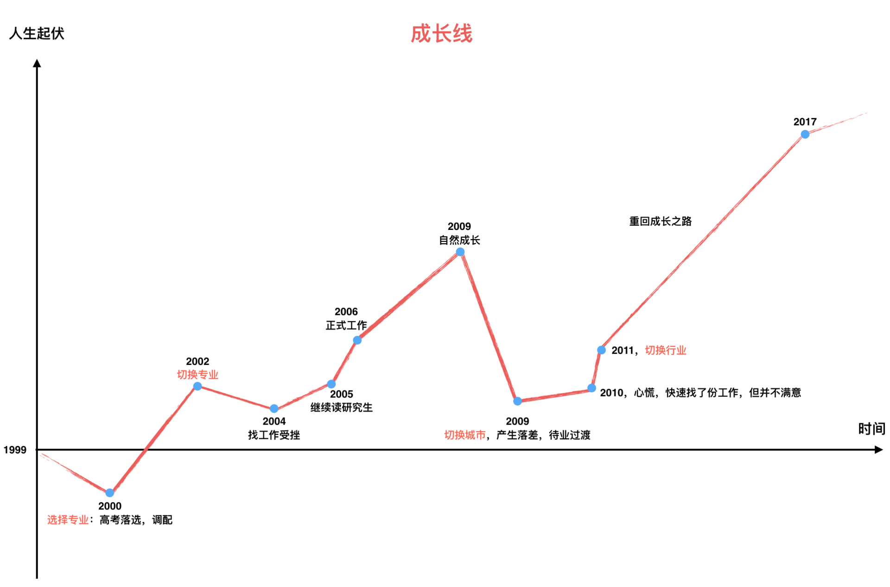

01 初心：为什么成为一名程序员？
=================

在走上程序的道路前，你不妨先问问自己成为程序员的初心是什么。回首往昔，我似乎是阴差阳错地走上了这条路，正因初心未明，所以早期的路上就多了很多迟疑和曲折。

人生路漫漫，在专栏的第一个模块里，我会和你讲讲自己走上程序道路的故事，希望这些故事能够给迷茫或者奋进中的你以启发。在人生的不同阶段里，我都喜欢做“复盘”，一方面审视过去的自己，另外一方面思索未来的方向。现在看来，这些有节奏的复盘也给我自己留下了深深的印记，也让我在某些关键节点的决策更加坚决。

首次接触
----

说起我和程序的渊源，大概可以回溯到二十多年前。

那时，我还在读初中二年级，那是四川一所少数民族中学，硬件条件不是太好。那是 1995 年，国际友人赞助赠送了学校几台苹果 II 代电脑。作为学校成绩名列前茅的学生，在比较重视分数排名的背景下我还算有点 “小特权”。这点“小特权”就是可以接触这批电脑，所以在那时我为了搞懂怎么 “玩” 这些电脑去学了下 BASIC 语言，然后在上面编程并在单调的绿色屏幕上画出了一些几何图形。

当时还挺有成就感的，一度畅想将来要考清华的计算机专业。可能，那时觉得清华就是最好的学校，而计算机和编程是当时的最爱。然而，实际情况是上了高中以后学习压力大增，再也没时间去 “玩” 这些电脑了，光应对考试已然应接不暇，渐渐就忘了初中那时的想法。

现在回想起来第一次接触程序的时候，感觉它们还算是好 “玩” 的，有一种智力上的挑战，但当时也不太可能想到十年后我将会以此为生，走上程序之路。

彼时，初心未有。

选择专业
----

对我们 80 后这一代人，高考算是人生第一次重要的选择了吧。

我那时高考填志愿，都是在考试前进行。高中三年，我都再没接触过程序了，早已忘记当年的想法。高考前，当时觉得自己对物理最有兴趣就填报了南京大学的物理系，应该也考虑过清华什么的，但没什么信心。

关于兴趣有一个有趣的说法：“往往并不是有兴趣才能做好，而是做好了才有兴趣。”高中后可能觉得当时物理学得还不错，所以就有了兴趣，并在填报高考志愿时选择了物理专业。

后来高考的结果，一方面信心不是很足，另一方面单科数学发挥也失常。南大的物理系没能上成，落到了第二志愿东北大学，调剂成了机械工程专业。这是一个随机调剂的专业，着实让我无比苦闷，学了一年后，我非常清楚，我并不喜欢这个专业，也看不清未来的职业前景。

再回首时你总会发现，有些最重要的人生路径选择，就这么有点 “无厘头” 地完成了。在面临人生重要路径的选择时，当时只考虑了兴趣，如今看来也没那么靠谱。应该多听听众人的看法，参考前人的路径，最后再自己做出决定。人生路径还是需要自己来主动、有意识地掌舵的。

彼时，初心已有，但却是混乱的。

转换专业
----

机械专业煎熬了两年，迎来了第二次选择专业的机会。

在我读完大二的时候，国家开始兴办软件学院，新开软件工程专业。我当时在机械专业也会学一门编程课：C 语言。那时对 C 语言比较感兴趣，而对专业课机械制图则完全无感，所以当机会出现时就义无反顾去转了专业。

新专业面向所有非计算机的工程专业招生，但有一个门槛是：高学费。当时，机械专业一年学费四千多点，而软件工程本科一年一万六，学费读一年就抵得上别人读四年了，这对一个工薪家庭的压力不算小。

总之，我就是这么阴差阳错地又绕到了计算机专业这条路上。作为一门新开专业，软件工程相对计算机专业更偏应用，对接企业用人需求。可见，当时（2002 年）整个 IT 行业已经面临人才缺乏的问题，国家之所以新开软件工程专业，恐怕也是经济规律在发挥作用，平衡供需两端。

于我而言，转换专业算是时代给予的机遇，我在懵懂中做出了一次正确的选择。当时并不明了，但如今回顾却是如此清晰：面对新开的软件工程专业，其实表明了一个信息，这个行业发展很快，前景很好。

人生路很长，走了一段，也需要时不时重新审视当前的路径是否适合，是否无意错过了前途更好的岔路口。

我如今会感到庆幸没有错过这个路口，当时的确是没想过从机械专业换到软件工程会有更好的发展前景，但就是这样，我绕绕弯弯、曲曲折折地入了行，成为了一名程序员。

彼时，初心虽已不乱，但依然未明。

转换行业
----

人的一生面临很多重要选择，除了高考选专业，我想转行也是其中之一。

入行后，一路走来也碰到过很多从其他行业转行成为程序员的人。曾经在招聘面试时碰到过两个程序员，他们一个是毕业于中医药大学，在药房工作两年后转行并干了 3 年；另外一个主修环境工程专业，在该行业工作 9 年后才转行程序员，并在这行干了 5 年。

那时我就在想，为什么他们都要转行做一名程序员呢？也许，客观上来说，行业的景气度让程序员的薪酬水平水涨船高。需求的持续上涨，吸引着更多的人进入，这也是经济规律。但主观上来说，可能我们也没有想好为什么就要转行成为一名程序员。

我转换到软件工程专业，毕业后顺利进入程序这行。早期一开始就是为一些传统行业公司写企业应用程序，提供 IT 服务，完成一份合同。工作五年后，我才渐渐明白，同样写程序，但为不同的行业写的程序价值真是完全不同。因此，我选择了切换到电商互联网行业来写程序。

而这一次的选择我很确定的是，至少我模糊地看到了这条路的前景，并坚定地在众多选项中排除其他路径。转行，不同的跨度，代价或大或小。但不转变就没代价吗？不见得，因为有时不做选择的代价可能更大。

此时，初心才算渐渐明了。

心明行远
----

在成长的路上，我先后经历了换专业、换城市、换行业。

去年底（2017）我适时地驻足回顾了一下从进入大学到如今这些年的学习、工作和成长经历。其中有一些重要的时间事件节点，我把它们连接起来，就成了我们大多数人的成长线。下图，是我过去 18 年的成长线：

在这张图上，选专业、换专业、换城市、换行业，这几个重要的人生选择点，我都用红色字体标记了。把过往的 18 年浓缩到一张图上后，我就清晰地看出了趋势，在切换行业之前，初心未明，成长的路上起起伏伏，波动很大，也因为不成熟的选择带来过巨大的落差感。

在工作的前几年，图上也有一段快速的自然成长期。因为这时我们就像一张白纸，只要是在认真地做事儿，总是能成长。这段时期，心其实是乱的，但因为忙而充实，也获得了很多成长，但它的问题是：这样的自然成长期有多长取决于你所做事情的天花板，所以才有了后面的一次切换城市带来的落差。

切换了行业，一路走到现在，前路不尽，心已明，行将远。

为什么成为一名程序员，初心若何？有人有天赋，有人凭兴趣，有人看前景。也许，你上路之初还未曾明了，但在路上不时叩问内心，找到初心，会走得更坚定，更长远。

闭上眼睛，你可以试着问自己走上程序道路的初心是否已经明了呢？欢迎给我留言，我们一起分享和讨论。
