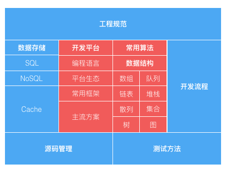

03 初程：带上一份技能地图
==============

程序世界是一片广阔的大地，相比我十多年前进入这个世界时，这片大地的边界又扩大了很多倍。初入程序世界难免迷茫，要在这个世界立足、生存，并得到很好的发展，应首要具备怎样的技能呢？未来的程序之路，先给自己准备一份基本的技能地图，先有图，再上路。

在程序的技能地图中，需要先开启和点亮哪些部分呢？回顾我过去的经历并结合现实的需要，可以从如下两个不同程度的维度来说明：

* 掌握
* 了解

掌握，意味着是一开始就要求熟练掌握的硬技能，这是生存之本。而至于掌握的深度，是动态的，倒是可以在行进过程中不断去迭代加深。了解，相对掌握不是必需，但也需要达到知其然的程度，甚至知其所以然更好。

一、掌握
----

上路之初，需要掌握的核心生存技能有哪些呢？

### 1. 开发平台

开发平台，它包括一种编程语言、附带的平台生态及相关的技术。在如今这个专业化分工越来越细的时代，开发平台决定了你会成为什么类型和方向的程序员。比如：服务端、客户端或前端开发等。其中进一步细分客户端还可以有 Windows、Mac、iOS 和 Android 等不同的平台。

#### 编程语言

语言的选择基本决定了开发平台的性质，但有些语言可能例外，如：C++、JS、C# 等，这些语言都可以跨多个平台。但即使你选的是这些语言，基本也会归属到某一类平台上。好比你选了 C++，如果你去做了客户端开发，就很少可能再去用 C++ 写服务端程序了。

关于语言的选择，前面我已经写过了选择的逻辑，便不再多说。但选择了语言，我们不仅仅是熟悉语言自身的特性，还需要掌握支撑语言的平台库。Java 若仅从语言特性上来说，有其优点，但其瑕疵和缺陷也一直被吐槽，要是没有 JDK 强大的平台库支撑，想必也不会有今天的繁荣。

#### 平台生态

与语言平台关联的还有其技术生态以及各种技术框架的繁荣程度。这些平台技术生态的存在让使用这门语言编程完成特定的任务变得容易和简单得多。Java 的生命力除了 JDK 的强大支撑，实际还有其平台生态的繁荣，也起了决定性的作用。

在选择了开发平台后，除了语言和平台库之外，其生态体系内主流的技术框架和解决方案也是必选的掌握内容。

### 2. 常用算法

在学校学习的算法，基本是解决各种计算机科学问题的通用方法。

还记得在学校时看过一本算法经典书《算法导论》。刚又把这本书的目录翻了出来过了一遍，发现已经忘记了百分之七、八十的内容。因为忘记的这部分内容，在过去的十多年工作中我基本都没机会用上。那么掌握算法的目的是为了什么呢？

有时候你可能会觉得学校教科书上学习的经典算法，在实际工作中根本就用不上。我还记得考研的时候，专业考试课就是算法与数据结构，在考卷上随手写个排序、树遍历手到擒来。但到研究生毕业去参加腾讯校招面试时，让在白纸上手写一个快排算法，我被卡住了，自然也就没通过。因为好久已经没有进行这样的练习了，而在研究生阶段一年期的公司实习工作场景也没有这样的需求。

那么为什么还要学习这些经典算法？

算法，表达的是一个计算的动态过程，它引入了一个度量标准：时空复杂度。当我回思时，发现这个度量标准思维在工作十余年中一直在发挥作用。如今，几乎所有的经典算法都能在开发平台库里找到实现，不会再需要自己从头写。但结合工作实际的业务场景，我们需要去设计更贴合需求的算法，而只要是算法它都受到时空复杂度的约束，而我们只是在其中进行平衡与折衷。

学校教科书的经典算法，是剥离了业务场景的高度抽象，当时学来有种不知道用在哪里的感觉；如今回头结合真实的业务场景需求再看，会有一种恍然大悟之感。

### 3. 数据结构

数据结构通常都和算法一起出现，但算法表达的是动态特性，而数据结构表达的是一种静态的结构特性。大部分开发平台库都提供了最基础和常用的数据结构实现，这些都是我们需要熟悉并掌握的，包括：

* 数组 Array
* 链表 Linked List
* 队列 Queues
* 堆栈 Stacks
* 散列 Hashes
* 集合 Sets

另外，还有两种数据结构不属于基础结构，但在现实中有非常广泛的直接映射场景。

* 树 Trees
* 图 Graphs

每种结构都有各种变体，适用于不同的场景，甚至很多时候你还需要会组合不同的结构去解决一些更复杂的问题。

二、了解
----

需要了解的内容比需要掌握的更广泛，但了解了这些方面会让你更高效地协作并解决问题。

### 1. 数据存储

不管你写什么样的程序系统，估计都离不开数据存储。数据是一个业务系统的核心价值所在，所以怎么存储不同类型的生产数据，是你必须要了解的。如今广泛流行的数据存储系统有下面三类：

* SQL 关系型数据库（如：MySQL、Oracle）
* NoSQL 非关系型数据库（如：HBase、MongoDB）
* Cache 缓存（如：Redis、Memcached）

每一种数据存储系统都有其特定的特性和应用场景。作为程序员，我们通常的需求就是最有效地用好各类数据存储，那么按了解的深度需要依次知道如下几点：

* 如何用？在什么场景下，用什么数据存储的什么特性？
* 它们是如何工作的？
* 如何优化你的使用方式？
* 它们的量化指标，并能够进行量化分析？

这 4 点虽不要求一开始就能掌握到一定程度，但你最好一开始就有这个层次思维，在日后的工作中不断去迭代它的深度。

### 2. 测试方法

为什么我们做开发还需要了解测试？

测试思维是一种与开发完全不同的思维模式。有一种流行的开发方法论叫 “测试驱动开发（TDD）”，它的流行不是没有道理的。在写代码的时候，用测试的思维与方式（提供单元测试）去审视和检测代码，也就是说明确要开发某个功能后，先思考如何对这个功能进行测试，并完成测试代码的编写，然后编写相关的代码满足这些测试用例。

开发与测试这两种相反视角的切入维度，能真正长期地提高你写代码的效率和水平。

### 3. 工程规范

每一种开发平台和语言，估计都有其相应约定俗成的一些工程规范要求。最基础的工程规范是代码规范，包括两个方面：

* 代码结构
* 代码风格

像 Java 这么多年下来，逐渐形成了一种基于 Maven 的代码组织结构规范，这种约定俗成的代码结构规范省却了很多没必要的沟通。有时候，同样的内容，有更规范的结构，其可阅读性、理解性就能得到提升。

而至于代码风格，相对没那么标准化。但为了写出更清晰、易读的代码，我们至少要坚持自己写的代码具有某种一致性的风格。另外，除了风格问题，也可以借助静态代码检查工具来规避一些新手爱犯的低级错误，而老手也可以通过这些工具来找到自己的认知与习惯盲点。

### 4. 开发流程

在开发流程方法论上，敏捷基本已经横扫天下，所以我们至少要了解下敏捷开发方法论。

虽然敏捷方法论定义了一些参考实践，但它依然是一组非常松散的概念。每个实践敏捷的开发团队，估计都会根据自己的理解和摸索建立一整套逐渐约定成型的开发流程规范。而为了和团队其他成员更好地协作，估计每个新加入团队的成员都需要了解团队演进形成的开发流程规范。

先了解，再优化。

### 5. 源码管理

既然我们生产代码，自然也需要了解如何管理好代码。

在我的从业经历中，源码管理工具经历了从 CVS 到 SVN 再到 Git 的变迁。Git 诞生的背景是为 Linux 这样超大规模的开源项目准备的，自然决定了其能应对各种复杂场景的源码管理需求。所以，你至少要了解 Git，并用好它。

当工具变得越来越强大时，工具背后的思想其实更重要，对其的理解决定了我们应用工具的模式。而对源码进行管理的最基本诉求有以下三点：

* 并行：以支持多特性，多人的并行开发
* 协作：以协调多人对同一份代码的编写
* 版本：以支持不同历史的代码版本切换

最后，我把以上内容总结为如下一张图：红色区域相对更小而聚焦，是需要掌握的部分，要求深度；蓝色区域的部分更广而泛，需要广度。

程序员的基础技能图

以上就是我回顾走过的路径后，觉得需要具备的一份基础技能图。十多年后，这张图上的每一个分类都出现了新的技术迭代，有了新的框架、算法和产品等，但它们并不过时，依然可以为你的技能点亮之路提供方向指引。也许，你程序生涯的第一个一万小时你就会花在这张图上了。
