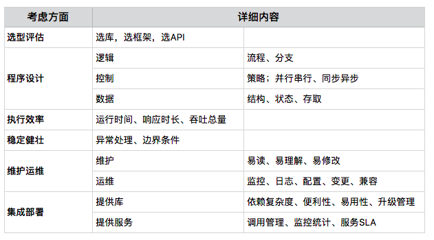
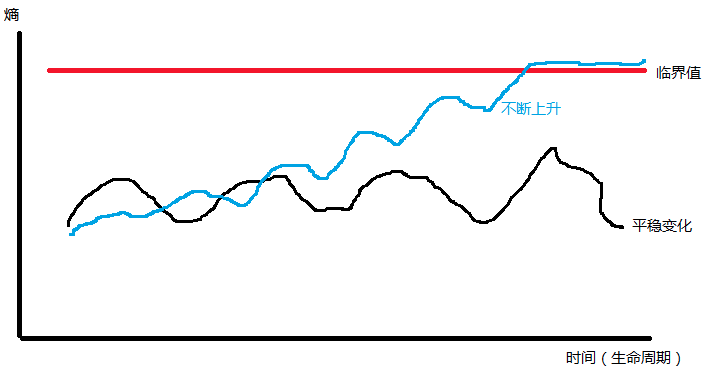

# 05 架构与实现：它们的连接与分界？

把一种想法、一个需求变成代码，这叫 “实现”，而在此之前，技术上有一个过程称为设计，设计中有个特别的阶段叫 “架构”。

程序员成长的很长一段路上，一直是在 “实现”，当有一天，需要承担起 “架构” 的责任时，可能会有一点搞不清两者的差异与界线。

## 是什么

架构是什么？众说纷纭。

架构（Architecture）一词最早源自建筑学术语，后来才被计算机科学领域借用。以下是其在维基百科（Wikipedia）中的定义：

> 架构是规划、设计和构建建筑及其物理结构的过程与产物。在计算机工程中，架构是描述功能、组织和计算机系统实现的一组规则与方法。 Architecture is both the process and the product of planning, designing, and constructing buildings and other physical structures. In computer engineering, “computer architecture” is a set of rules and methods that describe the functionality, organization, and implementation of computer systems.

在建筑学领域，有一组清晰的规则和方法来定义建筑架构。但可惜，到目前为止，在计算机软件工程领域并没有如此清晰的一组规则与方法来定义软件架构。

好在经过多年的实践，行业里逐渐形成了关于软件架构的共同认知：  **软件系统的结构与行为设计** 。而实现就是围绕这种已定义的宏观结构去开发程序的过程。

## 做什么

架构做什么？很多人会感觉糊里糊涂的。

我刚获得“架构师”称号时，也并不很明确架构到底在做什么，交付的是什么。后来不断在工作中去反思、实践和迭代，我才慢慢搞清楚架构工作和实现工作的差异与分界线。

从定义上，你已知道架构是一种结构设计，但它同时可能存在于不同的维度和层次上：

- 高维度：指系统、子系统或服务之间的切分与交互结构。
- 中维度：指系统、服务内部模块的切分与交互结构。
- 低维度：指模块组成的代码结构、数据结构、库表结构等。

在不同规模的团队中，存在不同维度的架构师，但不论工作在哪个维度的架构师，他们工作的共同点包括下面 4 个方面：

1. 确定边界：划定问题域、系统域的边界。
1. 切分协作：切分系统和服务，目的是建立分工与协作，并行以获得效率。
1. 连接交互：在切分的各部分之间建立连接交互的原则和机制。
1. 组装整合：把切分的各部分按预期定义的规则和方法组装整合为一体，完成系统目标。

有时，你会认为架构师的职责是要交付 “一种架构”，而这“一种架构” 的载体通常又会以某种文档的形式体现。所以，很容易误解架构师的工作就是写文档。但实际上  **架构师的交付成果是一整套决策流，文档仅仅是交付载体** ，而且仅仅是过程交付产物，最终的技术决策流实际体现在线上系统的运行结构中。

而对于实现，你应该已经很清楚是在做什么了。但我在这里不妨更清晰地分解一下。实现的最终交付物是程序代码，但这个过程中会发生什么？一般会有下面 6 个方面的考虑：选型评估；程序设计；执行效率；稳定健壮；维护运维；集成部署。

下表为其对应的详细内容：

我以交付一个功能需求为例，讲述下这个过程。

实现一个功能，可能全部自己徒手做，也可能选择一些合适的库或框架，再从中找到需要的 API。

确定了合适的选型后，需要从逻辑、控制与数据这三个方面进一步考虑程序设计：

- 逻辑，即功能的业务逻辑，反映了真实业务场景流程与分支，包含大量业务领域知识。
- 控制，即考虑业务逻辑的执行策略，哪些可以并行执行，哪些可以异步执行，哪些地方又必须同步等待结果并串行执行？
- 数据，包括数据结构、数据状态变化和存取方式。

开始编码实现时，你进一步要考虑代码的执行效率，需要运行多长时间？要求的最大等待响应时间能否满足？并发吞吐能力如何？运行的稳定性和各种边界条件、异常处理是否考虑到了？上线后，出现 Bug，相关的监控、日志能否帮助快速定位？是否有动态线上配置和变更能力，可以快速修复一些问题？新上线版本时，你的程序是否考虑了兼容老版本的问题等？

最后你开发的代码是以什么形态交付？如果是提供一个程序库，则需要考虑相关的依赖复杂度和使用便利性，以及未来的升级管理。如果是提供服务，就需要考虑服务调用的管理、服务使用的统计监控，以及相关的 SLA 服务保障承诺。

以上，就是我针对整个实现过程自己总结的一个思维框架。如果你每次写代码时，都能有一个完善的思维框架，应该就能写出更好的代码。这个思维框架是在过去多年的编程经验中逐步形成的，在过去每次写代码时如果漏掉了其中某个部分，后来都以某种线上 Bug 或问题的形式，让我付出了代价，做出了偿还。

“实现”作为一个过程，就是不断地在交付代码流。而完成的每一行代码，都包含了上面这些方面的考虑，而这些方面的所有判断也是一整套决策流，然后固化在了一块块的代码中。

因为实现是围绕架构来进行的，所以架构的决策流在先，一定程度上决定了实现决策流的方向与复杂度，而架构决策的失误，后续会成倍地放大实现的成本。

## 关注点

架构与实现过程中，有很多很多的点值得关注，若要选择一个核心点，会是什么？

架构的一个核心关注点，如果只能是一个点，我想有一个很适合的字可以表达： 熵。“熵”是一个物理学术语，在热力学中表达系统的混乱程度，最早是“信息论之父”克劳德·艾尔伍德·香农借用了这个词，并将其引入了信息科学领域，用以表达系统的混乱程度。

软件系统或架构，不像建筑物会因为时间的流逝而自然损耗腐坏，它只会因为变化而腐坏。一开始清晰整洁的架构与实现随着需求的变化而不断变得浑浊、混乱。这也就意味着系统的“熵”在不断增高。

这里我用一个图展示软件系统“熵”值的生命周期变化，如下：

系统只要是活跃的，“熵”值就会在生命周期中不断波动。需求的增加和改变，就是在不断增加“熵”值（系统的混乱程度）。但软件系统的“熵”有个临界值，当达到并超过临界值后，软件系统的生命也基本到头了。这时，你可能将迫不得已采取一种行动：重写或对系统做架构升级。

如果你不关注、也不管理系统的“熵”值，它最终的发展趋势就如图中的蓝线，一直升高，达到临界点，届时你就不得不付出巨大的代价来进行系统架构升级。

而实现中重构与优化的动作则是在不断进行减“熵”，作出平衡，让系统的“熵”值在安全的范围内波动。

那么，关于实现的核心关注点，也就呼之欲出了，我们也可以用一个字表达：简。

简，是简单、简洁、简明、简化，都是在做减法，但不是简陋。关于实现的全部智慧都浓缩在了这一个字里，它不仅减少代码量，也减少了开发时间，减少了测试时间，减少了潜在 Bug 的数量，甚至减少了未来的维护、理解与沟通成本。

架构关注复杂度的变化，自然就会带来简化，而实现则应当顺着把“简”做到极致。

## 断裂带

架构与实现之间，存在一条鸿沟，这是它们之间的断裂带。

断裂带出现在架构执行过程之中，落在文档上的架构决策实际上是静态的，但真正的架构执行过程却是动态的。架构师如何准确地传递架构决策？而开发实施的效果又如何能与架构决策保持一致？在这个过程中出现实施与决策的冲突，就又需要重新协调沟通讨论以取得新的一致。

当系统规模比较小时，有些架构师一个人就能把全部的设计决策在交付期限内开发完成，这就避免了很多沟通协调的问题。好些年前，我就曾这样做过一个小系统的架构升级改造，但后来的系统越来越大，慢慢就需要几十人的团队来分工协作。光是准确传递决策信息，并维持住大体的一致性，就是一件非常有挑战的工作了。

当系统规模足够大了，没有任何架构师能够把控住全部的细节。在实践中，我的做法是定期对系统的状态做快照，而非去把握每一次大大小小的变化，因为那样直接就会让我过载。在做快照的过程中我会发现很多的细节，也许和我当初想的完全不一样，会产生出一种“要是我来实现，绝对不会是这样”的感慨。

但在我发现和掌握的所有细节中，我需要做一个判断，哪些细节上的问题会是战略性的，而我有限的时间和注意力，必须放在这样的战略性细节上。而其他大量的实现细节也许和我想的不同，但只要没有越出顶层宏观结构定义的边界即可。系统是活的，控制演化的方向是可行的，而妄图掌控演化过程的每一步是不现实的。

关注与把控边界，这就比掌控整个领地的范围小了很多，再确认领地中的战略要地，那么掌控的能力也就有了支撑。架构与实现的鸿沟会始终存在，在这条鸿沟上选择合适的地方建设桥梁，建设桥梁的地方必是战略要地。

## 等效性

架构升级中，经常被问到一个问题：“这个架构能实现么？”

其实，这根本不是一个值得疑惑的问题。相对于建筑架构，软件架构过程其实更像是城市的规划与演变过程。有一定历史的城市，慢慢都会演变出所谓的旧城和新城。而新城相对于旧城，就是一次架构升级的过程。

城市规划师会对城市的分区、功能划分进行重新定位与规划。一个旧城所拥有的所有功能，如：社区、学校、医院、商业中心，难道新城会没有，或者说 “实现” 不了吗？

任何架构的可实现性，是完全等效的，但实现本身却不是等效的，对不同的人或不同的团队可实现性的可能、成本、效率是绝对不等效的。

近些年，微服务架构火了，很多人都在从曾经的单体应用架构升级到微服务架构。以前能实现的功能，换成微服务架构肯定也可以实现，只是编写代码的方式不同，信息交互的方式也不同。

架构升级，仅仅是一次系统的重新布局与规划，成本和效率的重新计算与设计，“熵”的重新分布与管理。

最后我归纳下：架构是关注系统结构与行为的决策流，而实现是围绕架构的程序开发过程；架构核心关注系统的“熵”，而实现则顺应“简”；架构注重把控系统的边界与 “要塞”，而实现则去建立 “领地”；所有架构的可实现性都是等效的，但实现的成本、效率绝不会相同。

文中提到，架构和实现之间有一条断裂带，而让架构与实现分道扬镳的原因有：

- 沟通问题：如信息传递障碍。
- 水平问题：如技术能力不足。
- 态度问题：如偷懒走捷径。
- 现实问题：如无法变更的截止日期（Deadline）。
