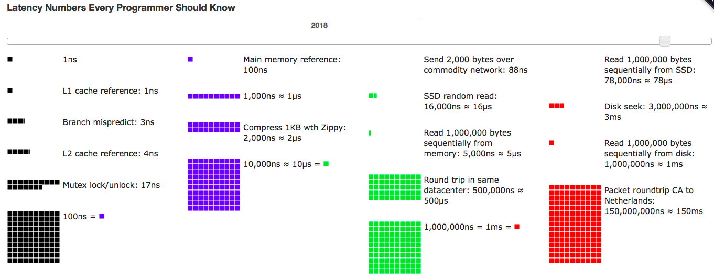
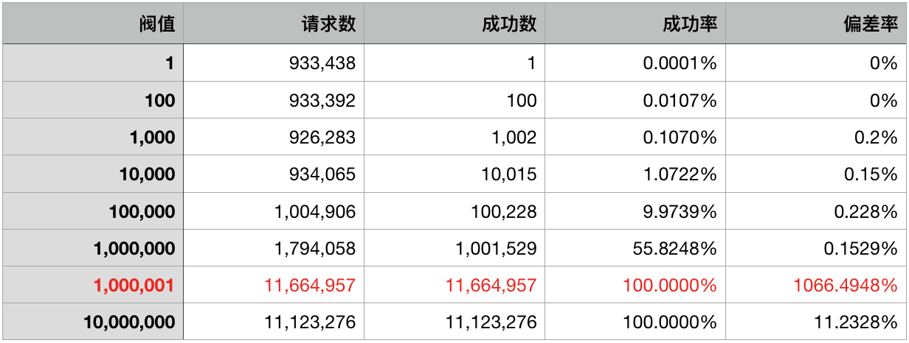

# 11 三阶段进化：调试，编写与运行代码

刚开始学编程写代码，总会碰到一些困惑。比如，曾经就有刚入行的同学问我：“写程序是想到哪写到哪，边写边改边验证好，还是先整体梳理出思路，有步骤、有计划地分析后，再写更好？”

老实说，我刚入行时走的是前一条路，因为没有什么人或方法论来指导我，都是自己瞎摸索。一路走来十多年后，再回溯编程之路的经历，总结编程的进化过程，大概会经历下面三个阶段。

## 阶段一：调试代码 Debugging

编程，是把用自然语言描述的现实问题，转变为用程序语言来描述并解决问题的过程；翻译，也是把一种语言的文字转变为另一种语言的文字，所以我想编程和翻译应该是有相通之处的。

好些年前，我曾偶然读到一篇关于性能的英文文章，读完不禁拍案叫绝，就忍不住想翻译过来。那是我第一次尝试翻译长篇英文，老实说翻得很痛苦，断断续续花了好几周的业余时间。那时的我，之于翻译，就是一个刚入门的初学者。

初次翻译，免不了遇到不少不熟悉的单词或词组，一路磕磕碰碰地查词典或 Google。一些似乎能理解含义的句子，却感觉无法很好地用中文来表达，如果直白地译出来感觉又不像正常的中文句子表达方式。

如是种种的磕碰之处，难道不像你刚学编程时候的情形吗？刚开始写代码，对语法掌握得不熟，对各种库和 API 不知道，不了解，也不熟悉。一路写代码，翻翻书，查查 Google，搜搜 API 文档，好不容易写完一段代码，却又不知道能否执行，执行能否正确等等。

小心翼翼地点击 Debug 按钮开始了单步调试之旅，一步步验证所有的变量或执行结果是否符合预期。如果出错了，是在哪一步开始或哪个变量出错的？一段不到一屏的代码，足足单步走了半小时，反复改了好几次，终于顺利执行完毕，按预期输出了执行结果。

如果不是自己写全新的代码，而是一来就接手了别人的代码，没有文档，前辈稍微给你介绍两句，你就很快又开始了 Debug 的单步调试之旅，一步步搞清代码运行的所有步骤和内部逻辑。根据你接手代码的规模，这个阶段可能持续数天到数周不等。

这就是我感觉可以划为编程第一阶段的 “调试代码 Debugging” 时期。这个时期或长或短，也许你曾经为各种编程工具或 IDE 提供的高级 Debug 功能激动不已，但如果你不逐渐降低使用 Debug 功能的频率，那么你可能很难走入第二阶段。

## 阶段二：编写代码 Coding

翻译讲究 “信、达、雅”，编码亦如此。

那么何谓 “信、达、雅” ？它是由我国清末新兴启蒙思想家严复提出的，他在《天演论》中的 “译例言” 讲到：

> 译事三难：信、达、雅。求其信已大难矣，顾信矣，不达，虽译犹不译也，则达尚焉。

**信，指不违背原文，不偏离原文，不篡改，不增不减，要求准确可信地表达原文描述的事实** 。

这条应用在编程上就是：程序员需要深刻地理解用户的原始需求。虽然需求很多时候来自于需求（产品）文档，但需求（产品）文档上写的并不一定真正体现了用户的原始需求。关于用户需求的“提炼”，早已有流传甚广的“福特之问”。

> 福特：您需要一个什么样的更好的交通工具？ 用户：我要一匹更快的马。

用户说需要一匹更快的马，你就跑去 “养” 只更壮、更快的马；后来用户需求又变了，说要让马能在天上飞，你可能就傻眼了，只能拒绝用户说：“这需求不合理，技术上实现不了。”可见，用户所说的也不可 “信” 矣。只有真正挖掘并理解了用户的原始需求，最后通过编程实现的程序系统才是符合 “信” 的标准的。

但在这一条的修行上几乎没有止境，因为要做到 “信” 的标准，编写行业软件程序的程序员需要在一个行业长期沉淀，才能慢慢搞明白用户的真实需求。 **达，指不拘泥于原文的形式，表达通顺明白，让读者对所述内容明达** 。

这条应用在编程上就是在说程序的可读性、可理解性和可维护性。

按严复的标准，只满足 “信” 一条的翻译，还不如不译，至少还需要满足 “达” 这条才算尚可。

同样，只满足 “信” 这一条的程序虽然能准确地满足用户的需要，但没有 “达” 则很难维护下去。因为程序固然是写给机器去执行的，但其实也是给人看的。

所有关于代码规范和风格的编程约束都是在约定 “达” 的标准。个人可以通过编程实践用时间来积累经验，逐渐达到 “达” 的标准。但一个团队中程序员们的代码风格差异如何解决？这就像如果一本书由一群人来翻译，你会发现每章的文字风格都有差异，所以我是不太喜欢读由一群人一起翻译的书。

一些流行建议的解决方案是：多沟通，深入理解别人的代码思路和风格，不要轻易盲目地修改。但这些年实践下来，这个方法在现实中走得并不顺畅。

随着微服务架构的流行，倒是提供了另一种解决方案：每个服务对应一个唯一的负责人（Owner）。长期由一个人来维护的代码，就不会那么容易腐烂，因为一个人不存在沟通问题。而一个人所能 “达” 到的层次，完全由个人的经验水平和追求来决定。 **雅，指选用的词语要得体，追求文章本身的古雅，简明优雅** 。

雅的标准，应用在编程上已经从技艺上升到了艺术的追求，这当然是很高的要求与自我追求了，难以强求。而只有先满足于 “信” 和 “达” 的要求，你才有余力来追求 “雅” 。

举个例子来说明下从 “达” 到 “雅” 的追求与差异。

下面是一段程序片段，同一个方法，实现完全一样的功能，都符合 “信” 的要求；而方法很短小，命名也完全符合规范，可理解性和维护性都没问题，符合 “达” 的要求；差别就在对 “雅” 的追求上。

```Java
private String generateKey(String service, String method) {  
  String head = "DBO$";  
  String key = "";   
  int len = head.length() + service.length() + method.length();  
  if (len <= 50) {  
    key = head + service + method;  
  } else {  
    service = service.substring(service.lastIndexOf(".") + 1);  
    len = head.length() + service.length() + method.length();  
    key = head + service + method;  
    if (len > 50) {  
      key = head + method;  
      if (key.length() > 50) {  
        key = key.substring(0, 48) + ".~";  
      }  
    }  
  }  
  return key;  
}
```

该方法的目标是生成一个字符串 key 值，传入两个参数：服务名和方法名，然后返回 key 值，key 的长度受外部条件约束不能超过 50 个字符。方法实现不复杂，很短，看起来也还不错，分析下其中的逻辑：

1. 先 key 由固定的头（head）+ service（全类名）+ method（方法）组成，若小于 50 字符，直接返回。
1. 若超过 50 字符限制，则去掉包名，保留类名，再判断一次，若此时小于 50 字符则返回。
1. 若还是超过 50 字符限制，则连类名一起去掉，保留头和方法再判断一次，若小于 50 字符则返回。
1. 最后如果有个变态长的方法名（46+ 个字符），没办法，只好暴力截断到 50 字符返回。

这个实现最大限度地在生成的 key 中保留全部有用的信息，对超过限制的情况依次按信息重要程度的不同进行丢弃。这里只有一个问题，这个业务规则只有 4 个判断，实现进行了三次 if 语句嵌套，还好这个方法比较短，可读性还不成问题。

而现实中很多业务规则比这复杂得多，以前看过一些实现的 if 嵌套多达 10 层的，方法也长得要命。当然一开始没有嵌套那么多层，只是后来随着时间的演变，业务规则发生了变化，慢慢增加了。之后接手的程序员就按照这种方式继续嵌套下去，慢慢演变至此，到我看到的时候就有 10 层了。

程序员有一种编程的惯性，特别是进行维护性编程时。一开始接手一个别人做的系统，不可能一下能了解和掌控全局。当要增加新功能时，在原有代码上添加逻辑，很容易保持原来程序的写法惯性，因为这样写也更安全。

所以一个 10 层嵌套 if 的业务逻辑方法实现，第一个程序员也许只写了 3 次嵌套，感觉还不错，也不失简洁。后来写 4、5、6 层的程序员则是懒惰不愿再改，到了写第 8、9、10 层的程序员时，基本很可能就是不敢再乱动了。

那么如何让这个小程序在未来的生命周期内，更优雅地演变下去？下面是另一个版本的实现：

```java
private String generateKey(String service, String method) {  
  String head = "DBO$";  
  String key = head + service + method;   
  // head + service(with package) + method  
  if (key.length() <= 50) {  
    return key;  
  }   
  // head + service(without package) + method  
  service = service.substring(service.lastIndexOf(".") + 1);  
  key = head + service + method;  
  if (key.length() <= 50) {  
    return key;  
  }   
  // head + method  
  key = head + method;  
  if (key.length() <= 50) {  
    return key;  
  }   
  // last, we cut the string to 50 characters limit.  
  key = key.substring(0, 48) + ".~";  
  return key;  
}
```

从嵌套变成了顺序逻辑，这样可以为未来的程序员留下更优雅地编程惯性方向。

## 阶段三：运行代码 Running

编程相对翻译，其超越 “信、达、雅” 的部分在于：翻译出来的文字能让人读懂，读爽就够了；但代码写出来还需要运行，才能产生最终的价值。

写程序我们追求 “又快又好”，并且写出来的代码要符合 “信、达、雅” 的标准，但清晰定义 “多快多好” 则是指运行时的效率和效果。为准确评估代码的运行效率和效果，每个程序员可能都需要深刻记住并理解下面这张关于程序延迟数字的图：



每个程序员都应该知道的延迟数字

只有深刻记住并理解了程序运行各环节的效率数据，你才有可能接近准确地评估程序运行的最终效果。当然，上面这张图只是最基础的程序运行效率数据，实际的生产运行环节会需要更多的基准效率数据才可能做出更准确的预估。

说一个例子，曾经我所在团队的一个高级程序员和我讨论要在所有的微服务中引入一个限流开源工具。这对于他和我们团队都是一个新东西，如何进行引入后线上运行效果的评估呢？

第一步，他去阅读资料和代码搞懂该工具的实现原理与机制并能清晰地描述出来。第二步，去对该工具进行效果测试，又称功能可用性验证。第三步，进行基准性能测试，或者又叫基准效率测试（Benchmark），以确定符合预期的标准。

做完上述三步，他拿出一个该工具的原理性描述说明文档，一份样例使用代码和一份基准效率测试结果，如下：



上图中有个红色字体部分，当阀值设置为 100 万而请求数超过 100 万时，发生了很大偏差。这是一个很奇怪的测试结果，但如果心里对各种基准效率数据有谱的话，会知道这实际绝不会影响线上服务的运行。

因为我们的服务主要由两部分组成：RPC 和业务逻辑。而 RPC 又由网络通信加上编解码序列化组成。服务都是 Java 实现的，而目前 Java 中最高效且吞吐最大的网络通信方式是基于 NIO 的方式，而我们服务使用的 RPC 框架正是基于 Netty（一个基于 Java NIO 的开源网络通信框架）的。

我曾经单独在一组 4 核的物理主机上测试过 Java 原生 NIO 与 Netty v3 和 v4 两个版本的基准性能对比，经过 Netty 封装后，大约有 10% 的性能损耗。在 1K 大小报文时，原生的 Java NIO 在当时的测试环境所能达到 TPS（每秒事务数） 的极限大约 5 万出头（极限，就是继续加压，但 TPS 不再上升，CPU 也消耗不上去，延时却在增加），而 Netty 在 4.5 万附近。增加了 RPC 的编解码后，TPS 极限下降至 1.3 万左右。

所以，实际一个服务在类似基准测试的环境下单实例所能承载的 TPS 极限不可能超过 RPC 的上限，因为 RPC 是没有包含业务逻辑的部分。加上不算简单的业务逻辑，我能预期的单实例真实 TPS 也许只有 1 千 ～2 千。

因此，上面 100 万的阀值偏差是绝对影响不到单实例的服务的。当然最后我们也搞明白了，100 万的阀值偏差来自于时间精度的大小，那个限流工具采用了微秒作为最小时间精度，所以只能在百万级的范围内保证准确。

讲完上述例子，就是想说明一个程序员要想精确评估程序的运行效率和效果，就得自己动手做大量的基准测试。

基准测试和测试人员做的性能测试不同。测试人员做的性能测试都是针对真实业务综合场景的模拟，测试的是整体系统的运行；而基准测试是开发人员自己做来帮助准确理解程序运行效率和效果的方式，当测试人员在性能测试发现了系统的性能问题时，开发人员才可能一步步拆解根据基准测试的标尺效果找到真正的瓶颈点，否则大部分的性能优化都是在靠猜测。

到了这个阶段，一段代码写出来，基本就该在你头脑中跑过一遍了。等上线进入真实生产环境跑起来，你就可以拿真实的运行数据和头脑中的预期做出对比，如果差距较大，那可能就掩藏着问题，值得你去分析和思考。

最后，文章开头那个问题有答案了吗？在第一阶段，你是想到哪就写到哪；而到了第三阶段，写到哪，一段鲜活的代码就成为了你想的那样。
