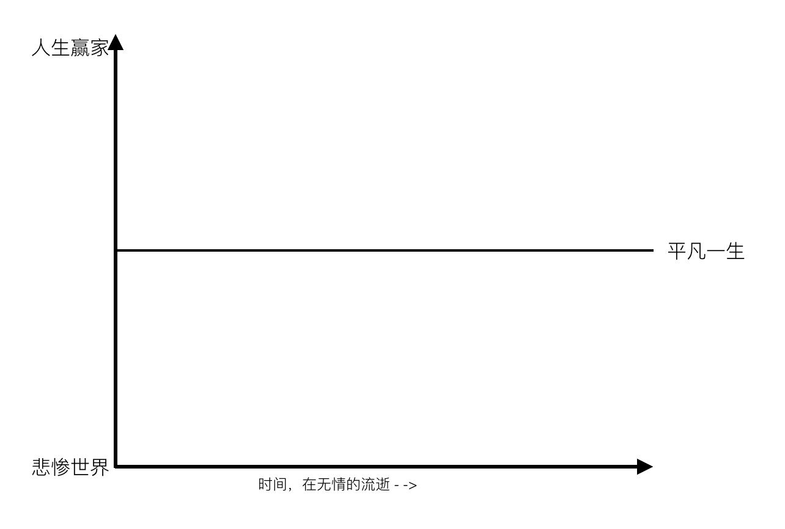
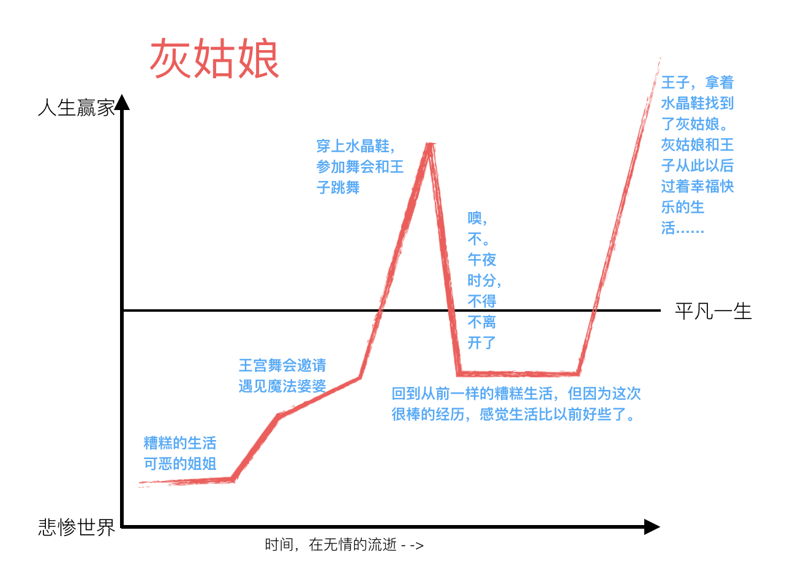
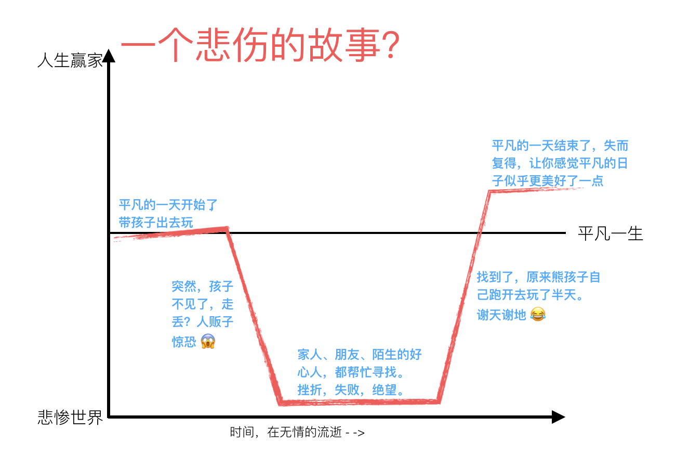
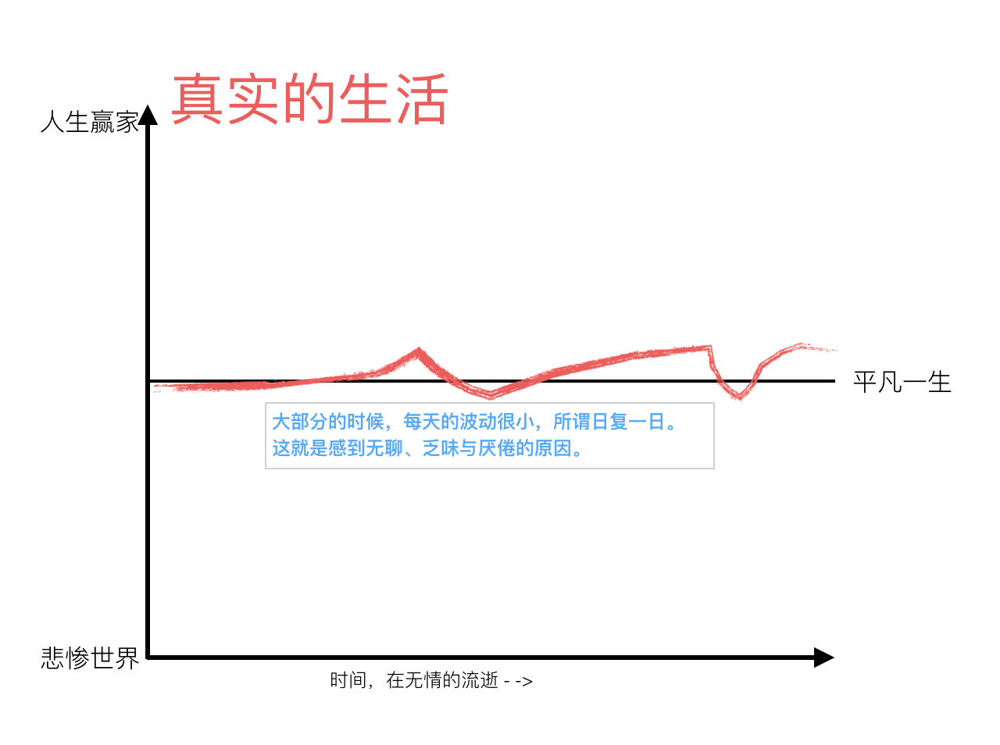

19 障碍：从计划到坚持，再到坚持不下去的时候
=======================

设定一个计划并不困难，真正的困难在于执行计划。若你能够坚持把计划执行下去，想必就能超越绝大部分人，因为大部分人的计划最终都半途而废了。

为什么那么多计划都半途而废了？在执行计划时，你会碰到怎样的障碍？我想从计划生命周期的各个阶段来分析下。

酝酿
--

酝酿期，是计划的早期雏形阶段；这阶段最大的障碍来自内心：理性与感性的冲突。

计划的目标是源自内心的，但也是有难度的，若是轻而易举的事情，也就不用计划了。这些需要坚持的事情，通常都 “不好玩”，而人是有惰性的，内心里其实并不愿意去做，这是我们感性的部分。但理性告诉我们，去完成这些计划，对自己是有长远好处的。这，就是冲突的地方。

就以我自己写作的例子来看，我不是一开始就写作的，我是工作了 5 年后，碰到了平台期，撞上了天花板，感觉颇为迷茫。于是就跑到网上到处看看有没有人分享些经验，找找道路。然后，看到了一些 “大神” 们写的博客，分享了他们一路走过的经历，在我迷茫与灰暗的那个阶段的航行中，就像一盏灯塔指引着前进方向。

于是我在想，也许我也可以开始写写东西。那时，内心里出现了两个声音，一个声音说：“你现在能写什么呢？有什么值得写的吗？有人看吗？”而另一个声音反驳说：“写，好过不写，写作是一件正确的事，就算没人看，也是对自己一个时期的思考和总结。”

最终，理性占了上风，开启了写作计划，然后注册了一个博客，想了一句签名：“写下、记下、留下”。

启动
--

启动期，是计划从静止到运动的早期阶段；这阶段的最大障碍是所谓的“最大静摩擦力”。

我们都学过初中物理，知道 “最大静摩擦力” 是大于 “滑动摩擦力” 的，也就是说要让一个物体动起来所需要的推力，比它开始运动后要大一些。这个现象，放在启动一个计划上时，也有类似的感觉，所以才有一句俗语叫：“万事开头难”。

还是回到我开始写作那个例子，我的第 1 篇博客的写作过程，至今还记得很清楚：一个周六的下午，在租的小房间里整整写了一下午。写得很艰苦，总感觉写得不好，不满意。最后一看天都黑了，肚子也饿了，就勉勉强强把它发了出去。

发出去后的前两天，我也会经常去刷新，看看阅读量有多少，有没有人评论啊。让人失望的是，前一个声音的说法变成了事实：的确没什么人看。两天的点击量不到一百，一条评论也没有，而且这一百的阅读计数里，搞不好还有些是搜索引擎的爬虫抓取留下的。

但是，写完了第一篇，我终于克服了写作的 “最大静摩擦力” 开始动了起来，一直写到了今天，这已经过去了 7 年。

执行
--

执行期，是计划实现过程中最漫长的阶段；这阶段的最大障碍就是容易困倦与乏味。

漫长的坚持过程期，大部分时候都是很无聊、乏味的，因为真实的人生就是这样，并没有那么多戏剧性的故事。所以，我在想这也许就是为什么那么多人爱看小说、电视剧和电影的原因吧，戏中的人物经历，总是更有戏剧性。

美国当代著名作家库尔特·冯内古特在一次谈话中谈及人生，他用了一组形象的类比来描述人生。我翻译过来并演绎了一下，如下面系列图示：

其中，纵坐标表示生活的幸福程度。越往上，代表幸福指数越高；越往下，代表幸福指数越低。中间的横线表示普通大众的平凡人生。

那么先来看一个大家都很熟悉的从 “丑小鸭” 变 “白天鹅”的故事：灰姑娘 。

我们从小就听过这个故事，人们喜欢这样的故事。同样的故事内核，被用在不同的故事里书写了上千次，传诵了上千年。这是一个皆大欢喜的故事，而下面则是一个稍微悲伤点的故事。

故事虽以悲剧开始，但好在以喜剧结束。人们也喜欢这样的故事，生活不就该这样吗？问题是，真实的生活可能是下面这样的。

没有那么多大起大落，我们大部分人的生活只是在经历一些平平凡凡的琐事。也许其中有些会让你感到高兴与兴奋，有些又让你感到烦躁与郁闷。但这些琐事都不会沉淀进历史中，被人们传诵上千年，它仅仅对你自己有意义。

所以呢，你明白为什么你感觉你的坚持那么无聊、单调与乏味了吧，大多数时候它都缺乏像 “灰姑娘” 故事曲线的戏剧性。而对抗这种过程的无聊，恰恰需要的就是故事。你看人类的历史上为什么要创造这么多戏剧性的故事，让这些戏剧性的故事包围了我们的生活，让人们想象生活充满了戏剧性，这种想象是治疗乏味的良药，也成为了创造更美好生活的动力。

万维钢的一篇文章《坚持坚持再坚持》里也提到：

> 故事的价值不在于真实准确，而在于提供人生的意义。

坚持，特别是长期的坚持，是需要动力的，而动力来自目标和意义。而获得目标与意义的最好方式是讲好一个故事。你看，成功的企业家会把未来的愿景包进一个美好的故事里，让自己深信不疑；然后再把这个故事传播出去，把所有相信这个故事的人聚在一起去追寻这个故事；最后，这个关于未来的故事就这样在现实中发生了。

漫长的人生，你需要为自己讲好一个故事。

挫败
--

挫败，不是一个阶段，而是坚持路上的一些点；正是在这些点上你遭遇了巨大的挫败感。

为什么会产生挫败感？可能的原因有，一开始你就不知道这件事有多难，直到走了一段后才发现这太难了。一开始就评估清楚一个计划的难度，需要投入大量的时间、经历和金钱，甚或有更高的技能与能力要求，这本身就是一件不容易的事。

而如果你计划的是一件从来没做过的事情，这就更难准确评估了。在路上，行至中途遭遇 “低估” 的挫败感就再正常不过了，而不少人，因为挫败过一两次后，就会放弃了计划。有时，遭遇挫败，选择了放弃，这个未必就是不合适的，但这要看这个放弃的决策是在什么情况下做出的。

遭遇挫败，你会进入一种心情与情绪的低谷，这个时候有很高的概率做出放弃的决策。而我的经验是，不要在挫败的情绪低谷期进行任何的选择与决策。可以暂时放下这件事，等待情绪回归到正常，再重新理性地评估计划还是否该坚持。

每经历一次挫败之后，你还选择坚持，那么就已经收获了成长。

最后总结来说，就是：你为了做成一件事，定一个计划，在执行计划的过程中，在 “酝酿”“启动” 和 “执行” 的不同阶段都会碰到各种障碍，可能都会让你产生一种快坚持不下去了的感觉。每到此时，你都要想想清楚，哪些是真正客观的障碍？哪些是主观的退却？

从坚持到持续，就是试图让现实的生活进入童话的过程，而后童话又变成了现实。

本文分析了计划的执行障碍，最后我也想问问你，在你成长的路上，遭遇过哪些障碍？是什么原因让你坚持不下去了的？
