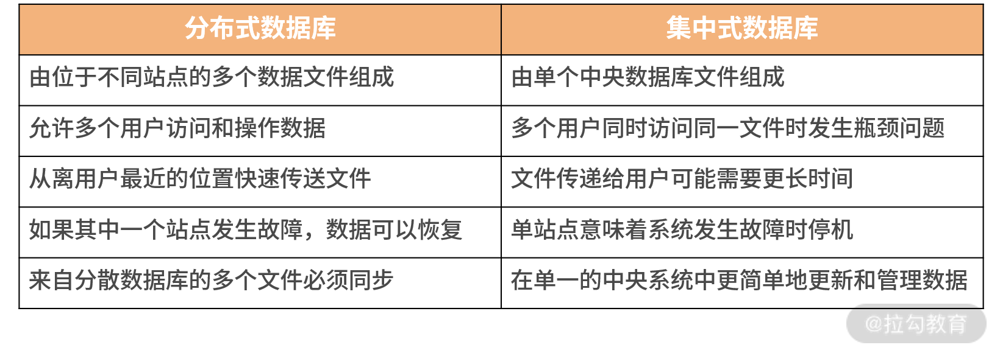
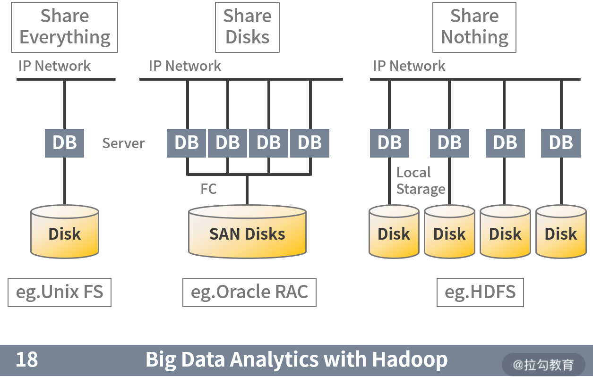
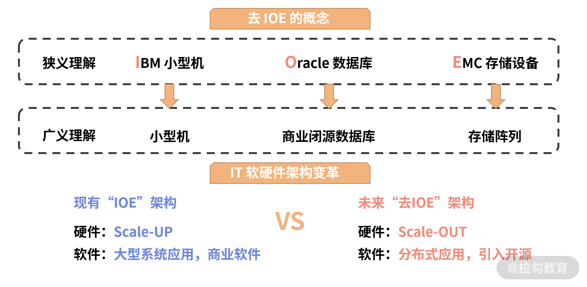
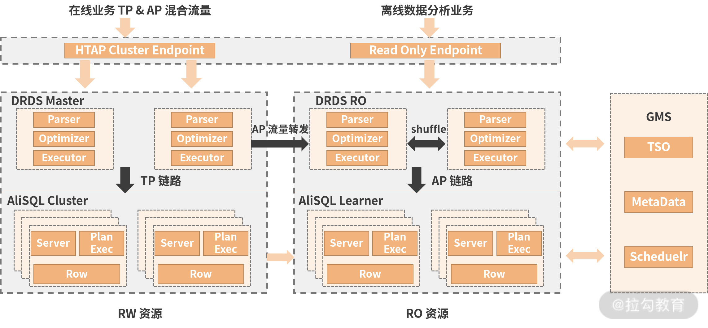

01 导论：什么是分布式数据库？聊聊它的前世今生
========================

你好，欢迎学习分布式数据库，我们的课程就正式开始了。

在开设这门课程之前，我简短地与身边同僚、朋友交流了课程的大纲。当时，大家都表示出了浓厚的兴趣，并且不约而同地问了我这样一个问题：啥是分布式数据库？更有“爱好学习”的朋友希望借此展现出“勤学好问”的品德，进而补充道：“这是哪个大厂出的产品？”

好吧，我的朋友，你们真的戳中了我的笑点。但笑一笑后，我不禁陷入了思考：为什么分布式数据库在大众，甚至专业领域内认知如此之低呢？

原因我大概可以总结为两点： **数据库产品特点与商业氛围**。

首先，数据库产品的特点是抽象度高。用户一般仅仅从使用层面接触数据库，知道数据库能实现哪些功能，而不关心或者很难关心其内部原理。而一些类型的分布式数据库的卖点正是这种抽象能力，从而使用户觉得应用这种分布式化的数据库与传统单机数据库没有明显的差别，甚至更加简单。

其次，数据库的商业氛围一直很浓厚。数据库产品高度抽象且位置关键，这就天然成为资本追逐的领地。而商业化产品和服务的卖点就是其包含支撑服务，而且许多商业数据库最赚钱的部分就是提供该服务。因此这些产品有意无意地对终端用户掩盖了数据库的技术细节，而用户有了这层商业保障，也很难有动力去主动了解内部原理。

这就造成即使你工作中接触了分布式数据库，也没有意识到它与过去的数据库有什么不同。但“福报迟到，但不会缺席”——当由于对其原理缺乏必要认识，导致技术问题频发时，用户才会真正意识到它们好像类似，但本质却截然不同。

而随着分布式数据库逐步渗透到各个领域，用户再也不能“傻瓜式”地根据特性选择数据库产品了。新架构催生出来的新特性，促使使用者需要深入参与其中，并需要他们认真评估数据库技术特点，甚至要重新设计自己的产品来与之更好地结合。

因此，我将**本专栏课程设计为一把钥匙，帮助你打开分布式数据库的大门**。你也可以将本门课程当作一个网游的新手村任务，完成后会获取初始装备（原理与方法论），继而掌握深入该领域所必要的知识。

我是“历史决定论”的忠实簇拥者，在这一讲中，我会沿着分布式数据库的发展脉络来介绍它。相信你在读完后，会对一开始的那个问题有自己的答案。那么现在我们从基本概念开始说起。

## 基本概念

分布式数据库，从名字上可以拆解为：分布式+数据库。用一句话总结为：由多个独立实体组成，并且彼此通过网络进行互联的数据库。

理解新概念最好的方式就是通过已经掌握的知识来学习，下表对比了大家熟悉的分布式数据库与集中式数据库之间主要的 5 个差异点。

从表中，我们可以总结出**分布式数据库的核心——数据分片、数据同步** 。

### 1\. 数据分片

该特性是分布式数据库的技术创新。它可以突破中心化数据库单机的容量限制，从而将数据分散到多节点，以更灵活、高效的方式来处理数据。这是分布式理论带给数据库的一份礼物。

分片方式包括两种。

* 水平分片：按行进行数据分割，数据被切割为一个个数据组，分散到不同节点上。
* 垂直分片：按列进行数据切割，一个数据表的模式（Schema）被切割为多个小的模式。

### 2\. 数据同步

它是分布式数据库的底线。由于数据库理论传统上是建立在单机数据库基础上，而引入分布式理论后，一致性原则被打破。因此需要引入数据库同步技术来帮助数据库恢复一致性。

简而言之，就是使分布式数据库用起来像“正常的数据库”。所以数据同步背后的推动力，就是人们对数据“一致性”的追求。这两个概念相辅相成，互相作用。

当然分布式数据库还有其他特点，但把握住以上两点，已经足够我们理解它了。下面我将从这两个特性出发，探求技术史上分布式数据库的发展脉络。我会以互联网、云计算等较新的时间节点来进行断代划分，毕竟我们的核心还是着眼现在、面向未来。

## 商业数据库

互联网浪潮之前的数据库，特别是前大数据时代。谈到分布式数据库绕不开的就是 Oracle RAC。

Oracle RAC 是典型的大型商业解决方案，且为软硬件一体化解决方案。我在早年入职国内顶级电信行业解决方案公司的时候，就被其强大的性能所震撼，又为它高昂的价格所深深折服。它是那个时代数据库性能的标杆和极限，是完美方案与商业成就的体现。

我们试着用上面谈到的两个特性来简单分析一下 RAC：它确实是做到了数据分片与同步。每一层都是离散化的，特别在底层存储使用了 ASM 镜像存储技术，使其看起来像一块完整的大磁盘。

这样做的好处是实现了极致的使用体验，即使用单例数据库与 RAC 集群数据库，在使用上没有明显的区别。它的分布式存储层提供了完整的磁盘功能，使其对应用透明，从而达到扩展性与其他性能之间的平衡。甚至在应对特定规模的数据下，其经济性又有不错的表现。

 **这种分布式数据库设计被称为“共享存储架构”（share disk architecture）**。它既是 RAC 强大的关键，又是其“阿喀琉斯之踵”，DBA 坊间流传的 8 节点的最大集群限制可以被认为是 RAC 的极限规模。

该规模在当时的环境下是完全够用的，但是随着互联网的崛起，一场轰轰烈烈的“运动”将会打破 Oracle RAC 的不败金身。

## 大数据

我们知道 Oracle、DB2 等商业数据库均为 OLTP 与 OLAP 融合数据库。而首先在分布式道路上寻求突破的是 OLAP 领域。在 2000 年伊始，以 Hadoop 为代表的大数据库技术凭借其“无共享”（share nothing）的技术体系，开始向以 Oracle 为代表的关系型数据库发起冲击。

这是一次水平扩展与垂直扩展，通用经济设备与专用昂贵服务，开源与商业这几组概念的首次大规模碰撞。**拉开了真正意义上分布式数据库的帷幕**。

当然从一般的观点出发，Hadoop 一类的大数据处理平台不应称为数据库。但是从前面我们归纳的两点特性看，它们又确实非常满足。因此我们可以将它们归纳为早期面向商业分析场景的分布式数据库。**从此 OLAP 型数据库开始了自己独立演化的道路**。

除了 Hadoop，另一种被称为 MPP（大规模并行处理）类型的数据库在此段时间也经历了高速的发展。MPP 数据库的架构图如下：

我们可以看到这种数据库与大数据常用的 Hadoop 在架构层面上非常类似，但理念不同。简而言之，它是对 SMP（对称多处理器结构）、NUMA（非一致性存储访问结构）这类硬件体系的创新，采用 shared-nothing 架构，通过网络将多个 SMP 节点互联，使它们协同工作。

MPP 数据库的特点是首先支持 PB 级的数据处理，同时支持比较丰富的 SQL 分析查询语句。同时，该领域是商业产品的战场，其中不仅仅包含独立厂商，如 Teradata，还包含一些巨头玩家，如 HP 的 Vertica、EMC 的 Greenplum 等。

大数据技术的发展使 OLAP 分析型数据库，从原来的关系型数据库之中独立出来，形成了完整的发展分支路径。而随着互联网浪潮的发展，OLTP 领域迎来了发展的机遇。

## 互联网化

国内数据库领域进入互联网时代第一个重大事件就是“去 IOE”。

其中尤以“去 Oracle 数据库”产生的影响深远。十年前，阿里巴巴喊出的这个口号深深影响了国内数据库领域，这里我们不去探讨其中细节，也不去评价它正面或负面的影响。但从对于分布式数据库的影响来说，它至少带来两种观念的转变。

1. 应用成为核心：去 O 后，开源数据库需要配合数据库中间件（proxy）去使用，但这种组合无法实现传统商业库提供的一些关键功能，如丰富的 SQL 支持和 ACID 级别的事务。因此应用软件需要进行精心设计，从而保障与新数据库平台的配合。应用架构设计变得非常关键，整个技术架构开始脱离那种具有调侃意味的“面向数据库” 编程，转而变为以应用系统为核心。
2. 弱一致性理念普及：虽然强一致性仍然需求旺盛，但人们慢慢接受了特定场景下可以尝试弱一致性来解决系统的吞吐量问题。而这带来了另外一个益处，一线研发与设计人员开始认真考虑业务需要什么样的一致性，而不是简单依靠数据库提供的特性。

以上两个观念都是在破除了对于 Oracle 的迷信后产生的，它们本身是正面的，但是如果没有这场运动，其想要在普通用户之中普及确实有很大困难。而这两种观念也为日后分布式数据库，特别是国产分布式数据的发展带来了积极的影响。

而与此同期，全球范围内又上演着 NoSQL 化浪潮，它与国内去 IOE 运动一起推动着数据库朝着横向分布的方向一路狂奔。关于 NoSQL 的内容，将会在下一讲详细介绍。

与上一部分中提到的大数据技术类似，随着互联网的发展，去 IOE 运动将 OLTP 型数据库从原来的关系型数据库之中分离出来，但这里需要注意的是，**这种分离并不是从基础上构建一个完整的数据库，而是融合了旧有的开源型数据库，同时结合先进的分布式技术，共同构造了一种融合性的“准”数据库**。它是面向具体的应用场景的，所以阉割掉了传统的 OLTP 数据库的一些特性，甚至是一些关键的特性，如子查询与 ACID 事务等。

而 NoSQL 数据库的重点是支持非结构化数据，如互联网索引，GIS 地理数据和时空数据等。这种数据在传统上会使用关系型数据库存储，但需要将此种数据强行转换为关系型结构，不仅设计烦琐，而且使用效率也比较低下。故**NoSQL 数据库被认为是对整个数据库领域的补充**，从而人们意识到数据库不应该仅仅支持一种数据模式。

随着分布式数据库的发展，一种从基础上全新设计的分布式 OLTP 数据库变得越来越重要，而云计算更是为这种数据库注入新的灵魂，两者的结合将会给分布式数据库带来美妙的化学反应。

## 云原生是未来

从上文可以看到人们真正具有广泛认知的分布式数据库，即 OLTP 型交易式分布式数据库，依然是分布式数据库领域一个缺失的片段，且是一个重要的片段。一个真正的 OLTP 数据库应该具备什么特点呢？

实际上人们需要的是**它既具有一个单机的关系型数据库的特性，又有分布式的分片与同步特性**。 DistributedSQL 和 NewSQL 正是为了这个目的而生的 。它们至少具有如下两点引人注目的特性：

1. SQL 的完整支持
2. 可靠的分布式事务。

典型的代表有 Spanner、NuoDB、TiDB 和 Oceanbase 等。并且本课程会重点围绕 DistributedSQL 的关键特性展开研究，这些特性是现代分布式数据库的基石。这里我就不占用过多篇幅介绍了，在 02 | SQL vs NoSQL：一次搞清楚五花八门的各种“SQL”中我们再一起详细学习。

与此同时，随着云计算的纵向深入发展，分布式数据库又迎来新的革命浪潮——云原生数据库。

首先，由于云服务天生的“超卖”特性，造成其采购成本较低，从而使终端用户尝试分布式数据库的门槛大大降低。

其次，来自云服务厂商的支撑人员可以与用户可以进行深度的合作，形成了高效的反馈机制。这种反馈机制促使云原生的分布式数据库有机会进行快速的迭代，从而可以积极响应客户的需求。

这就是云原生带给分布式数据库的变化，它是**通过生态系统的优化完成了对传统商业数据库的超越**。以下来自 DB-Engines 的分析数据说明了未来的数据库市场属于分布式数据库，属于云原生数据库。

随着分布式数据库的发展，我们又迎来了新的一次融合：那就是 OLTP 与 OLAP 将再一次合并为 HTAP（融合交易分析处理）数据库。

该趋势的产生主要来源于云原生 OLTP 型分布式数据库的日趋成熟。同时由于整个行业的发展，客户与厂商对于实时分析型数据库的需求越来越旺盛，但传统上大数据技术包括开源与 MPP 类数据库，强调的是离线分析。

如果要进行秒级的数据处理，那么必须将交易数据与分析数据尽可能地贴近，并减少非实时 ELT 的引入，这就促使了 OLTP 与 OLAP 融合为 HTAP。下图就是阿里云 PolarDB 的 HTAP 架构。

## 总结

用《三国演义》的第一句话来说：“天下大势，分久必合，合久必分。”而我们观察到的分布式数据库，乃至数据库本身的发展正暗合了这句话。**分布式数据库发展就是一个由合到分，再到合的过程**：

1. 早期的关系型商业数据库的分布式能力可以满足大部分用户的场景，因此产生了如 Oracle 等几种巨无霸数据库产品；
2. OLAP 领域首先寻求突破，演化出了大数据技术与 MPP 类型数据库，提供功能更强的数据分析能力；
3. 去 IOE 引入数据库中间件，并结合应用平台与开源单机数据库形成新一代解决方案，让商业关系型数据库走下神坛，NoSQL 数据库更进一步打破了关系型数据库唯我独尊的江湖地位；
4. 新一代分布式 OLTP 数据库正式完成了分布式领域对数据库核心特性的完整支持，它代表了分布式数据库从此走向了成熟，也表明了 OLAP 与 OLTP 分布式场景下，分别在各自领域内取得了胜利；
5. HTAP 和多模式数据处理的引入，再一次将 OLAP 与 OLTP 融合，从而将分布式数据库推向如传统商业关系型数据库数十年前那般的盛况，而其产生的影响要比后者更为深远。

我们回顾历史，目的是更好地掌握未来。在本课程中，我们将详细分析现代分布式数据库、OLTP 型数据库的关键技术、使用场景和应用案例。使你在未来可以更好地评估和使用分布式数据库。

而**分布式数据库的历史同时体现了实用主义的特色** ，其演化是需求与技术博弈的结果，而不是精心设计出来的。我们的课程也会体现出实用主义的特点，让你学以致用，学有所获。
