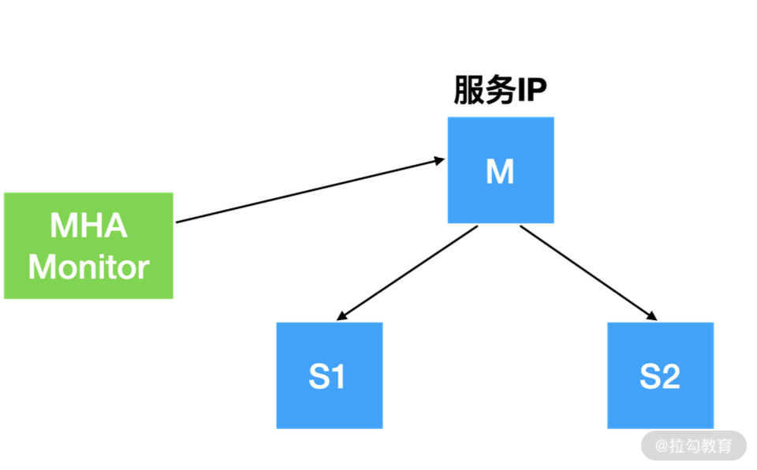
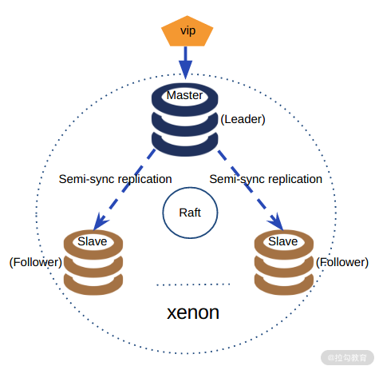

04 数据复制：如何保证数据在分布式场景下的高可用？
==========================

我们上一讲介绍了分片技术，它主要的目的是提高数据容量和性能。这一讲，我们将介绍分布式数据库另外一个重要根基：复制。

复制的主要目的是在几个不同的数据库节点上保留相同数据的副本，从而提供一种数据冗余。这份冗余的数据可以提高数据查询性能，而更重要的是保证数据库的可用性。

本讲主要介绍两种复制模式：单主复制与多主复制，并通过 MySQL 复制技术的演化来进行相应的展示。

现在让我们开始学习单主复制，其中不仅介绍了该技术本身，也涉及了一些复制领域的话题，如复制延迟、高可用和复制方式等。

## 单主复制

单主复制，也称主从复制。写入主节点的数据都需要复制到从节点，即存储数据库副本的节点。当客户要写入数据库时，他们必须将请求发送给主节点，而后主节点将这些数据转换为复制日志或修改数据流发送给其所有从节点。从使用者的角度来看，从节点都是只读的。下图就是经典的主从复制架构。

这种模式是最早发展起来的复制模式，不仅被广泛应用在传统数据库中，如 PostgreSQL、MySQL、Oracle、SQL Server；它也被广泛应用在一些分布式数据库中，如 MongoDB、RethinkDB 和 Redis 等。

那么接下来，我们就从复制同步模式、复制延迟、复制与高可用性以及复制方式几个方面来具体说说这个概念。

### 复制同步模式

复制是一个非常耗费时间而且很难预测完成情况的操作。虽然其受影响的因素众多，但一个复制操作是同步发生还是异步发生，被认为是极为重要的影响因素，可以从以下三点来分析。

1. 同步复制：如果由于从库已崩溃，存在网络故障或其他原因而没有响应，则主库也无法写入该数据。
2. 半同步复制：其中部分从库进行同步复制，而其他从库进行异步复制。也就是，如果其中一个从库同步确认，主库可以写入该数据。
3. 异步复制：不管从库的复制情况如何，主库可以写入该数据。而此时，如果主库失效，那么还未同步到从库的数据就会丢失。

可以看到不同的同步模式是在性能和一致性上做平衡，三种模式对应不同场景，并没有好坏差异。用户需要根据自己的业务场景来设置不同的同步模式。

### 复制延迟

如果我们想提高数据库的查询能力，最简便的方式是向数据库集群内添加足够多的从节点。这些从节点都是只读节点，故查询请求可以很好地在这些节点分散开。

但是如果使用同步复制，每次写入都需要同步所有从节点，会造成一部分从节点已经有数据，但是主节点还没写入数据。而异步复制的问题是从节点的数据可能不是最新的。

以上这些问题被称为“复制延迟”，在一般的材料中，我们会听到诸如“写后读”“读单增”等名词来解决复制延迟。但是这些概念其实是数据一致性模型的范畴。我将会在下一讲中深入介绍它们。

### 复制与高可用性

高可用（High availablity）是一个 IT 术语，指系统无中断地执行其功能的能力。系统中的任何节点都可能由于各种出其不意的故障而造成计划外停机；同时为了要维护系统，我们也需要一些计划内的停机。采用主从模式的数据库，可以防止单一节点挂起导致的可用性降低的问题。

系统可用程度一般使用小数点后面多个 9 的形式，如下表所示。

|  **可用性**  |  **年故障时间**  |
|------------|----------------|
| 99.9999%   | 32秒           |
| 99.999%    | 5分15秒        |
| 99.99%     | 52分34秒       |
| 99.9%      | 8小时46分      |
| 99%        | 3天15小时36分  |

一般的生产系统都会至少有两个 9 的保证，追求三个 9。想要做到 4 个 9 是非常最具有挑战的。

在主从模式下，为了支撑高可用，就需要进行故障处理。我这里总结了两种可能的故障及其处理方案。

1.  **从节点故障** 。由于每个节点都复制了从主库那里收到的数据更改日志，因此它知道在发生故障之前已处理的最后一个事务，由此可以凭借此信息从主节点或其他从节点那里恢复自己的数据。
2.  **主节点故障** 。在这种情况下，需要在从节点中选择一个成为新的主节点，此过程称为故障转移，可以手动或自动触发。其典型过程为：第一步根据超时时间确定主节点离线；第二步选择新的主节点，这里注意 **新的主节点通常应该与旧的主节点数据最为接近** ；第三步是重置系统，让它成为新的主节点。

### 复制方式

为了灵活并高效地复制数据，下面我介绍几种常用的复制方式。

*  **1. 基于语句的复制** 

主库记录它所执行的每个写请求（一般以 SQL 语句形式保存），每个从库解析并执行该语句，就像从客户端收到该语句一样。但这种复制会有一些潜在问题，如语句使用了获取当前时间的函数，复制后会在不同数据节点上产生不同的值。

另外如自增列、触发器、存储过程和函数都可能在复制后产生意想不到的问题。但可以通过预处理规避这些问题。使用该复制方式的分布式数据库有 VoltDB、Calvin。

*  **2. 日志（WAL）同步** 

WAL 是一组字节序列，其中包含对数据库的所有写操作。它的内容是一组低级操作，如向磁盘的某个页面的某个数据块写入一段二进制数据，主库通过网络将这样的数据发送给从库。

这种方法避免了上面提到的语句中部分操作复制后产生的一些副作用，但要求主从的数据库引擎完全一致，最好版本也要一致。如果要升级从库版本，那么就需要计划外停机。PostgreSQL 和 Oracle 中使用了此方法。

*  **3. 行复制** 

它由一系列记录组成，这些记录描述了以行的粒度对数据库表进行的写操作。它与特定存储引擎解耦，并且第三方应用可以很容易解析其数据格式。

*  **4. ETL 工具** 

该功能一般是最灵活的方式。用户可以根据自己的业务来设计复制的范围和机制，同时在复制过程中还可以进行如过滤、转换和压缩等操作。但性能一般较低，故适合处理子数据集的场景。

关于单主复制就介绍到这里，下面我们再来说说多主复制。

## 多主复制

也称为主主复制。数据库集群内存在多个对等的主节点，它们可以同时接受写入。每个主节点同时充当主节点的从节点。

多主节点的架构模式最早来源于 DistributedSQL 这一类多数据中心，跨地域的分布式数据库。在这样的物理空间相距甚远，有多个数据中心参与的集群中，每个数据中心内都有一个主节点。而在每个数据中心的内部，却是采用常规的单主复制模式。

这么设计该类系统的目的在于以下几点。

1. 获得更好的写入性能：使数据可以就近写入。
2. 数据中心级别的高可用：每个数据中心可以独立于其他数据中心继续运行。
3. 更好的数据访问性能：用户可以访问到距离他最近的数据中心。

但是，此方法的最大缺点是，存在一种可能性，即两个不同的主节点同时修改相同的数据。这其实是非常危险的操作，应尽可能避免。这就需要下一讲要介绍的一致性模型，配合冲突解决机制来规避。

还有一种情况是处理客户端离线操作的一致性问题。为了提高性能，数据库客户端往往会缓存一定的写入操作，而后批量发送给服务端。这种情况非常类似于大家使用协作办公文档工具的场景。在这种情况下，每个客户端都可以被看作是具有主节点属性的本地数据库，并且多个客户端之间存在一种异步的多主节点复制的过程。这就需要数据库可以协调写操作，并处理可能的数据冲突。

典型的多主复制产品有 MySQL 的 Tungsten Replicator、PostgreSQL 的 BDR 和 Oracle 的 GoldenGate。

目前，大部分 NewSQL、DistributedSQL 的分布式数据库都支持多主复制，但是大部分是用 Paxos 或 Raft 等协议来构建复制组，保证写入线性一致或顺序一致性；同时传统数据库如 MySQL 的 MGR 方案也是使用类似的方式，可以看到 **该方案是多主复制的发展方向** 。关于一致性协议的内容我们将在后续课程中详细介绍。

历史的发展潮流是从单主复制向多主复制演变的，以上我们抽象地总结了复制的发展模式和需要关注的技术点。下面我将通过 MySQL 高可用技术的发展路径，向你直观地展示数据库复制技术的发展脉络。

## MySQL 复制技术的发展

MySQL 由于其单机机能的限制，很早就发展了数据复制技术以提高性能。同时依赖该技术，MySQL 可用性也得到了长足的发展。

截止到现在，该技术经历了四代的发展。第一代为传统复制，使用 MHA（Master High Available）架构；第二代是基于 GTID 的复制，即 GTID+Binlog server 的模式；第三代为增强半同步复制，GTID+增强半同步复制；第四代为 MySQL 原生高可用，即 MySQL InnoDB Cluster。

数据库的复制技术需要考虑两个因素：数据一致 RPO 和业务连续性 RTO。所以，就像前面的内容所强调的，复制与一致性是一对如影随形的概念，本讲内容聚焦于复制，但是会提到关于一致性相关的概念。

下面我就从第一代复制技术开始说起。

### MHA 复制控制

下图是 MHA 架构图。

MHA 作为第一代复制架构，有如下适用场景：

1. MySQL 的版本≤5.5，这一点说明它很古老；
2. 只用于异步复制且一主多从环境；
3. 基于传统复制的高可用。

MHA 尽最大能力做数据补偿，但并不保证一定可以成功；它也尽最大努力在实现 RPO，有 RTO 概念支持。可以看到它只是一个辅助工具，本身的架构与机制对 RPO 和 RTO 没有任何保障。

那么由此可知，它会存在如下几个问题：

1. 它的 GTID 模型强依赖 binlog server，但是对于 5.7 后的 binlog 却不能识别，同时对并行复制支持不好；
2. 服务 IP 切换依赖自行编写的脚本，也可以与 DNS 结合，其运维效果取决于运维人员的经验；
3. 运维上需要做 SSH 信任、切换判断等人工操作，总体上处于“刀耕火种”的状态，自动化程度较低，维护难度高；
4. 现在项目基本无维护。

从上述问题中可以看到，MHA 作为第一代复制架构，功能相对原始，但已经为复制技术的发展开辟了道路，特别是对 GTID 和 binlog 的应用。但如果不是维护比较古老的 MySQL 集群，目前已经不推荐采用它了。

### 半同步复制

这是第二代复制技术，它与第一代技术的差别表现在以下几点。

1. binlog 使用半同步，而第一代是异步同步。它保障了数据安全，一般至少要同步两个节点，保证数据的 RPO。
2. 同时保留异步复制，保障了复制性能。并通过监控复制的延迟，保证了 RTO。
3. 引入配置中心，如 consul。对外提供健康的 MySQL 服务。
4. 这一代开始需要支持跨 IDC 复制。需要引入监控 Monitor，配合 consul 注册中心。多个 IDC 中 Monitor 组成分布式监控，把健康的 MySQL 注册到 consul 中，同时将从库复制延迟情况也同步到 consul 中。

下图就是带有 consul 注册中心与监控模块的半同步复制架构图。

第二代复制技术也有自身的一些缺陷。

1. 存在幻读的情况。当事务同步到从库但没有 ACK 时，主库发生宕机；此时主库没有该事务，而从库有。
2. MySQL 5.6 本身半同步 ACK 确认在 dump\_thread 中，dump\_thread 存在 IO 瓶颈问题。

基于此，第三代复制技术诞生。

### 增强半同步复制

这一代需要 MySQL 是 5.7 以后的版本。有一些典型的框架来支持该技术，如 MySQL Replication Manager、GitHub-orchestrator 和国内青云开源的 Xenon 等。

这一代复制技术采用的是增强半同步。首先主从的复制都是用独立的线程来运行；其次主库采用 binlog group commit，也就是组提交来提供数据库的写入性能；而从库采用并行复制，它是基于事务的，通过数据参数调整线程数量来提高性能。这样主库可以并行，从库也可以并行。

这一代技术体系强依赖于增强半同步，利用半同步保证 RPO，对于 RTO，则取决于复制延迟。

下面我们用 Xenon 来举例说明，请看下图（图片来自官网）。

从图中可以看到。每个节点上都有一个独立的 agent，这些 agent 利用 raft 构建一致性集群，利用 GTID 做索引选举主节点；而后主节点对外提供写服务，从节点提供读服务。

当主节点发生故障后，agent 会通过 ping 发现该故障。由于 GTID 和增强半同步的加持，从节点与主节点数据是一致的，因此很容易将从节点提升为主节点。

第三代技术也有自身的缺点，如增强半同步中存在幽灵事务。这是由于数据写入 binlog 后，主库掉电。由于故障恢复流程需要从 binlog 中恢复，那么这份数据就在主库。但是如果它没有被同步到从库，就会造成从库不能切换为主库，只能去尝试恢复原崩溃的主库。

### MySQL 组复制

组复制是 MySQL 提供的新一代高可用技术的重要组成。其搭配 MySQL Router 或 Proxy，可以实现原生的高可用。

从这一代开始，MySQL 支持多主复制，同时保留单主复制的功能。其单主高可用的原理与第三代技术类似，这里我们不做过多分析了。

现在说一下它的多主模式，原理是使用 MySQL Router 作为数据路由层，来控制读写分离。而后组内部使用 Paxos 算法构建一致性写入。

它与第三代复制技术中使用的一致性算法的作用不同。三代中我们只使用该算法来进行选主操作，数据的写入并不包含在其中；而组复制的多主技术需要 Paxos 算法深度参与，并去决定每一次数据的写入，解决写入冲突。

组复制有如下几个优点。

* 高可用分片：数据库节点动态添加和移除。分片实现写扩展，每个分片是一个复制组。可以结合上一讲中对于 TiDB 的介绍，原理类似。
* 自动化故障检测与容错：如果一个节点无法响应，组内大多数成员认为该节点已不正常，则自动隔离。
* 方案完整：前面介绍的方案都需要 MySQL 去搭配一系列第三方解决方案；而组复制是原生的完整方案，不需要第三方组件接入。

当然，组复制同样也有一些限制。主要集中在需要使用较新的特性，一些功能在多组复制中不支持，还有运维人员经验缺乏等。

相信随着 MySQL 的发展，将会有越来越多的系统迁移到组复制中，多主模式也会逐步去替代单主模式。

## 总结

这一讲内容就介绍到这里了。我们深入介绍了复制技术在分布式数据库中的作用；探讨了单主和多主两种复制技术；而后通过 MySQL 复制技术的发展路径来介绍了复制技术的应用案例。

如我在上面所描述的，复制往往需要与一致性放在一起讨论。本讲聚焦于复制，下一讲我们将详细探讨一致性问题，包括 CAP 理论与一致性模型，并带你研究它与复制的结合。

## 教学相长

这里给你留一个思考题：我们常听到一种叫作“无主复制”的技术，它与我们这一讲介绍的两种复制技术有什么异同？
