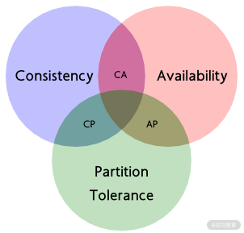
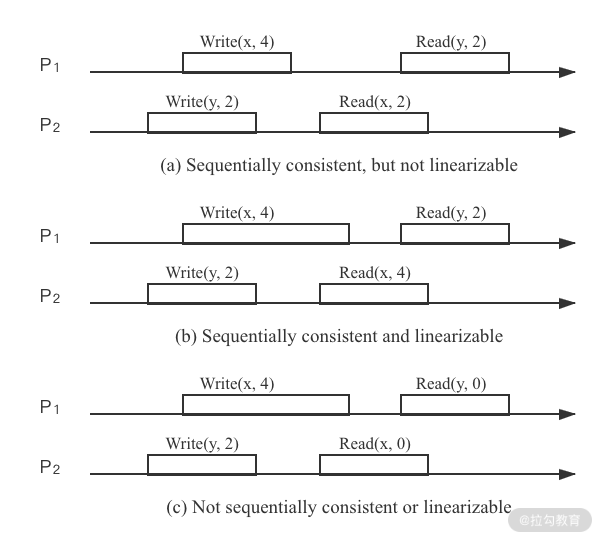

# 05 一致性与 CAP 模型：为什么需要分布式一致性？

上一讲我们讨论了复制的相关内容，其中有部分知识点提到了“一致性”的概念。那么这一讲我们就来聊聊 CAP 理论和一致性的相关内容。我将重点聚焦于一致性模型，因为它是复制一致性和分布式事务的理论基础。

在开始课程之前，我们先讨论一下：分布式数据库，乃至于一般的分布式系统所谈论的一致性到底是什么？

## 一致性是高可用的必备条件

在现实世界中，分布式数据库的节点并不总是处于活动状态且相互能够通信的。但是，以上这些故障不应该影响数据库的可用性。换言之，从用户的角度来看，整个系统必须像没有遭到任何故障一样继续运行。系统高可用性是分布式数据库一个极其重要的特性，甚至在软件工程中，我们始终致力于实现高可用性，并尽量减少停机时间。

为了使系统高度可用，系统需要被设计成允许一个或多个节点的崩溃或不可访问。为此，我们需要引入如上一讲所说的复制技术，其核心就是使用多个冗余的副本来提高系统的可用性。但是，一旦添加了这些副本，我们将面临使多个数据副本保持同步的问题，并且遭遇故障后如何恢复系统的问题。

这就是 MySQL 复制发展历程所引入的 RPO 概念，也就是系统不仅仅要可用，而且数据还需要一致。所以 **高可用必须要尽可能满足业务连续性和数据一致性这两个指标**。

而我们马上要介绍的 CAP 理论会告诉我们还有第三个因素——网络分区会对可用性产生影响。它会告诉我们可用性和一致性在网络分区下是不能同时满足的。

## CAP 理论与注意事项

首先，**可用性是用于衡量系统能成功处理每个请求并作出响应的能力**。可用性的定义是用户可以感知到的系统整体响应情况。但在实践中，我们希望组成系统的各个组件都可以保持可用性。

其次，**我们希望每个操作都保持一致性**。一致性在此定义为原子一致性或线性化一致性。线性一致可以理解为：分布式系统内，对所有相同副本上的操作历史可以被看作一个日志，且它们在日志中操作的顺序都是相同的。线性化简化了系统可能状态的计算过程，并使分布式系统看起来像在单台计算机上运行一样。

最后，**我们希望在容忍网络分区的同时实现一致性和可用性**。网络是十分不稳定的，它经常会分为多个互相独立的子网络。在这些子网中，节点间无法相互通信。在这些被分区的节点之间发送的某些消息，将无法到达它的目的地。

那么总结一下，**可用性要求任何无故障的节点都可以提供服务，而一致性要求结果需要线性一致** 。埃里克·布鲁尔（Eric Brewer）提出的 CAP 理论讨论了一致性、可用性和分区容错之间的抉择。

其中提到了，异步系统是无法满足可用性要求的，并且在存在网络分区的情况下，我们无法实现同时保证可用性和一致性的系统。不过我们可以构建出，在尽最大努力保证可用性的同时，也保证强一致性的系统；或者在尽最大努力保证一致性的同时，也保证可用性的系统。

这里提到的“最大努力”意味着，如果一切正常，系统可以提供该特性的保证，但是在网络分区的情况下，允许削弱和违反这个保证。换句话说，CAP 描述了一种组合性选择，也就是要有取舍。从 CAP 理论的定义，我们可以拥有以下几种系统。

- CP 系统：一致且容忍分区的系统。更倾向于减少服务时间，而不是将不一致的数据提供出去。一些面向交易场景构建的 NewSQL 数据库倾向于这种策略，如 TiDB、阿里云 PolarDB、AWS Aurora 等。但是它们会生成自己的 A，也就是可用性很高。
- AP 系统：可用且具有分区容忍性的系统。它放宽了一致性要求，并允许在请求期间提供可能不一致的值。一般是列式存储，NoSQL 数据库会倾向于 AP，如 Apache Cassandra。但是它们会通过不同级别的一致性模式调整来提供高一致性方案。

CP 系统的场景实现思路是需要引入共识算法，需要大多数节点参与进来，才能保证一致性。如果要始终保持一致，那么在网络分区的情况下，部分节点可能不可用。

而 AP 系统只要一个副本就能启动，数据库会始终接受写入和读取服务。它可能最终会丢失数据或产生不一致的结果。这里可以使用客户端模式或 Session 模型，来提供一致性的解决方案。

**使用 CAP 理论时需要注意一些限制条件** 。

CAP 讨论的是网络分区，而不是节点崩溃或任何其他类型的故障。这意味着网络分区后的节点都可能接受请求，从而产生不一致的现象。但是崩溃的节点将完全不受响应，不会产生上述的不一致问题。也就是说，分区后的节点并不是都会面临不一致的问题。而与之相对的，网络分区并不能包含真实场景中的所有故障。

CAP 意味着即使所有节点都在运行中，我们也可能会遇到一致性问题，这是因为它们之间存在连接性问题。CAP 理论常常用三角形表示，就好像我们可以任意匹配三个参数一样。然而，尽管我们可以调整可用性和一致性，但分区容忍性是我们无法实际放弃的。

如果我们选择了 CA 而放弃了 P，那么当发生分区现象时，为了保证 C，系统需要禁止写入。也就是，当有写入请求时，系统不可用。这与 A 冲突了，因为 A 要求系统是可用的。因此，分布式系统理论上不可能选择 CA 架构，只能选择 CP 或者 AP 架构。

如下图所示，其实 CA 类系统是不存在的，这里你需要特别注意。

图 1 CAP 理论

CAP 中的可用性也不同于上述的高可用性，CAP 定义对请求的延迟没有任何限制。此外，与 CAP 相反，数据库的高可用性并不需要每个在线节点都可以提供服务。

CAP 里面的 C 代表线性一致，除了它以外，还有其他的一致模式，我们现在来具体介绍一下。

## 一致性模型

一致性模型是分布式系统的经典内容，也是入门分布式数据库的重要知识点。但很少有人知道，其实一致性模型来源于单机理论中的共享内存。

从用户的角度看，分布式数据库就像具有共享存储的单机数据库一样，节点间的通信和消息传递被隐藏到了数据库内部，这会使用户产生“分布式数据库是一种共享内存”的错觉。一个支持读取和写入操作的单个存储单元通常称为寄存器，我们可以把代表分布式数据库的共享存储看作是一组这样的寄存器。

每个读写寄存器的操作被抽象为“调用”和“完成”两个动作。如果“调用”发生后，但在“完成”之前该操作崩溃了，我们将操作定义为失败。如果一个操作的调用和完成事件都在另一个操作被调用之前发生，我们说这个操作在另一个操作之前，并且这两个操作是顺序的；否则，我们说它们是并发的。

如下图所示，a）是顺序操作，b）和 c）是并发操作。

图 2 顺序操作&并发操作

多个读取或写入操作可以同时访问一个寄存器。对寄存器的读写操作不是瞬间完成的，需要一些时间，即调用和完成两个动作之间的时间。由不同进程执行的并发读/写操作不是串行的，根据寄存器在操作重叠时的行为，它们的顺序可能不同，并且可能产生不同的结果。

当我们讨论数据库一致性时，可以从两个维度来区别。

1. 滞后性。它是数据改变的时刻与其副本接收到数据的时刻。这是上一讲所介绍的复制延迟场景，一般被归类为“客户端一致性”范畴。我们将在“15 | 再谈一致性：除了 CAP 之外的一致性模型还有哪些”中进一步讨论。
1. 顺序性。讨论的是各种操作在系统所有副本上执行的顺序状态。这是本讲一致性模型所讨论的重点。

现在我们对顺序性再做进一步的探讨。

当面对一系列读写操作时，作为人类，我们对它们的执行顺序是有一个主观判断的。甚至，对于一个单机数据而言，这些操作的顺序也是可以确定的。但是，在分布式系统中做出这种判断就不是那么容易了，因为很难知道什么时候确切地发生了什么，并且很难在整个集群中立刻同步这些操作。

为了推理操作顺序并指出真正的结果，我们必须定义一致性模型来保障顺序性。

我们怎么来理解模型中“保障”的含义呢？它是将一致性模型视为用户与数据库之间的一种约定，每个数据库副本如何做才能满足这种顺序保障？并且用户在读取和写入数据时期望得到什么？也就是说，即使数据是被并发读取和写入的，用户也可以获得某种可预测的结果。

需要注意，我们将要讨论单一对象和单一操作一致性模型，但现实的数据库事务是多步操作的，我们将在下面“事务与一致性”部分进一步讨论。

下面我按照顺序性的保障由强到弱来介绍一致性模型。

### 严格一致性

严格的一致性类似于不存在复制过程：任何节点的任何写入都可立即用于所有节点的后续读取。它涉及全局时钟的概念，如果任何节点在时刻 T1 处写入新数据 A，则所有节点在 T2 时刻（T2 满足 T2>T1），都应该读到新写入的 A。

不幸的是，这只是理论模型，现实中无法实现。因为各种物理限制使分布式数据不可能一瞬间去同步这种变化。

### 线性一致性

线性一致性是最严格的且可实现的单对象单操作一致性模型。在这种模型下，写入的值在调用和完成之间的某个时间点可以被其他节点读取出来。且所有节点读到数据都是原子的，即不会读到数据转换的过程和中间未完成的状态。

线性一致需要满足的是，新写入的数据一旦被读取出来，那么所有后续的读操作应该能读取到这个数据。也就是说，一旦一个读取操作读到了一个值，那么后续所有读取操作都会读到这个数值或至少是“最近”的一个值。

上面的定义来自早期的论文，我将里面的关键点提炼一下，如下所示。

1. 需要有全局时钟，来实现所谓的“最近”。因为没有全局一致的时间，两个独立进程没有相同的“最近”概念。
1. 任何一次读取都能读到这个“最近”的值。

下面我通过一个例子来说明线性一致性。

现在有三个节点，其中一个共享变量 x 执行写操作，而第三个节点会读取到如下数值。

1. 第一个读操作可以返回 1、2 或空（初始值，两个写操作之前的状态），因为两个写操作仍在进行中；第一次读取可以在两次写入之前，第一次写入与第二次写入之间，以及两次写入之后。
1. 由于第一次写操作已完成，但第二次写操作尚未完成，因此第二次读操作只能返回 1 和 2。
1. 第三次读只能返回 2，因为第二次写是在第一次写之后进行的。

下图正是现象一致性的直观展示。

图 3 线性一致性

线性一致性的代价是很高昂的，甚至 CPU 都不会使用线性一致性。有并发编程经验的朋友一定知道 CAS 操作，该操作可以实现操作的线性化，是高性能并发编程的关键，它就是通过编程手段来模拟线性一致。

一个比较常见的误区是，使用一致性算法可以实现线性一致，如 Paxos 和 Raft 等。但实际是不行的，以 Raft 为例，算法只是保证了复制 Log 的线性一致，而没有描述 Log 是如何写入最终的状态机的，这就暗含状态机本身不是线性一致的。

这里推荐你阅读 TiKV 关于线性一致的实现细节，由于线性一致性价比不高，这里就不进行赘述了，我们接下来说说顺序一致性和因果一致性。

### 顺序一致性

由于线性一致的代价高昂，因此人们想到，既然全局时钟导致严格一致性很难实现，那么顺序一致性就是放弃了全局时钟的约束，改为分布式逻辑时钟实现。顺序一致性是指所有的进程以相同的顺序看到所有的修改。读操作未必能及时得到此前其他进程对同一数据的写更新，但是每个进程读到的该数据的不同值的顺序是一致的。

下图展示了 P1、P2 写入两个值后，P3 和 P4 是如何读取的。以真实的时间衡量，1 应该是在 2 之前被写入，但是在顺序一致性下，1 是可以被排在 2 之后的。同时，尽管 P3 已经读取值 1，P4 仍然可以读取 2。但是需要注意的是这两种组合：1->2 和 2 ->1，P3 和 P4 从它们中选择一个，并保持一致。下图正是展示了它们读取顺序的一种可能：2->1。

图 4 顺序一致性

我们使用下图来进一步区分线性一致和顺序一致。

图 5 区分线性一致和顺序一致

其中，图 a 满足了顺序一致性，但是不满足线性一致性。原因在于，从全局时钟的观点来看，P2 进程对变量 x 的读操作在 P1 进程对变量 x 的写操作之后，然而读出来的却是旧的数据。但是这个图却是满足顺序一致性，因为两个进程 P1 和 P2 的一致性并没有冲突。

图 b 满足线性一致性，因为每个读操作都读到了该变量的最新写的结果，同时两个进程看到的操作顺序与全局时钟的顺序一样。

图 c 不满足顺序一致性，因为从进程 P1 的角度看，它对变量 y 的读操作返回了结果 0。那么就是说，P1 进程的对变量 y 的读操作在 P2 进程对变量 y 的写操作之前，x 变量也如此。因此这个顺序不满足顺序一致性。

在实践中，你就可以使用上文提到的一致性算法来实现顺序一致。这些算法可以保证操作在每个节点都是按照一样的顺序被执行的，所以它们能保证顺序一致。

如 Google Megastore 这类系统都是使用 Paxos 算法实现了顺序一致性。也就是说在 Megastore 内部，如果有一个数据更新，所有节点都会同步更新，且操作在各个节点上执行顺序是一致的。

### 因果一致性

相比于顺序一致性，因果一致性的要求会低一些：它仅要求有因果关系的操作顺序是一致的，没有因果关系的操作顺序是随机的。

因果相关的要求有如下几点。

1. 本地顺序：本进程中，事件执行的顺序即为本地因果顺序。
1. 异地顺序：如果读操作返回的是写操作的值，那么该写操作在顺序上一定在读操作之前。
1. 闭包传递：和时钟向量里面定义的一样，如果 a->b、b->c，那么肯定也有 a->c。

那么，为什么需要因果关系，以及没有因果关系的写法如何传播？下图中，进程 P1 和 P2 进行的写操作没有因果关系，也就是最终一致性。这些操作的结果可能会在不同时间，以乱序方式传播到读取端。进程 P3 在看到 2 之前将看到值 1，而 P4 将先看到 2，然后看到 1。

图 6 因果一致性

而下图显示进程 P1 和 P2 进行因果相关的写操作并按其逻辑顺序传播到 P3 和 P4。因果写入除了写入数据外，还需要附加一个逻辑时钟，用这个时钟保证两个写入是有因果关系的。这可以防止我们遇到上面那张图所示的情况。你可以在两个图中比较一下 P3 和 P4 的历史记录。

图 7 逻辑时钟

而实现这个逻辑时钟的一种主要方式就是向量时钟。向量时钟算法利用了向量这种数据结构，将全局各个进程的逻辑时间戳广播给所有进程，每个进程发送事件时都会将当前进程已知的所有进程时间写入到一个向量中，而后进行传播。

因果一致性典型案例就是 COPS 系统，它是基于 causal+一致性模型的 KV 数据库。它定义了 dependencies，操作了实现因果一致性。这对业务实现分布式数据因果关系很有帮助。另外在亚马逊 Dynamo 基于向量时钟，也实现了因果一致性。

## 事务隔离级别与一致性模型

现在我们谈论了一致性模型，但是它与数据库领域之中的事务有什么区别呢？我先说结论：有关系但又没有关系。

怎么理解呢？我先来论证它们之间的无关性。

ACID 和 CAP 中的“C”是都是一致性，但是它们的内涵完全不同。其中 ADI 都是数据库提供的能力保障，但是 C（一致性）却不是，它是业务层面的一种逻辑约束。

以转账这个最为经典的例子而言，甲有 100 元 RMB，乙有 0 元 RMB，现在甲要转给乙 30 元。那么转账前后，甲有 70，乙有 30，合起来还是 100。显然，这只是业务层规定的逻辑约束而已。

而对于 CAP 这里的 C 上文已经有了明确说明，即线性一致性。它表示副本读取数据的即时性，也就是对“何时”能读到“正确”的数据的保证。越是即时，说明系统整体上读取数据是一致的。

那么它们之间的联系如何呢？其实就是事务的隔离性与一致模型有关联。

如果把上面线性一致的例子看作多个并行事务，你会发现它们是没有隔离性的。因为在开始和完成之间任意一点都会读取到这份数据，原因是一致性模型关心的是单一操作，而事务是由一组操作组成的。

现在我们看另外一个例子，这是展示事务缺乏一致性后所导致的问题。

图 8 事务与一致性

其中三个事务满足隔离性。可以看到 T2 读取到了 T1 入的值。但是这个系统缺乏一致性保障，造成 T3 可以读取到早于 T2 读取值之前的值，这就会造成应用的潜在 Bug。

那现在给出结论：事务隔离是描述并行事务之间的行为，而一致性是描述非并行事务之间的行为。其实广义的事务隔离应该是经典隔离理论与一致性模型的一种混合。

比如，我们会在一些文献中看到如“one-copy serializability”“strong snapshot isolation”，等等。前者其实是 serializability 隔离级别加上顺序一致，后者是 snapshot 隔离级别加上线性一致。

所以对分布式数据库来说，原始的隔离级别并没有舍弃，而是引入了一致性模型后，扩宽数据库隔离级别的内涵。

## 总结

本讲内容较长，不过已经精炼很多了。我们从高可用性入手，介绍了 CAP 理论对于分布式模型评估的影响；而后重点介绍了一致性模型，这是本讲的核心，用来帮助你评估分布式数据库的特性。

最后我介绍了事务隔离级别与一致性模型之间的区别与联系，帮助你认清分布式数据库下的事务隔离级别的概念。
