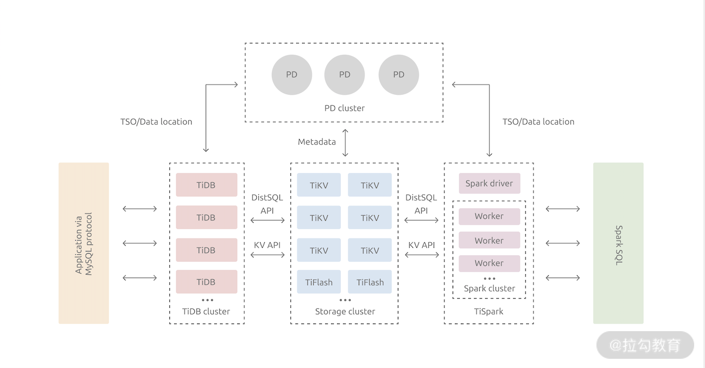
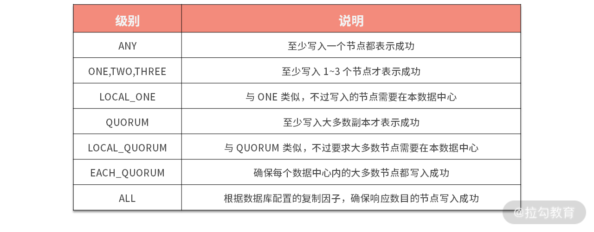
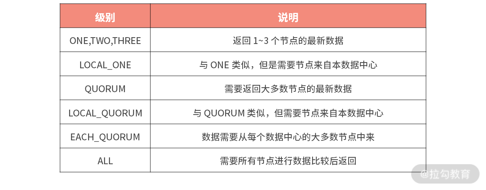

# 21 知识串讲：如何取得性能和可扩展性的平衡？

这一讲我们来总结一下模块三。经过这个模块的学习，相信你已经对分布式数据库中分布式系统部分常见的技术有了深刻的理解。这是一节知识串讲的课，目的是帮助你将所学的内容串接起来；同时，我会通过若干的案例带你看看这些知识是如何应用到分布式数据库之中的。

## 知识总结

在本模块一开始，我就提出了分布式系统最需要关心的问题：失败。失败可以说是分布式系统中无处不在的一种现象，它不仅来源于网络抖动带来的连接问题，同时分布式的节点本身的稳定性也会影响系统整体的稳定状态。在“13 | 概要：分布式系统都要解决哪些问题”中我们就定义了失败模型，它们分别是：崩溃失败、遗漏失败以及任意失败。

其中分布式数据库一般研究前两种失败，因为任意失败是假设节点伪造数据，这对基于安全网络而构建的分布式数据库来说是一种不常见的情况。失败模型从上到下失败的原因越来越难以预知，同时处理的难度也越来越大。本模块介绍的绝大部分技术与算法，都是处理第一种失败场景的，而共识算法主要解决第二种失败场景。

而后我们介绍了针对失败的探测手段，其中基于心跳的算法广泛地应用在分布式数据库之中。同时对于无主节点的对等分布式数据库，基于 Gossip 算法的失败检测被用于该场景的分布式数据库，如 Apache Cassandra。

在介绍了失败检测之后，我提到了主从模式的分布式系统。具有主节点的分布式数据库相对于完全对等的分布式数据库来说，具有性能高、状态易于预测等优点。在该部分，我们重点介绍了领导选举的方案，选举算法中我介绍了 Bully 算法及其多种变种，基本涵盖了主要的领导选举手段。共识算法部分如 ZAB、Raft 等协议的领导选举方案中都可以看到 Bully 算法的影子。

在介绍完领导选举以后，我们接着扩展了模块一中关于复制与一致性的内容。补充说明了客户端一致性与最终一致性。至此关于一致性所有的内容，在我们的课程体系中都已经介绍完整。在“16 | 再谈一致性：除了 CAP 之外的一致性模型还有哪些”中我引入了完整的一致性模型树，帮助你建立起一致性的完整知识体系。客户端一致性与最终一致性往往同时使用，非常适合 AP 类数据库，这类数据库以 AWS 的 DynamoDB 为代表，是一类无主节点、跨区域、可全球部署的分布式数据库，且一般为 NoSQL 数据库。除了 Dynamo 外，如 Apache Cassandra、Azue Cosmos 也是此类数据库典型的代表。

由于最终一致会导致数据库允许节点之前数据的暂时不一致，根据熵增理论，此种不一致会随着时间逐渐扩大，最终导致最终一致类数据库完全不可用。基于此种原因，我们引入了反熵的概念。反熵手段分为前台与后台两类，前者包括读修复、暗示传递队列等；后者有 Merkle 树和位图版本向量。而在“14 | 错误侦测：如何保证分布式系统稳定”提到的 Gossip 协议，除了可以检测系统中的异常情况外，其最重要的功能是保证消息在整个分布式系统内部可靠地传递，从而实现了反熵的目的。Gossip 协议非常适用于大规模的分布式数据库，如 Apache Cassandra、Redis 等都使用该技术。

**分布式事务是本模块的重点内容**。我用了两讲来介绍它，首先说的是最典型的原子提交事务，分别为两阶段和三阶段提交，其中三阶段提交虽然对两阶段出现的问题进行了改进，但由于其性能较低，且存在脑裂的问题，故在现实场景中很少使用。而后我们介绍了快照隔离与序列化的快照隔离，它们是现代分布式数据库最重要的隔离级别，为实现无锁高性能的分布式事务提供了支持。而 Percolator 事务模型就是基于此种隔离级别的一种高效乐观无锁的事务方案。目前 TiDB 使用该方案来实现其乐观事务。

分布式事务一直是分布式数据库领域的理论创新热点。我在本模块中对比介绍了两种创新的事务模型 Spanner 和 Calvin，前者使用 PaxosGroup 结合 TrueTime，在平衡性方面取得了瞩目的成绩；而后者在高竞争事务的吞吐量上给我们留下了深刻的印象。同时它们之间的理论争论，为我们更好地认识其优缺点指明了方向，可以说它们之间的论战对整个分布式事务理论的发展是非常有意义的，同时我们也期待未来分布式事务理论能否产生出更加优秀的解决方案。

在本模块的最后一讲，也就是“20 | 共识算法：一次性说清楚 Paxos、Raft 等算法的区别”，我们介绍了分布式系统理论的集大成者——分布式共识算法。共识算法可以说是失败模型、失败侦测、领导选举和一致性的合体。它通过单一的算法体系，实现了以上描述的分布式系统中的多种功能。从而为构建分布式数据库提供了强有力的帮助，如分布式事务和数据复制领域中，我们会发现许多方案都使用了共识算法。目前在分布式数据库中，最为常见的共识算法是 Raft，它是在 Multi-Paxos 基础上经过一定简化得到的，其易于实现、快速恢复等特点对分布式数据库的维护者而言是非常有吸引力的。

至此，我们介绍完了本模块的全部内容。下面我将通过一些具体的案例来把所学知识应用在实际中。在案例部分我选择了三个比较典型的数据库：TiDB、阿里的 PolarDB-X 和 Apache Cassandra。它们是目前分布式数据库比较典型的代表，让我们来看看它们是如何使用本模块知识点的。

## TiDB：使用乐观事务打造悲观事务

在分布式事务那一讲，我提到 TiDB 的乐观事务使用了 Google 的 Percolator 模式，同时 TiDB 也对该模式进行了改进。可以说一提到 Percolator 模式事务的数据库，国内外都绕不过 TiDB。

TiDB 在整体架构上基本参考了 Google Spanner 和 F1 的设计，分两层为 TiDB 和 TiKV。 TiDB 对应的是 Google F1，是一层无状态的 SQL Layer，兼容绝大多数 MySQL 语法，对外暴露 MySQL 网络协议，负责解析用户的 SQL 语句，生成分布式的 Query Plan，翻译成底层 Key Value 操作发送给 TiKV。TiKV 是真正的存储数据的地方，对应的是 Google Spanner，是一个分布式 Key Value 数据库，支持弹性水平扩展，自动地灾难恢复和故障转移，以及 ACID 跨行事务。下面的图展示了 TiDB 的架构。

对于事务部分，TiDB 实现悲观事务的方式是非常简洁的。其团队在仔细研究了 Percolator 的模型后发现，其实只要将在客户端调用 Commit 时候进行两阶段提交这个行为稍微改造一下，将第一阶段上锁和等锁提前到事务中执行 DML 的过程中，就可以简单高效地支持悲观事务场景。

TiDB 的悲观锁实现的原理是，在一个事务执行 DML（UPDATE/DELETE）的过程中，TiDB 不仅会将需要修改的行在本地缓存，同时还会对这些行直接上悲观锁，这里的悲观锁的格式和乐观事务中的锁几乎一致，但是锁的内容是空的，只是一个占位符，等到 Commit 的时候，直接将这些悲观锁改写成标准的 Percolator 模型的锁，后续流程和原来保持一致即可。

这个方案在很大程度上兼容了原有的事务实现，其扩展性、高可用和灵活性都有保证。同时该方案尽最大可能复用了原有 Percolator 的乐观事务方案，减少了事务模型整体的复杂度。

以上就是 TiDB 如何使用 Percolator 模型及其变种同时实现了乐观事务与悲观事务。下面我来介绍一下阿里的 PolarDB-X 是如何利用共识算法打造异地多活分布式数据库的。

## PolarDB-X：使用 Paxos 打造异地多活体系

阿里随着业务的高速增长，“异地多活”成了其应用的新标准。基于这样的业务背景驱动，PolarDB-X 早期基于单机 MySQL 实现了一致性能力，配合 TDDL 分库分表的模式部分解决了业务诉求，该模块被称为 X-Paxos。随着技术的不断发展和演进，以及面向云的时代的全面普及，PolarDB-X 2.0 中融合了分布式 SQL 引擎和基于 X-Paxos 的数据库存储技术，提供了全新的云原生分布式数据库。

X-Paxos 的算法基于具有领导节点的 Multi-Paxos 来实现。就像我在共识那一讲介绍的一样，这是被大量工程实践证明是最高效的一种 Paxos 算法。

在基础算法之上，结合阿里是业务场景以及高性能和生态的需求，X-Paxos 做了很多的创新性的功能和性能的优化，使其相对于基础的 Multi-Paxos，功能变得更加丰富，性能也有明显的提升。这里我介绍 X-Paxos 的几个优化点。

### 有主选举

X-Paxos 在标准 Multi-Paxos 的基础上，支持在线添加/删除多种角色的节点，支持在线快速将领导节点转移到其他节点。这样的在线运维能力，将极大地方便分布式节点的有计划性的运维工作，从而降低业务恢复时间。

### 可用区位置感知

阿里目前多地架构会有中心机房的诉求，比如，应用因其部署的特点，往往要求在未发生城市级容灾的情况下，仅在中心写入数据库，数据库的领导节点在正常情况下只在中心地域；同时又要求在发生城市级容灾的时候（同一个城市的多个机房全部不可用），可以完全不丢失任何数据的情况下，将主节点切换到非中心城市。

### 节点功能裁剪

Paxos 算法中每个节点都包含了 Proposer/Accepter/Learner 三种功能，每一个节点都是全功能节点。但是某些情况下，集群并不需要所有节点都拥有全部的功能。X-Paxos 使用了如下的一些裁剪手段：

1. 裁剪其中一些节点的状态机，只保留日志（无数据的纯日志节点，但是在同步中作为 Quroum 计算），此时需要裁剪掉协议中的 Proposer 功能，保留 Accepter 和 Learner 功能；
1. 一些节点只是订阅/消费协议产生的日志流，而不作为集群的成员，此时可以裁剪掉协议的 Proposer/Accepter 功能，只保留 Learner 功能。

以上裁剪手段的组合，可以提高集群利用率、节约成本，同时得到了比较灵活的功能组合。

这就是 PolarDB-X 使用共识算法的一系列尝试，最后让我们看看 Apache Cassandra 是如何实现可调节一致性的。

## Apache Cassandra：可调节一致性

Apache Cassandra 提供了可调节一致性，允许开发者在数据一致性和可用性之间做出权衡，并且这种灵活性由客户端来管理。一致性可以是全局的，也可以针对单个读取和写入操作进行调整。例如在更新重要数据时，需要高度的一致性。 对于不太关键的应用或服务，可以放宽一致性以实现更好的性能。

Cassandra 的可调节一致性如我在本模块一致性那一讲介绍的一样，分为写一致性与读一致性。

### 写一致性

写一致性声明了需要写入多少个节点才算一次成功的写入。Cassandra 的写一致性是可以在强一致到弱一致之间进行调整的。我总结了下面的表格来为你说明。

我们可以看到 ANY 级别实际上对应了最终一致性。Cassandra 使用了反熵那一讲提到的暗示切换技术来保障写入的数据的可靠，也就是写入节点一旦失败，数据会暂存在暗示切换队列中，等到节点恢复后数据可以被还原出来。

### 读一致性

对于读操作，一致性级别指定了返回数据之前必须有多少个副本节点响应这个读查询。这里同样给你整理了一个表格。

Cassandra 在读取的时候使用了读修复来修复副本上的过期数据，该修复过程是一个后台线程，故不会阻塞读取。

以上就是 Apache Cassandra 实现可调节一致性的一些细节。AWS 的 DynamoDB、Azure 的 CosmosDB 都有类似的可调节一致性供用户进行选择。你可以比照 Cassandra 的模式和这些数据库的文档进行学习。

## 总结**分布式系统是分布式数据库的核心，它与存储引擎相互配合共同实现了完整的分布式数据库的功能** 。存储引擎一般影响数据库的写入，也就是数据库的性能，它决定了数据库到底能多快地处理数据。同时，分布式系统处理节点直接的通信，也就是数据库的扩展性，它决定了数据库的扩展能力和数据容量。故两者需要相互配合，同时在设计使用数据库时，可以在它们之间进行一定的取舍，从而达到高效利用各种资源的目的

分布式系统这个模块，我们介绍了分布式数据库经常使用的知识点，特别是事务、一致性和共识是本模块的核心，希望你能好好掌握。

下一模块我们就进入实际案例中，我将分门别类地为你介绍市面中典型的分布式数据库。利用课程中的知识来分析它们，从而更好地帮助你去使用它们。

感谢学习，我们下一讲再见。
