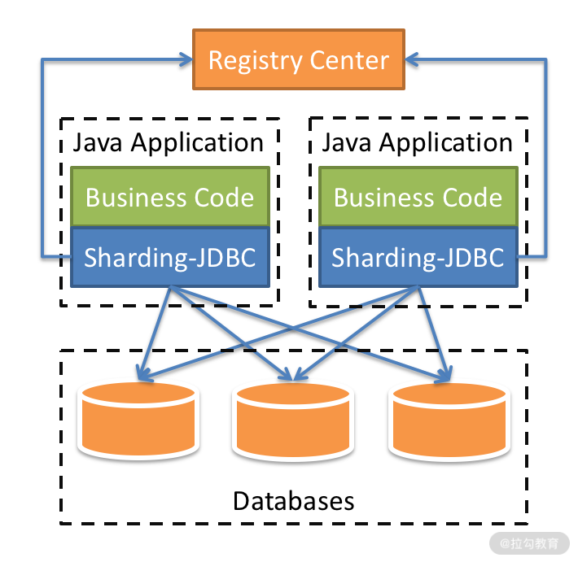
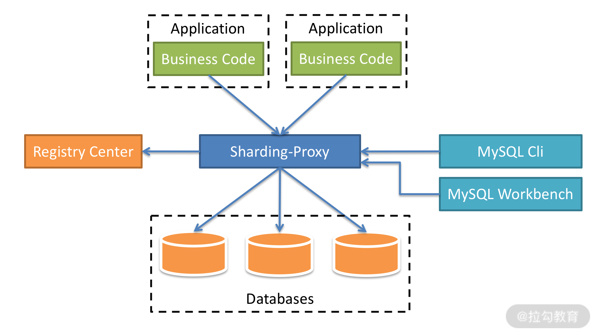

# 22 发展与局限：传统数据库在分布式领域的探索

从这一讲开始，我们进入实践（扩展）模块，目的是帮助你更了解现代分布式数据库，并且我会把之前学习的理论知识应用到实际案例中。

这个模块的讲解思路如下。

1. 传统数据库分布式：传统数据库，如 Oracle、MySQL 和 PostgreSQL 没有一刻放弃在分布式领域的探索。我会介绍分布式技术如何赋能传统数据库，以及它们的局限性。
1. 数据库中间件：虽然中间件严格来说并不包含在数据库领域内，但它是很多用户首次接触分布式数据库的切入点，故在该领域有着不可代替的作用。我会介绍数据库中间件的功能，特别是处理事务的方式，它与模块三中介绍的分布式事务还是有差别的。
1. 当代分布式数据库：该部分重点介绍目前大家能接触到的 NewSQL、DistributedSQL 类型的数据库。重点关注它们在异地多活、容灾等方面的实践。
1. 其他类型数据库与数据库选型：查缺补漏为你介绍其他类型的分布式数据库，扩宽你的视野。最后结合金融、电信和电商等场景，为你介绍这些行业是如何选择分布式数据库的。

以上就是本模块整体的讲解流程，那么现在让我们进入第一个问题的学习，来看看传统数据库如何进行分布式化改造。

## 传统数据库分布式化

我在模块一中介绍过，业务应用系统可以按照交易类型分为 OLTP 场景和 OLAP 场景两大类。OLTP 是面向交易的处理过程，单笔交易的数据量小，但是要在很短的时间内给出结果，典型场景包括购物、转账等；而 OLAP 场景通常是基于大数据集的运算，典型场景包括生成各种报表等。

OLTP 与 OLAP 两种场景有很大的差异，虽然传统数据库在其早期是将两者融合在一起的。但是随着它们向分布式，特别是 Sharding（分片）领域转型，OLAP 类型的数据逐步被抛弃，它们将所有的精力集中在了 OLTP 上。

OLTP 场景通常有三个特点：

- 写多读少，而且读操作的复杂度较低，一般不涉及大数据集的汇总计算；
- 低延时，用户对于延时的容忍度较低，通常在 500 毫秒以内，稍微放大一些也就是秒级，超过 5 秒的延时通常是无法接受的；
- 高并发，并发量随着业务量而增长，没有理论上限。

传统数据库，比如 MySQL 和 Oracle 这样的关系型数据库就是服务于 OLTP 场景的，但我们一般认为它们并不是分布式数据库。这是为什么呢？因为这些数据库传统都是单节点的，而我们说的分布式数据库都是多节点的。

传统关系型数据库是单机模式的，也就是主要负载运行在一台机器上。这样，数据库的并发处理能力与单机的资源配置是线性相关的，所以并发处理能力的上限也就受限于单机配置的上限。这种依靠提升单机资源配置来扩展性能的方式，被称为垂直扩展（Scale Up）。我们之前介绍过，垂直扩展是瓶颈的，因为物理机单机配置上限的提升是相对缓慢的。这意味着，在一定时期内，依赖垂直扩展的数据库总会存在性能的天花板。

那么传统数据库的单机模式可以变为分布式吗？答案是可以的。这些传统数据库在维持关系型数据库特性不变的基础上，可以通过水平扩展，也就是 Sharding 模式，增加机器数量、提供远高于单体数据库的并发量。这个并发量几乎不受单机性能限制，我们将这个级别的并发量称为“高并发”。这里说的“高并发”并没有一个具体的数字与之对应。不过，我可以给出一个经验值，这个“高并发”应该至少大于一万 TPS。

在 Sharding 之外，还需要引入可靠的复制技术，从而提高系统整体的可用度，这在金融级的容灾场景中非常重要。这些理念都是我在模块一中就强调过的，分片与同步才是分布式数据库的核心。

那么介绍完了传统数据库如何改造为分布式数据库的基本理念，现在让我们看看它们是如何具体操作的吧。

## 商业产品

我在“01 | 导论：什么是分布式数据库？聊聊它的前世今生”介绍过，商业数据库如 Oracle 通过底层存储的分布式达到数据分散的目的。其实这类数据库一直没有放弃对分布式领域的探索。现在我介绍一下 Oracle Sharding。

Oracle 数据库从 12.2 版本开始引入 Sharding 特性，集成了 NoSQL 和成熟的关系型数据库的优势，到如今已经过多个版本迭代，成为一整套成熟的分布式关系型数据库解决方案。Oracle Sharding 可以让用户将数据分布和复制到一组 Oracle 数据库集群中，集群中的数据库只需要网络连接，不需要共享软件和硬件。Oracle Sharding 可以为应用提供线性扩展能力和完全容错能力。

Oracle Sharding 主要包括下面这些组件。

- Sharded database（SDB）：逻辑上 SDB 是一个数据库，但是物理上 SDB 包括多个物理独立的数据库，SDB 类似一个数据库池（pool），数据库池中包括多个数据库（Shard）。
- Shards：SDB 包括多个物理独立的数据库，每一个数据库都称为 shard，每个 shard 数据库位于不同的服务器。这些 Shard 被部署在独立的机器上，每个 shard 数据库中保存表的不同数据集，但是每个 Shard 中都有相同的列，也就是说这些 Shard 是按行进行分片的。
- Shard catalog：是一个 Oracle 数据库，用于集中存储管理 SDB 配置信息，是 SDB 的核心。SDB 配置变化，比如添加/删除 shard 等，都记录在 Shard catalog。如果应用查询多个 shard 中的数据，那么由 Shard catalog 统一协调分配。Shard catalog 需要进行 HA，也就是高可用部署。因为里面的数据非常重要，一旦丢失，会造成整个数据库不可用。
- Shard directors：Global Data Service（GDS）实现对 Sharding 的集中部署和管理。GSM 是 GDS 的核心组件，GSM 作为 Shard director。GSM 类似监听器，将客户端对 SDB 的请求路由到对应的 shard，负载均衡客户端的访问。

Oracle Sharding 优点如下。

- 线性扩展：因为每个 shard 是一个独立的数据库，通过增加新的 Shard 节点，来线性扩展性能，自动 rebalance 数据。
- 失败隔离：由于 Shard 是一种 shared-nothing 技术，每个 shard 使用独立的硬件，因此一个 shard 节点出现故障，只会影响到这个 shard 存放的数据，而不会影响到其他 shard。
- 按照地理位置分布数据：可以选择根据地理位置不同，将数据存储在不同的 shard。

除了以上的优点，其缺点也非常明显。

- 用户设计复杂：不同于传统的 RAC 模式，Sharding 需要用户对表进行严格设计，从而才能发挥该模式扩展性与可用性方面的优势。同时，对于老系统迁移，这往往意味着要修改现有代码。
- 跨分片性能低：跨分片事务，聚合查询的性能很低。一般比单分片低 10%。

最后一个缺点就是商业数据库的老问题，性价比低。这个我在后面会进一步阐述。

那么商业方案看起来很好，但是如果你更喜欢开源的解决方案，下面我会介绍开源传统数据库对这个问题的思考。

## 开源定制

单体开源数据要向分布式数据库演进，就要解决写入性能不足的问题。

最简单直接的办法就是分库分表。分库分表方案就是在多个单体数据库之前增加代理节点，本质上是增加了 SQL 路由功能。这样，代理节点首先解析客户端请求，再根据数据的分布情况，将请求转发到对应的单体数据库。代理节点分为“客户端 + 单体数据库”和“中间件 + 单体数据库”两个模式。

客户端组件 + 单体数据库通过独立的逻辑层建立数据分片和路由规则，实现单体数据库的初步管理，使应用能够对接多个单体数据库，实现并发、存储能力的扩展。其作为应用系统的一部分，对业务侵入比较深。这种客户端组件的典型产品是 Apache ShardingShpere 的 JDBC 客户端模式，下图就是该模式的架构图。

Apache ShardingShpere 的 JDBC 客户端模式架构图

代理中间件 + 单体数据库以独立中间件的方式，管理数据规则和路由规则，以独立进程存在，与业务应用层和单体数据库相隔离，减少了对应用的影响。随着代理中间件的发展，还会衍生出部分分布式事务处理能力。这种中间件的典型产品是 MyCat、Apache ShardingShpere 的 Proxy 模式。

Apache ShardingShpere 的 Proxy 模式架构图

代理节点需要实现三个主要功能，它们分别是客户端接入、简单的查询处理器和进程管理中的访问控制。另外，分库分表方案还有一个重要的功能，那就是分片信息管理，分片信息就是数据分布情况。不过考虑分片信息也存在多副本的一致性的问题，大多数情况下它会独立出来。显然，如果把每一次的事务写入都限制在一个单体数据库内，业务场景就会很受局限。

因此，跨库事务成为必不可少的功能，但是单体数据库是不感知这个事情的，所以我们就要在代理节点增加分布式事务组件。同时，简单的分库分表不能满足全局性的查询需求，因为每个数据节点只能看到一部分数据，有些查询运算是无法处理的，比如排序、多表关联等。所以，代理节点要增强查询计算能力，支持跨多个单体数据库的查询。更多相关内容我会在下一讲介绍。

这时离分布式数据库还差重要的一步，那就是逻辑时钟。我们在分布式系统模块已经介绍了逻辑时钟的意义，它是实现数据一致性的必要条件。加上这最后一块拼图，这类分布式数据库区别于单体数据库的功能也就介绍完整了，它们是分片、分布式事务、跨节点查询和逻辑时钟。

这类数据库一般以 MySQL 或 PostgreSQL 为基础进行开发。MySQL 类的解决方案有 TDSQL、Vitess 和具有 JDTX 的 ShardingShpere。PGXC（PostgreSQL-XC）的本意是指一种以 PostgreSQL 为内核的开源分布式数据库。因为 PostgreSQL 的开放软件版权协议，很多厂商在 PGXC 上二次开发，推出自己的产品。不过，这些改动都没有变更主体架构风格，所以我把这类产品统称为 PGXC 风格，其中包括 TBase、GuassDB 和 AntDB 等。

以上我们讨论了开源领域中传统数据库在分布式领域中的尝试。但是，此类方案是有一些局限的，看看都有哪些。

## 局限

目前传统数据库在分布式领域内的探索，我们可以总结为“ **商业靠实力而开源靠合作**”，它们分别打开了自己的一片天地。但是，它们长久的技术积累不仅带来了功能的丰富，同时一些局限也是其无法克服的。

1.**性价比 **。以 Oracle Sharding 为代表的商业解决方案，虽然功能很完善，同时能满足多种场景，对传统 Oracle 用户有极强的吸引力。但是其费用与收益其实是不成正比的，其对分片事务支持有限，同时跨分片查询性能很低。这些重要功能的缺失与其高昂的售价相比是极不相称的。故商业的 Sharding 方案一直没有成为主流。
2.** 事务 **。由于传统数据库都需要复用原有的存储节点，故事务方案大多都是我们介绍过的两阶段提交这类原子提交协议。学习过模块三中分布式事务的同学都清楚，传统两阶段在性能和规模上都有很大的限制，必须采用新的事务模式才能突破这层天花板。而传统数据库的底层被锁死，很难在这个领域有更好的表现。
3.** OLAP**。传统数据库在转为分布式之前能很好地支持 OLAP。但其 Sharding 后，该过程变得越来越困难。同时随着大数据技术的崛起，它们有主动放弃该领域的趋势。而新一代的 HTAP 架构无一例外都是 NewSQL 和云原生数据库的天下，这个领域是从传统数据库发展而来的分布式数据库无法企及的。

以上我们谈的传统数据库在分布式领域的局限其实总结为一点就是，**它们的底层存储引擎限制了其上层分布式功能的拓展** 。只有如 NewSQL 类数据库一般，使用创新的存储引擎，才能在整体上打造出功能与性能匹配的现代分布式数据库。但是，此类数据库由于发展多年，在稳定性、维护性上有不可动摇的优势，即使存在一些局限性，但其对单机版本的用户依然有很强的吸引力。

## 总结

这一讲，我们介绍了传统单机数据库向分布式数据库的转型尝试，它们一般经过分片、复制、分布式事务和物理时钟等过程的改造，从而打造以单体数据库为数据节点的分布式数据库。

同时我们也讨论了此类数据库的天花板，因此应该从底层去构建分布式数据库，就像 NewSQL 类数据库，才是分布式数据库发展的正途。
