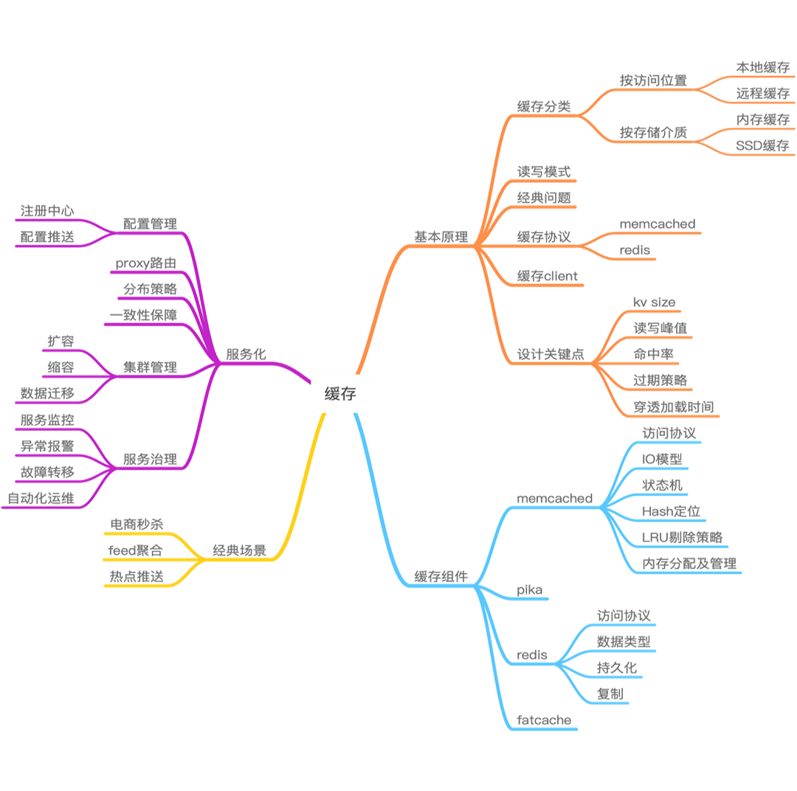
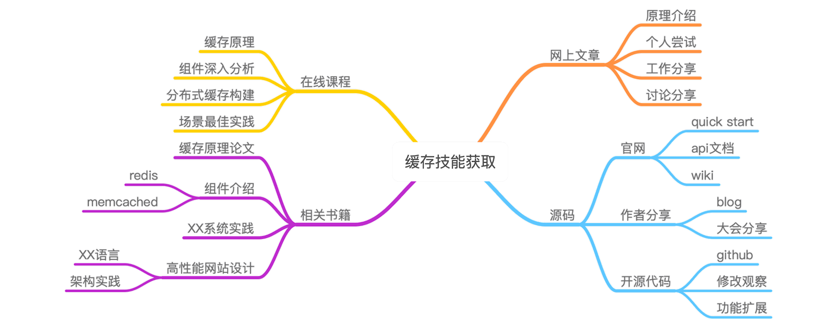

# 00 开篇寄语：缓存，你真的用对了吗？

你好，我是你的缓存老师陈波，可能大家对我的网名 fishermen 会更熟悉。

我是资深老码农一枚，经历了新浪微博从起步到当前月活数亿用户的大型互联网系统的技术演进过程，现任新浪微博技术专家。我于 2008 年加入新浪，最初从事新浪 IM 的后端研发。2009 年之后开始微博 Feed 平台系统的的研发及架构工作，深度参与最初若干个版本几乎所有业务的开发和架构改进，2013 年后开始从事微博平台基础架构相关的研发工作。目前主要从事微博 Feed 平台的基础设施、缓存中间件、分布式存储等的研发及架构优化工作。

\*\*那么，我们为什么要学习缓存呢？有必要学习缓存吗？\*\*随着互联网从门户/搜索时代进入移动社交时代，互联网产品也从满足用户单向浏览的需求，发展为满足用户个性信息获取及社交的需求。这就要求产品做到以用户和关系为基础，对海量数据进行实时分析计算。也就意味着，用户的每次请求，服务后端都要查询用户的个人信息、社交关系图谱，以及关系图谱涉及到的大量关联信息。还要将这些信息进行聚合、过滤、筛选和排序，最终响应给用户。如果这些信息全部从 DB 中加载，将会是一个无法忍受的漫长等待过程。

而缓存的使用，是提升系统性能、改善用户体验的唯一解决之道。

以新浪微博为例，作为移动互联网时代的一个开拓者和重量级社交分享平台，自 2009 年上线后，用户数量和微博数量都从 0 开启并高速增长，到 2019 年，日活跃用户已超 2亿，每日新发 Feed 1～2亿，每日访问量百亿级，历史数据高达千亿级。同时，在微博的日常服务中，核心接口可用性要达到 99.99%，响应时间在 10～60ms 以内，核心单个业务的数据访问量高达百万级 QPS。

所有这些数据都是靠良好的架构和不断改进的缓存体系来支撑的。

其实，作为互联网公司，只要有直接面对用户的业务，要想持续确保系统的访问性能和可用性，都需要使用缓存。因此，缓存也是后端工程师面试中一个非常重要的考察点，面试官通常会通过应聘者对缓存相关知识的理解深入程度，来判断其开发经验和学习能力。可以说，对缓存的掌握程度，在某种意义上决定了后端开发者的职业高度。**想学好缓存，需要掌握哪些知识呢？**

可以看一下这张“缓存知识点全景图”。

- 首先，要熟练掌握缓存的基础知识，了解缓存常用的分类、读写模式，熟悉缓存的七大经典问题及解决应对之策，同时要从缓存组件的访问协议、Client 入手，熟练掌握如何访问各种缓存组件，如 Memcached、Redis、Pika 等。
- 其次，要尽可能深入理解缓存组件的实现方案、设计原理，了解缓存的各种特性、优势和不足，这样在缓存数据与预期不一致时，能够快速定位并解决问题。
- 再次，还要多了解线上大中型系统是如何对缓存进行架构设计的。线上系统，业务功能丰富多变，跨域部署环境复杂，而且热点频发，用户习惯迥异。因此，缓存系统在设计之初就要尽量进行良好设计，规划好如何进行Hash及分布、如何保障数据的一致性、如何进行扩容和缩容。当然，缓存体系也需要伴随业务发展持续演进，这就需要对缓存体系进行持续的状态监控、异常报警、故障演练，以确保在故障发生时能及时进行人肉或自动化运维处理，并根据线上状况不断进行优化和改进。
- 最后，了解缓存在各种场景下的最佳实践，理解这些最佳实践背后的 Tradeoff，做到知其然知其所以然，以便在实际工作中能举一反三，把知识和经验更好的应用到工作实践中来。

**如何高效学习缓存呢？你能学到什么？**

对于缓存，网上学习资料很多，但过于零散和重复，想要系统地学习还是需要通过阅读缓存相关的书籍、论文和缓存源码，或是学习一些来自实战总结的网络课程。但前面几种形式目前都需要花费较多时间。为了学员既系统又快速地获得所需知识，拉勾教育推出了“300 分钟学会”系列技术课，其中“缓存“课由我来讲。

在这 300 分钟里，我将结合自己在微博平台的缓存架构经验，用 10 课时来分享：

- 如何更好地引入和使用缓存，自系统设计之初，就把缓存设计的关键点对号入座。
- 如何规避并解决缓存设计中的七大经典问题。
- 从协议、使用技巧、网络模型、核心数据结构、存储架构、数据处理模型、优化及改进方案等，多角度全方位深入剖析互联网企业大量使用的Memcached、Redis等开源缓存组件。
- 教你如何利用它们构建一个分布式缓存服务体系。
- 最后，我将结合诸如秒杀、海量计数、微博 Feed 聚合等经典业务场景，分析如何构建相应的高可用、高性能、易扩展的缓存架构体系。

通过本课程，你可以：

- 系统地学习缓存之设计架构的关键知识点；
- 学会如何更好地使用 Memcached、Redis 等缓存组件；
- 对这些缓存组件的内部架构、设计原理有一个较为深入的了解，真正做到知其然更知其所以然；
- 学会如何根据业务需要对缓存组件进行二次开发；
- 搞懂如何构建一个大型的分布式缓存服务系统；
- 了解在当前多种热门场景下缓存服务的最佳实践；
- 现学现用，针对互联网大中型系统，构建出一个更好的缓存架构体系，在大幅提升系统吞吐和响应性能的同时，达到高可用、高扩展，从而可以更从容地应对海量并发请求和极端热点事件。

