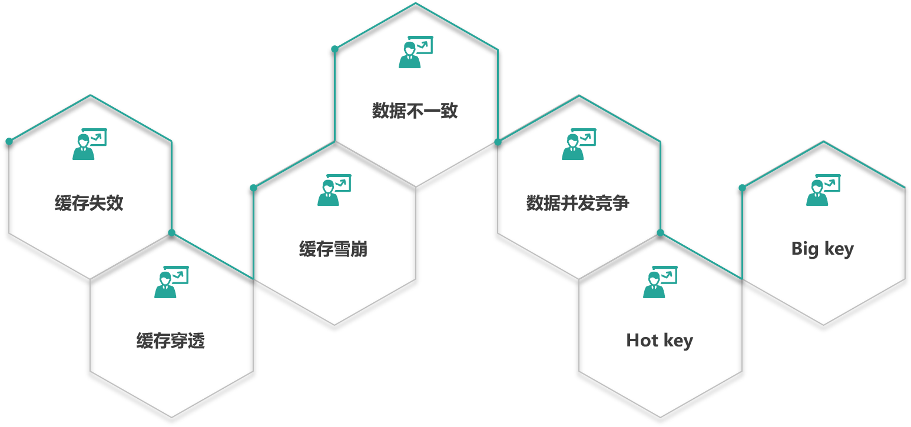
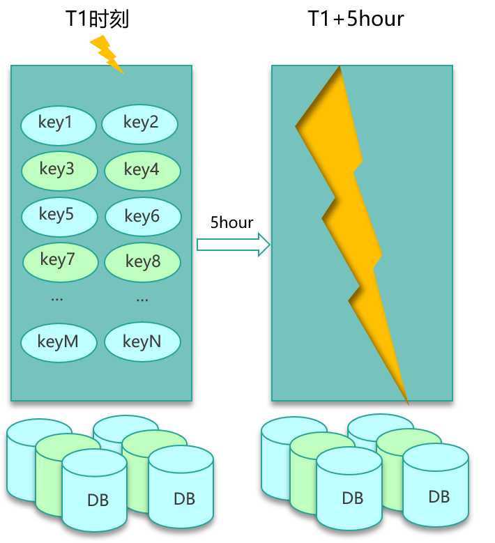
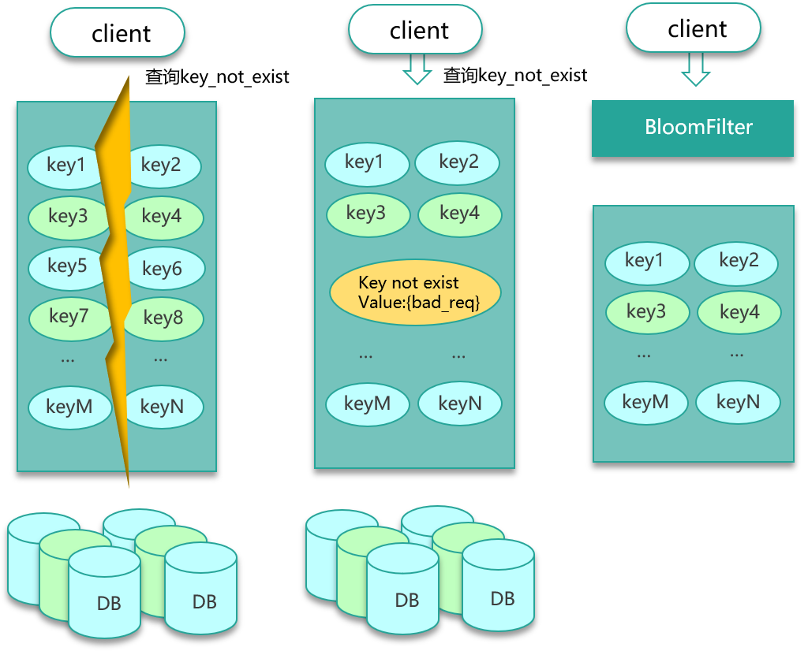
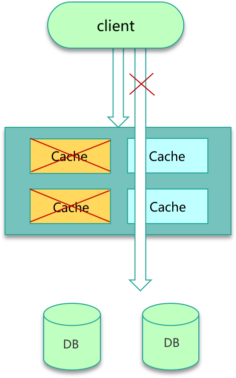

04 缓存失效、穿透和雪崩问题怎么处理？
====================

你好，我是你的缓存老师陈波，欢迎进入第 4 课时“缓存访问相关的经典问题”。

前面讲解了缓存的原理、引入，以及设计架构，总结了缓存在使用及设计架构过程中的很多套路和关键考量点。实际上，在缓存系统的设计架构中，还有很多坑，很多的明枪暗箭，如果设计不当会导致很多严重的后果。设计不当，轻则请求变慢、性能降低，重则会数据不一致、系统可用性降低，甚至会导致缓存雪崩，整个系统无法对外提供服务。

接下来将对缓存设计中的 7 大经典问题，如下图，进行问题描述、原因分析，并给出日常研发中，可能会出现该问题的业务场景，最后给出这些经典问题的解决方案。本课时首先学习缓存失效、缓存穿透与缓存雪崩。

###### 缓存失效

###### 问题描述

缓存第一个经典问题是缓存失效。上一课时讲到，服务系统查数据，首先会查缓存，如果缓存数据不存在，就进一步查 DB，最后查到数据后回种到缓存并返回。缓存的性能比 DB 高 50~100 倍以上，所以我们希望数据查询尽可能命中缓存，这样系统负荷最小，性能最佳。缓存里的数据存储基本上都是以 key 为索引进行存储和获取的。业务访问时，如果大量的 key 同时过期，很多缓存数据访问都会 miss，进而穿透到 DB，DB 的压力就会明显上升，由于 DB 的性能较差，只在缓存的 1%~2% 以下，这样请求的慢查率会明显上升。这就是缓存失效的问题。

###### 原因分析

导致缓存失效，特别是很多 key 一起失效的原因，跟我们日常写缓存的过期时间息息相关。

在写缓存时，我们一般会根据业务的访问特点，给每种业务数据预置一个过期时间，在写缓存时把这个过期时间带上，让缓存数据在这个固定的过期时间后被淘汰。一般情况下，因为缓存数据是逐步写入的，所以也是逐步过期被淘汰的。但在某些场景，一大批数据会被系统主动或被动从 DB 批量加载，然后写入缓存。这些数据写入缓存时，由于使用相同的过期时间，在经历这个过期时间之后，这批数据就会一起到期，从而被缓存淘汰。此时，对这批数据的所有请求，都会出现缓存失效，从而都穿透到 DB，DB 由于查询量太大，就很容易压力大增，请求变慢。

###### 业务场景

很多业务场景，稍不注意，就出现大量的缓存失效，进而导致系统 DB 压力大、请求变慢的情况。比如同一批火车票、飞机票，当可以售卖时，系统会一次性加载到缓存，如果缓存写入时，过期时间按照预先设置的过期值，那过期时间到期后，系统就会因缓存失效出现变慢的问题。类似的业务场景还有很多，比如微博业务，会有后台离线系统，持续计算热门微博，每当计算结束，会将这批热门微博批量写入对应的缓存。还比如，很多业务，在部署新 IDC 或新业务上线时，会进行缓存预热，也会一次性加载大批热数据。

###### 解决方案

对于批量 key 缓存失效的问题，原因既然是预置的固定过期时间，那解决方案也从这里入手。设计缓存的过期时间时，使用公式：过期时间=baes 时间+随机时间。即相同业务数据写缓存时，在基础过期时间之上，再加一个随机的过期时间，让数据在未来一段时间内慢慢过期，避免瞬时全部过期，对 DB 造成过大压力，如下图所示。

###### 缓存穿透

###### 问题描述

第二个经典问题是缓存穿透。缓存穿透是一个很有意思的问题。因为缓存穿透发生的概率很低，所以一般很难被发现。但是，一旦你发现了，而且量还不小，你可能立即就会经历一个忙碌的夜晚。因为对于正常访问，访问的数据即便不在缓存，也可以通过 DB 加载回种到缓存。而缓存穿透，则意味着有特殊访客在查询一个不存在的 key，导致每次查询都会穿透到 DB，如果这个特殊访客再控制一批肉鸡机器，持续访问你系统里不存在的 key，就会对 DB 产生很大的压力，从而影响正常服务。

###### 原因分析

缓存穿透存在的原因，就是因为我们在系统设计时，更多考虑的是正常访问路径，对特殊访问路径、异常访问路径考虑相对欠缺。

缓存访问设计的正常路径，是先访问 cache，cache miss 后查 DB，DB 查询到结果后，回种缓存返回。这对于正常的 key 访问是没有问题的，但是如果用户访问的是一个不存在的 key，查 DB 返回空（即一个 NULL），那就不会把这个空写回cache。那以后不管查询多少次这个不存在的 key，都会 cache miss，都会查询 DB。整个系统就会退化成一个“前端+DB“的系统，由于 DB 的吞吐只在 cache 的 1%~2% 以下，如果有特殊访客，大量访问这些不存在的 key，就会导致系统的性能严重退化，影响正常用户的访问。

###### 业务场景

缓存穿透的业务场景很多，比如通过不存在的 UID 访问用户，通过不存在的车次 ID 查看购票信息。用户输入错误，偶尔几个这种请求问题不大，但如果是大量这种请求，就会对系统影响非常大。

###### 解决方案

那么如何解决这种问题呢？如下图所示。

* 第一种方案就是，查询这些不存在的数据时，第一次查 DB，虽然没查到结果返回 NULL，仍然记录这个 key 到缓存，只是这个 key 对应的 value 是一个特殊设置的值。
* 第二种方案是，构建一个 BloomFilter 缓存过滤器，记录全量数据，这样访问数据时，可以直接通过 BloomFilter 判断这个 key 是否存在，如果不存在直接返回即可，根本无需查缓存和 DB。

不过这两种方案在设计时仍然有一些要注意的坑。

* 对于方案一，如果特殊访客持续访问大量的不存在的 key，这些 key 即便只存一个简单的默认值，也会占用大量的缓存空间，导致正常 key 的命中率下降。所以进一步的改进措施是，对这些不存在的 key 只存较短的时间，让它们尽快过期；或者将这些不存在的 key 存在一个独立的公共缓存，从缓存查找时，先查正常的缓存组件，如果 miss，则查一下公共的非法 key 的缓存，如果后者命中，直接返回，否则穿透 DB，如果查出来是空，则回种到非法 key 缓存，否则回种到正常缓存。
* 对于方案二，BloomFilter 要缓存全量的 key，这就要求全量的 key 数量不大，10亿 条数据以内最佳，因为 10亿 条数据大概要占用 1.2GB 的内存。也可以用 BloomFilter 缓存非法 key，每次发现一个 key 是不存在的非法 key，就记录到 BloomFilter 中，这种记录方案，会导致 BloomFilter 存储的 key 持续高速增长，为了避免记录 key 太多而导致误判率增大，需要定期清零处理。

###### BloomFilter

BloomFilter 是一个非常有意思的数据结构，不仅仅可以挡住非法 key 攻击，还可以低成本、高性能地对海量数据进行判断，比如一个系统有数亿用户和百亿级新闻 feed，就可以用 BloomFilter 来判断某个用户是否阅读某条新闻 feed。下面来对 BloomFilter 数据结构做一个分析，如下图所示。

BloomFilter 的目的是检测一个元素是否存在于一个集合内。它的原理，是用 bit 数据组来表示一个集合，对一个 key 进行多次不同的 Hash 检测，如果所有 Hash 对应的 bit 位都是 1，则表明 key 非常大概率存在，平均单记录占用 1.2 字节即可达到 99%，只要有一次 Hash 对应的 bit 位是 0，就说明这个 key 肯定不存在于这个集合内。

BloomFilter 的算法是，首先分配一块内存空间做 bit 数组，数组的 bit 位初始值全部设为 0，加入元素时，采用 k 个相互独立的 Hash 函数计算，然后将元素 Hash 映射的 K 个位置全部设置为 1。检测 key 时，仍然用这 k 个 Hash 函数计算出 k 个位置，如果位置全部为 1，则表明 key 存在，否则不存在。

BloomFilter 的优势是，全内存操作，性能很高。另外空间效率非常高，要达到 1% 的误判率，平均单条记录占用 1.2 字节即可。而且，平均单条记录每增加 0.6 字节，还可让误判率继续变为之前的 1/10，即平均单条记录占用 1.8 字节，误判率可以达到 1/1000；平均单条记录占用 2.4 字节，误判率可以到 1/10000，以此类推。这里的误判率是指，BloomFilter 判断某个 key 存在，但它实际不存在的概率，因为它存的是 key 的 Hash 值，而非 key 的值，所以有概率存在这样的 key，它们内容不同，但多次 Hash 后的 Hash 值都相同。对于 BloomFilter 判断不存在的 key ，则是 100% 不存在的，反证法，如果这个 key 存在，那它每次 Hash 后对应的 Hash 值位置肯定是 1，而不会是 0。

###### 缓存雪崩

###### 问题描述

第三个经典问题是缓存雪崩。系统运行过程中，缓存雪崩是一个非常严重的问题。缓存雪崩是指部分缓存节点不可用，导致整个缓存体系甚至甚至服务系统不可用的情况。缓存雪崩按照缓存是否 rehash（即是否漂移）分两种情况：

* 缓存不支持 rehash 导致的系统雪崩不可用
* 缓存支持 rehash 导致的缓存雪崩不可用

###### 原因分析

在上述两种情况中，缓存不进行 rehash 时产生的雪崩，一般是由于较多缓存节点不可用，请求穿透导致 DB 也过载不可用，最终整个系统雪崩不可用的。而缓存支持 rehash 时产生的雪崩，则大多跟流量洪峰有关，流量洪峰到达，引发部分缓存节点过载 Crash，然后因 rehash 扩散到其他缓存节点，最终整个缓存体系异常。

第一种情况比较容易理解，缓存节点不支持 rehash，较多缓存节点不可用时，大量 Cache 访问会失败，根据缓存读写模型，这些请求会进一步访问 DB，而且 DB 可承载的访问量要远比缓存小的多，请求量过大，就很容易造成 DB 过载，大量慢查询，最终阻塞甚至 Crash，从而导致服务异常。

第二种情况是怎么回事呢？这是因为缓存分布设计时，很多同学会选择一致性 Hash 分布方式，同时在部分节点异常时，采用 rehash 策略，即把异常节点请求平均分散到其他缓存节点。在一般情况下，一致性 Hash 分布+rehash 策略可以很好得运行，但在较大的流量洪峰到临之时，如果大流量 key 比较集中，正好在某 1～2 个缓存节点，很容易将这些缓存节点的内存、网卡过载，缓存节点异常 Crash，然后这些异常节点下线，这些大流量 key 请求又被 rehash 到其他缓存节点，进而导致其他缓存节点也被过载 Crash，缓存异常持续扩散，最终导致整个缓存体系异常，无法对外提供服务。

###### 业务场景

缓存雪崩的业务场景并不少见，微博、Twitter 等系统在运行的最初若干年都遇到过很多次。比如，微博最初很多业务缓存采用一致性 Hash+rehash 策略，在突发洪水流量来临时，部分缓存节点过载 Crash 甚至宕机，然后这些异常节点的请求转到其他缓存节点，又导致其他缓存节点过载异常，最终整个缓存池过载。另外，机架断电，导致业务缓存多个节点宕机，大量请求直接打到 DB，也导致 DB 过载而阻塞，整个系统异常。最后缓存机器复电后，DB 重启，数据逐步加热后，系统才逐步恢复正常。

###### 解决方案

预防缓存雪崩，这里给出 3 个解决方案。

* 方案一，对业务 DB 的访问增加读写开关，当发现 DB 请求变慢、阻塞，慢请求超过阀值时，就会关闭读开关，部分或所有读 DB 的请求进行 failfast 立即返回，待 DB 恢复后再打开读开关，如下图。

* 方案二，对缓存增加多个副本，缓存异常或请求 miss 后，再读取其他缓存副本，而且多个缓存副本尽量部署在不同机架，从而确保在任何情况下，缓存系统都会正常对外提供服务。
* 方案三，对缓存体系进行实时监控，当请求访问的慢速比超过阀值时，及时报警，通过机器替换、服务替换进行及时恢复；也可以通过各种自动故障转移策略，自动关闭异常接口、停止边缘服务、停止部分非核心功能措施，确保在极端场景下，核心功能的正常运行。

实际上，微博平台系统，这三种方案都采用了，通过三管齐下，规避缓存雪崩的发生。
