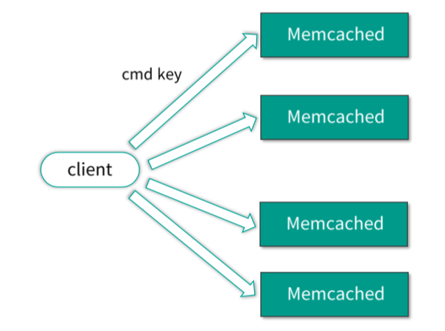
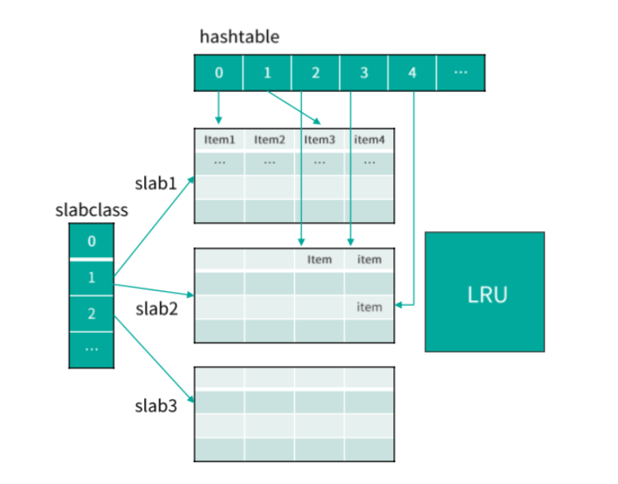

07 MC为何是应用最广泛的缓存组件？
===================

好，我是你的缓存老师陈波，欢迎你进入第 7 课时“Memcached 原理及特性”的学习。

众所周知，用户体验可以说是互联网企业最看重的指标，而在用户体验中，请求响应速度首当其冲。因此互联网系统对性能的追求是永无止境的。性能争霸，缓存为王，Memcached，作为互联网系统使用最广泛、影响最大的标配缓存组件，可以说的上是王中之王了。

本课时将讲解 Memcached 的原理及特性，系统架构，还会重点讲解 Memcached 的网络模型、状态机，最后还会涉及到 Memcached 命令处理的整个流程。

###### Memcached 原理及特性

首先来看 Memcached 的原理及特性。

###### 原理

Memcached 是一个开源的、高性能的分布式 key/value 内存缓存系统。它以 key/value 键值对的方式存储数据，是一个键值类型的 NoSQL 组件。

NoSQL 即 Not SQL，泛指非关系型数据存储。NoSQL 是通过聚合模型来进行数据处理的。其聚合模型主要分为：key/value 键值对、列族、图形等几种方式。其中 key/value 键值类似我们平常使用的 map，只能通过 key 来进行查找和变更操作。我们使用的 Memcached、Redis 等都是 key/value 类型的 NoSQL 存储组件。

Memcached 简称 Mc，是一个典型的内存型缓存组件，这就意味着，Mc 一旦重启就会丢失所有的数据。如下图所示，Mc 组件之间相互不通信，完全由 client 对 key 进行 Hash 后分布和协同。Mc 采用多线程处理请求，由一个主线程和任意多个工作线程协作，从而充分利用多核，提升 IO 效率。

###### slab 机制

接下来介绍 Mc 的 slab 机制。

Mc 并不是将所有数据放在一起来进行管理的，而是将内存划分为一系列相同大小的 slab 空间后，每个 slab 只管理一定范围内的数据存储。也就是说 Mc 内部采用 slab 机制来管理内存分配。Mc 内的内存分配以 slab 为单位，默认情况下一个 slab 是 1MB，可以通过 -I 参数在启动时指定其他数值。

slab 空间内部，会被进一步划分为一系列固定大小的 chunk。每个 chunk 内部存储一个 Item，利用 Item 结构存储数据。因为 chunk 大小固定，而 key/value 数据的大小随机。所以，Item存储完 key/value 数据后，一般还会有多余的空间，这个多余的空间就被浪费了。为了提升内存的使用效率，chunk size 就不能太大，而要尽量选择与 key/value size 接近的 ，从而减少 chunk 内浪费的空间。

Mc 在分配内存时，先将内存按固定大小划分成 slab，然后再将不同 slab 分拆出固定 size 的 chunk。虽然 slab 内的 chunk 大小相同，但不同 slab 的 chunk size 并不同，Mc 会按照一个固定比例，使划分的 chunk size 逐步增大，从而满足不同大小 key/value 存储的需要。

如下图，一组具有相同 chunk size 的所有 slab，就组成一个 slabclass。不同 slabclass 的 chunk size 按递增因子一次增加。Mc 就通过 slabclass 来管理一组 slab 内的存储空间的。每个 slabclass 内部有一个 freelist ，包含这组 slab 里所有空闲的 chunk，当需要存储数据时，从这个 freelist 里面快速分配一个 chunk 做存储空间。当 Item 数据淘汰剔除时，这个 Item 所在的 chunk 又被回收至这个 freelist。

Mc 在通过 slab 机制管理内存分配时，实际 key/value 是存在 Item 结构中，所以对 key/value 的存储空间分配就转换为对 Item 的分配。而 Item 空间的分配有 2 种方式，如果 Mc 有空闲空间，则从 slabclass 的 freelist 分配；如果没有空闲空间，则从对应 slabclass id 对应的 LRU 中剔除一个 Item，来复用这个 Item 的空间。

在查找或变更一个 key 时，首先要定位这个 key 所在的存储位置。Mc 是通过哈希表 Hashtable 来定位 key 的。Hashtable 可以看作是一个内存空间连续的大数组，而这个大数据的每一个槽位对应一个 key 的 Hash 值，这个槽位也称 bucket。由于不同 key 的 Hash 值可能相同，所以 Mc 在 Hashtable 的每个捅内部再用一个单向链表，来解决 Hash 冲突的问题。

Mc 内部是通过 LRU 来管理存储 Item 数据的，当内存不足时，会从 LRU 队尾中剔除一个过期或最不活跃的 key，供新的 Item 使用。

###### 特性

讲完 slab 机制我们来学习 Mc 的特性。

* Mc 最大的特性是高性能，单节点压测性能能达到百万级的 QPS。
* 其次因为 Mc 的访问协议很简单，只有 get/set/cas/touch/gat/stats 等有限的几个命令。Mc 的访问协议简单，跟它的存储结构也有关系。
* Mc 存储结构很简单，只存储简单的 key/value 键值对，而且对 value 直接以二进制方式存储，不识别内部存储结构，所以有限几个指令就可以满足操作需要。
* Mc 完全基于内存操作，在系统运行期间，在有新 key 写进来时，如果没有空闲内存分配，就会对最不活跃的 key 进行 eviction 剔除操作。
* 最后，Mc 服务节点运行也特别简单，不同 Mc 节点之间互不通信，由 client 自行负责管理数据分布。
