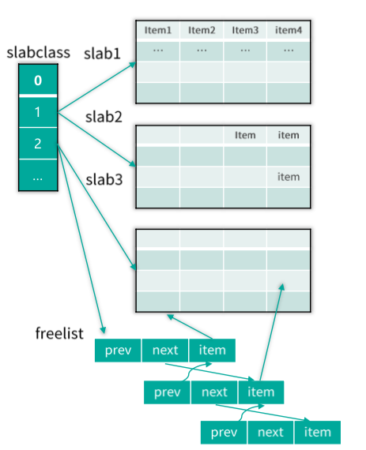
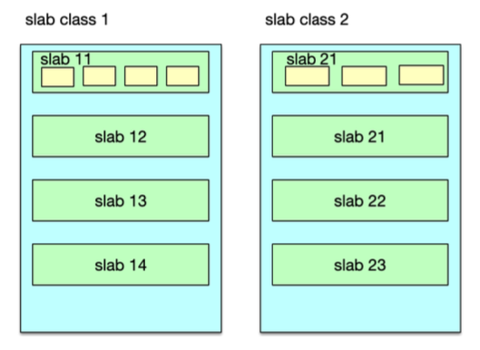
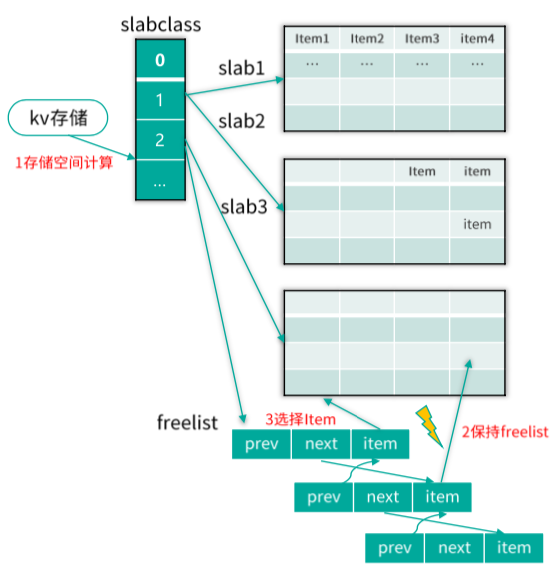
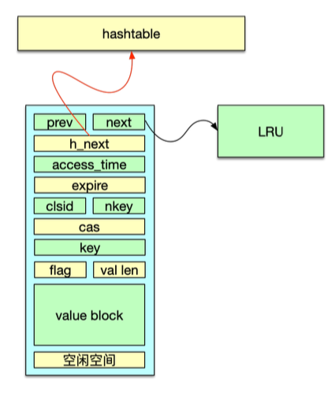

12 为何MC能长期维持高性能读写？
==================

你好，我是你的缓存课老师陈波，欢迎进入第 12 课时“Memcached 内存管理 slab 机制”的学习。

###### 内存管理 slab 机制

讲完淘汰策略，我们接下来学习内存管理 slab 机制。

Mc 内存分配采用 slab 机制，slab 机制可以规避内存碎片，是 Mc 能持续高性能进行数据读写的关键。

###### slabclass

Mc 的 slab 机制是通过 slabclass 来进行运作的，如下图所示。Mc 在启动时，会构建长度为 64 的 slabclass 数组，其中 0 号 slabclass 用于 slab 的重新分配，1~63 号 slabclass 存储数据 Item。存储数据的每个 slabclass，都会记录本 slabclass 的 chunk size，同时不同 slabclass 的 chunk size 会按递增因子增加，最后一个 slabclass（即 63 号 slabclass）的 chunk size 会直接设为最大的 chunk size，默认是 0.5MB。每个 slabclass 在没有空闲的 chunk 时，Mc 就会为其分配一个默认大小为 1MB 的 slab，同时按照本 slabclass 的 chunk size 进行拆分，这些分拆出来的 chunk 会按 Item 结构体进行初始化，然后记录到 slabclass 的 freelist 链表中。当有 key/value 要存储在本 slabclass 时，就从 freelist 分配一个 Item，供其使用。同时，如果 Item 过期了，或被 flush\_all 失效了，或在内存不够时被强项剔除了，也会在适当时刻，重新被回收到 freelist，以供后续分配使用。

###### 存储 slab 分配

如下图所示，Mc 的存储空间分配是以 slab 为单位的，每个 slab 的默认大小时 1MB。因此在存数据时，Mc 的内存最小分配单位是 1MB，分配了这个 1MB 的 slab 后，才会进一步按所在 slabclass 的chunk size 进行细分，分拆出的相同 size 的 chunk。这个 chunk 用来存放 Item 数据，Item 数据包括 Item 结构体字段，以及 key/value。

一般来讲，Item 结构体及 key/value 不会填满 chunk，会存在少量字节的浪费，但这个浪费的字节很少，基本可以忽略。Mc 中，slab 一旦分配，就不会再被回收，但会根据运行状况，重新在不同 slabclass 之间进行分配。

当一个 slabclass 没有空闲 chunk，而新数据插入时，就会对其尝试增加一个新的 slab。slabclass 增加新 slab 时，首先会从 0 号全局 slabclass 中复用一个之前分配的 slab，如果 0 号 slabclass 没有 slab，则会尝试从内存堆空间直接分配一个 slab。如果 0 号全局 slabclass 没有空闲 slab，而且 Mc 内存分配已经达到 Mc 设定的上限值，就说明此时没有可重新分配的 slab，分配新 slab 失败，直接返回。

当然，虽然 slabclass 分配 slab 失败，但并不意味着 Item分配会失败，前面已经讲到，可以通过同步 LRU 淘汰，回收之前分配出去的 Item，供新的存储请求使用。

###### Item

Mc 中，slabclass 中的 chunk 会首先用 Item 结构体进行初始化，然后存到 freelist 链表中，待需要分配给数据存储时，再从 freelist 中取出，存入 key/value，以及各种辅助属性，然后再存到 LRU 链表及 Hashtable 中，如下图所示。Item 结构体，首先有两个 prev、next 指针，在分配给待存储数据之前，这两个指针用来串联 freelist 链表，在分配之后，则用来串联所在的 LRU 链表。接下来是一个 h\_next 指针，用来在分配之后串联哈希表的桶单向链表。Item 结构体还存储了过期时间、所属 slabclass id，key 长度、cas 唯一 id 值等，最后在 Item 结构体尾部，存储了 key、flag、value 长度，以及 value block 数据。在 value 之后的 chunk 空间，就被浪费掉了。Item 在空闲期间，即初始分配时以及被回收后，都被 freelist 管理。在存储期间，被哈希表、LRU 管理。

###### 存储 Item 分配

Mc 采用 slab 机制管理分配内存，采用 Item 结构存储 key/value，因此对存储 key/value 的内存分配，就转换为对 Item 的分配。分配 Item 空间时，会进行 10 次大循环，直到分配到 Item 空间才会提前返回。如果循环了 10 次，还没有分配到 Item 空间，则存储失败，返回一个 SERVER\_ERROR 响应。

在分配过程中，首先，如果 slabclass 的 freelist 有空间，则直接分配。否则，尝试分配一个新的 slab，新 slab 依次尝试从全局 slab 池（即 0 号 slabclass）中复用一个空闲 slab，如果全局 slab 池没有 slab，则尝试从内存直接分配。分配新 slab 成功后，会按照 slabclass 记录的 chunk size 对 slab 进行分拆，并将分拆出来的 chunk 按 Item 结构初始化后记录到 freelist。如果全局 slab 池为空，且 Mc 内存分配已经达到设定的上限，则走新增 slab 的路径失败，转而进行 5 次小循环，尝试从 COLD LRU 回收过期 key，如果没有过期则直接强制剔除队尾的一个正常 key。如果该 slabclass 的 COLD LRU 没有 Item，则对其 HOT LRU 进行处理，对 HOT 链表队尾 Item 进行回收或者迁移，以方便在下次循环中找到一个可用的 Item 空间。

数据存储机理
======

讲完 Mc 的哈希表定位、LRU 淘汰、slab 内存分配，接下来我们来看看 Mc 中 key/value 数据的存储机理，通过对数据存储以及维护过程的分析，来把 Mc 的核心模块进行打通和关联。

首先来看 Mc 如何通过 slab 机制将数据写入预分配的存储空间。

如下图所示，当需要存储 key/value 数据时，首先根据 key/value size，以及 Item 结构体的 size，计算出存储这个 key/value 需要的字节数，然后根据这个字节数选择一个能存储的 chunk size 最小的 slabclass。再从这个 slabclass 的 freelist 分配一个空闲的 chunk 给这个 key/value 使用。如果 freelist 为空，首先尝试为该 slabclass 新分配一个 slab，如果 slab 分配成功，则将 slab 按 size 分拆出一些 chunk，通过 Item 结构初始化后填充到 freelist。如果 slab 分配失败，则通过 LRU 淘汰失效的 Item 或强行剔除一个正常的 Item，然后这些 Item 也会填充到 freelist。当 freelist 有 Item 时，即可分配给 key/value。这个过程会重试 10 次，直到分配到 Item 位置。一般情况下，Item 分配总会成功，极小概率情况下也会分配失败，如果分配失败，则会回复一个 SERVER\_ERROR 响应，通知 client 存储失败。分配到一个空闲的 Item 后，就会往这个 Item 空间写入过期时间、flag、slabclass id、key，以及 value 等。对于 set 指令，如果这个 key 还有一个旧值，在存入新 value 之前，还会先将这个旧值删除掉。

当对 key/value 分配 Item 成功，并写入数据后，接下来就会将这个 Item 存入哈希表。因为Mc 哈希表存在迁移的情况，所以对于正常场景，直接存入主哈希表。在哈希表迁移期间，需要根据迁移位置，选择存入主哈希表还是旧哈希表。存入哈希表之后，这个 key 就可以快速定位了。然后这个 Item 还会被存入 LRU，Mc 会根据这个 key 的过期时间进行判断，如果过期时间小于 61s，则存入 TEMP LRU，否则存入 HOT LRU。

至此，这个 key/value 就被正确地存入 Mc 了，数据内容写入 slabclass 中某个 slab 的 chunk 位置，该 chunk 用 Item 结构填充，这个 Item 会被同时记录到 Hashtable 和 LRU，如下图所示。通过 Hashtable 可以快速定位查到这个 key，而 LRU 则用于 Item 生命周期的日常维护。

Mc 对 Item 生命周期的日常维护，包括异步维护和同步维护。异步维护是通过 LRU 维护线程来进行的，整个过程不影响 client 的正常请求，在 LRU 维护线程内，对过期、失效 key 进行回收，并对 4 个 LRU 进行链表内搬运和链表间迁移。这是 Item 生命周期管理的主要形式。同步维护，由工作线程在处理请求命令时进行。工作线程在处理 delete 指令时，会直接将 key/value 进行删除。在存储新 key/value 时，如果分配失败，会进行失效的 key 回收，或者强行剔除正常的 Item。这些 Item 被回收后，会进入到 slabclass 的 freelist 进行重复使用。
