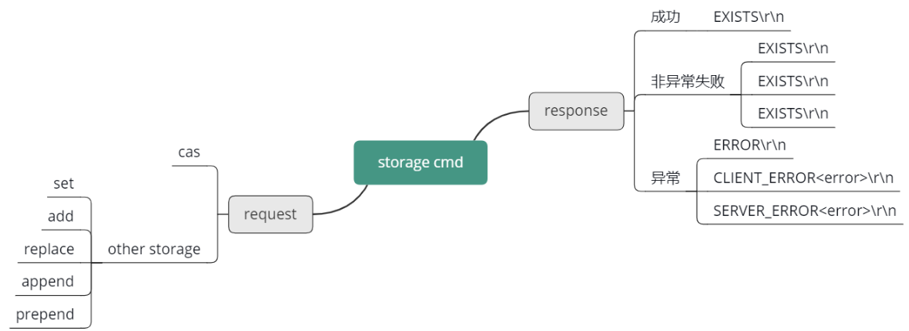
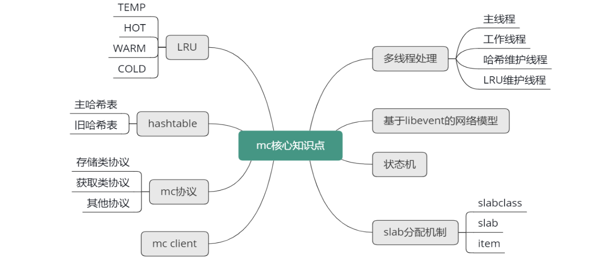
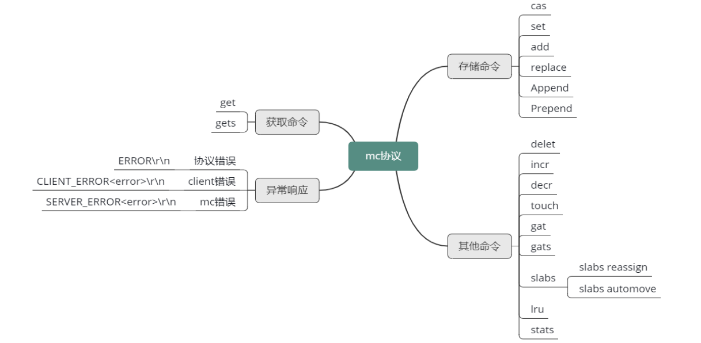

13 如何完整学习MC协议及优化client访问？
=========================

你好，我是你的缓存课老师陈波，欢迎进入第 13 课时“Memcached 协议分析”的学习。

###### 协议分析

###### 异常错误响应

接下来，我们来完整学习 Mc 协议。在学习 Mc 协议之前，首先来看看 Mc 处理协议指令，如果发现异常，如何进行异常错误响应的。Mc 在处理所有 client 端指令时，如果遇到错误，就会返回 3 种错误信息中的一种。

* 第一种错误是协议错误，一个"ERROR\\r\\n"的字符串。表明 client 发送了一个非法命令。
* 第二种错误是 client 错误，格式为"CLIENT\_ERROR <error-描述信息>\\r\\n"。这个错误信息表明 ，client 发送的协议命令格式有误，比如少了字段、多了非法字段等。
* 第三种错误是"SERVER\_ERROR <error-描述信息>\\r\\n"。这个错误信息表明 Mc server 端，在处理命令时出现的错误。比如在给 key/value 分配 Item 空间失败后，会返回"SERVER\_ERROR out of memory storing object" 错误信息。

###### 存储协议命令

现在再来看看 Mc 的存储协议。Mc 的存储协议命令不多，只有 6 个。

Mc 存储指令分 2 行。第一行是报文首部，第二行是 value 的 data block 块。这两部分用 \\r\\n 来进行分割和收尾。

存储类指令的报文首行分 2 种格式，其中一种是在 cmd 存储指令，后面跟 key、flags、expiretime、value 字节数，以及一个可选的 noreply。

其中 flags 是用户自己设计的一个特殊含义数字，Mc 对 flag 只存储，而不进行任何额外解析处理，expiretime 是 key 的过期时间，value 字节数是 value block 块的字节长度，而带上 noreply 是指 Mc 处理完后静默处理，不返回任何响应给 client。

这种 cmd 指令包括我们最常用的 set 指令，另外还包括 add、replace、append、reppend ，总共 5 个指令：

* Set 命令用于存储一个 key/value；
* Add 命令是在当 key 不存在时，才存储这个 key/value；
* Replace 命令，是当 key 存在时，才存储这个 key/value；
* Append 命令，是当 key 存在时，追加 data 到 value 的尾部；
* Prepend 命令，是当 key 存在时，将 data 加到 value 的头部。

另外一种存储协议指令，主要格式和字段与前一种基本相同，只是多了一个 cas unique id，这种格式只有 cas 指令使用。cas 指令是指只有当这个 key 存在，且从本 client 获取以来，没有其他任何人修改过时，才进行修改。cas 的英文含义是 compare and set，即比较成功后设置的意思。

###### 存储命令响应

Mc 在响应存储协议时，如果遇到错误，就返回前面说的3种错误信息中的一种。否则就会返回如下 4 种正常的响应，"STORED\\r\\n”、"EXISTS\\r\\n”、"NOT\_STORED\\r\\n"、"NOT\_FOUND\\r\\n“。

其中，stored 表明存储修改成功。NOT\_STORED 表明数据没有存储成功，但并不是遇到错误或异常。这个响应一般表明 add 或 replace 等指令，前置条件不满足时，比如 add，这个 key 已经存在 Mc，就会 add 新 key 失败。replace 时， key 不存在，也无法 replace 成功。EXISTS 表明待 cas 的key 已经被修改过了，而 NOT\_FOUND 是指待 cas 的 key 在 Mc 中不存在。

Mc 对存储命令的请求及响应协议，可以参考下面的思维导图来有一个完整的印象。

###### 获取命令

Mc 的获取协议，只有 get、gets 两种指令，如下图所示。格式为 get/gets 后，跟随若干个 key，然后 \\r\\n 结束请求命令。get 指令只获取 key 的 flag 及 value，gets 会额外多获取一个 cas unique id值。gets 主要是为 cas 指令服务的。

获取命令的响应，就是 value 字串，后面跟上 key、flag、value 字节数，以及 value 的 data block 块。最后跟一个 END\\r\\n 表明所有存在的 key/value 已经返回，如果没有返回的 key，则表明这个 key 在 Mc 中不存在。

###### 其他指令

Mc 的其他协议指令包括 delete、incr、decr、touch、gat、gats、slabs、lru、stats 这 9 种指令。

其中 delete 用于删除一个 key。

incr/decr 用于对一个无符号长整型数字进行加或减。

touch、gat、gats 是 Mc 后来增加的指令，都可以用来修改 key 的过期时间。不同点是 touch 只修改 key 的过期时间，不获取 key对应的value。

而 gat、gats 指令，不仅会修改 key 的过期时间，还会获取 key 对应的 flag 和 value 数据。gats 同 gets，还会额外获取 cas 唯一 id 值。

Slabs reassign 用于在 Mc 内存达到设定上限后，将 slab 重新在不同的 slabclass 之间分配。这样可以规避 Mc 启动后自动分配而产生随机性，使特殊 size 的数据也得到较好的命中率。Slabs automove 是一个开关指令，当打开时，就允许 Mc 后台线程自行决定何时将 slab 在slabclass 之间重新分配。

lru 指令用于 Mc LRU 的设置和调优。比如 LRU tune 用于设置 HOT、WARM LRU 的内存占比。LRU mode 用来设置 Mc 只使用 COLD LRU，还是使用新版的 4 个 LRU 的新策略。LRU TEMP\_TTL 用来设置 Mc 的 TEMP LRU 的TTL值，默认是 61s，小于这个 TMEP\_TTL 的 key会被插入到 TEMP LRU。

Stats 用于获取 Mc 的各种统计数据。Stats 后面可以跟 statistics、slabs、size 等参数，来进一步获取更多不同的详细统计。

###### Client 使用

Mc 在互联网企业应用广泛，热门语言基本都有 Mc client 的实现。以 Java 语言为例，互联网业界广泛使用的有 Memcached-Java-Client、SpyMemcached、Xmemcached 等。

Memcached-Java-Client 推出时间早，10 年前就被广泛使用，这个 client 性能一般，但足够稳定，很多互联网企业至今仍在使用。不过这个 client 几年前就停止了更新。

SpyMemcached 出现的比较晚，性能较好，但高并发访问场景，稳定性欠缺。近几年

变更很少，基本停止了更新。

Xmemcached 性能较好，综合表现最佳。而且社区活跃度高，近些年也一直在持续更新中。Java 新项目启动，推荐使用 Xmemcached。

在使用 Mc client 时，有一些通用性的调优及改进方案。比如，如果读写的 key/value 较大，需要设置更大的缓冲 buf，以提高性能。在一些业务场景中，需要启用 TCP\_NODELAY，避免 40ms 的延迟问题。同时，如果存取的 key/value size 较大，可以设置一个压缩阀值，超过阀值，就对value 进行压缩算法，减少读写及存储的空间。

为了避免缓存雪崩，并更好地应对极热 key 及洪水流量的问题，还可以对 Mc client 进行封装，加入多副本、多层级策略，使 Mc 缓存系统在任何场景下，都可做到高可用、高性能。

讲到这里，Mc 的核心知识点就基本讲完了，知识点结构图如下所示。

回顾一下最近几节课的内容。首先，学习了 Mc 的系统架构，学习了 Mc 基于 libevent 的网络模型，学习了 Mc 的多线程处理，包括主线程、工作线程如何进行网络 IO 协调及处理，学习了 Mc 的状态机。然后，继续学习了 Mc 用于定位 key 的哈希表，学习了用于数据生命周期管理的 LRU，还学习 slab 分配机制，以及 Mc 数据的存储机理。最后，还完整学习了 Mc的协议，了解了以 Java 语言为例的 3 种 Mc client，以及 Mc client 在线上使用过程中，如何进行调优及改进。

根据下面 Mc 协议的思维导图，查看自己是否对所有指令都有理解，可以结合 Mc 的协议文档，启动一个 Mc 实例，进行各个命令的实际操练。

