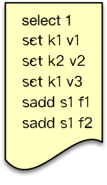
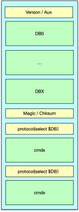

24 Redis崩溃后，如何进行数据恢复的？
======================

你好，我是你的缓存课老师陈波，欢迎来到第 24 课时“Redis 崩溃后，如何进行数据恢复”的学习。本课时我们主要学习通过 RDB、AOF、混合存储等数据持久化方案来解决如何进行数据恢复的问题。

Redis 持久化是一个将内存数据转储到磁盘的过程。Redis 目前支持 RDB、AOF，以及混合存储三种模式。

###### RDB

Redis 的 RDB 持久化是以快照的方式将内存数据存储到磁盘。在需要进行 RDB 持久化时，Redis 会将内存中的所有数据以二进制的格式落地，每条数据存储的内容包括过期时间、数据类型、key，以及 value。当 Redis 重启时，如果 appendonly 关闭，则会读取 RDB 持久化生成的二进制文件进行数据恢复。

触发构建 RDB 的场景主要有以下四种。

1. 第一种场景是通过 save 或 bgsave 命令进行主动 RDB 快照构建。它是由调用方调用 save 或 bgsave 指令进行触发的。
2. 第二种场景是利用配置 save m n 来进行自动快照生成。它是指在 m 秒中，如果插入或变更 n 个 key，则自动触发 bgsave。这个配置可以设置多个配置行，以便组合使用。由于峰值期间，Redis 的压力大，变更的 key 也比较多，如果再进行构建 RDB 的操作，会进一步增加机器负担，对调用方请求会有一定的影响，所以线上使用时需要谨慎。
3. 第三种场景是主从复制，如果从库需要进行全量复制，此时主库也会进行 bgsave 生成一个 RDB 快照。
4. 第四种场景是在运维执行 flushall 清空所有数据，或执行 shutdown 关闭服务时，也会触发 Redis 自动构建 RDB 快照。

save 是在主进程中进行 RDB 持久化的，持久化期间 Redis 处于阻塞状态，不处理任何客户请求，所以一般使用较少。而 bgsave 是 fork 一个子进程，然后在子进程中构建 RDB 快照，构建快照的过程不直接影响用户的访问，但仍然会增加机器负载。线上 Redis 快照备份，一般会选择凌晨低峰时段，通过 bgsave 主动触发进行备份。

RDB 快照文件主要由 3 部分组成。

1. 第一部分是 RDB 头部，主要包括 RDB 的版本，以及 Redis 版本、创建日期、占用内存等辅助信息。
2. 第二部分是各个 RedisDB 的数据。存储每个 RedisDB 时，会首先记录当前 RedisDB 的DBID，然后记录主 dict 和 expire dict 的记录数量，最后再轮询存储每条数据记录。存储数据记录时，如果数据有过期时间，首先记录过期时间。如果 Redis 的 maxmemory\_policy 过期策略采用 LRU 或者 LFU，还会将 key 对应的 LRU、LFU 值进行落地，最后记录数据的类型、key，以及 value。
3. 第三部部分是 RDB 的尾部。RDB 尾部，首先存储 Redis 中的 Lua 脚本等辅助信息。然后存储 EOF 标记，即值为 255 的字符。最后存 RDB 的 cksum。

至此，RDB 就落地完毕。

RDB 采用二进制方式存储内存数据，文件小，且启动时恢复速度快。但构建 RDB 时，一个快照文件只能存储，构建时刻的内存数据，无法记录之后的数据变更。构建 RDB 的过程，即便在子进程中进行，但仍然属于 CPU 密集型的操作，而且每次落地全量数据，耗时也比较长，不能随时进行，特别是不能在高峰期进行。由于 RDB 采用二进制存储，可读性差，而且由于格式固定，不同版本之间可能存在兼容性问题。

###### AOF

Redis 的 AOF 持久化是以命令追加的方式进行数据落地的。通过打开 appendonly 配置，Redis 将每一个写指令追加到磁盘 AOF 文件，从而及时记录内存数据的最新状态。这样即便 Redis 被 crash 或异常关闭后，再次启动，也可以通过加载 AOF，来恢复最新的全量数据，基本不会丢失数据。

AOF 文件中存储的协议是写指令的 multibulk 格式，这是 Redis 的标准协议格式，所以不同的 Redis 版本均可解析并处理，兼容性很好。

但是，由于 Redis 会记录所有写指令操作到 AOF，大量的中间状态数据，甚至被删除的过期数据，都会存在 AOF 中，冗余度很大，而且每条指令还需通过加载和执行来进行数据恢复，耗时会比较大。

AOF 数据的落地流程如下。Redis 在处理完写指令后，首先将写指令写入 AOF 缓冲，然后通过 server\_cron 定期将 AOF 缓冲写入文件缓冲。最后按照配置策略进行 fsync，将文件缓冲的数据真正同步写入磁盘。

Redis 通过 appendfsync 来设置三种不同的同步文件缓冲策略。

1. 第一种配置策略是 no，即 Redis 不主动使用 fsync 进行文件数据同步落地，而是由操作系统的 write 函数去确认同步时间，在 Linux 系统中大概每 30 秒会进行一次同步，如果 Redis 发生 crash，就会造成大量的数据丢失。
2. 第二种配置策略是 always，即每次将 AOF 缓冲写入文件，都会调用 fsync 强制将内核数据写入文件，安全性最高，但性能上会比较低效，而且由于频繁的 IO 读写，磁盘的寿命会大大降低。
3. 第三种配置策略是 everysec。即每秒通过 BIO 线程进行一次 fsync。这种策略在安全性、性能，以及磁盘寿命之间做较好的权衡，可以较好的满足线上业务需要。

随着时间的推移，AOF 持续记录所有的写指令，AOF 会越来越大，而且会充斥大量的中间数据、过期数据，为了减少无效数据，提升恢复时间，可以定期对 AOF 进行 rewrite 操作。

AOF 的 rewrite 操作可以通过运维执行 bgrewiretaof 命令来进行，也可以通过配置重写策略进行，由 Redis 自动触发进行。当对 AOF 进行 rewrite 时，首先会 fork 一个子进程。子进程轮询所有 RedisDB 快照，将所有内存数据转为 cmd，并写入临时文件。在子进程 rewriteaof 时，主进程可以继续执行用户请求，执行完毕后将写指令写入旧的 AOF 文件和 rewrite 缓冲。子进程将 RedisDB 中数据落地完毕后，通知主进程。主进程从而将 AOF rewite 缓冲数据写入 AOF 临时文件，然后用新的 AOF 文件替换旧的 AOF 文件，最后通过 BIO 线程异步关闭旧的 AOF 文件。至此，AOF 的 rewrite 过程就全部完成了。

AOF 重写的过程，是一个轮询全部 RedisDB 快照，逐一落地的过程。每个 DB，首先通过 select $db 来记录待落的 DBID。然后通过命令记录每个 key/value。对于数据类型为 SDS 的value，可以直接落地。但如果 value 是聚合类型，则会将所有元素设为批量添加指令，进行落地。

对于 list 列表类型，通过 RPUSH 指令落地所有列表元素。对于 set 集合，会用 SADD 落地所有集合元素。对于 Zset 有序集合，会用 Zadd 落地所有元素，而对于 Hash 会用 Hmset 落地所有哈希元素。如果数据带过期时间，还会通过 pexpireat 来记录数据的过期时间。

AOF 持久化的优势是可以记录全部的最新内存数据，最多也就是 1-2 秒的数据丢失。同时 AOF 通过 Redis 协议来追加记录数据，兼容性高，而且可以持续轻量级的保存最新数据。最后因为是直接通过 Redis 协议存储，可读性也比较好。

AOF 持久化的不足是随着时间的增加，冗余数据增多，文件会持续变大，而且数据恢复需要读取所有命令并执行，恢复速度相对较慢。

###### 混合持久化

Redis 在 4.0 版本之后，引入了混合持久化方式，而且在 5.0 版本后默认开启。前面讲到 RDB 加载速度快，但构建慢，缺少最新数据。AOF 持续追加最新写记录，可以包含所有数据，但冗余大，加载速度慢。混合模式一体化使用 RDB 和 AOF，综合 RDB 和 AOF 的好处。即可包含全量数据，加载速度也比较快。可以使用 aof-use-rdb-preamble 配置来明确打开混合持久化模式。

混合持久化也是通过 bgrewriteaof 来实现的。当启用混合存储后，进行 bgrewriteaof 时，主进程首先依然是 fork 一个子进程，子进程首先将内存数据以 RDB 的二进制格式写入 AOF 临时文件中。然后，再将落地期间缓冲的新增写指令，以命令的方式追加到临时文件。然后再通知主进程落地完毕。主进程将临时文件修改为 AOF 文件，并关闭旧的 AOF 文件。这样主体数据以 RDB 格式存储，新增指令以命令方式追加的混合存储方式进行持久化。后续执行的任务，以正常的命令方式追加到新的 AOF 文件即可。

混合持久化综合了 RDB 和 AOF 的优缺点，优势是包含全量数据，加载速度快。不足是头部的 RDB 格式兼容性和可读性较差。
