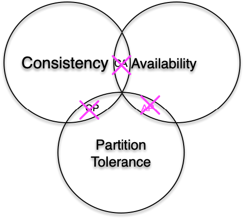
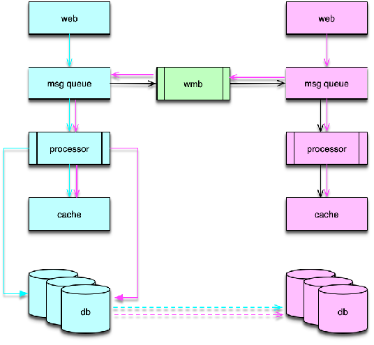

31 如何设计足够可靠的分布式缓存体系，以满足大中型移动互联网系统的需要？
=====================================

上一课时我们了解了为什么不能设计出同时满足一致性、可用性、分区容错性的分布式系统，本课时我们来具体看下，工作中应该如何设计分布式系统，以满足大中型互联网系统的需求。

传统 CAP 的突破
----------

随着分布式系统的不断演进，会不断遇到各种问题，特别是当前，在大中型互联网系统的演进中，私有云、公有云并行发展且相互融合，互联网系统的部署早已突破单个区域，系统拓扑走向全国乃至全球的多区域部署。在践行传统的经典 CAP 理论的同时，需要认识到 CAP 三要素的复杂性，不能简单的对 CAP 理论进行三选二，需要根据业务特点、部署特点，对 CAP 理论进行创新、修正及突破。

甚至 CAP 理论的提出者 Eric Brewer 自己也在 CAP 理论提出的 12 年后，即在 2012 年，对 CAP 理论，特别是 CAP 使用中的一些误区，进一步进行修正、拓展及演进说明。Brewer 指出，CAP 理论中经典的三选二公式存在误导性，CAP 理论的经典实践存在过于简化三种要素，以及三要素之间的相互关系的问题。他同时把 CAP 与 ACID、BASE 进行比较，分析了 CAP 与延迟的关系，最后还重点分析了分布式系统如何应对分区异常的问题。

要突破经典的 CAP 理论和实践，要认识到 CAP 三要素都不是非黑即白，而是存在一系列的可能性，要在实际业务场景中对分布式系统，进行良好的架构设计，这是一个很大的挑战。

在系统实际运行过程中，大部分时间，分区异常不会发生，此时可以提供良好的一致性和可用性。同时，我们需要在系统架构设计中，在分析如何实现业务功能、系统 SLA 指标实现等之外，还要考虑整个系统架构中，各个业务、模块、功能、系统部署如何处理潜在的分区问题。

要良好处理潜在的分区问题，可以采用如下步骤。

首先，要考虑如何感知分区的发生，可以通过主动探测、状态汇报、特殊时间/特殊事件预警、历史数据预测等方式及时发现分区。

其次，如果发现分区，如何在分区模式下进行业务处理。可以采用内存缓冲、队列服务保存数据后，继续服务，也可以对敏感功能直接停止服务，还可以对分区进行进一步细分，如果是短时间延迟，可以部分功能或请求阻塞等待结果，其他功能和请求快速返回本地老数据；如果分区时长超过一定阀值，进行部分功能下线，只提供部分核心功能。

最后，在分区异常恢复后，如何同步及修复数据，建立补偿机制应对分区模式期间的错误。如系统设计中引入消息队列，在分区模式期间，变更的数据用消息队列进行保存，分区恢复后，消息处理机从消息队列中进行数据读取及修复。也可以设计为同步机制，分区异常时，记录最后同步的位置点，分区恢复后，从记录的位置点继续同步数据。还可以在分区时，分布式系统的各区记录自己没有同步出去的数据，然后在分区恢复后，主动进行异地数据比较及合并。最后，还可以在故障恢复后通过数据扫描，对比分区数据，进行比较及修复。

BASE 理论
-------

BASE 理论最初由 Brewer 及他的同事们提出。虽然比较久远，但在当前的互联网界活力更盛。各大互联网企业，在构建大中型规模的分布式互联网系统，包括各种基于私有云、公有云及多云结合的分布式系统时，在尽力借鉴 CAP 理论与实践的同时，还充分验证和实践了 BASE 理论，并将其作为 CAP 理论的一种延伸，很好的应用在互联网各种系统中。

BASE 理论及实践是分布式系统对一致性和可用性权衡后的结果。其基本思想是分布式系统各个功能要适当权衡，尽力保持整个系统稳定可用，即便在出现局部故障和异常时，也确保系统的主体功能可用，确保系统的最终一致性。

BASE 理论也包括三要素，即 Basically Availabe 基本可用、Soft state 软状态和 Eventual Consistency 最终一致性。

### Basically Availabe 基本可用

基本可用是指分布式系统在出现故障时，允许损失部分可用性。比如可以损失部分 SLA，如响应时间适当增加、处理性能适当下降，也可以损失部分周边功能、甚至部分核心功能。最终保证系统的主体基本稳定，核心功能基本可用的状态。如淘宝、京东在双十一峰值期间，请求会出现变慢，但少许延迟后，仍然会返回正确结果，同时还会将部分请求导流到降级页面等。又如微博在突发故障时，会下线部分周边功能，将资源集中用于保障首页 feed 刷新、发博等核心功能。

### Soft state 软状态

软状态是指允许系统存在中间状态。故障发生时，各分区之间的数据同步出现延时或暂停，各区域的数据处于不一致的状态，这种状态的出现，并不影响系统继续对外提供服务。这种节点不一致的状态和现象就是软状态。

### Eventual Consistency 最终一致性

最终一致性，是指分布式系统不需要实时保持强一致状态，在系统故障发生时，可以容忍数据的不一致，在系统故障恢复后，数据进行同步，最终再次达到一致的状态。

BASE 理论是面向大中型分布式系统提出的，它更适合当前的大中型互联网分布式系统。

* 首先用户体验第一，系统设计时要优先考虑可用性。
* 其次，在故障发生时，可以牺牲部分功能的可用性，牺牲数据的强一致性，来保持系统核心功能的可用性。
* 最后，在系统故障恢复后，通过各种策略，确保系统最终再次达到一致。

一致性问题及应对
--------

分布式系统中，为了保持系统的可用性和性能，系统中的数据需要存储多个副本，这些副本分布在不同的物理机上，如果服务器、网络出现故障，就会导致部分数据副本写入成功，部分数据副本写入失败，这就会导致各个副本之间数据不一致，数据内容冲突，也就造成了数据的不一致。因此，为了保持分布式系统的一致性，核心就是如何解决分布式系统中的数据一致性。

保持数据一致性的方案比较多，比较常见的方案有，分布式事务，主从复制，业务层消息总线等。

### 分布式事务

分布式事务在各节点均能正常执行事务内一系列操作才会提交，否则就进行回滚，可以保持系统内数据的强一致。分布式事务应用比较广泛，比如跨行转账，用户甲向用户乙转账，甲账户需要减少，乙账户需要增加对应金额，这两个操作就必须构成一个分布式事务。还有其他场景，比如 12306 中支付出票、支付宝买入基金等，都需要保持对应操作的事务性。

分布式事务的具体方案较多，典型有 2PC 两阶段提交、3PC 三阶段提交、Paxos、Zab、Raft等。

两阶段提交方案中，系统包括两类节点，一类是协调者，一类是事务参与者。协调者一般只有一个，参与者可以理解为数据副本的数量，一般有多个。

两阶段提交的执行分为请求阶段和提交阶段两部分。在请求阶段，协调者将通知事务参与者准备提交或取消事务，通知完毕后，事务参与者就开始进行表决。在表决中，参与者如果本地作业执行成功，则表决同意，如果执行失败，则表决取消，然后把表决回复给协调者。然后进入提交阶段。

在提交阶段，协调者将基于第一阶段的表决结果进行决策是提交事务还是取消事务。决策方式是所有参与者表决同意则决策提交，否则决策取消。然后协调者把决策结果分发给所有事务参与者。事务参与者接受到协调者的决策后，执行对应的操作。

三阶段提交与两阶段提交类似，只是在协调者、参与者都引入了超时机制，而且把两阶段提交中的第一阶段分拆成了 2 步，即先询问再锁资源。

分布式事务中 Paxos、Zab、Raft 等方案的基本思想类似。在每个数据副本附带版本信息，每次写操作保证写入大于 N/2 个节点，同时每次读操作也保证从大于 N/2 个节点读，以多数派作为最终决策。这种仲裁方式在业界使用比较广泛，比如亚马逊的 Dynamo 存储也是类似，Dynamo 的决策更简洁，只要写操作数 + 读操作数大于节点数即可。一般整个仲裁过程由协调者进行，当然也可以像 Dynamo那样，支持由业务 Client 决策也没问题，更有弹性，因为可以由业务按各种策略选择。在仲裁后，仲裁者可以选择正确的版本数据，甚至在某些场景下可以将不同版本的数据合并成一个新数据。

### 主从复制

主从复制也是一种使用较为广泛的一致性方案。在 Mysql 等各种 DB 中广泛使用，之前课程中讲到的 Redis 也是采用主从复制来保持主从数据一致的。

除了从数据层保证一致性，还可以在上层业务层，通过消息总线分发，来更新缓存及存储体系，这也是互联网企业在进行异地多活方案设计时经常会考虑到的方案。

消息总线在各区域相互分发消息，有 push 推和 pull 拉两种方案。一般来讲，pull 拉的方式，由于拉取及拉取后的执行过程对分发是可以感知，在网络异常时，更容易保障数据的一致性。

分布式系统多区数据一致性案例
--------------

如图所示，是微博进行多区数据一致性保障案例。消息是通过消息中间件 wmb 进行分发的。wmb 两边分别为分布式系统的 2 个区域。每个区域所有的用户写操作，都会封装成一条消息，业务消息会首先写入消息队列服务，然后消息队列处理机读取消息队列，并进行缓存和 DB 的更新。在业务消息写入消息队列服务时，wmb 会同时将这条消息分发给其他所有异地区子系统。分发的方式是，wmb 本地组件先将消息写入本地队列，然后 wmb 异地组件 Client 再读取。当分区故障发生时，异地读取失败，消息仍然在各区的消息队列中，不会丢失。分区故障过程中，系统的各区子系统只处理本地事件。在分区故障排除后，wmb Client 继续读取异地消息，然后由消息处理机执行，最终实现数据的一致性。

由于 wmb 通过消息队列机方式从业务层面进行同步，分区故障发生时，各区都是先执行本地，分区恢复后再执行异地，所有事件在各区的执行顺序可能会有差异，在某些极端场景下，可能会导致数据不一致。所以，微博只用 wmb 来更新缓存，DB 层仍然采用主从复制的方式进行强一致保障。这样即便故障恢复期间，可能存在少量缓存数据暂时不一致，由于恢复数据时采用了更短的过期时间，这部分数据在从 DB 重新加载后，仍然能保持数据的最终一致性。同时，微博不用 DB 数据更新缓存，是由于缓存数据结构过于复杂，而且经常需要根据业务需要进行扩展，一条缓存记录会涉及众多 DB，以及 Redis 中多项纪录，通过 DB 同步数据触发更新缓存涉及因素太多，不可控。所以微博在尝试 DB 驱动缓存更新方案失败后，就改为 wmb 消息队列方式进行缓存更新。
