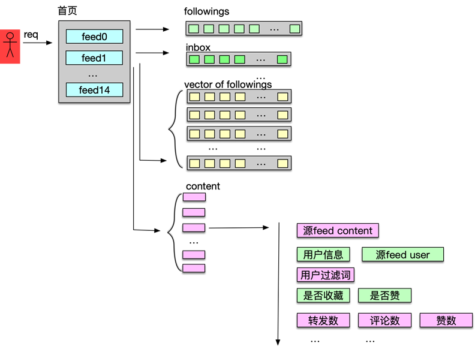
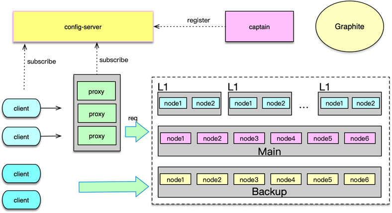
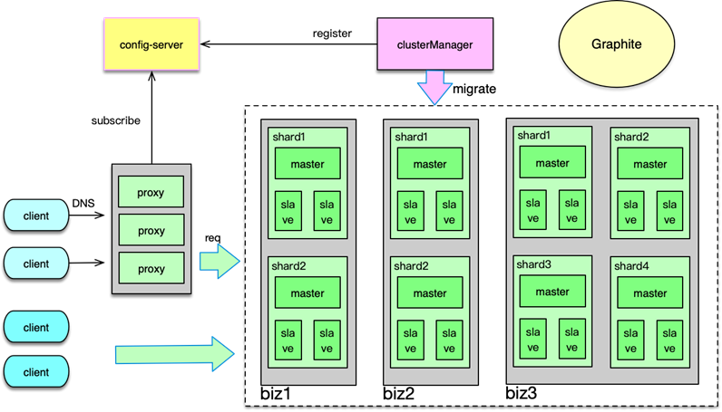

35 如何为社交feed场景设计缓存体系？
=====================

在上一课时我们讲解了如何为海量计数场景进行缓存设计，本课时中我将讲解如何为社交 Feed 场景设计缓存体系。

Feed 流场景分析
----------

Feed 流是很多移动互联网系统的重要一环，如微博、微信朋友圈、QQ 好友动态、头条/抖音信息流等。虽然这些产品形态各不相同，但业务处理逻辑却大体相同。用户日常的“刷刷刷”，就是在获取 Feed 流，这也是 Feed 流的一个最重要应用场景。用户刷新获取 Feed 流的过程，对于服务后端，就是一个获取用户感兴趣的 Feed，并对 Feed 进行过滤、动态组装的过程。

接下来，我将以微博为例，介绍用户在发出刷新 Feed 流的请求后，服务后端是如何进行处理的。

获取 Feed 流操作是一个重操作，后端数据处理存在 100 ~ 1000 倍以上的读放大。也就是说，前端用户发出一个接口请求，服务后端需要请求数百甚至数千条数据，然后进行组装处理并返回响应。因此，为了提升处理性能、快速响应用户，微博 Feed 平台重度依赖缓存，几乎所有的数据都从缓存获取。如用户的关注关系从 Redis 缓存中获取，用户发出的 Feed 或收到特殊 Feed 从 Memcached 中获取，用户及 Feed 的各种计数从计数服务中获取。

Feed 流流程分析
----------

Feed 流业务作为微博系统的核心业务，为了保障用户体验，SLA 要求较高，核心接口的可用性要达到 4 个 9，接口耗时要在 50~100ms 以内，后端数据请求平均耗时要在 3~5ms 以内，因此为了满足亿级庞大用户群的海量并发访问需求，需要对缓存体系进行良好架构且不断改进。

在 Feed 流业务中，核心业务数据的缓存命中率基本都在 99% 以上，这些缓存数据，由 Feed 系统进行多线程并发获取及组装，从而及时发送响应给用户。

Feed 流获取的处理流程如下。

首先，根据用户信息，获取用户的关注关系，一般会得到 300~2000 个关注用户的 UID。

然后，再获取用户自己的 Feed inbox 收件箱。收件箱主要存放其他用户发表的供部分特定用户可见的微博 ID 列表。

接下来，再获取所有关注列表用户的微博 ID 列表，即关注者发表的所有用户或者大部分用户可见的 Feed ID 列表。这些 Feed ID 列表都以 vector 数组的形式存储在缓存。由于一般用户的关注数会达到数百甚至数千，因此这一步需要获取数百或数千个 Feed vector。

然后，Feed 系统将 inbox 和关注用户的所有 Feed vector 进行合并，并排序、分页，即得到目标 Feed 的 ID 列表。

接下来，再根据 Feed ID 列表获取对应的 Feed 内容，如微博的文字、视频、发表时间、源微博 ID 等。

然后，再进一步获取所有微博的发表者 user 详细信息、源微博内容等信息，并进行内容组装。

之后，如果用户设置的过滤词，还要将这些 Feed 进行过滤筛选，剔除用户不感兴趣的 Feed。

接下来，再获取用户对这些 Feed 的收藏、赞等状态，并设置到对应微博中。

最后，获取这些 Feed 的转发数、评论数、赞数等，并进行计数组装。至此，Feed 流获取处理完毕，Feed 列表以 JSON 形式返回给前端，用户刷新微博首页成功完成。

Feed 流缓存架构
----------

Feed 流处理中，缓存核心业务数据主要分为 6 大类。

第一类是用户的 inbox 收件箱，在用户发表仅供少量用户可见的 Feed 时，为了提升访问效率，这些 Feed ID 并不会进入公共可见的 outbox 发件箱，而会直接推送到目标客户的收件箱。

第二类是用户的 outbox 发件箱。用户发表的普通微博都进入 outbox，这些微博几乎所有人都可见，由粉丝在刷新 Feed 列表首页时，系统直接拉取组装。

第三类是 Social Graph 即用户的关注关系，如各种关注列表、粉丝列表。

第四类是 Feed Content 即 Feed 的内容，包括 Feed 的文字、视频、发表时间、源微博 ID 等。

第五类是 Existence 存在性判断缓存，用来判断用户是否阅读了某条 Feed，是否赞了某条 Feed 等。对于存在性判断，微博是采用自研的 phantom 系统，通过 bloomfilter 算法进行存储的。

第六类是 Counter 计数服务，用来存储诸如关注数、粉丝数，Feed 的转发、评论、赞、阅读等各种计数。

对于 Feed 的 inbox 收件箱、outbox 发件箱，Feed 系统通过 Memcached 进行缓存，以 feed id的一维数组格式进行存储。

对于关注列表，Feed 系统采用 Redis 进行缓存，存储格式为 longset。longset 在之前的课时介绍过，是微博扩展的一种数据结构，它是一个采用 double-hash 寻址的一维数组。当缓存 miss 后，业务 client 可以从 DB 加载，并直接构建 longset 的二进制格式数据作为 value写入Redis，Redis 收到后直接 restore 到内存，而不用逐条加入。这样，即便用户有成千上万个关注，也不会引发阻塞。

Feed content 即 Feed 内容，采用 Memcached 存储。由于 Feed 内容有众多的属性，且时常需要根据业务需要进行扩展，Feed 系统采用 Google 的 protocol bufers 的格式进行存放。protocol buffers 序列化后的所生成的二进制消息非常紧凑，二进制存储空间比 XML 小 3~10 倍，而序列化及反序列化的性能却高 10 倍以上，而且扩展及变更字段也很方便。微博的 Feed content 最初采用 XML 和 JSON 存储，在 2011 年之后逐渐全部改为 protocol buffers 存储。

对于存在性判断，微博 Feed 系统采用自研的 phantom 进行存储。数据存储采用 bloom filter 存储结构。实际上 phantom 本身就是一个分段存储的 bloomfilter 结构。bloomFilter 采用 bit 数组来表示一个集合，整个数组最初所有 bit 位都是 0，插入 key 时，采用 k 个相互独立的 hash 函数计算，将对应 hash 位置置 1。而检测某个 key 是否存在时，通过对 key 进行多次 hash，检查对应 hash 位置是否为 1 即可，如果有一个为 0，则可以确定该 key 肯定不存在，但如果全部为 1，大概率说明该 key 存在，但该 key 也有可能不存在，即存在一定的误判率，不过这个误判率很低，一般平均每条记录占用 1.2 字节时，误判率即可降低到 1%，1.8 字节，误判率可以降到千分之一。基本可以满足大多数业务场景的需要。

对于计数服务，微博就是用前面讲到的 CounterService。CounterService 采用 schema 策略，支持一个 key 对应多个计数，只用 5~10% 的空间，却提升 3~5 倍的读取性能。

Feed 流 Mc 架构
------------

Feed 流的缓存体系中，对于 Memcached 存储采用 L1-Main-Backup 架构。这个架构前面在讲分布式 Memcached 实践中也有介绍。微博 Feed 流的 Memcached 存储架构体系中，L1 单池容量一般为 Main 池的 1/10，有 4~6 组 L1，用于存放最热的数据，可以很好的解决热点事件或节假日的流量洪峰问题。Main 池容量最大，保存了最近一段时间的几乎所有较热的数据。Backup 池的容量一般在 Main 池的 1/2 以下，主要解决 Main 池异常发生或者 miss 后的 key 访问。

L1-Main-Bakcup 三层 Memcached 架构，可以很好抵御突发洪峰流量、局部故障等。实践中，如果业务流量不大，还可以配置成两层 Main-Bakckup。对于 2 层或 3 层 Mc 架构，处理 Mc 指令需要各种穿透、回种，需要保持数据的一致性，这些策略相对比较复杂。因此微博构建了 proxy，封装 Mc 多层的读写逻辑，简化业务的访问。部分业务由于对响应时间很敏感，不希望因为增加 proxy 一跳而增加时间开销，因此微博也提供了对应的 client，由 client 获取并订阅 Mc 部署，对三层 Mc 架构进行直接访问。

在突发热点事件发生，大量用户上线并集中访问、发表 Feed，并且会对部分 Feed 进行超高并发的访问，总体流量增加 1 倍以上，热点数据所在的缓存节点流量增加数倍，此时需要能够快速增加多组 L1，从而快速分散这个节点数据的访问。另外在任何一层，如果有节点机器故障，也需要使用其他机器替代。这样三层 Mc 架构，时常需要进行一些变更。微博的 Mc 架构配置存放在配置中心 config-server 中，由 captain 进行管理。proxy、client 启动时读取并订阅这些配置，在 Mc 部署变更时，可以及时自动切换连接。

Feed 流处理程序访问 Mc 架构时，对于读请求，首先会随机选择一组 L1，如果 L1 命中则直接返回，否则读取 Main 层，如果 Main 命中，则首先将 value 回种到 L1，然后返回。如果 Main 层也 miss，就再读取 slave，如果 slave 命中，则回种 Main 和最初选择的那组 L1，然后返回。如果 slave 也 miss，就从 DB 加载后，回种到各层。这里有一个例外，就是 gets 请求，因为 gets 是为了接下来的 cas 更新服务，而三层 Mc 缓存是以 Main、Backup 为基准，所以 gets 请求直接访问 Main 层，如果 Main 层失败就访问 Backup，只要有一层访问获得数据则请求成功。后续 cas 时，将数据更新到对应 Main 或 Backup，如果 cas 成功，就把这个 key/value set 到其他各层。

对于数据更新，三层 Mc 缓存架构以 Main-Backup 为基准，即首先更新 Main 层，如果 Main 更新成功，则再写其他三层所有 Mc pool 池。如果 Main 层更新失败，再尝试更新 Backup 池，如果 Backup 池更新成功，再更新其他各层。如果 Main、Backup 都更新失败，则直接返回失败，不更新 L1 层。在数据回种，或者 Main 层更新成功后再更新其他各层时，Mc 指令的执行一般采用 noreply 方式，可以更高效的完成多池写操作。

三层 Mc 架构，可以支撑百万级的 QPS 访问，各种场景下命中率高达 99% 以上，是 Feed 流处理程序稳定运行的重要支撑。

对于 Feed 流中的 Redis 存储访问，业务的 Redis 部署基本都采用 1 主多从的方式。同时多个子业务按类型分为 cluster 集群，通过多租户 proxy 进行访问。对于一些数据量很小的业务，还可以共享 Redis 存储，进行混合读写。对于一些响应时间敏感的业务，基于性能考虑，也支持smart client 直接访问 Redis 集群。整个 Redis 集群，由 clusterManager 进行运维、slot 维护及迁移。配置中心记录集群相关的 proxy 部署及 Redis 配置及部署等。这个架构在之前的经典分布式缓存系统课程中有详细介绍，此处不再赘述。

至此，本专栏的全部内容就讲完了，希望你可以在项目中结合所学的知识，融会贯通，也感谢你对本专栏的支持，谢谢。
